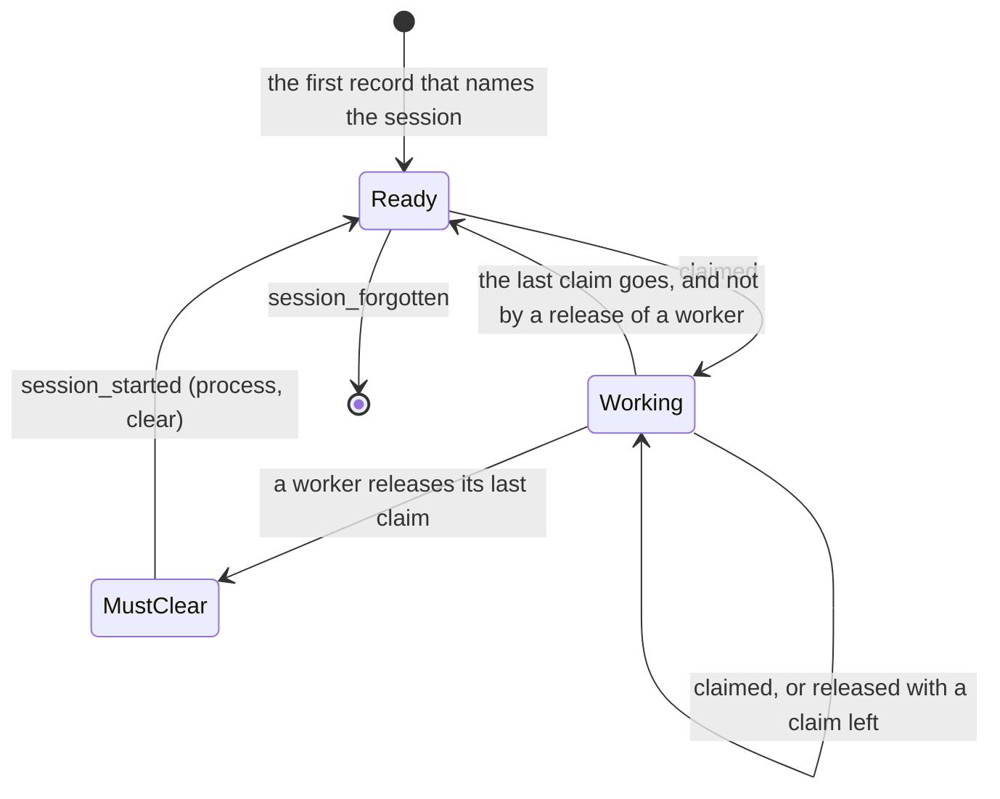

# Review engine-03: the skeptic

Issue: #358. Design at commit 8006647.

## Summary

The core of the design pays for itself: one dispatch, one wait rule, a `Command` trait with one generic handler, the caller and the command in each record, a `session_started` record, and a pause for each repository. Most of it is a move of code that exists (`change`, `settled` and `State::handle`), not a new system. Four parts cost more than they give at the target. The stage types guard one function of five lines, and one of them does not fit the writer of today. The journal says two times what the log says, and 75 % of its lines are statuses. The life cycle puts an end of a session in the log, though no reader needs it. `MemoryChange` is a concept for two cases. One rule of the life cycle does not work as written: a worker can come into MustClear with no reply that tells riff to clear it, and then it gets no wake.

## Findings

| ID | Finding | Level | Section of the design | Proposal |
|---|---|---|---|---|
| engine-03-1 | `Written::apply` makes `Applied` for one command. But the writer applies the records of a whole chunk to the written copy, in position order, one time (`write_log` in `crates/riff-server/src/lib.rs`: `s.state().written(&records)`). A chunk holds the records of more than one command. When each command applies its own records, two tasks can apply out of order. When the writer applies, `Written::apply` does nothing and proves nothing. | must-fix | The pipeline in the types | The writer applies each chunk, as today. Remove the stage `Applied`. The command waits for the written position, then reads its reply from the written copy. See engine-03-2. |
| engine-03-2 | The stages `Checked`, `Queued`, `Written` and `Applied` are made and used only in `Engine::dispatch`, a function of five lines. The design has one generic handler, so no handler is written by hand. So the types protect the engine only from its own five lines. The cost is four generic types, one with a lifetime, and `compile_fail` doc tests. | should-fix | The pipeline in the types; Decisions, 6 | Keep `Authenticated<C>`, `Command`, `Engine::dispatch`, `Engine::signal`, and the riff and the presence as two types. Put the state and its lock in the engine module, with private fields. Write the pipeline as one function. Keep the two tests of today that show a record only after its write. |
| engine-03-3 | A worker can come into MustClear with no release call: another session takes its claim after the claim timer, or a start with the reason `resume` frees its claims. Only the reply to a release tells riff to clear. The engine sends no wake to a session in MustClear. So the worker waits, a request of the lead waits with it, and nothing clears it. | must-fix | The life cycle of a session; The clear of a worker | Only the command `release` of the worker itself makes it `used`. A claim that goes in another way leaves the worker Ready. As a second guard, the reply to a keep-alive carries the ask to clear, as it carries the ask to stop today (`AliveReply` in `State::alive`, `crates/riff-server/src/state.rs`). |
| engine-03-4 | A worker that stops in the middle of an item and resumes cannot claim its item again. Today a resume frees the claims, and the session "claims again what it goes on with" (the table of sources in `crates/riff/src/hook.rs`). In the design, the worker is used, so the resume leaves it in MustClear. It must clear the context that the resume brought back. | should-fix | The life cycle of a session, the diagram: `MustClear --> MustClear: session_started (resume, join)` | The proposal of engine-03-3: `used` comes only from a release of the worker. A resume in the middle of an item then gives Ready. Rule 3 of #354 says the same: a clear between the last release and the next claim. |
| engine-03-5 | The reply to the last release clears the context. The skill of today has steps after the release: remove the worktree and its branch, then `riff workers next` (steps 9 to 11 of the start routine). After the clear, the worker does not know them. Note 514 of the repository thread shows the order of today: "I release issue-355. I remove its worktree after the verify of #372". | should-fix | The clear of a worker | Say in the design that the release is the last step of an item, and that #353 changes the skill: remove the worktree first, then release. Or keep the clear as a call of the worker (`riff workers next`), and let MustClear refuse the next claim. |
| engine-03-6 | The journal says two times what the log says. An accepted command that makes records is in the log with `by` and `command`, and `riff audit` does not read the journal. About 80,000 of the 106,000 lines each day are `status` commands, which are lost at each start. The journal cannot prove a thing: it is a line on the standard output, and a stop between the write and the line loses it. It needs `Command::args` on each of about 25 commands, with a rule ("never a body, a token or a key") that only a review checks. It keeps emails for 400 days. | should-fix | The journal; Goals, 2; Cost; Build items, E2 | Write one log line only for a refused and for a failed command: the caller, the command and the reason. The reason names the item already. Remove `Command::args`, the `accepted` lines and the log bucket for 400 days. Change goal 2: each record names its caller and its command, and each refusal leaves one log line. |
| engine-03-7 | `MemoryChange` is a third output of `handle`, for two cases: a status and a place. A status has no rule about the state: today `set_status` checks only the text (`Status::check` in `crates/riff-core/src/wire.rs`). It makes no record and a start loses it. So it is presence. | should-fix | A status; The terms; Decisions, 3 | Make a status and a place signals: `Engine::signal` sets them in the presence. Remove `Decision::memory`. The wire type refuses a bad text before the signal. `register` is then a signal (the place) and a command (the join of the thread). |
| engine-03-8 | The state Ended and the kind `session_ended` have no reader. #353 needs `session_started`. No rule of #354 needs an end. A release by an end already has `command` `end` in its record. Presence already knows that a session ended (`Session::ended` in `crates/riff-server/src/state.rs`), and after a replay each session is gone until it calls. With Ended in the log, a query of a session that ended, for example `who`, first makes a `session_started` record with the reason `join`, and waits for a chunk. | should-fix | The life cycle of a session; The records | Keep three states: Ready, Working, MustClear. Keep the end in presence, as today. Remove `session_ended` from the list of 1.0.0. The rules allow a new kind after 1.0.0, so add it when a reader needs it. |
| engine-03-9 | The text and the table of the build items do not agree: "E3, E4 and E5 can run at the same time", but E5 needs E3. E5 needs E3 only for the roles of the owner and the admins in `handle`. The people are 10 commands and 8 kinds for 1 to 2 changes each day (`person_changed` in `design/measures.md`). | should-fix | Build items; One path ("The engine checks each role in `handle`") | Let `Authenticated<C>` carry the role of the caller, from the token layer. `handle` reads the role from the caller. Then E5 and E4 do not wait for E3. The role is read a moment before the lock, as today (`admin_only`, then `settled`, in `idle_workers`, `crates/riff-server/src/lib.rs`). |
| engine-03-10 | The rule for the value `other` is weaker than the rule for a kind that a build does not know. A build that skips a kind writes no checkpoint past it. A build that reads `other` goes on, and writes a checkpoint. For a `pause_set` with a new scope, the old build then lets a session claim in a place that is paused, and a checkpoint keeps that state. The field `state` (paused, running) has no third value to come. | should-fix | What the rules for a change of a record say; Decisions, 11 | Give `other` the rule of a kind that is not known: the build writes no checkpoint past the record. Remove `other` from `state`. |
| engine-03-11 | The counts of the queries in `riff server` say what the request log of Cloud Run says: each call with its path and its status. `design/measures.md` used that log for each count. The counts start at 0 at each start of an instance. | note | The journal / Queries; Build items, E2 | Remove the counts from E2. Add them when a riff on one machine needs them. |
| engine-03-12 | Decision 8, "a worker is never the lead", is a new rule. Today `lead_if_first` has no check for a worker, and `Command::Lead` refuses only a person (`crates/riff-server/src/state.rs`). A person whose only session in a repository is a worker then has no lead there. A verify request to `lead=true` still goes to the free sessions. | note | Who can make which move; Decisions, 8 | Keep it. Say in the book what a person sees when the only session is a worker: `tell lead` fails, and the questions of the worker go to its own terminal. |

### engine-03-1 and engine-03-2: the stages

Today two functions own the pipeline: `change` and `settled` in `crates/riff-server/src/lib.rs`. Each one locks the state, runs a closure, reads the position that the call must wait for, frees the lock, and waits for the write. The design merges them into one wait rule. That is a gain: one rule, and no choice for a handler.

The faults that the design wants to stop come from code that goes around these two functions, not from a wrong order in them:

- `post_message` writes the pipeline by hand: `acts_as`, `made`, `deliver_after`, `written`.
- The changes of the people use a second path: `tokens_change` and `saved`.
- `forget_sessions` locks the state and calls `made` by itself.
- The handlers, `Server::state` and the fields of the server are in one module of 3,255 lines. So the privacy of Rust stops nothing there.

One generic handler and a private engine module repair each of these. A handler then has `Engine::dispatch`, `Engine::signal` and the views, and nothing else. It cannot reply before the write, because it cannot reach the state.

What the stage types add to that:

| Rule in the design | Who gives it with no stage type |
|---|---|
| A handler cannot reply before the write. | The one generic handler. It only calls `dispatch`. |
| No call comes between the check and the queue. | One lock scope in `dispatch`, as in `change` today. |
| A guard over an `await` does not compile. | `std::sync::MutexGuard` is not `Send`, and axum needs a `Send` future. This is true today. |
| `apply` to the written copy takes only written records. | The writer. See engine-03-1. |
| Only `apply` gets the riff as `&mut`. | The two types `Riff` and presence, with private fields. Keep them. |

The cost of the stage types:

- A `compile_fail` doc test passes for each compile error, also for a wrong name after a rename. So it can pass when the rule is gone.
- Two parts of the design do not fit one `Checked<'s, C>`: the `register` that runs first "in the same lock" (two commands, one guard), and a timer that posts more than one note.
- `Applied` does not fit the writer (engine-03-1).

The cost of the cut: a later edit of `dispatch` can put the reply before the wait. The tests `a_state_with_a_writer_shows_a_record_only_after_its_write` and `a_post_of_a_state_with_a_writer_is_read_only_after_its_write` (`crates/riff-server/src/state.rs`) find that fault today. Keep them, and add one for a refused command.

### engine-03-3, engine-03-4 and engine-03-5: MustClear

The design says: "MustClear: a worker that held a claim since its last fresh start, and holds none now." The rule that #353 and #354 need is smaller: a worker that finished an item clears before its next claim. The larger rule catches three cases that it must not:

| Case | In the design | With `used` only from a release of the worker |
|---|---|---|
| The network of a worker is down for 6 minutes. Another session claims its item. | MustClear. No release reply, no wake. The worker is stuck. | Ready. The worker sees that it lost the item. |
| The process of a worker stops in the middle of an item. A person resumes it. | The start frees the claim. MustClear. The claim is refused. | Ready. The worker claims its item again, as today. |
| A worker finishes an item and releases it. | MustClear, then the clear. | The same. |

`used` is then a fact of the log, as the design wants: a `released` record with the `command` `release` and the session of the worker sets it. A `session_started` record with a fresh context ends it.

For the order of the last steps (engine-03-5), the design must pick one of two rules, because the diagram "The clear of a worker" fixes it:

- The server starts the clear (the design). Then the release is the last call of an item, and the skill moves the clean up before it.
- The worker starts the clear (`riff workers next`, as today). Then MustClear is only the guard: the next claim is refused until the clear. This needs no ask in a reply and no wake that waits.

The second rule is less machinery. The first rule does not depend on the worker. #353 asks for the first one. So the design keeps it, and names the change of the skill.

### engine-03-6: the journal

What each kind of line gives:

| Line | Lines each day at the target | Also in |
|---|---:|---|
| accepted, with records | about 26,000 | The log: each record has `by`, `command`, the time and the change. |
| accepted, a `status` | about 80,000 | Nowhere. A start loses the status itself. |
| accepted, no record and no status (for example a claim of an item that the caller holds) | few | Nowhere. Nothing changed. |
| refused | not measured | The request log of Cloud Run: the path and the status, with no caller and no reason. |
| failed | a few at a stop | The error line of the writer names the chunk (`write_log` in `crates/riff-server/src/lib.rs`). |

Only the refused lines say a thing that no other place says. They are useful: a claim that is refused in a pause, or a `remove` by a person who is not an admin. Today some handlers already write such lines by hand, for example `tracing::info!(%caller, %email, "invited")` in `invite` (`crates/riff-server/src/lib.rs`).

The money cost of the journal is small ($0.21 each month). The real costs:

- `args` on each command, and the rule about bodies and tokens that no compiler checks.
- "A test of a refusal also compares the journal line": each rule test then depends on a log format.
- Two sources for one fact. When the journal says `accepted` at positions 1234 to 1234 and the log says another thing, the log is right. So nobody can use the journal as proof.
- A log bucket with its own keep time in `just cloud setup`, with the emails of invites in it for 400 days.

One thing the journal has that the log does not: time. The server deletes a chunk when each kept checkpoint is past it, and it keeps one checkpoint each day for 30 days ("The checkpoint" in `design-storage.md`). So the log shows who did what for about 30 days, and the journal for 400. If a person must read a change that is older than 30 days, the smaller answer is one place: keep the chunks longer. See the questions for the lead.

### engine-03-8: the end of a session

The design says: "Presence (live, gone) is a different thing: it is in memory." Ended is a third word for "not there", next to gone and forgotten. `who` must then show a session from two sources that can disagree: Ended in the log and live in presence, until the `register` runs.

The records that an end needs are there with no new kind: one `released` record for each claim, with `command` `end`. The lead of an ended session does not count today because the session is gone (`Session::holds`, `crates/riff-server/src/state.rs`), and that stays.

The life cycle is then:

## The questions of this point of view

### 1. Which parts pay for themselves at the target, and which do not?

The parts that pay:

| Part | Why it pays |
|---|---|
| One dispatch, `Command`, one generic handler | It removes the three paths around `change` and `settled` (see engine-03-2). A new command is one type. |
| One wait rule for each command | It merges `change` and `settled`. At 0.3 records each second, a command with no record almost never waits. |
| `by` and `command` in each record | About 40 bytes. `member_invited`, `pause_set` and a `joined_thread` of a woken session name nobody else. `command` tells a release from a start that frees a claim, which rule 1 of #354 needs. |
| The timers as commands of the caller `riff` | `Command::Forget` and `Command::Announce` exist (`crates/riff-server/src/state.rs`). |
| `session_started` with a reason and the worker mark | #353 and rule 3 of #354 need it. |
| MustClear, with the smaller rule of engine-03-3 | The server holds the rule, not the worker. |
| Two pauses in one kind | #364 needs them. One kind with a scope is less than two kinds. |
| The people in the log | The store design put them in the class "the log". It is the largest item for the fewest changes, so it must not block E4 and E5 (engine-03-9). |

The parts that do not pay, and the cost of each cut:

| Cut | What the cut costs |
|---|---|
| The stage types `Checked`, `Queued`, `Written`, `Applied` (engine-03-1, engine-03-2) | The compiler does not check the order of five lines in `dispatch`. Two tests check it. |
| The `accepted` lines of the journal, `Command::args`, the bucket for 400 days (engine-03-6) | No line for a status. No record of who did what after the chunks are deleted, about 30 days. |
| `MemoryChange` (engine-03-7) | A status and a place are signals, with no line in a journal. |
| The state Ended and `session_ended` (engine-03-8) | The log does not show the end of a session that held no claim. |
| The counts of the queries (engine-03-11) | A riff on one machine has no counts. Cloud Run has the request log. |
| `other` for the field `state` (engine-03-10) | Nothing. |

### 2. Is typestate the simplest way to stop a reply before the write?

No. One function that owns the pipeline does the same, when the handlers cannot reach the state. The design already has that function (`Engine::dispatch`) and already has only one handler. So the reply before the write is not possible in a handler, with or with no stage types. The stage types then check only the body of `dispatch`. See engine-03-2 for the table and the costs, and engine-03-1 for the stage that does not fit.

Keep the one type that crosses a module border: `Authenticated<C>`. The token layer makes it, and the engine takes only it. That is a real proof between two modules.

### 3. Does a journal of each command cost more than it gives? What is the smallest journal that still proves the flow?

Yes, for the accepted commands. The smallest journal that proves the flow of #354 is no journal: `by` and `command` in each record. Each of the 7 rules of #354 reads records and GitHub. The design says so: "`riff audit` does not read the journal."

Rule 4 of #354 ("no claim while the riff was paused") is the one rule where a refusal is of interest. The log proves it with no refusal: no `claimed` record is between a `pause_set` paused and the next `pause_set` running. `handle` makes that true.

So the smallest useful journal is one log line for each refused and each failed command, with the caller, the command and the reason. It goes through the log lines of today (`crates/riff-server/src/logline.rs`), with the keep time of Cloud Logging. It needs no `args`, no bucket and no test of its format, except one test that a refusal writes a line.

### 4. Does the session state machine make the life of a person harder?

Not for a person who works in a session by hand. That session is not a worker: the worker mark comes only from `RIFF_WORKER=1` (`crates/riff/src/worker.rs`), which `riff workers start` sets, and the session sends it when it registers (`register` in `crates/riff-server/src/lib.rs`). A session with no worker mark goes from Working to Ready and can claim again with no clear.

It makes the life of a person harder in these cases:

- A person resumes a worker that stopped in the middle of an item. The worker cannot claim its item again (engine-03-4).
- A worker loses its claim to the claim timer. It is stuck, and the person finds it only in `who` (engine-03-3).
- A person types in the pane of a worker. The worker rules apply to that person: after a release, the next claim is refused until a clear. This is right, but the refusal must say what to do: "clear your context first: type /clear, or run riff workers next".
- A person whose only session in a repository is a worker has no lead (engine-03-12).

With the smaller rule for `used`, the first two cases go away, and a person never meets MustClear except in a worker that finished an item.

## Questions for the lead

1. Must a person read who made a change that is older than 30 days? If yes, is the answer the journal for 400 days, or the chunks for a longer time? If no, engine-03-6 stands as written.
2. Who starts the clear of a worker: the server, in the reply to the last release (#353 as written), or the worker with `riff workers next`, with MustClear as the guard? The first needs the change of the skill of engine-03-5.
3. Can a worker that a person resumes in the middle of an item go on with that item (engine-03-4)? Or does the rule "a worker starts each item with an empty context" also mean that a resume must clear?
4. Does 1.0.0 fix `session_ended`, or does it wait for a reader (engine-03-8)? A kind that is in the list of 1.0.0 stays for good. A kind that comes later costs one new name.
5. Does E5 (#364) wait for the people in the log, or does the caller carry its role (engine-03-9)?
