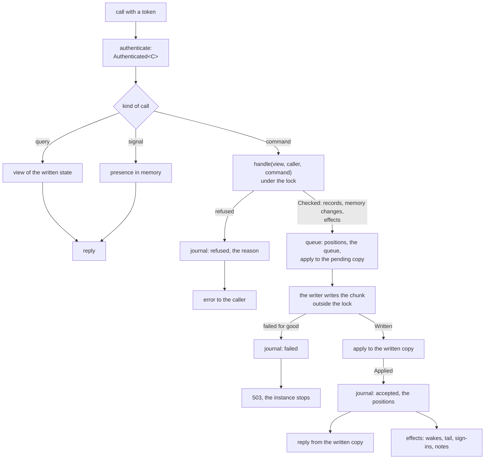
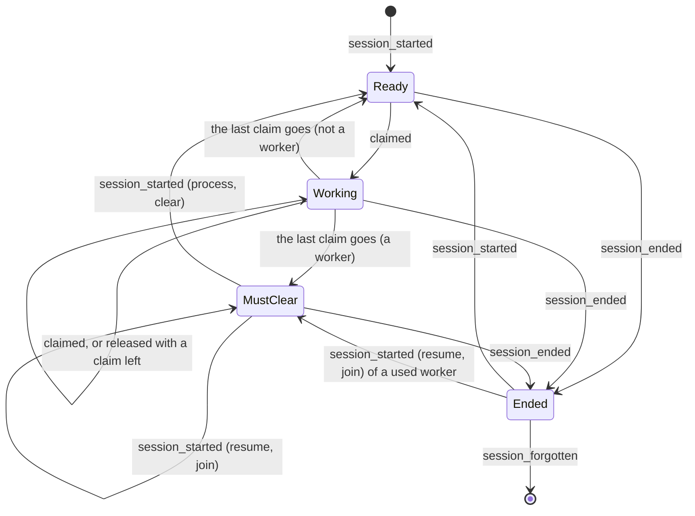
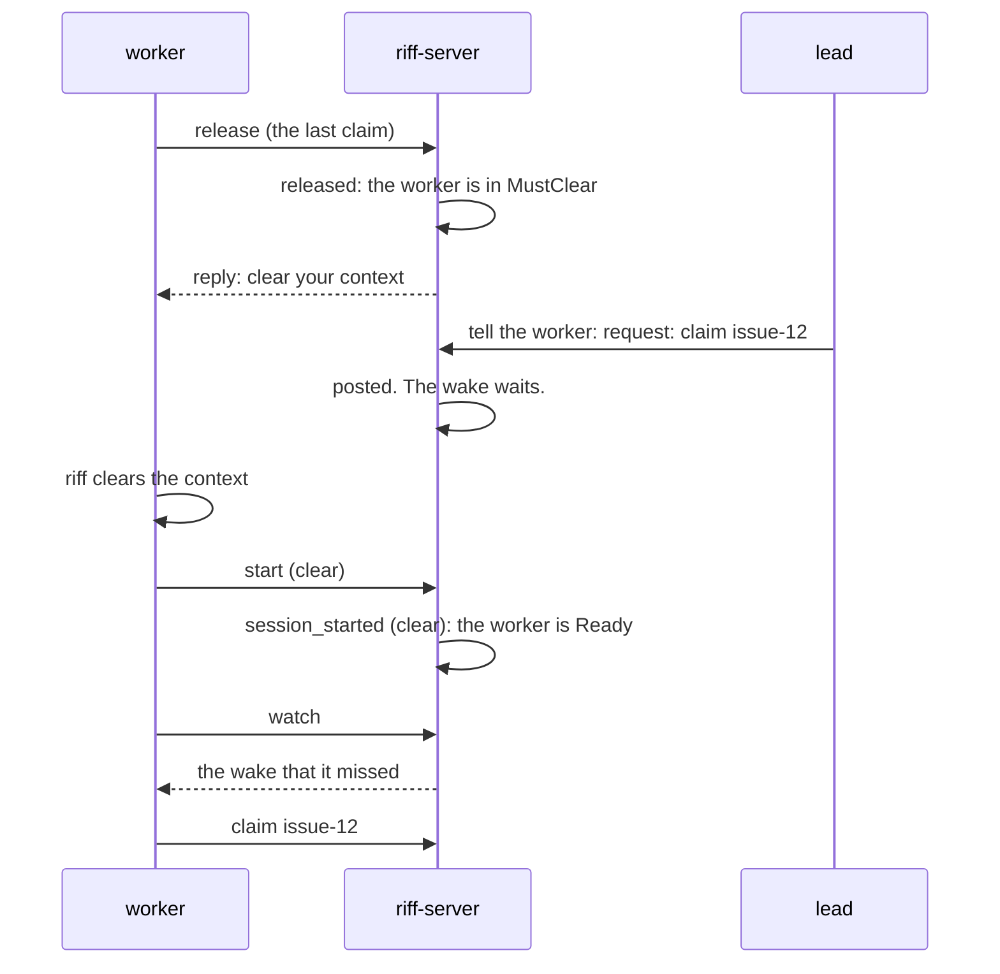

# Design: the command engine of riff-server

This page is the design of the command engine for release 1.0.0. It is
a draft for review. It builds on [the store](design-storage.md): one
log, `handle`, `apply`, and the writer. When the build is done, the
big picture stays in the book, and the details go into the rustdoc.
The reviews are in `design/reviews/`.

## Goals

- One path: each call that changes something goes through one
  dispatch.
- A journal: each command leaves one entry, also a refused one.
- A session has a life cycle in the state. `handle` refuses a move
  that is not valid.
- The compiler enforces the order of the stages. A handler cannot
  reply before the write.
- Release 1.0.0 fixes the format of the log. So this page names each
  record kind.
- Not goals: a new wire, a new store, more than one instance.

## The terms

| Term | Meaning |
|---|---|
| caller | Who sends a call. The engine takes it from the token, never from the body. |
| command | A call that asks for a change. It has a kind, for example `claim`. |
| query | A call that only reads: `who`, `read`, `threads`, `me`, `members`, the facts of the server, `watch`, `tail`. |
| signal | A sign that a session is there: a keep-alive, a call, an open or a closed watch stream, a read cursor. |
| record | One line of the log. Only a command makes records. |
| memory change | A change that a command makes to the memory, with no record: a status, a place. |
| effect | What the server does after the write: a wake, a `tail` event, the end of sign-ins, a note of the server. |
| journal | One line for each command, with its caller and its result. |

## One path



- The engine is the only code that locks the state. Its one entry for a
  change is `Engine::dispatch`.
- Each command is a type that implements the trait `Command`. The trait
  gives the kind, the HTTP path, the type of the reply, `handle` and
  `reply`. One generic handler serves each command, so no handler is
  written by hand. A new command is one type and one line in the list
  of routes.
- `handle` checks the command against the pending copy. It does no I/O
  and changes nothing. It gives the records, the memory changes and
  the effects, or the reason for a refusal.
- The engine checks each role in `handle`. No handler checks a role.
  The people and their roles are in the state that the log gives, so
  `handle` sees them.
- Each command waits until the log is written up to the position of the
  pending copy at its check. This is one rule for each command, also
  for a command that makes no record. So no reply tells of a change
  that is not in the log.
- The server is a caller too. Each timer sends a command as the caller
  `riff`: forget the old sessions, grant a request for the owner role,
  end the role of an owner who is gone, post a note of the server.
- A call from a session that the state does not know, or that ended,
  first runs the command `register` for that session, in the same lock.

### The callers

| Caller | From | Example |
|---|---|---|
| a person | a person token | `mike` |
| a session | a session token | `mike/a6cf` |
| a sign-in | a verified email of the provider, before a token is there | `mike@comotechnologies.io` |
| the server | a timer of riff-server | `riff` |

A riff with no sign-in trusts its network. The caller is then the `me`
of the body, and each role check passes.

### The commands

| Group | Commands |
|---|---|
| sessions | `register`, `start`, `end`, `status` |
| threads | `join`, `leave`, `post`, `announce` |
| work | `claim`, `release`, `lead` |
| the riff | `pause`, `resume`, `set_idle`, `forget` |
| people | `admit`, `invite`, `remove`, `set_admin`, `pass_owner`, `take_owner`, `deny_owner`, `grant_owner`, `end_owner`, `revoke` |

### What stays outside

| Part | Why |
|---|---|
| The sign-in chains: the first pair, a refresh, a session pair | They change only `signins.json`. A refresh does not wait for a write. The log holds no token and no hash. When the chains are lost, each person signs in again. |
| Presence: a keep-alive, the last call, an open or a closed watch stream, the ask to stop an idle worker | It comes each minute from each session. It is never refused, and nothing is lost when it is lost. |
| The read cursors | A `read` moves the cursor of the caller. The checkpoint keeps the cursors. |
| The queries | They change nothing. |

- The outside parts are signals. `Engine::signal` takes a signal and
  changes only the presence. Its type has no access to the state that
  the log gives. So a signal cannot change a claim or a lead.
- The first sign-in of a person changes the people: it gives the user
  its email, and it can make the first owner. The token path sends the
  command `admit` for it, with the sign-in as the caller. Then it makes
  the chain.
- A `remove` and a `revoke` end sign-ins. The record holds the time.
  The end of the sign-ins is an effect after the write. When a load
  finds a sign-in of a user that is older than the last such record of
  that user, it drops the sign-in. So a stop between the write and the
  effect lets no removed person in.

### A status

A status is a command, `status`. `handle` checks it, as each command.
It makes no record: it gives one memory change. The engine applies a
memory change under the lock, at once. The command gets a journal
entry. A start of the server loses each status.

`register` works the same way for the place of a session: the place is
a memory change, and the join of the repository thread is a record.

## The journal

Each command gives one journal entry: one log line of riff-server, as
JSON, with the field `journal`. The engine writes the line when the
result is known: after the write, or at the refusal.

```json
{"severity":"INFO","journal":true,"at_ms":1790000000000,"caller":"mike/a6cf","command":"claim","args":{"thread":"como-technologies/riff","item":"issue-355"},"result":"accepted","first":1234,"last":1234}
{"severity":"INFO","journal":true,"at_ms":1790000000050,"caller":"mike/84cf","command":"claim","args":{"thread":"como-technologies/riff","item":"issue-355"},"result":"refused","reason":"issue-355 is held by mike/a6cf"}
```

- `result` is `accepted`, `refused` or `failed`. An accepted command
  names the positions of its records, or none when it made no record.
  A refused command names the reason. `failed` means that the chunk
  was not written, and the instance stopped.
- `args` holds the fields of the command that find the change: the
  thread, the item, the selectors, the email, the kind of the post. It
  never holds the body of a post, a token or a key.
- The journal is not in the log of the store. A refused command is not
  a change, and the log holds only changes. A start does not read the
  journal.
- Each record names its cause: the envelope of a record has the caller
  (`by`) and the kind of the command (`command`). So the log alone
  shows who made each change, and `riff audit` does not read the
  journal.

```json
{"position":1234,"written_at_ms":1790000000000,"by":"mike/a6cf","command":"claim","change":{"claimed":{"session":"riff://mike@pangolin/como-technologies/riff?session=a6cf","thread":"como-technologies/riff","item":"issue-355"}}}
```

- The records of one command are in one chunk, one after another.
- On Cloud Run, the lines go to Cloud Logging. A log bucket keeps the
  lines with `journal` for 400 days. On one machine, the lines go to
  the standard output of `riff-server`.

### Queries

A query is not a command, and it gets no journal entry. The engine
counts the calls of each route since the start, and how many it
refused. `riff server` shows the counts. The request log of Cloud Run
holds each call with its path and its status.

### Cost

The numbers come from `design/measures.md`, at 36 people and 288 live
sessions.

| Item | Each day | Each month |
|---|---:|---:|
| Commands that make records (about 720 for each person) | about 26,000 | |
| `status` commands (279 for each live session) | about 80,000 | |
| Journal lines, at about 500 bytes | about 106,000, 53 MB | 1.6 GB |
| Cloud Logging, the first 50 GiB each month | | $0 |
| Kept for 400 days: about 21 GB at $0.01 for each GiB each month | | $0.21 |
| `by` and `command` in each record: about 40 bytes × 27,700 | 1.1 MB | less than $0.01 |

- A journal line adds no GCS write, and no wait to a call.
- The prices are the list prices of Cloud Logging. Make sure of them
  when you set up.

## The life cycle of a session

The state that the log gives holds the life cycle of each session.
Records move it, so a replay gives the same state. Presence (live,
gone) is a different thing: it is in memory, and it says only if the
session is there.



| State | Meaning |
|---|---|
| Ready | The session holds no claim. It can claim. |
| Working | The session holds one or more claims. |
| MustClear | A worker that held a claim since its last fresh start, and holds none now. Its context has the old item. It cannot claim. |
| Ended | The session ended. It holds no claim. Its lead does not count. |

- The state is a function of three facts in the state: the claims that
  the session holds, whether it is a worker, and whether it is `used`.
  A `claimed` record makes its session used. A `session_started` record
  with a fresh context makes it not used.
- A `session_started` record has a reason: `process` (a new agent
  process), `resume`, `clear`, or `join` (the session comes with no
  new start: its first call, or a call after an end). `process` and
  `clear` are fresh starts. The record also says if the session is a
  worker.
- A start frees each claim of the session: one `released` record for
  each, then the `session_started` record. An end does the same, with a
  `session_ended` record.
- A claim goes by a release, a start, an end, or a claim of another
  session after the 5 minutes of the claim timer.
- A person has no session ID and no life cycle. A person can claim and
  release.

### The moves that `handle` refuses

| Command | Refused when |
|---|---|
| `claim` | The session is in MustClear: "clear your context first". The repository or the riff is paused. Another session holds the item. |
| `release` | The caller does not hold the item. |
| `lead` | The caller is a person, or a worker. |
| `register` | The session ID is known under another user. |

A call of an Ended session is not refused. The `register` that the
engine runs first gives a `session_started` record with the reason
`join`.

### Who can make which move

| Move | Person | Session | Worker | Lead | Admin, owner | Server |
|---|---|---|---|---|---|---|
| `register`, `start`, `end`, `status` | | yes | yes | yes | | |
| `join`, `leave`, `post` | yes | yes | yes | yes | | |
| `claim`, `release` | yes | yes | yes, not in MustClear | yes | | |
| `lead` | | yes | | yes | | |
| `pause`, `resume` of a repository | yes | | | yes, its repository | yes | |
| `pause`, `resume` of the riff | | | | | yes | |
| `revoke` of the own sign-ins | yes | | | | | |
| `set_idle`, `invite`, `remove`, `revoke` of another person | | | | | admin | |
| `set_admin`, `pass_owner`, `deny_owner` | | | | | owner | |
| `take_owner` | | | | | admin | |
| `announce`, `forget`, `grant_owner`, `end_owner` | | | | | | yes |
| `admit` | | | | | | the sign-in |

A lead that is an admin has the moves of an admin. A worker is never
the lead: the rule for the first session of a user in a repository
skips a worker.

### The clear of a worker



- The reply to the release that puts a worker in MustClear tells riff
  to clear its context. The worker sends no other call for it.
- The engine sends no wake to a session in MustClear. The message is in
  its thread. When the watch starts after the clear, the session gets
  the wake that it missed.
- `who`, `top` and `riff workers` show MustClear, and the time since
  the last fresh start of each worker.

## The pipeline in the types

The stages of a command are types. Only the engine module can make a
value of a stage, and each stage is made from the stage before it.

| Stage | Made by | It proves |
|---|---|---|
| `Authenticated<C>` | the token layer | The caller is the caller of the token, and may act as the `me` of the body. |
| `Checked<'s, C>` | `Engine::check` | `handle` accepted the command. It holds the lock of the state. |
| `Queued<C>` | `Checked::queue` | The records have positions, are in the queue and in the pending copy. The lock is free. |
| `Written<C>` | `Queued::written` | The chunk of each record is in the log. |
| `Applied<C>` | `Written::apply` | The written copy has the records. |

- Only `Applied` gives the reply and the effects. So a handler cannot
  reply before the write, and it cannot wake a session for a record
  that is not written.
- `apply` to the written copy takes only records from `Written`. So
  the server cannot apply a record that is not written.
- `Checked` holds the lock guard of the state, so no other call comes
  between the check and the queue. The guard is not `Send`, so a
  handler that holds it over an `await` does not compile.
- The state has two parts with two types: the riff (the state that the
  log gives) and the presence (memory). Only `apply` gets the riff as
  `&mut`. A signal gets only the presence.
- A doc test with `compile_fail` shows each of these rules.

This is a sketch. The build puts the real code in its place with an
include.

```rust,ignore
/// A call that asks for a change.
pub trait Command: DeserializeOwned + Send + 'static {
    /// The name in the journal and in each record.
    const KIND: &'static str;
    /// The HTTP path, for example `/v1/claim`.
    const PATH: &'static str;
    type Reply: Serialize;

    /// Checks the command. It does no I/O and changes nothing.
    fn handle(&self, caller: &Caller, view: &View<'_>, now: Now)
        -> Result<Decision, Refused>;

    /// Makes the reply from the written copy.
    fn reply(&self, caller: &Caller, view: &View<'_>, made: &[Record])
        -> Self::Reply;

    /// The fields for the journal. Never a body, a token or a key.
    fn args(&self) -> serde_json::Value;
}

/// What `handle` decides.
pub struct Decision {
    pub changes: Vec<Change>,
    pub memory: Vec<MemoryChange>,
    pub effects: Vec<Effect>,
}

impl Engine {
    /// The one path of each command.
    pub async fn dispatch<C: Command>(&self, call: Authenticated<C>)
        -> Result<C::Reply, Refused>
    {
        let checked: Checked<'_, C> = self.check(call)?; // lock, handle
        let queued: Queued<C> = checked.queue();         // positions, queue
        let written: Written<C> = queued.written().await?; // the chunk
        let applied: Applied<C> = written.apply();       // the written copy
        Ok(applied.finish()) // the journal, the effects, the reply
    }
}
```

The command `claim`, and the one handler of each command:

```rust,ignore
#[derive(Deserialize)]
pub struct Claim { pub me: SessionUri, pub thread: ThreadName, pub item: String }

impl Command for Claim {
    const KIND: &'static str = "claim";
    const PATH: &'static str = "/v1/claim";
    type Reply = ClaimReply;

    fn handle(&self, caller: &Caller, view: &View<'_>, now: Now)
        -> Result<Decision, Refused>
    {
        view.session(caller).may_claim()?;        // the life cycle
        view.pauses().check(&self.thread)?;        // the two pauses
        match view.holder(&self.thread, &self.item, now) {
            Some(holder) if holder != caller.who() => Err(Refused::held(&self.item, holder)),
            Some(_) => Ok(Decision::none()),       // the caller holds it
            None => Ok(Decision::record(claimed(caller, self))),
        }
    }
    // reply and args: not shown
}

/// The handler of each command. The router makes one route for each
/// command type: `.route(C::PATH, post(command::<C>))`.
async fn command<C: Command>(
    State(engine): State<Engine>,
    call: Authenticated<C>,
) -> Result<Json<C::Reply>, Refused> {
    engine.dispatch(call).await.map(Json)
}
```

The tests keep the given/when/then form of the store design. A test
of a refusal also compares the journal line.

## The records

Release 1.0.0 fixes this list. Each kind is in `Change::KINDS`, and
the fixtures of CI hold one record of each kind.

The envelope of each record: `position`, `written_at_ms`, `by`,
`command`, `change`.

| Kind | Fields | Made by |
|---|---|---|
| `riff_made` | `riff_id` | the first start of a riff: the first record of the log |
| `posted` | `thread`, `message`, `woken` | `post`, `announce` |
| `joined_thread` | `session`, `thread` | `register`, `join`, `post` |
| `left_thread` | `session`, `thread` | `leave` |
| `claimed` | `session`, `thread`, `item` | `claim` |
| `released` | `session`, `thread`, `item` | `release`, `start`, `end` |
| `lead_set` | `session`, `thread` | `lead`, `register` |
| `session_started` | `session`, `reason`, `worker` | `register`, `start` |
| `session_ended` | `session` | `end` |
| `session_forgotten` | `session` | `forget` |
| `pause_set` | `scope`, `state` | `pause`, `resume` |
| `setting_changed` | `idle` | `set_idle` |
| `person_joined` | `user`, `email` | `admit` |
| `member_invited` | `email` | `invite` |
| `member_removed` | `email` | `remove` |
| `admin_set` | `email`, `admin` | `set_admin` |
| `owner_set` | `email`, or none | `admit`, `pass_owner`, `take_owner`, `grant_owner`, `end_owner` |
| `owner_asked` | `admin`, `due_ms` | `take_owner` |
| `owner_denied` | `admin` | `deny_owner` |
| `signins_ended` | `user` | `revoke` |

- `pause_set` holds the pause of the riff too. The list has no kind
  `riff_state_set`: no release wrote one.
- The import of go-live writes these kinds with `by` `riff` and
  `command` `import`. It needs no kind of its own.
- `apply` of `member_removed` and of `signins_ended` keeps the time of
  the record for the user. See "What stays outside".
- `signins.json` holds only the sign-ins and their chains.

### What the rules for a change of a record say

The three rules of the store design stay. They mean this for the new
kinds:

- Each kind above is in the first format. No build that serves skips
  one of them.
- `by` and `command` are fields of the envelope with a default: a
  record with no `by` has a cause that is not known.
- A new record kind after 1.0.0 gets a new name. An old build skips it,
  and writes no checkpoint past it.
- One new rule: a field with a set of named values (`reason`, `scope`,
  `state`) has the value `other`. A build reads a value that it does
  not know as `other`. So a new value never stops a replay. `apply`
  takes `other` in the safe way: a `session_started` with the reason
  `other` is not a fresh start, and a `pause_set` with the scope
  `other` changes nothing.
- A new command needs no change of the format: `command` is text.

## The scope of a pause

The state holds a pause of the whole riff, and a pause for each
repository.

```rust,ignore
pub struct Pauses {
    /// The pause of the whole riff. A new riff is paused.
    riff: Option<Pause>,
    /// The pause of each repository thread. A new repository runs.
    repositories: BTreeMap<ThreadName, Pause>,
}

/// Who set a pause, and when: the `by` and the time of its record.
pub struct Pause { by: Who, at_ms: u64 }
```

```json
{"position":2001,"written_at_ms":1790000000000,"by":"brett/62b2","command":"pause","change":{"pause_set":{"scope":{"repository":"como-technologies/strata"},"state":"paused"}}}
{"position":2002,"written_at_ms":1790000100000,"by":"mike","command":"pause","change":{"pause_set":{"scope":"riff","state":"paused"}}}
```

- A thread is paused when the riff is paused, or when the thread is a
  repository thread that is paused. `handle` reads the two for the
  thread of a claim: `view.pauses().check(thread)`. The refusal names
  the pause and who set it.
- A session is paused when the repository of its place is paused, or
  the riff is paused. `whoami`, `who` and `top` show which pause it is
  and who set it.
- A claim in a thread that is not a repository thread sees only the
  pause of the riff.

| Pause | Who can set and end it |
|---|---|
| a repository | a lead of that repository; a person, for the repository of the call; the owner and each admin, for each repository |
| the whole riff | the owner and each admin: as a person, or as a lead |

- A resume of a repository while the riff is paused changes only the
  pause of the repository. The reply says that the riff is still
  paused.
- A pause and a resume wake each session that it changes: the sessions
  of the repository, or each session.
- The rollout starts no worker for a repository that is paused.

## Build items

Each item needs the decision of the lead on this page (#359). Items E1
and E2 run one after another. E1 gives each group of commands its own
file. Then E3, E4 and E5 can run at the same time: they share only the
list of kinds. E6 is the last.

| Item | What | Needs |
|---|---|---|
| E1 | The engine: `Caller`, `Command`, `Decision`, the stages as types, `Engine::dispatch`, `Engine::signal`, the one handler, the one wait rule, the riff and the presence as two types. Each command that has a `handle` rule before this item moves to it, and `status`. | #359 |
| E2 | The journal line of each command. `by` and `command` in each record. The counts of the queries in `riff server`. The log bucket for 400 days in `just cloud setup`. A how-to in the book: find who did what. | E1 |
| E3 | The people in the log: the kinds, the commands, the roles in `handle`, the timer commands of the owner, `riff_made`, `signins.json` with only the sign-ins, the drop of an old sign-in at a load. | E2 |
| E4 | The life cycle: `session_started`, `session_ended`, the worker mark in the log, MustClear, the refusals, the wake that waits, the state in `who` and `top`. | E2 |
| E5 | The two pauses (#364): `pause_set` in the place of `riff_state_set`, the roles, the views, the rollout. | E2, E3 |
| E6 | The format of 1.0.0: the value `other`, a fixture with one record of each kind, the replay of each fixture in CI. | E3, E4, E5 |

Other items:

- #353 (riff clears a worker) needs E4.
- #354 (`riff audit`) needs E2, E4 and #353.
- #341 (go live) needs E6, and so each item before it. The import
  writes the people, the sessions and the pauses as records of these
  kinds, and 1.0.0 fixes them.

## Decisions

1. The journal is log lines, not records. The log holds only changes.
2. Each record names its caller and its command.
3. A status is a command with a memory change. It makes no record.
4. The sign-in chains, presence, the read cursors and the queries stay
   outside the dispatch. A signal cannot change the state of the log.
5. Each command waits for the pending position at its check.
6. A command is a type with a trait, not a variant of one enum. One
   generic handler serves each command.
7. The life cycle is a function of the claims, the worker mark and the
   `used` mark. A resume is not a fresh start.
8. A worker is never the lead.
9. Each change of the people is a record kind of its own. There is no
   `person_changed`.
10. One kind, `pause_set`, holds the two scopes of a pause.
11. A field with named values has the value `other`.
