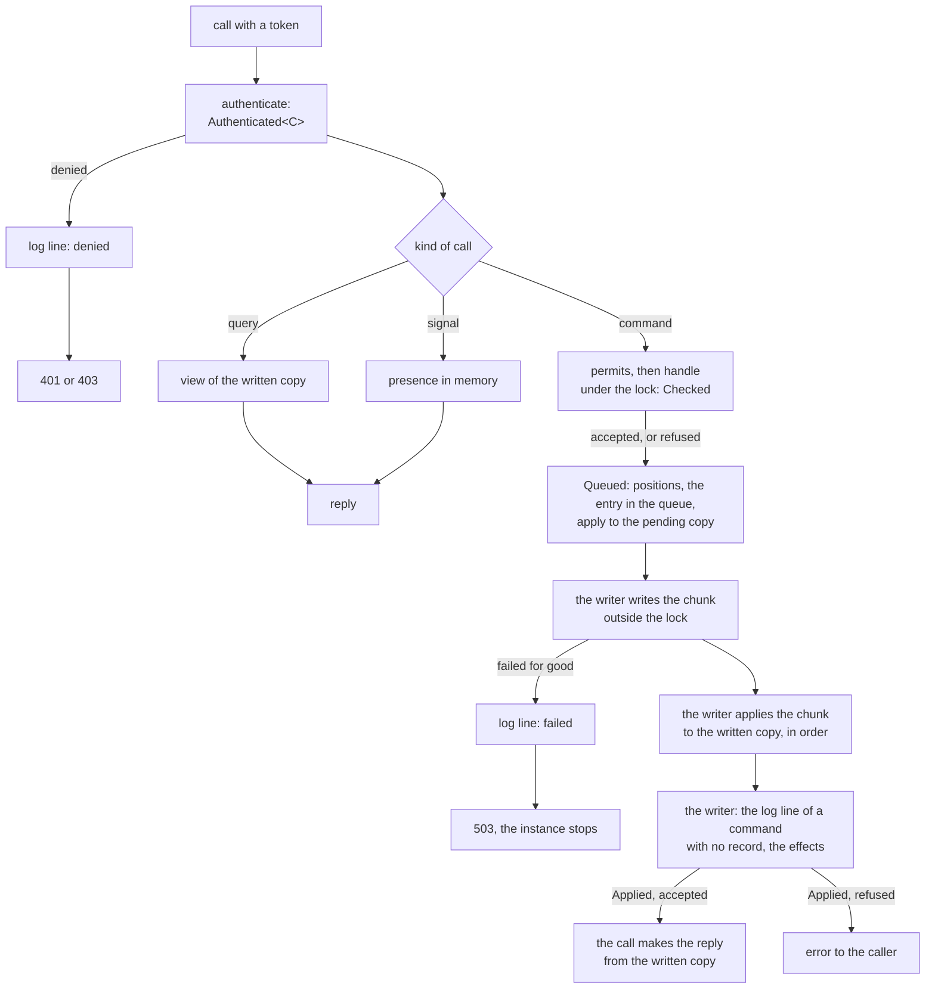
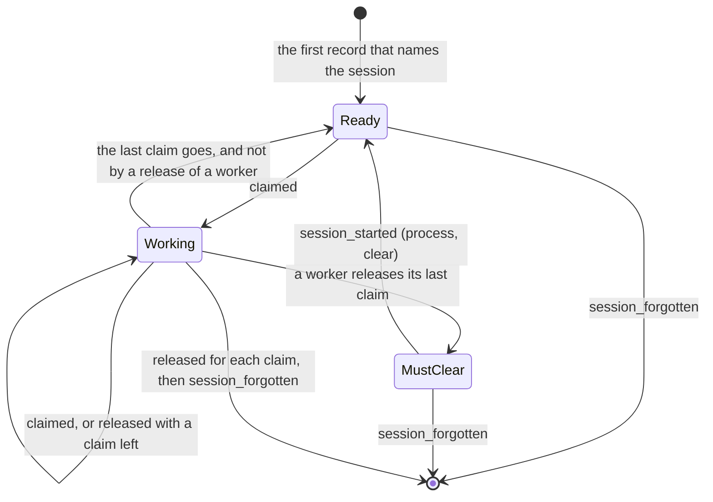
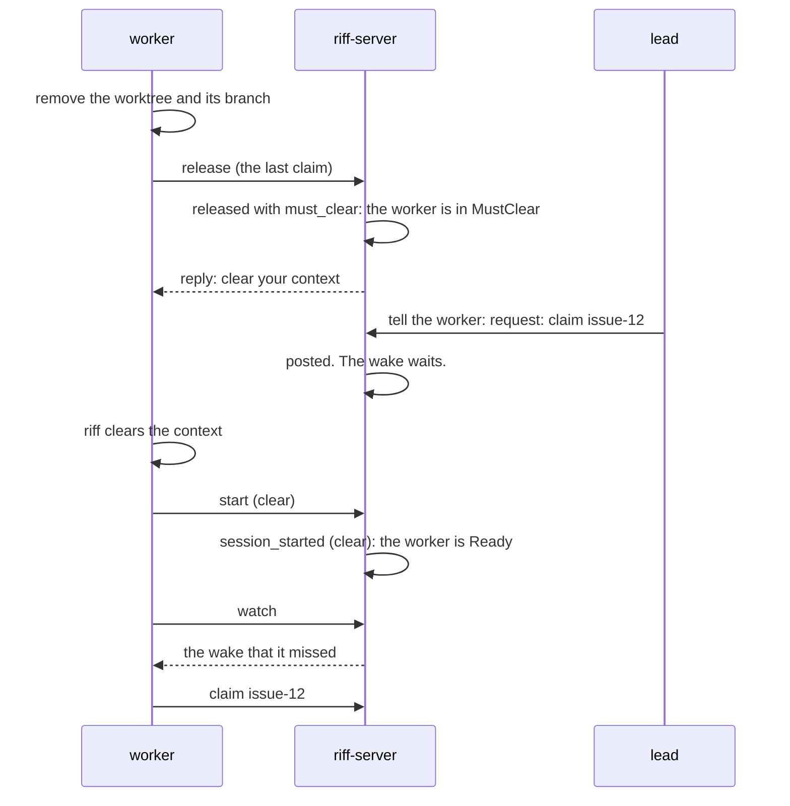

# Design: the command engine of riff-server

This page is the design of the command engine for release 1.0.0. It
builds on [the store](design-storage.md): one log, `handle`, `apply`,
and the writer. Three reviews are in `design/reviews/`
(`engine-01` to `engine-03`), and the decisions are at the end of this
page. When the build is done, the big picture stays in the book, and
the details go into the rustdoc.

## Goals

- One path: each call that changes the state of the log goes through
  one dispatch.
- One trace: each command leaves its records, or one log line.
- A worker clears its context between two items. `handle` refuses a
  claim that is against this rule.
- The compiler enforces the order of the stages. A handler cannot
  reply before the write.
- Release 1.0.0 fixes the format of the log. So this page names each
  record kind.
- Not goals: a new wire, a new store, more than one instance.

## The terms

| Term | Meaning |
|---|---|
| caller | Who sends a call. The engine takes it from the token, never from the body. |
| command | A call that asks for a change of the state that the log gives. It has a kind, for example `claim`. |
| query | A call that reads: `who`, `read`, `threads`, `me`, `members`, the facts of the server, the state of a pause, `watch`, `tail`. |
| signal | A call that changes only the presence: a keep-alive, a status, the place of a session, an open or a closed watch stream, a read cursor. |
| record | One line of the log. Only a command makes records. |
| effect | What the server does after the write: a wake, a `tail` event, the end of sign-ins. |
| trace | What a command leaves: its records, or one log line. |

## One path



- The engine is the only code that locks the state. Its one entry for a
  change is `Engine::dispatch`. Its one entry for a signal is
  `Engine::signal`.
- Each command is a type that implements the trait `Command`. The trait
  gives the kind, the type of the reply, `handle` and `reply`. A
  command that a client can send also implements `Routed`, which gives
  the HTTP path. One generic handler serves each routed command. A new
  command is one type and one line in the list of routes.
- `handle` checks the command against the pending copy. It does no I/O
  and changes nothing. It gives the changes and a note for the reply,
  or the reason for a refusal. The writer makes the effects from the
  written records: the wakes and the `tail` event of each `posted`
  record.
- The writer finishes each command. It writes the chunk, applies the
  records of the chunk to the written copy in the order of their
  positions, writes the log line of a command that made no record, and
  sends the effects. The call only waits, and makes the reply. A call
  that the client drops loses only its reply.
- Each command waits until the writer is done with its entry in the
  queue. The queue is in order, so each entry before it is done too.
  This is one rule for each command, also for a command that makes no
  record, and for a command that is refused: a refused command has an
  entry with no record. So no reply and no refusal tells of a change
  that is not in the log.
- A call can be a command and a signal: a `register` sets the place,
  and an `end` ends the session. The trait `Command` has the method
  `signal`, which gives the signal of the call, or none. The engine
  sets it in the presence at the check, under the same lock, also when
  the command makes no record. A refused command sets no signal.
- The server is a caller too. Each timer sends a command as the caller
  `server`: forget the old sessions, grant a request for the owner
  role, end the role of an owner who is gone, post a note of the
  server, name the owner of the settings. The engine has one function
  for each command of the server: `Engine::make_riff`,
  `Engine::announce` and `Engine::forget` are built. The function
  makes the `Authenticated` value inside the engine module. E3 adds
  the command `admit` of the token path, with the proof of the
  sign-in.
- `Engine::make_riff` goes through the same stages as
  `Engine::dispatch` (`Engine::send`: the check and the entry), and
  does not wait for the write: the build of a service is not async.
- Two signals of the server are no call of `Engine::signal`: the end
  of a watch stream (`Engine::watch_ended`) and the ask to stop an
  idle worker (`Engine::stop_idle_workers`). They are no call of a
  session, so they register nothing and they count as no call. Each
  one changes only the presence, under the lock of the engine.
- The first start of a riff sends the command `make_riff` of the
  server. It makes the `riff_made` record, and a `pause_set` record
  that pauses the riff. Until E3 and E5, it makes one `riff_state_set`
  record that pauses the riff.
- A call from a session that the state does not know first runs the
  command `register` for that session, also when the call is a query
  or a signal. It is a command of its own, with an entry of its own:
  its records name `register`, and they have a `session_started`
  record with the reason `join`. `Engine::check` runs the two `handle`
  functions under one lock. A query of such a session waits for that
  write, then reads the view. A signal of such a session first sends
  `register` through `Engine::dispatch` and waits for it, then sets
  the signal. An `end` of such a session registers nothing.
- The first `register` of a caller that the state does not know runs
  before `permits` of its command. So the session is registered also
  when its command is refused. A caller that the state knows gets the
  signal `Called` at the check, also when its command is refused: a
  refused call is a sign of life.

### The callers

| Caller | From | `by` in a record |
|---|---|---|
| a person | a person token | `{"person":"mike"}` |
| a session | a session token | `{"session":"mike/a6cf"}` |
| a sign-in | a verified email of the provider, before a token is there | `{"sign_in":"mike@comotechnologies.io"}` |
| the server | a timer of riff-server | `"server"` |

- The token layer makes the caller, with its class. `Engine::check`
  adds the worker mark and the role (member, admin or owner) under the
  lock, before `permits`. A session that the state does not know is
  not a worker. Until E3, the role comes from the token store.
- A build reads a class of caller that it does not know as `other`.
- A riff with no sign-in trusts its network. The caller is then the
  `me` of the body, with the role of an admin. Such a riff refuses each
  command of the group "people". A call whose body names no `me` needs
  a token: the caller is then the caller of the token. So a riff with
  no sign-in takes no such call (01M3WRD9G5GAF65EX8P6D5DMQM).
- The role of a caller with no token comes from the trust of the riff
  (01M3X4Z6G0TG0B4FT2N1FSPDHS): an admin in a riff with no sign-in, else a member.

### The commands

| Group | Commands |
|---|---|
| sessions | `register`, `start`, `end` |
| threads | `join`, `leave`, `post`, `announce` |
| work | `claim`, `release`, `release_for`, `lead` |
| the riff | `make_riff`, `pause`, `resume`, `set_idle`, `forget`, `import` |
| people | `admit`, `invite`, `remove`, `set_admin`, `pass_owner`, `take_owner`, `deny_owner`, `grant_owner`, `end_owner`, `name_owner`, `revoke` |

- `make_riff`, `announce`, `forget`, `import`, `grant_owner`,
  `end_owner`, `name_owner` and `admit` are not `Routed`. No HTTP call
  can send them.
- `pause`, `resume` and `set_idle` each have a path of their own:
  `/v1/pause`, `/v1/resume` and `/v1/idle/set`. A read of the pause
  (`/v1/riff`) or of the idle setting (`/v1/idle`) is a query.
- The path and the reply type of each routed command are in
  `riff-core`, next to its wire type: the trait `Call`. The server and
  the client use the same ones.
- The wire changes in these places: `start` gets the fields `reason`
  and `worker` (E4); `pause`, `resume` and `set_idle` get paths of
  their own; `join` and `leave`, and `claim`, `release` and
  `release_for`, each get a wire type of their own; the reply to a
  claim has no `granted`. The client and the server are one release.
- A kind is never renamed, and the name of a removed command is never
  used again. A file in the fixtures lists each kind of each release.
- Each group has one file in `crates/riff-server/src/state/`, with its
  part of the riff, its `apply` arms, its part of the checkpoint and
  its commands. The record `session_forgotten` of `forget` changes
  each part, so its arm calls each part. The rustdoc of the module
  `state` says where each part lives.
- The wire type of each routed command is its command type.
- The lead of a user frees the claim of another session of that user
  with `release_for`, a command of the group work with the path
  `/v1/release/for` (01M3WRD9MGSC3FTBAANT4ZSMKY). Its note of the
  server is a `posted` record in the chunk of the command.

### Who can send a command

One function, `permits`, holds this table. It reads only the caller:
its class (person, session, sign-in, server), its worker mark, and its
role (member, admin, owner; the owner has the role of an admin too).
It does not read the state. The engine calls it before `handle`, and
its refusal has the code `not_allowed`. A kind with no row does not
compile. One test runs each command as each class, mark and role, and
compares the result with the table. Each command gives the role that
it needs (`Command::needs`), and `permits` compares it with the role
of the caller.

| Command | Class of the caller | Role |
|---|---|---|
| `register` | a person, a session | member |
| `start`, `end` | a session | member |
| `join`, `leave`, `post` | a person, a session | member |
| `claim`, `release` | a person, a session | member |
| `release_for` | a session | member |
| `lead` | a session that is not a worker | member |
| `pause`, `resume` of a repository | a person, a session | member |
| `pause`, `resume` of the riff | a person, a session | admin |
| `revoke` of the own sign-ins | a person | member |
| `set_idle`, `invite`, `remove`, `revoke` of another person, `take_owner` | a person | admin |
| `set_admin`, `pass_owner`, `deny_owner` | a person | owner |
| `make_riff`, `announce`, `forget`, `import`, `grant_owner`, `end_owner`, `name_owner` | the server | |
| `admit` | a sign-in | |

The engine registers the first call of a person too, so `register`
has the class of a person. Two rows of the code differ from this
table until a later item:

- Until E5: the riff has one pause. `pause` and `resume` need a
  member, and `handle` refuses a session that is not a lead.
- Until E3: a session can send `set_idle` too, with the role of an
  admin. The commands of the people are not commands yet: they change
  only the token store.

```rust,ignore
{{#include ../../crates/riff-server/src/state/command.rs:permits}}
```

`handle` makes each check that reads the state: a session pauses only
the repository of which it is a lead, a worker in MustClear cannot
claim, a caller releases only what it holds. See "The moves that
`handle` refuses".

A worker is
never the lead: the rule for the first session of a user in a
repository skips a worker. Only an explicit `register` or `start`
makes the first lead. When the only session of a person in a
repository is a worker, that person has no lead there: `tell lead`
fails, and the worker asks in its own terminal.

### What stays outside

| Part | Why |
|---|---|
| The sign-in chains: the first pair, a refresh, the token of a session | They change only `signins.json`. A refresh does not wait for a write. The log holds no token and no hash. When the chains are lost, each person signs in again. |
| Presence: a keep-alive, the last call, a status, the place of a session, an open or a closed watch stream, the end of a session, the ask to stop an idle worker | It comes each minute from each session. Nothing is lost when it is lost: a start of the server loses each of them. |
| The read cursors | A `read` moves the cursor of the caller. The checkpoint keeps the cursors. |
| The queries | They change nothing. |

- The state has two parts with two types: the riff (the state that the
  log gives) and the presence (memory). `View` holds the two, read
  only. A signal is a value of the type `Signal`, and `Signal::set`
  gets `&mut Presence` only. So a signal cannot change a claim or a
  lead.
- A record changes the presence only in `Presence::applied`: a
  `session_forgotten` record removes the session and its cursors, a
  `claimed` or a `released` record sets the time of the last change of
  the claims, and a `riff_state_set` record sets the time for a stale
  status. The writer calls `apply(&mut riff, record)` and then
  `Presence::applied`, with the record, the riff after the `apply`,
  and the time of the call that made the record. A replay gives no
  time, and then `Presence::applied` sets no time.
- A session whose item another session takes has a `released` record
  of its own (01M3X4Z6BKM251H7CS2CEGR205). So `Presence::applied` reads only the record
  and the riff.
- `who` shows the time of a change after the write of its record: each
  reader sees the written copy.
- A status is a signal. The wire type refuses a bad text. A `register`
  is a signal (the place) and a command (the join of the repository
  thread). An `end` is a command (it frees the claims) and a signal
  (the session ended).
- The first sign-in of a person changes the people: it gives the user
  its email, and it can make the first owner. The token path sends the
  command `admit` for it, with the sign-in as the caller. Then it makes
  the chain. `admit` makes no record for a person that the state
  knows.
- A `remove` and a `revoke` end sign-ins. The end of the sign-ins is an
  effect after the write. Each sign-in keeps the position of the log at
  its start. When a load finds a sign-in whose position is less than
  the position of the last `member_removed` or `signins_ended` record
  of its user, it drops the sign-in. So a stop between the write and
  the effect lets no removed person in.
- The setting `--owner` is the command `name_owner` of the server. It
  runs one time after the load, and makes an `owner_set` record when
  the riff has no owner and had none. The admins of the settings are
  not in the log: `View` holds them, and the token layer adds them to
  the role of the caller.

## The trace of a command

The log is the truth for each change. Each record names its cause: the
envelope has the caller (`by`) and the kind of the command
(`command`). So the log alone shows who made each change, and
`riff audit` reads only the log.

```json
{"position":1234,"written_at_ms":1790000000000,"by":{"session":"mike/a6cf"},"command":"claim","change":{"claimed":{"session":"riff://mike@pangolin/como-technologies/riff?session=a6cf","thread":"como-technologies/riff","item":"issue-355"}}}
```

- The records of one command are in one chunk, one after another
  (01M3X4Z60G1FXQTDC5XDJ05BAX). `State::queue` gives the records of a command their
  positions and their cause under one lock, and the writer takes whole
  entries of the queue.
- A record from before E2 has no `by` and no `command`. It reads, and
  its cause is not known. `riff-server log` prints the cause of each
  record.
- A note of the server that a command causes is a `posted` record in
  the chunk of that command, with the `by` and the `command` of the
  cause. The sender of the message is the server.
- The session in a change is a full URI: it holds the place at the time
  of the record. `by` holds only the user and the session ID.

A command that makes no record gives one log line of riff-server. The
line has the format of each other log line (`severity`, `time`,
`message`, `target`), and these fields:

```json
{"severity":"INFO","time":"2026-10-01T12:00:00Z","target":"engine","message":"refused","caller":{"session":"mike/84cf"},"key":"0f3a…","command":"claim","result":"refused","code":"held","reason":"issue-355 is held by mike/a6cf"}
```

| `result` | When | Severity |
|---|---|---|
| `refused` | `permits` or `handle` refused the command. | `INFO` |
| `no_change` | `handle` accepted the command, and it made no record. | `INFO` |
| `failed` | The chunk was not written, and the instance stopped. | `ERROR` |
| `denied` | The token layer refused the call: a command, a query or a signal. | `INFO` |

- The writer makes the lines `refused`, `no_change` and `failed`
  (`Engine::finish` and `Engine::fail`, 01M3X4Z62RJREQ5H8F18Y85T6V). The token layer
  makes the line `denied` (01M3X4Z64ZNRD0G0F4JV1M64FN). The module
  `crates/riff-server/src/trace.rs` holds each line.
- `failed`: one line for each command of the chunk that was not
  written, and one for each command that waits in the queue when the
  server stops.
- A refusal has a `code` and a `reason` as text. A test of a refusal
  compares the code. The codes of this release: `not_allowed` (the
  class or the role of the caller), `no_sign_in` (a command of the
  people in a riff with no sign-in), `held`, `paused`, `must_clear`,
  `not_holder`, `other_user`, `not_member` (the command names a person
  who is not a member), `bad_request` (the fields of the call do not
  agree, for example the signed fields of a post). A release can add a
  code. A reader takes a code that it does not know as text. The enum
  `Code` has each code of this list. `no_sign_in` and `not_member` get
  their first use in E3, and `must_clear` in E4. The reply to a
  refused command has the code in the header `riff-refused`, and the
  reason as its text (01M3WRD9JBQMNN96TXJH8EAJ3W).
- The HTTP status of a refused command comes from its code
  (01M3X4Z69CFV23V4QZBE8RP1GJ):

  | Status | Codes |
  |---|---|
  | 403 | `not_allowed`, `no_sign_in`, `not_member` |
  | 409 | `held`, `paused`, `must_clear`, `not_holder`, `other_user` |
  | 400 | `bad_request` |

- A `denied` line has no `caller`. It has `named` (the caller that the
  call named), `proved` with the value `false` (no token proved the
  name), `path` in the place of `command`, and a code. It has no
  `reason`. These codes are codes of the token layer only. They are
  not codes of a refused command:

  | Code | When | Status |
  |---|---|---|
  | `no_token` | The call has no token. | 401 |
  | `bad_token` | The server does not know the token, or the token expired. | 401 |
  | `bad_proof` | The proof of the device key is refused: 401. The signature of a post is refused: 403. | 401, 403 |
  | `not_you` | The token may not act as the `me` of the body. | 403 |
  | `old_build` | The build of the client is too old or too new. | 409 |

- `named` is the `me` of the body, or the `uri` of the query. The
  server reads the body for it only after it refused the call, and at
  most 64 KiB of it. A call with a longer body, or with no name, gives
  a line with no `named`. A name that is no session URI is text:
  `{"text":"..."}`. A name of more than 200 characters is cut, and the
  line then has `named_cut` with the value `true`. A line break in a
  name is escaped, so the line stays one line.
- `key` is the thumbprint of the device key of the token. It is not a
  secret. A call with no token has no `key`.
- A line never holds the body of a post, a token or a key
  (01M3X4Z675D0ZQX93E93F3M8FA). A test runs each command with a marked body and a
  marked token, and finds no mark in the lines.
- A command with records gets no line. A signal and a query that the
  token layer accepts get no line. The request log of Cloud Run holds
  each call with its path and its status.
- The lines are best effort: a stop between the result and the line
  loses the line.
- The log shows who did what for as long as it keeps its chunks: about
  30 days (see "The checkpoint" in the store design).

## The life cycle of a session

The state that the log gives holds the life cycle of each session.
Records move it, so a replay gives the same state. Presence (live,
gone, ended) is a different thing: it is in memory, and it says only
if the session is there.



| State | Meaning |
|---|---|
| Ready | The session holds no claim. It can claim. |
| Working | The session holds one or more claims. |
| MustClear | A worker that released its last claim, and did not start with a fresh context after it. Its context has the old item. It cannot claim. |

- `handle` decides, and the record holds the decision: the `released`
  record of the last claim of a worker, made by its own `release`, has
  `must_clear`. `apply` only stores it. A `session_started` record
  with a fresh context ends it.
- A claim that goes in another way leaves the worker Ready: a start,
  an end, or a claim of another session after the 5 minutes of the
  claim timer. So a worker that a person resumes in the middle of an
  item claims its item again and goes on.
- A `session_started` record has a reason: `process` (a new agent
  process), `resume`, `clear`, or `join` (the session comes with no
  new start). `process` and `clear` are fresh starts. The record also
  says if the session is a worker.
- The `start` call carries the reason and the worker mark. An explicit
  `register` whose worker mark is not the mark of the state makes a
  `session_started` record with the reason `join` and the new mark.
  The `register` that the engine runs first keeps the mark of the
  state.
- A start frees each claim of the session: one `released` record for
  each, then the `session_started` record. An end frees each claim
  too. The log has no record for the end itself.
- A claim that takes an item whose holder is gone gives a `released`
  record for the old holder, then the `claimed` record, in one chunk.
- `forget` gives one `released` record for each claim of the session,
  then the `session_forgotten` record. That record says that each
  thing of the session goes: `apply` removes the session, its places
  in the threads and its lead.
- The state keeps the time of the last fresh start of each session:
  the time of its last `session_started` record with a fresh context.
- A person has no session ID and no life cycle. A person can claim and
  release.

### The moves that `handle` refuses

| Command | Refused when | Code |
|---|---|---|
| `claim` | The session is in MustClear: "clear your context first: type /clear, or run riff workers next". | `must_clear` |
| `claim` | The repository or the riff is paused. | `paused` |
| `claim` | Another session holds the item. | `held` |
| `release` | The caller does not hold the item. | `not_holder` |
| `pause`, `resume` of a repository | The caller is a session that is not a lead of that repository, and not an admin. | `not_allowed` |
| `register` | The session ID is known under another user. | `other_user` |

`permits` refuses a `lead` of a person or of a worker, before `handle`.

### The clear of a worker



- The release is the last step of an item. The skill removes the
  worktree and its branch first.
- The reply to the release that puts a worker in MustClear tells riff
  to clear its context. The reply to a keep-alive of a worker in
  MustClear tells it too, so a lost reply does not leave the worker
  there.
- The engine sends no wake to a session in MustClear. The message is in
  its thread, and its `posted` record names the session in `woken`.
  The wake waits in the presence. When the watch starts after the
  clear, the session gets the wake that it missed. A start of the
  server loses the wake that waits: the message stays unread, and the
  session reads it at its start.
- `who`, `top` and `riff workers` show MustClear, and the time since
  the last fresh start of each worker.

## The pipeline in the types

The stages of a command are types of the engine module. Only that
module can make `Checked`, `Queued` and `Applied`, and each one is
made from the stage before it. `Authenticated<C>` has two doors: its
constructor for a routed command takes the proof of the token layer
(`SignedIn`), and the functions of the engine for the commands of the
server and for `admit` make it inside the module. The
state, its lock and the queue are private fields of the engine module.
The files of the commands are next to the engine module, not below it,
so no command can make a stage or lock the state.

| Stage | Made by | It proves |
|---|---|---|
| `Authenticated<C>` | the token layer with its proof, or a function of the engine | The caller is the caller of the token, and may act as the `me` of the body. |
| `Checked<'s, C>` | `Engine::check`, in the call | `permits` and `handle` ran: the command is accepted or refused. It holds the lock of the state. |
| `Queued<C>` | `Checked::queue`, in the call | The records have positions. The entry of the command is in the queue, and its records are in the pending copy. The lock is free. |
| `Applied<C>` | `Queued::applied`, from the word of the writer | The chunk of each record is in the log, and the written copy has the records, in order. The log line and the effects of the command are done. |

The writer has a proof too (01M3X4Z6DSWKMJ2R549R4TSYP0). `log::write` gives the value
`Written`, and only the module `log` makes it. `Engine::finish` takes
the chunk and its `Written`. So the types show that only a written
chunk reaches the written copy. A chunk with no record needs no object:
a write of no record gives its `Written` with no I/O. A chunk that is
not written goes to `Engine::fail`.

- Only `Applied` gives the reply. So a handler cannot reply before the
  write. The writer sends the effects, so no wake goes out for a record
  that is not written.
- Only the writer calls `apply` on the written copy, with the records
  of a chunk that it wrote. So the server cannot apply a record that is
  not written, and the written copy is the replay of the log.
- `Checked` holds the guard of a `std::sync::Mutex`, so no other call
  comes between the check and the queue. The guard is not `Send`, and
  axum needs a `Send` future. So a handler that holds it over an
  `await` does not compile.
- Two rules have a doc test with `compile_fail` that names its error
  code, and a twin doc test that compiles and differs in the one line
  that the rule forbids:
  - Code outside the engine module cannot make a stage: `Engine::check`
    is private (E0624). The twin uses `Engine::dispatch`. The two are
    on `Authenticated`.
  - A signal cannot reach the riff: `Signal::set` does not take a
    `Riff` (E0308). The twin gives it the presence. The two are on
    `Signal`.
- The stages are public types, so a doc test can name them. Their
  fields and the functions that make them are private to the engine
  module: the privacy of the module keeps the rule for each other way
  to make a stage.
- The rule "no `await` while `Checked` lives" has no doc test: only
  `dispatch` can break it, and then the one handler does not build.
  The rustdoc of `dispatch` says so, with the text of the error.
- The tests `a_state_with_a_writer_shows_a_record_only_after_its_write`
  and `a_post_of_a_state_with_a_writer_is_read_only_after_its_write`
  stay. The tests of the engine are in `crates/riff-server/src/lib.rs`:
  one drops a call while the write waits, then checks the written
  copy and the wake. One puts a claim and a release in one chunk, and
  compares the written copy with the replay of the log. One checks
  that a refusal as `held` comes only after the write of the claim
  that holds.

This is the real code. A command, with its kind, its reply and its
rule:

```rust,ignore
{{#include ../../crates/riff-server/src/state/command.rs:command}}
```

A call, in `riff-core`, and a command that a client can send:

```rust,ignore
{{#include ../../crates/riff-core/src/wire.rs:call}}

{{#include ../../crates/riff-server/src/engine.rs:routed}}
```

A signal:

```rust,ignore
{{#include ../../crates/riff-server/src/state/presence.rs:signal}}
```

One entry of the queue, and why a call gets no reply:

```rust,ignore
{{#include ../../crates/riff-server/src/engine.rs:entry}}

{{#include ../../crates/riff-server/src/engine.rs:failed}}
```

The one path, and the handler of each routed command:

```rust,ignore
{{#include ../../crates/riff-server/src/engine.rs:dispatch}}

{{#include ../../crates/riff-server/src/engine.rs:handler}}
```

The router has one line for each routed command:

```rust,ignore
{{#include ../../crates/riff-server/src/lib.rs:routes}}
```

The writer is one task of the server. It takes each entry of the
queue (`Engine::take`), writes their records as one chunk outside the
lock, and gives the chunk and the proof of its write to
`Engine::finish`:

```rust,ignore
{{#include ../../crates/riff-server/src/engine.rs:finish}}
```

The tests keep the given/when/then form of the store design.

## The records

Release 1.0.0 fixes this list. The enum `Change` and the list of its
kinds come from one place, so a kind cannot be in one and not in the
other. The fixtures of CI hold one record of each kind.

The envelope of each record: `position`, `written_at_ms`, `by`,
`command`, `change`.

| Kind | Fields | Made by |
|---|---|---|
| `riff_made` | `riff_id` | `make_riff`, or `import`: the first record of the log |
| `posted` | `thread`, `message` (it holds the seq), `woken` | `post`, `announce`, and a command that causes a note |
| `joined_thread` | `session`, `thread` | `register`, `join`, `post` |
| `left_thread` | `session`, `thread` | `leave` |
| `claimed` | `session`, `thread`, `item` | `claim` |
| `released` | `session`, `thread`, `item`, `must_clear` | `release`, `start`, `end`, `claim`, `forget` |
| `lead_set` | `session`, `thread` | `lead`, `register`, `start` |
| `session_started` | `session`, `reason`, `worker` | `register`, `start` |
| `session_forgotten` | `session` | `forget` |
| `pause_set` | `scope`, `state` | `pause`, `resume`, `make_riff`, `import` |
| `setting_changed` | `idle` | `set_idle` |
| `person_joined` | `user`, `email` | `admit` |
| `member_invited` | `email` | `invite` |
| `member_removed` | `email` | `remove` |
| `admin_set` | `email`, `admin` | `set_admin` |
| `owner_set` | `email`, or none | `admit`, `name_owner`, `pass_owner`, `take_owner`, `grant_owner`, `end_owner` |
| `owner_asked` | `email`, `due_ms` | `take_owner` |
| `owner_denied` | `email` | `deny_owner` |
| `signins_ended` | `user` | `revoke` |

- `pause_set` holds the pause of the riff too.
- A record of the people names a person by the email. The state finds
  the user from the email.
- `setting_changed` holds each setting. Each setting is a field that
  can be absent: absent means "not changed".
- The log has no record for the end of a session. A later release can
  add one, with a new name.

### The rules for a change of a record

The three rules of the store design stay. These rules come with them:

- `apply` only stores what a record says
  (01M3WNQQWA7XGK4Y9ET8HJZ8NN). It reads only the record and the riff,
  and no clock, no presence and no setting. It makes no decision. So a
  new policy changes only `handle`, and the same log gives the same
  riff on each build that knows the records. The table below has each
  place where `apply` reads the riff. A new place needs a line in the
  list of `state/riff.rs`.
- `by` and `command` are fields of the envelope with a default: a
  record with no `by` has a cause that is not known.
- A new record kind after 1.0.0 gets a new name. An old build skips it,
  and writes no checkpoint past it.
- A field with a set of named values that can grow (`reason`, `scope`,
  the class in `by`) has the value `other`. A build reads a value that
  it does not know as `other`, and `apply` changes nothing for it: a
  `session_started` with the reason `other` is not a fresh start, and
  a `pause_set` with the scope `other` changes no pause. A record with
  a value that the build read as `other`, in its change or in its
  `by`, counts as a skipped record: the build writes no checkpoint
  past it, and `riff server` counts it. `state` of `pause_set` has two
  values and no `other`.
- A new command needs no change of the format: `command` is text. A
  reader takes a `command` that it does not know as text.

| Record | Where `apply` reads the riff | It stays |
|---|---|---|
| `session_forgotten` | It removes each thing of the session: its entry, its places in the threads, its claims, its lead, and each direct thread whose other session is not known. | Yes. E4 gives the claims their `released` records first. |
| `left_thread` | It ends the place of the session in the thread, with its lead of that thread. The lead of a thread is a member of it. | Yes. |
| `posted` | A thread keeps its last 200 messages. The number is a constant of the format: a change of it follows the rules for a change of a record. | Yes. |
| `claimed` | The new holder replaces the old one. | Yes, for a log from before E2. Since E2, the old holder gets a `released` record first. |
| `released` | A record of a session that does not hold the item changes nothing. `handle` refuses such a release, so the engine does not write this record. | Yes. |
| `lead_set` | The session of the record replaces the old lead of its user in the thread. | Yes. |
| `posted`, `session_forgotten` | They keep the index of the signed messages for the copy check. A `posted` record adds the hash of its payload, and removes the hash of the message that goes at 200. A `session_forgotten` record removes the hashes of each direct thread that goes. | Yes. |

### The checkpoint

Each part of the state that the log gives is in the checkpoint. The
store design names the parts of today. The engine adds these parts,
and the build item that adds a part to the state adds it to the
checkpoint:

- the riff ID;
- the people: the email of each user, the members, the admins, the
  owner, a riff whose owner is gone, and the request for the owner
  role with its time;
- the position of the last `member_removed` and `signins_ended` record
  of each user;
- the worker mark, the MustClear mark and the time of the last fresh
  start of each session;
- each pause, with who set it and when.

A test takes each fixture log and compares the state of a full replay
with the state of a start from a checkpoint at each position.

## The scope of a pause

The state holds a pause of the whole riff, and a pause for each
repository.

```rust,ignore
pub struct Pauses {
    /// The pause of the whole riff. A new riff is paused.
    riff: Option<Pause>,
    /// The pause of each repository thread. A new repository runs.
    repositories: BTreeMap<ThreadName, Pause>,
}

/// Who set a pause, and when: the `by` and the time of its record.
pub struct Pause { by: Who, at_ms: u64 }
```

```json
{"position":2001,"written_at_ms":1790000000000,"by":{"session":"brett/62b2"},"command":"pause","change":{"pause_set":{"scope":{"repository":"como-technologies/strata"},"state":"paused"}}}
{"position":2002,"written_at_ms":1790000100000,"by":{"person":"mike"},"command":"pause","change":{"pause_set":{"scope":"riff","state":"paused"}}}
```

- A thread is paused when the riff is paused, or when the thread is a
  repository thread that is paused. `handle` reads the two for the
  thread of a claim: `view.pauses().check(thread)`. The refusal names
  the pause and who set it.
- A session is paused when the repository of its place is paused, or
  the riff is paused. `whoami`, `who` and `top` show which pause it is
  and who set it.
- A claim in a thread that is not a repository thread sees only the
  pause of the riff.

| Pause | Who can set and end it |
|---|---|
| a repository | a lead of that repository; a person, for the repository of the call; the owner and each admin, for each repository |
| the whole riff | the owner and each admin: as a person, or as a lead |

- A resume of a repository while the riff is paused changes only the
  pause of the repository. The reply says that the riff is still
  paused.
- A pause and a resume wake each session that it changes: the sessions
  of the repository, or each session.
- The rollout starts no worker for a repository that is paused.
- The server keeps the idle workers for each user, host and
  repository.

## The import of go-live

A start that finds the old objects and no log is the import. It needs
no flag: the deploy of release 1.0.0 is the import. The server reads
the old objects before the dispatch, and gives what it read to the
command `import` of the server. `Engine::dispatch` writes these
records, with `by` `server` and `command` `import`:

1. `riff_made`, with the riff ID of today.
2. `person_joined` for each user, with its email.
3. `member_invited`, `admin_set` and `owner_set`; `owner_asked` when a
   request for the owner role waits.
4. `pause_set` for the riff, paused; `setting_changed`.
5. For each session that did not end: `session_started` (the reason
   `join`, the worker mark), then its `joined_thread`, `lead_set` and
   `claimed` records.
6. The `posted` records: the last 200 messages of each thread, as the
   checkpoint keeps them. A direct thread whose two sessions ended is
   not in the import.

- After the import, the server writes a checkpoint with the read
  cursors of the old objects. So no session reads a message of the
  import a second time.
- A worker that holds no claim at the import is Ready.
- A second start finds the log, and does not import again.
- Until the import is built (E6), `riff-server` refuses to start on a
  store that has the old objects and no log.
- After go-live, only the owner and the admins resume the whole riff.

## Build items

Each item is in Wave 17, with a `Needs:` line. A session takes an item
only when each item that it needs is merged. No release goes out from
`main` before go-live (#341). Each item that adds a part to the state
adds it to the checkpoint, with a test: a start from a checkpoint
gives the state of a full replay.

| Item | What | Needs |
|---|---|---|
| E1a | The move, with no change of behavior: `State` becomes the riff and the presence. Each command becomes a type with `handle`. Each group of commands gets a file with its part of the state, its `apply` arms and its part of the checkpoint. The old handlers stay. The requirement: `apply` only stores what a record says. | |
| E1b | The engine: `Caller` with its role, `Command`, `Routed` in `riff-core`, `permits`, the stages as types, `Engine::dispatch`, `Engine::signal`, the one handler, the writer that makes `Applied`, the one wait rule (also for a refusal) and its measure, a status and a place as signals, the signal of a command, `make_riff`, the paths of `pause`, `resume` and `set_idle`, the refusal to start on old objects with no log. | E1a |
| E2 | The trace: `by` and `command` in each record, the log line of a command with no record with its fields and the `key`, the codes of a refusal, the `denied` line of the token layer, a note in the chunk of its cause, the `released` record of a claim that takes an item. A how-to in the book: find who did what. | E1b |
| E3 | The people in the log: the kinds, the commands, `admit`, `name_owner`, the timer commands of the owner, `riff_made`, the role of the caller from the written copy, `signins.json` with only the sign-ins and the position of each, the drop of an old sign-in at a load. | E2 |
| E4 | The life cycle: `reason` and `worker` in `start`, `session_started`, the first lead only from an explicit `register` or `start` and never for a worker, the `released` records of `forget`, `must_clear` in `released`, MustClear, the refusals, the ask to clear in the reply to a release and to a keep-alive, the wake that waits, the state in `who`, `top` and `riff workers`. | E2 |
| E5 | The two pauses (#364): `pause_set`, the roles, the views, the rollout, the idle workers for each repository. | E2 |
| E6 | The format of 1.0.0: the enum and the kinds from one place, the value `other` and its checkpoint rule, the list of the command kinds, a fixture with one record of each kind, the replay of each fixture in CI, the test of the checkpoint, the command `import`. | E3, E4, E5 |

E1a is built. Its fixture
`crates/riff-server/tests/fixtures/main-a2e9c98/` holds a log and a
checkpoint that `main` wrote before the engine build. Each later item
reads them with no change (01M3WNQR41K41TV832GRQZ2CQS).

E1b is built: the module `crates/riff-server/src/engine.rs`. The sync
methods of `State` (`State::run`, `State::claim` and the others) stay
for a state with no writer: the tests, the examples and the tools use
them. Each one runs the same steps as the engine: `State::check`,
`State::queue` and `State::written`. The server cannot call them: the
state is a private field of the engine.

E2 is built: the cause in each record (`riff_core::record::By`), the
lines of the module `crates/riff-server/src/trace.rs`, and the proof
of a write (`log::Written`).

Other items:

- #353 (riff clears a worker) needs E4. It changes the skill: the
  release is the last step of an item.
- #354 (`riff audit`) needs E2, E4 and #353.
- #341 (go live) needs E6, #381 (the token of a session) and #363 (the
  guards of `log cut`).

## Decisions

1. The stages of a command are types. The call makes `Checked` and
   `Queued`. The writer makes `Applied`.
2. The writer finishes each command: the write, the apply in order,
   the log line, the effects.
3. Each command leaves one trace: its records, or one log line. A
   command with records gets no log line.
4. Each record names its caller and its command. `by` is an object
   that names the class of the caller.
5. The log shows who did what for as long as it keeps its chunks.
6. A status and a place are signals. The sign-in chains, presence, the
   read cursors and the queries stay outside the dispatch. A signal
   cannot change the state of the log.
7. A command is a type with a trait, not a variant of one enum. One
   generic handler serves each routed command. A command of the server
   has no route.
8. One table, `permits`, says who can send each command.
9. MustClear comes only from the release of a worker itself. `handle`
   decides, and the `released` record holds it.
10. The server starts the clear of a worker. The release is the last
    step of an item.
11. `apply` only stores what a record says.
12. A worker is never the lead.
13. Each change of the people is a record kind of its own. The people
    are in the log before go-live. The caller carries its role.
14. One kind, `pause_set`, holds the two scopes of a pause.
15. A field with named values that can grow has the value `other`, and
    a record that a build read as `other` stops its checkpoint.
16. The log has no record for the end of a session.
