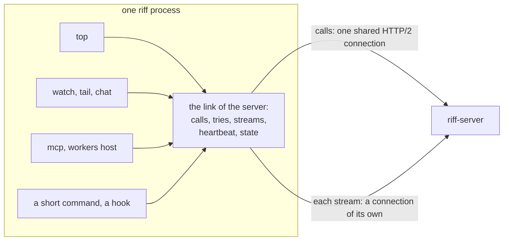
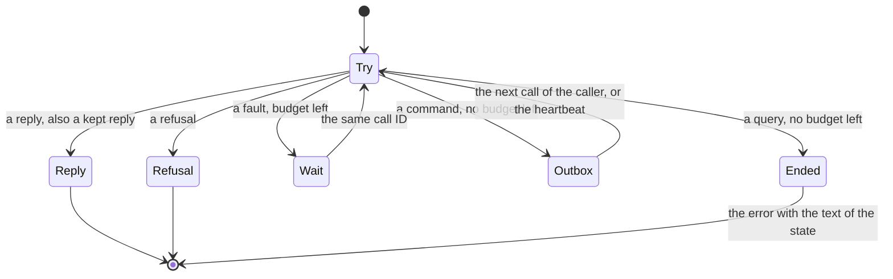
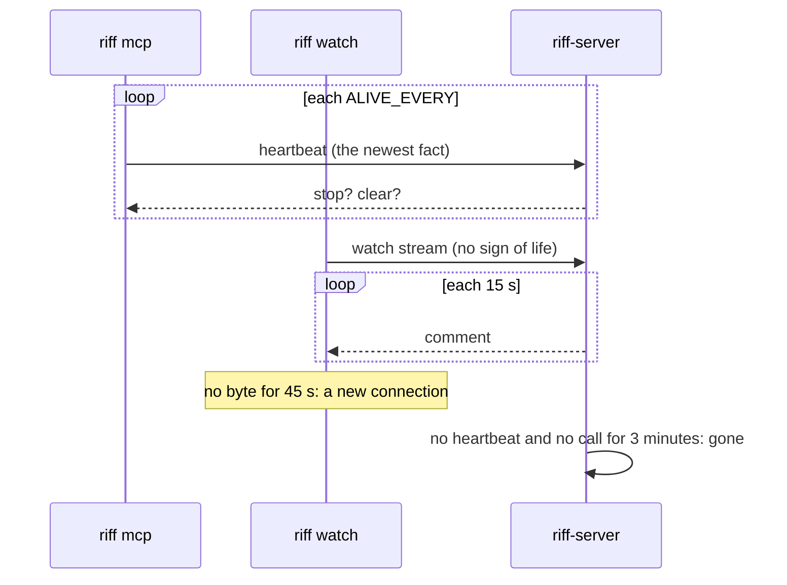
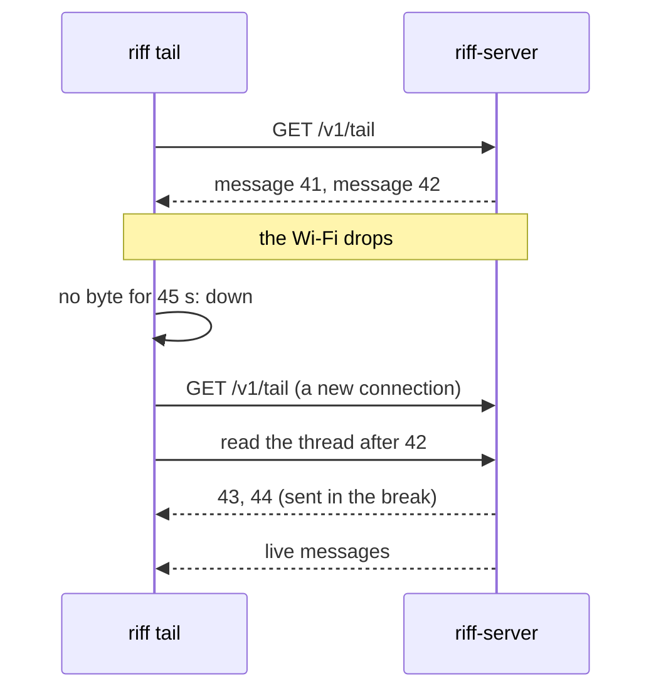
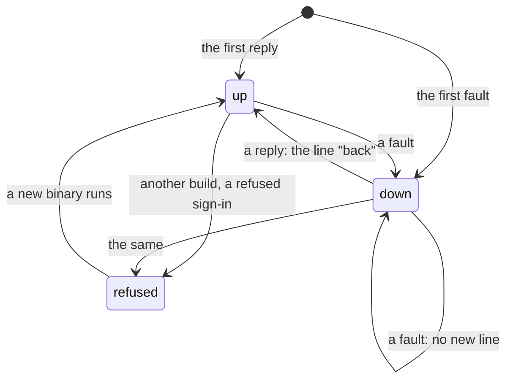

# Design: the client link

This page is the design of the link: the one part of `riff` that
connects to `riff-server`, sends each call, tries again, follows each
stream, sends the sign of life, and knows the state of the connection.
Each command uses it. The crate review is
`design/reviews/link-00-crates.md`. Three reviews are in
`design/reviews/` (`link-01` to `link-03`), and the decisions are at
the end of this page. When the build is done, the big picture stays in
the book, and the details go into the rustdoc.

## Goals

- One link for each command: `top`, `watch`, `chat`, `tail`, `mcp`,
  `workers host`, the status line, the hooks and each short command.
  A command does not connect, try again or show a fault in a way of
  its own.
- Each call has a time limit. No call waits for ever.
- One rule for a new try. A fault of the connection gets a new try on
  a new connection. A refusal gets none.
- Delivery is guaranteed: the link sends a command until it gets a
  reply, and `riff-server` runs each command one time only.
- One sign of life for a session: the heartbeat.
- Each stream has a connection of its own, finds a dead connection in
  45 s, and loses no message after a break.
- One state of the connection, with one text, in each command that
  runs until stopped.
- Not goals: a new wire, HTTP/3, a connection that lives through a
  change of the address, a queue of calls that waits for the network
  while no command runs.

## The terms

| Term | Meaning |
|---|---|
| link | The part of `riff` that talks to one `riff-server`. One process has one link for each server. |
| call | One request and its reply: a query, a signal or a command (see [the command engine](design-engine.md)). |
| try | One send of a call on one connection. A call has one or more tries. |
| fault | A try that ends with no reply of `riff-server`: no connect, a cut, no reply in time, or a reply of the front end. |
| refusal | A reply of `riff-server` that says no. A new try gives the same reply. |
| budget | The time from the first try of a call to its end. Each call has a budget, except the streams. |
| call ID | A random ID of one call of a command. Each try of the call sends it. |
| outbox | The commands of a caller on this machine that got no reply in their budget. |
| heartbeat | The keep-alive that a session sends each `ALIVE_EVERY`. |
| state | `up`, `down` or `refused`: what the link knows of the server now. |

## The picture



## 1. One link

The link is the module `link` of the crate `riff`. `link::of(base)`
gives the one link of a server in the process: a map by the URL of
the server. So each `Api` of one server shares one link, one HTTP
client and one state. `Api` keeps its typed methods (`who`, `post`,
`claim` and the others), and each method goes through the link. Only
the link talks to `riff-server`. The client of the sign-in provider in
`login` is not a client of `riff-server`, and its faults do not change
the state.

| Part | What it does |
|---|---|
| `link::of(base)` | The link of the server at `base`. The process statics of today (`REPLIED`, `SERVER_BUILD`, `WAIT_SHOWN`, `NOTED`) move into it. |
| `Link::call(call, budget)` | Sends one call with the rule for a new try (section 2), in its budget. |
| `Link::stream(path, query)` | Follows one stream across connections (section 5). The stream never ends. |
| `Link::heartbeat(every, body, on_reply)` | A task that sends the heartbeat of a session (section 4). `body` makes the body at each tick. `on_reply` takes the asks of the server: stop, clear. |
| `Link::state()` | A `tokio::sync::watch` receiver of the state (section 6). |
| `Limits` | The time limits. `Limits::default()` has the constants below. A test gives limits in milliseconds. |

### The budget

The budget belongs to each call. A process gives its calls a default.

| Call | Budget |
|---|---|
| A call of a short command: `claim`, `post`, `who` and each other | `SHORT_BUDGET`, 60 s. |
| A tool call of `riff mcp`, a post of `chat`, a call of `workers host` | `SHORT_BUDGET`. A tool call must not hold the turn of the agent for ever. |
| A look of `riff top` | `SHORT_BUDGET`. `top` draws the state while a look waits. |
| The start hook | `STATE_WAIT`, 3 s (R69: each start has its context). |
| The status line | `STATUSLINE_WAIT`, 2 s, one try. |
| The end of a session (`mcp`, `workers host`) | `END_WAIT`. |
| The heartbeat | Its period. Each tick is one try. The next tick is the new try. |
| A stream | None. A stream tries until it is stopped. |

The budget is a deadline for the whole call. The link cuts the open
try at the deadline. Each try has the limit `min(TRY_WAIT, the budget
that is left)`, and each connect `min(CONNECT_WAIT, the budget that is
left)`.

### The constants

| Constant | Value | Of today |
|---|---|---|
| `CONNECT_WAIT` | 5 s | New. Today a connect has no limit. |
| `TRY_WAIT` | 20 s | Replaces `host::CALL_WAIT`. |
| `SHORT_BUDGET` | 60 s | Replaces `BUSY_LIMIT` and `top::LOOK_WAIT`. |
| `MOST_WAIT` | 5 s | The longest wait between two tries of a call, as `busy_waits` today. |
| `STREAM_RETRY` | 5 s | Replaces the three `RETRY` constants of `main`, `host` and `chat`. |
| `STREAM_IDLE` | 45 s | New. |
| `LINE_AFTER` | 1 s | Replaces `WAIT_LINE_AFTER`. |
| `STATE_WAIT`, `STATUSLINE_WAIT`, `END_WAIT`, `PROBE_WAIT` | as today | They become budgets. |
| `ALIVE_EVERY`, `WORKER_ALIVE_EVERY` | 60 s, 10 s | They stay. |
| `CALL_KEEP`, `CALL_KEEP_MOST` | 24 h, 1024 | New, on the server. |
| `OUTBOX_KEEP` | 23 h | New. Less than `CALL_KEEP`. |

## 2. One rule for a new try

Each try ends in one of three ways: a reply, a fault or a refusal.

| Outcome | Examples | What the link does |
|---|---|---|
| reply | Each 2xx of `riff-server`. | Gives the reply. The state is `up`. |
| fault | No DNS answer. A connect that fails or takes more than `CONNECT_WAIT`. A cut before the end of the reply. No reply in the limit of the try. A 502, 503, 504 or 429 with no build header: a reply of the front end. A 503 of `riff-server`. | A new try after a wait, while the budget lasts. The state is `down` from the first fault. |
| refusal | Each other reply of `riff-server`. A build that riff cannot talk to. A refused token. A session that left the riff. | No new try. The call gives the refusal. |

- A 401 to a token is the one exception: the link gets a new token and
  tries one more time, as today.
- The wait before a new try grows: 250 ms, then double, up to
  `MOST_WAIT`. Each wait has a random part of up to half of it, so many
  workers do not try at the same moment after a deploy. `getrandom`,
  which riff uses already, gives the random part.
- A fault with no HTTP reply (no connect, a cut, no reply in time)
  makes a new HTTP client of the link, which each `Api` of the server
  shares. A 503 or a 429 came on a good connection, so it keeps the
  client.
- A refused connect (`ECONNREFUSED`) to a loopback address of a server
  that never replied to this process ends a call with a budget at
  once. `riff` cannot tell a server that starts from no server, so
  `riff who` with no server on this machine ends at once. This sets no
  state. Each other connect error is a fault, and a stream takes each
  connect error as a fault.

### Each command gets to the server one time

Delivery is guaranteed (the decision of the user). The link sends a
command again after each fault, also after a cut and after no reply in
time, until it gets a reply or a refusal. `riff-server` runs each
command one time only. So each command carries a call ID, and the
server keeps the reply of each call ID.

```mermaid
sequenceDiagram
    participant C as riff
    participant S as riff-server
    C->>S: release issue-12, riff-call 7f3a
    S->>S: handle, write; the writer keeps the result of 7f3a
    S--xC: the reply is lost (a cut)
    C->>S: release issue-12, riff-call 7f3a (new connection)
    S-->>C: the reply of 7f3a: released, must clear (riff-repeat: 1)
```

#### The client

- The link makes a call ID for each call of a command: 16 random
  bytes in base 64. Each try of the call sends the same ID in the
  header `riff-call`. A query and a signal need no call ID: each of
  them is safe to send two times. The server reads the header only for
  a command.
- When the budget of a command ends with no reply, the link puts the
  command in the outbox of its caller on this machine: a file in
  `local::dir()`, with the path, the body, the call ID and the time.
  The command gives the text of `down`, and says that riff sends the
  command when `riff-server` is back.
- Each call of the link of that caller sends the commands of the
  outbox first, in their order, with their call IDs. The heartbeat
  sends them too. One process at a time sends the outbox: it holds a
  lock of `local`. A command leaves the outbox at its reply or its
  refusal.
- A call of the same command with the same body, while the outbox has
  it, takes the call ID of the outbox. So an agent or a person that
  sends a command again does not make it run two times.
- A command older than `OUTBOX_KEEP` (23 h) leaves the outbox with one
  line on stderr that names it: the server keeps a call ID for
  `CALL_KEEP` (24 h), so a later send can run it two times.

#### The server

- `Authenticated<C>` reads the header `riff-call` into its field
  `call`. The key of a call is the caller (`Caller::by`) and the call
  ID.
- The engine has the table of the calls in `Core`, under its lock. A
  key is `Pending` or `Kept`.
- `Engine::check` looks up the key before `handle`:
  - No key: the engine puts `Pending` in the table and runs `handle`,
    as today.
  - `Pending`: the first try waits for the writer. The second try
    waits for the same entry, then makes its reply as for `Kept`.
  - `Kept`: the engine runs no `handle`. The try makes its reply with
    `C::reply` from the kept result, on the written copy of now.
- The writer keeps the result, not the call: `Entry` gets the key, and
  `Engine::finish` puts `Kept { done, note, at }` in the table. So a
  cut, which drops the future of the call, does not lose the result.
  The note of a command (`Command::Note`) gets the bounds `Clone +
  Default + Send + 'static`.
- A refused command removes its key: a refusal is not kept. A second
  try runs `handle` again. The first try changed nothing, so this is
  safe.
- A reply to a kept call has the header `riff-repeat: 1`, for the log
  line and the tests. The client takes it as each other reply. The
  reply shows the state of now: a claim that another session took
  between the two tries says "held by".
- The table keeps a key for `CALL_KEEP` (24 h), and at most
  `CALL_KEEP_MOST` (1024) keys for each caller. The oldest key goes
  first.

#### The log and the checkpoint

- Each record of a command has the call ID in its envelope: the field
  `call`, with a default, next to `by` and `command`. A record of 1.0.0
  has no `call`, and a build reads it as `None`. A build of 1.0.0 skips
  the field: `Record` has no `deny_unknown_fields`. This follows the
  rules for a change of a record (see
  [the command engine](design-engine.md)).
- The checkpoint (`Snapshot`) gets the field `calls`, with a default:
  the key, the positions of the records and the time of each call of
  the last `CALL_KEEP`. An old checkpoint has none.
- At a start, the load makes `Kept` from the checkpoint and from each
  record after it: the records of a call give its `done`, and its note
  is `Note::default()`. So a start from a checkpoint and a start from
  the full log give the same reply to a repeated call.
- A command that the engine accepted with no record (for example a
  claim of an item that the caller holds) has no call ID in the log.
  After a start, a second try runs `handle` again. Such a command
  changed nothing, so this is safe.
- A rollback to a build with no call ID loses the table. For
  `CALL_KEEP` after it, a repeated command can run two times. The
  procedure of a rollback says so.



## 3. The wire

`riff` stays on HTTPS over TCP. No HTTP/3 now: it is not widely
adopted yet, and the design does not depend on a property of QUIC.

`reqwest` speaks HTTP/2 to a server that offers it, as Cloud Run does,
from its default features. So the calls of one process share one TCP
connection. The local tests speak HTTP/1.1 over `http://`.

| Client | Settings |
|---|---|
| The client of the calls | `connect_timeout(CONNECT_WAIT)`. The limit of each try with `RequestBuilder::timeout`. `http2_keep_alive_interval` 10 s, `http2_keep_alive_timeout` 5 s and `http2_keep_alive_while_idle`, so it finds a dead HTTP/2 connection in 15 s. On Linux, `tcp_user_timeout` 20 s. |
| The client of the streams | `pool_max_idle_per_host(0)`: this turns off the pool, also for HTTP/2, so each stream has a connection of its own (#379). `connect_timeout(CONNECT_WAIT)`. `read_timeout(STREAM_IDLE)`: it resets at each read. No total limit. |

## 4. One sign of life

The heartbeat is the only sign of life of a session, with each call of
the session, as today. An open stream is not a sign of life.

| Process | Heartbeat |
|---|---|
| `riff mcp` | Each `ALIVE_EVERY` (60 s). In a worker, each `WORKER_ALIVE_EVERY` (10 s). No heartbeat after a leave. |
| `riff watch` | Each `ALIVE_EVERY`. |
| `riff workers host` | Each `ALIVE_EVERY`. Today it has none. Its status tells only its numbers. |
| `riff chat`, `riff tail`, `riff top` of a person | None. |

- The heartbeat is `POST /v1/alive`. Its reply carries the asks of the
  server: stop an idle worker, clear the context. Since #424 its body
  carries the newest fact of the session, so `body` makes it at each
  tick.
- Each tick is one try, with the period as its limit. A tick that
  fails sets the state `down`. The next tick is the new try.
- A stream has a heartbeat of its own: `riff-server` sends a comment
  each 15 s (`KeepAlive::default()` of axum), and the comment `ready`
  when the stream opens. The link ends a stream that gives no byte for
  `STREAM_IDLE`, three comments, and connects again. So a stream that
  died with no sign, for example after a sleep of the laptop, comes
  back in at most 45 s.
- The server counts the open watch streams of a session
  (`Session::watching`), but only while the session is not gone. So
  the count is no sign of life. A new connection after `STREAM_IDLE`
  makes the count go down and up, and changes nothing for a session
  with a heartbeat.



## 5. Streams

Each stream has a connection of its own, which never goes to the pool
of the calls. The end of a stream by the server is normal: Cloud Run
ends each stream after 60 minutes, and a deploy ends each stream. The
link connects again at once, and shows nothing. A connect that fails
is a fault: the link waits `STREAM_RETRY` and tries again.

| Stream | After a break |
|---|---|
| `watch` | The server sends the newest unread wake when the watch opens (`State::missed`), from the read cursor of the session. One wake is enough: a wake is a sign to read. |
| `tail` | It opens the stream, then reads the messages of the thread after the last `seq` that it showed, then shows the live messages. It drops each message with a `seq` that it showed. |
| `chat` | The same as `tail`. At the first connect it reads the history, or from `--after N` after an update. |
| `top` | It uses `tail` only as a sign to look again. Any message is enough. |

- The open comes before the read, so no message falls between the two.
- The server keeps the last 200 messages of a thread. A break with
  more new messages shows one line with the number of the lost
  messages.
- A stream that is slow to read can lose events on the server: the
  broadcast of the engine has room for 1024 events. The server ends a
  stream that lost an event (`Lagged`). Then the client connects
  again, and reads what it lost.



## 6. One state that a person sees

The link has one state, and one text for each state:

| State | When | Text |
|---|---|---|
| `up` | A reply of `riff-server`. | No line. After `down`: `riff: riff-server is back (down 3 min).` |
| `down` | From the first fault. | `riff: riff-server at URL is not reachable since 21:52 (no reply in 20 s). riff tries again.` |
| `refused` | A build that riff cannot talk to, or a refused sign-in. | The text of the refusal, in red: `riff update`, `riff login`. |



- Each command that runs until stopped shows the state in its place:
  `top` in its first line, and it draws again at each change of the
  state, also while a look waits. `chat` shows it above its prompt.
  `watch`, `tail` and `workers host` show it on stderr. Each uses the
  one function `text::link_line`.
- A short command shows the line of `down` one time on stderr after
  `LINE_AFTER`. A call that ends with no budget left gives the text of
  `down` as its error. A command then waits in the outbox, and the
  text says so.
- At `refused` for another build, a command that runs until stopped
  waits for a new binary and runs it, as today
  (01M3MNVTC248YYJJQKFD9H1WY9). A refused sign-in ends it.
- The status line makes one try. When the try fails, it shows
  `riff: offline`.
- The lines `(waits for riff-server…)`, `(reconnecting…)`, `(back)` and
  the fault line of `top` go. The state gives each of them.

## The parts of the link

The crate review gives one part for each piece:

| Piece | Part |
|---|---|
| The wait that grows | Written in riff: `busy_waits` of today, with a random part from `getrandom`. `backon` if the loop grows. |
| The time limits | `reqwest` and `tokio::time::timeout`: no new crate. |
| The call ID | Written in riff: the header `riff-call` and the table of the calls in the engine. The name follows the `Idempotency-Key` of Stripe and of the IETF draft. `axum-idempotent` keeps the replies outside the log, so it does not fit. |
| The stream | The reconnect of `follow` of today, with `read_timeout`. The parser of `data:` lines stays. `sse-stream` if a stream needs `id:` or `event:`. |
| The heartbeat | Written in riff: `tokio::time::interval`. |
| The state | Written in riff: an enum in a `tokio::sync::watch` channel. |

The repository has no configuration of `cargo deny`. The first build
item that adds a crate adds it: the advisories with no exception, a
list of the licenses, no second `reqwest` or `hyper`, and crates.io as
the only source.

## The cost

| Change | Size |
|---|---|
| The time limits and `STREAM_IDLE` | About 80 lines, and a test that holds a stream with no byte. |
| The module `link`, and `Api` on top of it | About 600 lines, most of them moved from `api.rs`, `host.rs`, `top.rs`, `chat.rs` and `main.rs`. |
| The call ID on the server: the header, the table of the calls, the writer, the record envelope, the checkpoint | About 400 lines, and the tests of a lost reply, a second try while the first waits, and a start from a checkpoint. |
| The outbox of the client | About 150 lines. |
| The read after a break in `tail`, and `Lagged` on the server | About 100 lines. |
| The state and its text | About 200 lines. |
| A test server that cuts a reply, holds a stream with no byte, refuses a connect, and replies 502 | About 250 lines of tests. |

## Build items

Each item changes the requirements that it replaces (R131, R132, R148
and the decisions of the code in `api.rs`), the rustdoc, and the book.

| ID | Item | Needs |
|---|---|---|
| L1 (#505) | The time limits: `CONNECT_WAIT`, the limit of each try, the HTTP/2 pings, `STREAM_IDLE` on the streams, and the end of a stream at `Lagged` on the server. | none |
| L6 (#510) | The call ID on the server: the header `riff-call`, the table of the calls, the result that the writer keeps, `riff-repeat`, the field `call` of the record envelope and of the checkpoint. | none |
| L2 (#507) | The module `link`: `link::of`, one shared client, the swap after a fault, the budgets, the rule of section 2, the call ID of each command, a new try after each fault. Each command uses it. | L1, L6 |
| L7 (#511) | The outbox: a command with no reply at the end of its budget waits in the outbox, and the next call or the heartbeat sends it with its call ID. | L2, L5 |
| L3 (#508) | The state: the text, `text::link_line`, `top` that draws at each change, the line of a short command, the status line, a how-to "When riff-server is not reachable" in the book. | L2 |
| L4 (#506) | The read after a break in `tail` and `chat`, and the line of lost messages. | L1 |
| L5 (#509) | `Link::heartbeat` in `mcp`, `watch` and `workers host`. | L2, #424 |

## Decisions

1. Delivery is guaranteed (the decision of the user, 2026-10-03). Each
   command has a call ID in the header `riff-call`. The writer keeps the
   result, a second try waits for a pending first try, a kept reply is
   made with `C::reply` and has `riff-repeat`, and the record envelope
   and the checkpoint keep the call IDs. A command with no reply at the
   end of its budget waits in the outbox. (link-01-2, link-01-4,
   link-01-14, link-01-15, link-02-4 to link-02-8. The user did not
   take link-03-3 and link-03-4.)
2. The budget belongs to each call. A tool call of `riff mcp`, a post
   of `chat` and a look of `top` have `SHORT_BUDGET`. Only the streams
   have none. (link-01-1, link-02-10, link-03-1.)
3. A refused connect ends a call at once only for a call with a
   budget, a loopback address and a server that never replied. It sets
   no state. (link-02-9, link-03-2.)
4. One shared HTTP client for each server in the process, swapped
   only after a fault with no HTTP reply. (link-02-1, link-02-12,
   link-03-10.)
5. A stream is not a sign of life. `STREAM_IDLE` is 45 s, three
   comments of the server. (link-02-3, link-03-11.)
6. No state file. The status line makes its own try. (link-01-5,
   link-02-17, link-03-5.)
7. `tail` and `chat` read after a break from the last `seq` that they
   showed. No cursor on the server, no `Last-Event-ID`. The server ends
   a stream at `Lagged`. (link-01-9, link-02-13 to link-02-15,
   link-03-6, link-03-12.)
8. At `refused` for another build, a command that runs until stopped
   waits for a new binary, as today. (link-01-3.)
9. The start hook keeps `STATE_WAIT` 3 s. (link-02-11, link-03-8.)
10. A short command shows the line of `down` after 1 s. (link-03-7.)
11. The heartbeat makes one try at each tick, with the period as its
    limit. Its body comes from a function. (link-01-7, link-02-16,
    link-03-13.)
12. The time limits come first, as L1: they repair the two faults that
    are left today, a call with no limit and a stream that dies with no
    sign. (link-01-12, link-03-9.)
13. HTTPS over TCP. No HTTP/3 now (the decision of the user,
    2026-10-01).
