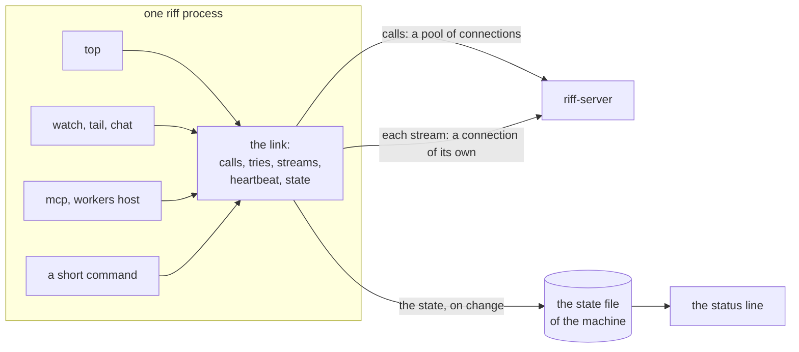
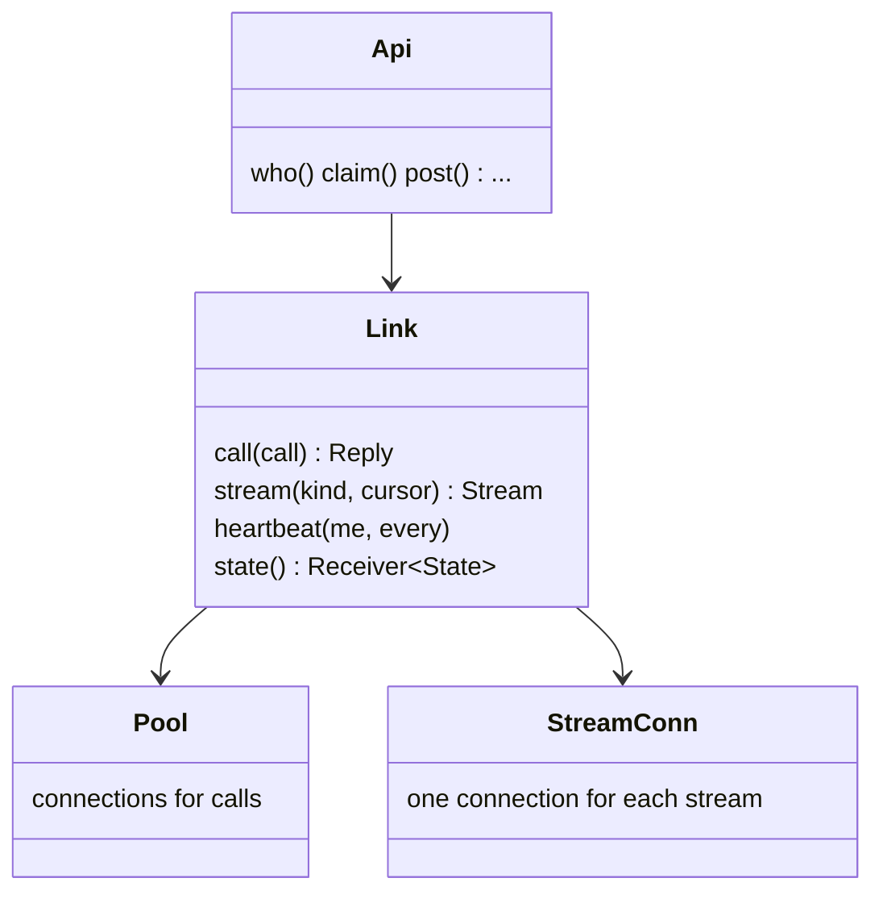
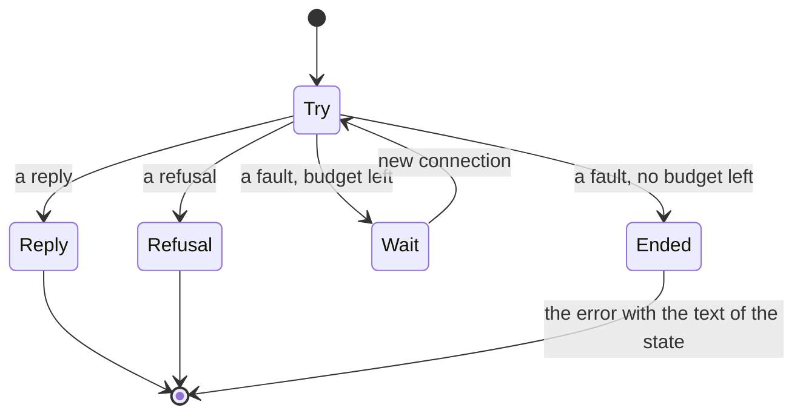
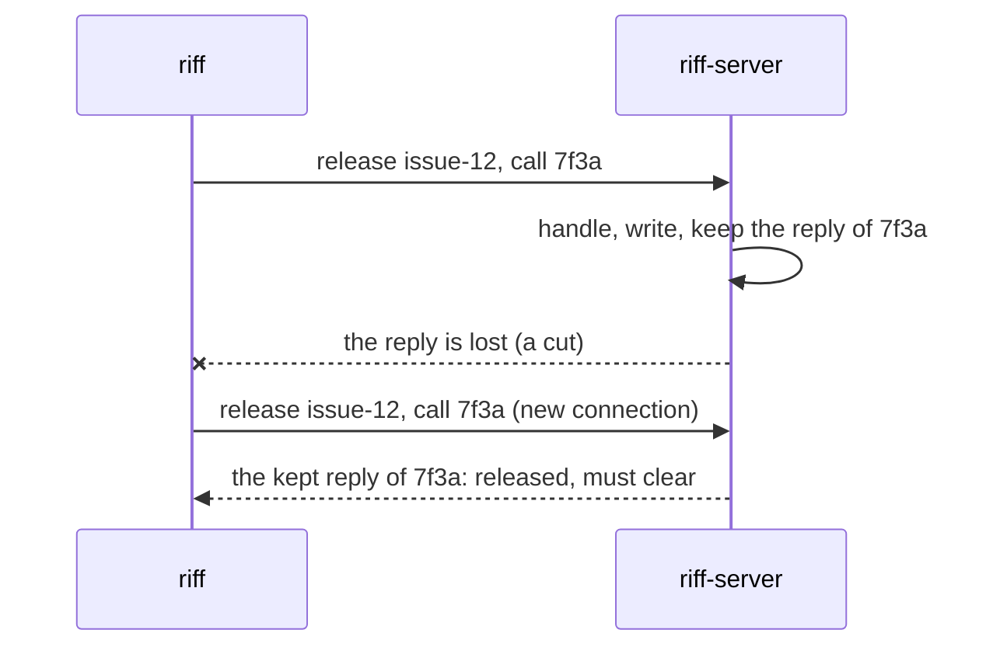
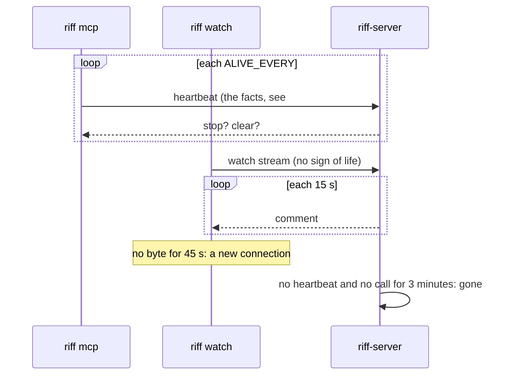
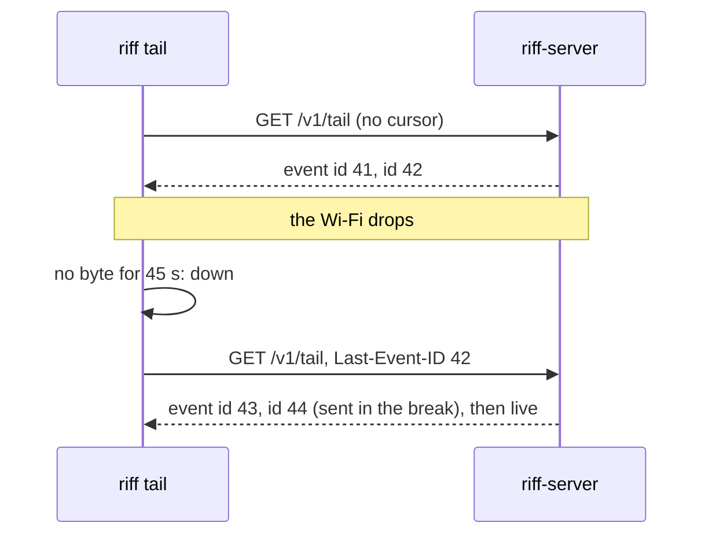
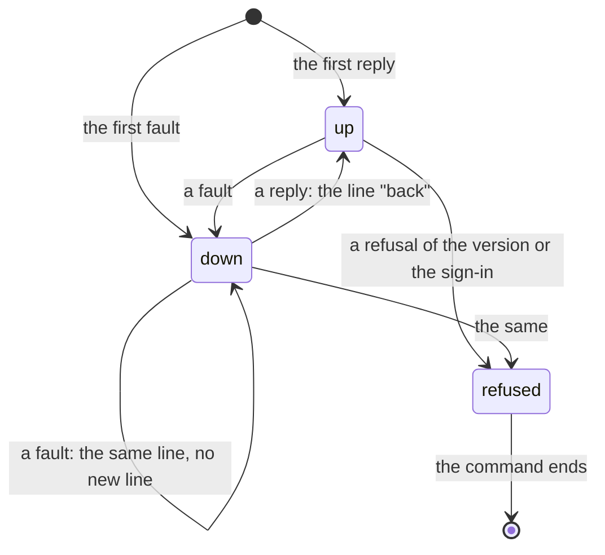

# Design: the client link

This page is the design of the link: the one part of `riff` that
connects to `riff-server`, sends each call, tries again, follows each
stream, sends the sign of life, and knows the state of the connection.
Each command uses it. Three reviews are in `design/reviews/`
(`link-01` to `link-03`), and the crate review is `link-00`. The
decisions are at the end of this page. When the build is done, the big
picture stays in the book, and the details go into the rustdoc.

## Goals

- One link for each command: `top`, `watch`, `chat`, `tail`, `mcp`,
  `workers host`, the status line, the hooks and each short command.
  A command does not connect, try again or show a fault in a way of
  its own.
- One rule for a new try. A fault of the connection gets a new try on
  a new connection. A refusal gets none.
- Each command that changes the state is safe to send two times.
- One sign of life for a session: the heartbeat of the link.
- Each stream has a connection of its own, and goes on from a cursor
  after a break. No stream loses a message.
- One state of the connection, with one text, in each command that
  runs until stopped and in the status line.
- Not goals: a new wire, HTTP/3, a connection that lives through a
  change of the address, a queue of calls that waits for the network
  while no command runs.

## The terms

| Term | Meaning |
|---|---|
| link | The part of `riff` that talks to one `riff-server`. One process has one link for each server. |
| call | One request and its reply: a query, a signal or a command (see [the command engine](design-engine.md)). |
| try | One send of a call on one connection. A call has one or more tries. |
| fault | A try that ends with no reply from `riff-server`: no connect, a cut, no reply in time, or a reply of the front end. A new try can repair it. |
| refusal | A reply of `riff-server` that says no. A new try gives the same reply. |
| budget | How long a call can try. A short command has a budget. A command that runs until stopped has none. |
| call ID | A random ID that the client gives a command once. Each try of the command carries the same ID. |
| heartbeat | The keep-alive that the link sends each `ALIVE_EVERY`. |
| cursor | The position in a stream of the last item that the client got. |
| state | `up`, `down` or `refused`: what the link knows of the server now. |

## The picture

## 1. One link

The link is the module `link` of the crate `riff`. `Api` keeps its
typed methods (`who`, `post`, `claim` and the others), and each method
goes through the link. No other module makes an HTTP client.

| Part | What it does |
|---|---|
| `Link::new(base, auth, Budget)` | Makes the link of a process for one server. The budget is the budget of each call. |
| `Link::call(&call)` | Sends one call with the rule for a new try (section 2). A command gets its call ID here (section 3). |
| `Link::stream(kind, cursor)` | Follows one stream across connections, from a cursor (section 5). The stream never ends. It gives items and the changes of the state. |
| `Link::heartbeat(me, every)` | A task that sends the heartbeat of a session (section 4). Its reply carries the asks of the server: stop, clear. |
| `Link::state()` | A receiver of the state (section 6). A command that runs until stopped shows each change of it. |

The budget is part of the link, not of the call site:

| Command | Budget |
|---|---|
| A short command: `claim`, `post`, `who`, and each other | `SHORT_BUDGET`, 60 s. Then the command ends with the text of the state. |
| A hook | `HOOK_BUDGET`, 10 s. A hook must not hold the turn of Claude Code. |
| The status line | `STATUSLINE_WAIT`: one try, no new try. |
| A command that runs until stopped: `top`, `watch`, `tail`, `chat`, `mcp`, `workers host` | None. Each call tries until it gets a reply or a refusal. |

## 2. One rule for a new try

Each try ends in one of three ways: a reply, a fault or a refusal.

| Outcome | Examples | What the link does |
|---|---|---|
| reply | Each 2xx of `riff-server` | Gives the reply. The state is `up`. |
| fault | No DNS answer. A connect that is refused or that takes more than `CONNECT_WAIT`. A cut before the end of the reply. No reply in `TRY_WAIT`. A 502, 503, 504 or 429 of the front end (no build header). A 503 of `riff-server`. | A new try after a wait, on a new connection. The state is `down` after the first fault. |
| refusal | Each 4xx of `riff-server`. A build that riff cannot talk to. A refused token. A session that left the riff. | No new try. The command gets the refusal. A refusal of the version or of the sign-in sets the state `refused`. |

- A 401 to a token is the one exception: the link gets a new token and
  tries one more time, as today.
- After a fault, the link drops its pool. The next try opens a new
  connection. A connection can die with no sign when the address of
  the machine changes.
- The wait before a new try grows: 250 ms, then double, up to
  `MOST_WAIT` (5 s for a call with a budget, 30 s for a command with
  no budget). Each wait has a random part of up to half of it, so many
  workers do not try at the same moment after a deploy.
- A refused connect to a server that never replied to this process is
  a refusal, not a fault: `riff` cannot tell a server that starts from
  no server. So `riff who` with no server on this machine ends at
  once.
- The time limits come from the link, not from the call site:
  `CONNECT_WAIT` 5 s, `TRY_WAIT` 20 s. A call with a longer server wait
  sets its own `TRY_WAIT`.

The crate review (`link-00`) names the part for the wait: see the
table in section 7.

## 3. A command that is sent two times

A command can reach the server and lose its reply. Then the link tries
again, and the server gets the command two times. So each command
carries a call ID.

- The link makes the call ID once for each command: 16 random bytes,
  in base 64. Each try of the command sends the same ID in the body
  field `call`. A query and a signal carry no call ID: each of them is
  safe to send two times.
- The server keeps the reply of each accepted command by the caller
  and the call ID, for `CALL_KEEP` (10 minutes), at most
  `CALL_KEEP_MOST` (256) for each caller. A command with a call ID that
  the server keeps gets the kept reply, and the engine runs nothing.
- Each record of the command has the call ID in the envelope, next to
  `by` and `command`. So after a start of the server, a command with
  the call ID of a record in the last `CALL_KEEP` gets the code
  `repeat`, with the positions of its records. The client takes
  `repeat` as a reply with no body. A start loses the kept replies,
  not the fact that the command is done.
- A refused command has no record and no kept reply. A second try gets
  the refusal again.
- A command with no call ID, from a client of the release before, works
  as before.
- The copy check of a signed post stays. A copy of the post with the
  call ID of the first post gets the kept reply, not the refusal
  `copy`.

### The wire and the log after 1.0.0

- The wire: each command body gets the field `call`, with a default.
  A server of the release before skips it.
- The log: the envelope of a record gets the field `call`, with a
  default, as `by` and `command`. A build that does not know it skips
  it. This follows the rules for a change of a record (see "The rules
  for a change of a record" in [the command engine](design-engine.md)).
- The log line of a refused command gets the call ID, so that a person
  can find the two tries of one command.

## 4. One sign of life

The heartbeat of the link is the only sign of life of a session. A
call of the session also counts, as today. An open stream does not.

| Process | Heartbeat |
|---|---|
| `riff mcp` | Each `ALIVE_EVERY` (60 s). In a worker, each `WORKER_ALIVE_EVERY` (10 s). |
| `riff watch` | Each `ALIVE_EVERY`. |
| `riff workers host` | Each `ALIVE_EVERY`. Its status tells only its numbers, not that it lives. |
| `riff chat`, `riff tail`, `riff top` of a person | None: a person is not a session with a life. |

- The heartbeat is `POST /v1/alive`. Its reply carries the asks of the
  server: stop an idle worker, clear the context. It carries the facts
  of a session too (see #424).
- A heartbeat is a call of the link: it has the rule for a new try,
  with no budget, and the wait of a heartbeat is at most
  `ALIVE_EVERY`. So one hung try does not stop the next heartbeat.
- A stream has a heartbeat of its own: `riff-server` sends a comment
  each 15 s. The link ends a stream that gives no byte for
  `STREAM_IDLE` (45 s), and connects again. So a stream that died with
  no sign, for example after a sleep of the laptop, comes back in at
  most 45 s.

## 5. Streams

Each stream has a connection of its own, which never goes to the pool
of the calls (#379). Each stream event has an `id`: its cursor. At a
new connection, the link sends the cursor of the last event in the
header `Last-Event-ID`, and the server sends each event after it, then
the live events.

| Stream | Cursor | After a break |
|---|---|---|
| `watch` | The read cursor of the session on the server. | The server sends the newest unread wake, as today. A wake is a sign to read, so one wake is enough. |
| `tail` | The `seq` of the last message of the thread. | The server sends each message with a larger `seq` that it keeps (the last 200 of the thread), then the live messages. |
| `chat` | The same as `tail`. | `chat` uses `tail` with a cursor, and no read of its own at each connect. |
| `top` | None. | `top` uses `tail` only as a sign to look again. Any event is enough. |

- A cursor older than the messages that the server keeps gives an
  event `gap` first, with the number of lost messages. `tail` and
  `chat` show one line for it.
- The end of a stream by the server is normal: Cloud Run ends each
  stream after 60 minutes, and a deploy ends each stream. The link
  connects again at once, and shows nothing.

## 6. One state that a person sees

The link has one state, and one text for each state:

| State | When | Text |
|---|---|---|
| `up` | A reply or a refusal of a call. | No line. After `down`: `riff: riff-server is back (down 3 min).` |
| `down` | A fault, since its first fault. | `riff: riff-server at URL is not reachable since 21:52 (no reply in 20 s). riff tries again.` |
| `refused` | A refusal of the version or the sign-in. | The text of the refusal, in red: `riff update`, `riff login`. |

- Each command that runs until stopped shows the state in its place:
  `top` in its first line, `chat` above its prompt, `watch`, `tail`
  and `workers host` on stderr. Each uses the one function
  `text::link_line`.
- The link writes each change of the state to the state file of the
  server on this machine. The status line reads the file: it shows
  `riff: offline since 21:52` when a process of this machine saw the
  server down, and makes no call while it is fresh.
- A short command that ends with no budget left gives the text of
  `down` as its error.
- The line `(waits for riff-server…)` of a 503, the lines
  `(reconnecting…)` and `(back)` of a stream, and the fault line of
  `top` go. The state gives each of them.

## 7. The wire

`riff` stays on HTTPS over TCP. No HTTP/3 now: it is not widely
adopted yet, and the design does not depend on a property of QUIC.

- `reqwest` speaks HTTP/2 to a server that offers it, as Cloud Run
  does. Then the calls of a process share one connection. The client
  of the calls sends an HTTP/2 ping each 20 s
  (`http2_keep_alive_interval`), so it finds a dead connection with no
  call.
- The client of the streams keeps no idle connection. So each stream
  has a connection of its own, also with HTTP/2. Its `read_timeout` is
  `STREAM_IDLE`: it resets at each read, so it ends only a stream that
  gives no byte.
- Each client sets `connect_timeout` to `CONNECT_WAIT`. The client of
  the calls sets `timeout` to `TRY_WAIT`.

The crate review (`design/reviews/link-00-crates.md`) gives the part
for each piece of the link:

| Piece | Part |
|---|---|
| The wait that grows | TODO after link-00 |
| The time limits | TODO |
| The call ID | TODO |
| The stream with a cursor | TODO |
| The heartbeat | TODO |
| The state | TODO |

## The cost

| Change | Size |
|---|---|
| The module `link`, and `Api` on top of it | About 600 lines, most of them moved from `api.rs`, `host.rs` and `main.rs`. |
| The call ID on the wire, in the record envelope and in the server | About 300 lines, and the tests of a lost reply. |
| The cursor of `tail`, with the event `gap` | About 150 lines on the server, 50 on the client. |
| The state, its text and the state file | About 200 lines. |
| A test server that cuts a reply, holds a stream with no byte, and refuses a connect | About 250 lines of tests. |

## Build items

| ID | Item | Needs |
|---|---|---|
| L1 | The module `link`: one HTTP client for the calls, one for the streams, the time limits, the rule for a new try, the budgets. `Api` and each command use it. | none |
| L2 | The state of the link, its text, the state file and the status line. | L1 |
| L3 | The streams: `STREAM_IDLE`, the cursor of `tail` and `chat`, the event `gap`. | L1 |
| L4 | The call ID: the wire, the kept replies, the record envelope, the code `repeat`. | L1 |
| L5 | The heartbeat of the link in `mcp`, `watch` and `workers host`. | L1, #424 |

## Decisions

TODO after the reviews.
