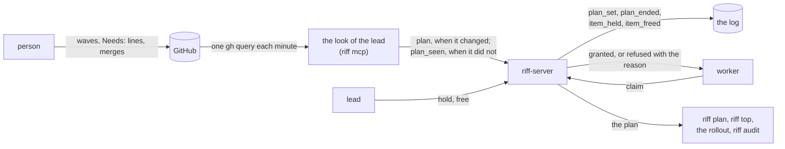
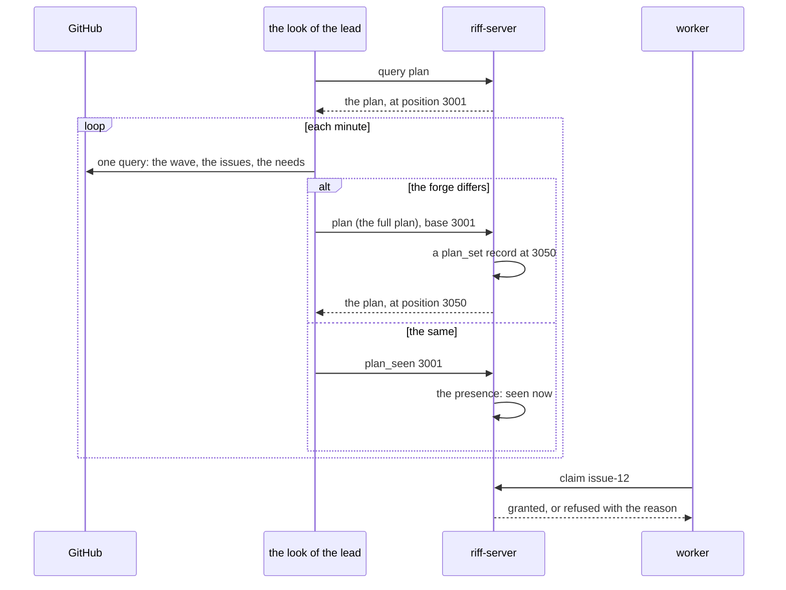
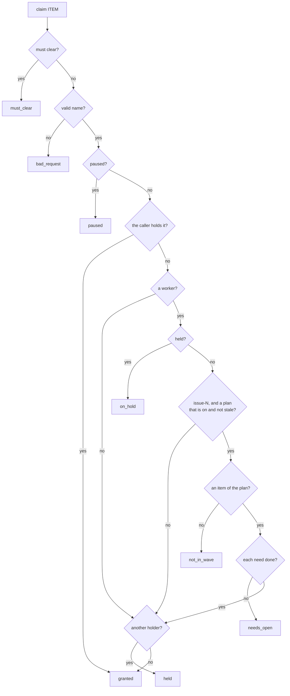

# Design: the plan on the server

This page is the design of the plan: the current wave of a repository,
the order of its items, and the held items. It builds on
[the command engine](design-engine.md): each change of the plan is a
command, with a record. Two reviews are in `design/reviews/`
(`plan-01` and `plan-02`), and the decisions are at the end of this
page. When the build is done, the big picture stays in the book, and
the details go into the rustdoc.

## Goals

- The plan is state on the server. Each change of it is a record in
  the log, with the caller and the command.
- The server refuses a claim of a worker against the plan, and the
  refusal names the reason.
- A lead holds an item with a reason, and frees it again. A hold is
  not a claim.
- One source for each part of the plan, one writer rule that loses no
  update, and a limit on the age of the copy on the server.
- Not goals: a plan that the server reads from the forge itself, a
  plan of more than the current wave, an order inside a wave, a plan
  for a thread that is not a repository thread.

## The terms

| Term | Meaning |
|---|---|
| plan | The current wave of one repository: its open items, the needs of each item, and the done needs. |
| current wave | The open wave with the lowest number. A repository with no open wave has no current wave. |
| item of the plan | An open issue of the current wave. Its name is `issue-N`. With no current wave: an open issue with no wave. |
| need | An issue that an item names in its `Needs:` line. A need can be in an earlier wave, in a later wave, or in no wave. |
| done | Merged: the issue is closed, or it has the comment `Merged in #PR (COMMIT)`. |
| held item | An item that a lead holds, with a reason. No worker can claim it. |
| waits | An item of the plan with a need that is not done. |
| look | The task of the `riff mcp` of the lead that reads the forge each minute (#424, `crate::look`). |
| stale | A plan that no look saw for `PLAN_TTL` (10 minutes). |

## The picture



## 1. The source of the plan

| Part | Source | How it gets to the server |
|---|---|---|
| The current wave and its items | GitHub: the current wave and its open issues | the command `plan` |
| The needs of each item | GitHub: the `Needs:` line of the issue (#286) | the command `plan` |
| The done needs | GitHub: a closed issue, or the comment `Merged in` | the command `plan` |
| The held items | the server | the commands `hold` and `free` |
| The plan is on for the repository | the server | the first `plan`; the command `plan_off` |

- A person plans on GitHub, as today. The skill, the book and the
  leads keep the waves and the `Needs:` lines.
- The server has no credential of the forge (#424). So the server never
  reads GitHub. A client tells it the plan.
- The plan is opt-in for each repository. `riff plan on` sends the
  first `plan`. `riff plan off` sends `plan_off`, and the server
  forgets the plan of the repository. A repository with no plan gets
  no check of a plan, as today. So the people of another repository
  (for example `como-technologies/strata`) decide for themselves.
- The look of the lead reads the plan of each repository with a plan
  on. It makes one GraphQL query of `gh` for each look: the
  open waves, and the open issues of the current wave with their body
  and their last comments, and the state of each need. The same query
  gives the item facts of #424. So the look reads the forge one time,
  and the needs come to the server one time: the server makes
  `waits` from the plan, and `ItemFact` has no `needs`.
- The look compares the plan of the forge with the plan that the
  server gave it last (the reply of the query `plan` at the start of
  the look, and the reply of each `plan` after it):
  - When the two differ, it sends `plan` with the full plan and with
    `base`, the position of the `plan_set` record that it compared
    with.
  - When they are the same, it sends the signal `plan_seen` with the
    same position. The signal changes only the presence: the time of
    the last look that saw the plan. It makes no record.
- `riff plan sync` does the same as one look, at once. Each session
  that is not a worker can run it, and a person in a terminal.
- `riff pr wait` sends nothing. The `Merged in` comment comes after
  it, and the next look finds it.
- The look drops a need that is not an issue of this repository (an
  issue of another repository, a pull request), with one log line. One
  such need never stops the plan.
- A look against a server with no command `plan` (a build of 1.0.0)
  writes one log line, and tries again after one hour.



### Two writers, and the age of the copy

- `handle` of `plan` refuses the command with the code `stale_base`
  when `base` is not the position of the last `plan_set` record of
  the repository. The reply holds the plan of the server. The look
  reads the forge again at its next turn. So two looks that cross never
  write an old plan over a new one.
- `plan` with the plan that the server has already gives no record. It
  counts as `plan_seen`.
- The plan is stale when no `plan` and no `plan_seen` came for
  `PLAN_TTL` (10 minutes). The time of the last look is presence, so
  a new start of the server begins the count again from the start.
- A stale plan checks no wave and no need: the server checks only the
  holds. The reply of a claim says "the plan of the server is stale;
  run riff plan sync". So a stale plan never blocks work for long. A
  plan that is not stale but older than the forge can refuse a claim
  for at most one minute: the refusal is safe, and the session picks
  another item.

### The plan on GitHub

- A wave is the milestone `Wave N`. The current wave is the open
  milestone `Wave N` with the lowest N.
- The GraphQL query of the look reads the open milestones, and the
  open issues of the milestone of the current wave.
- With no milestone `Wave N`, the items of the plan are the open
  issues with no milestone.
- The lead moves an item to an open wave with
  `gh issue edit N --milestone "Wave M"`.

## 2. When an item is done

- An item is done when it is merged: its issue is closed, or the issue
  has the comment `Merged in #PR (COMMIT)`. This is the rule of the
  waves in the skill. The look reads it from the forge, and the
  command `plan` carries it.
- The release of a claim is not done. A worker releases its item at
  the verify request, before the merge.
- The word of the lead is a close of the issue, or the comment
  `Merged in`, on GitHub. Then the next look, or `riff plan sync`,
  sends it. The server has no command "done" of its own: one source for
  done.
- A need is done by the same rule, in each wave and in no wave.
  Today the rollout counts a need that is open with `Merged in` as
  open (`crate::rollout::free_items`). The plan counts it as done, as
  `riff audit` does.
- The plan has no check of done for a claim. An open item with
  `Merged in` has a check after the release. The session that runs the
  check, or that fixes it, claims the item. A closed issue is not an
  item of the plan.

## 3. The records and the commands

Release 1.0.0 fixed the format. The rules for a change of a record
(see [the engine](design-engine.md#the-rules-for-a-change-of-a-record))
give the new kinds new names. A build of 1.0.0 skips them, and writes
no checkpoint past the first one. The fixtures of the next release go
into a directory of their own, for example
`crates/riff-server/tests/fixtures/1.1.0/`, with its kinds, its log
and its replay. The test of the kinds takes the union of the lists.

| Kind | Fields | Made by |
|---|---|---|
| `plan_set` | `thread`, `wave` (`number` and `title`, or none), `items` (each with `item` and `needs`), `done` | `plan` |
| `plan_ended` | `thread` | `plan_off` |
| `item_held` | `thread`, `item`, `reason` | `hold` |
| `item_freed` | `thread`, `item` | `free` |

```json
{"position":3001,"written_at_ms":1791000000000,"by":{"session":"mike/3511"},"command":"plan","change":{"plan_set":{"thread":"como-technologies/riff","wave":{"number":19,"title":"Wave 19"},"items":[{"item":"issue-366","needs":[]},{"item":"issue-459","needs":["issue-416"]}],"done":["issue-416"]}}}
{"position":3002,"written_at_ms":1791000100000,"by":{"session":"mike/3511"},"command":"hold","change":{"item_held":{"thread":"como-technologies/riff","item":"issue-366","reason":"waits for the word of Mike"}}}
```

- `plan_set` holds the full plan of one repository. `apply` replaces
  the plan of its thread with it, and keeps the position and the time
  of the record. A full plan is small: a wave of 20 items is about
  2 KB. One record for each change keeps `apply` simple, and the
  record shows the whole plan at that time, for `riff audit`.
- `done` lists each need that is done. A need that is not in `done`
  is open.
- `plan_ended` removes the plan of the thread. The holds stay.
- `item_held` adds the hold of an item, or replaces its reason.
  `item_freed` ends it. `apply` keeps the `by` and the time of the
  `item_held` record, so that a view shows who held the item and when.
- A hold names one item by its exact name. A hold of `issue-12` stops a
  claim of `issue-12`. It does not stop `verify-issue-12`.
- A hold can name an item that is not in the plan, for example an item
  of the next wave. A hold needs no plan.
- A hold does not end a claim. A hold of an item that a session holds
  stops only the next claim of a worker. The reply names the holder.
  The lead frees the claim of a session of its user with
  `riff release ITEM --session ID`.
- Only `free` ends a hold. A hold of a done item stops nothing that
  matters, and the lead frees it.
- `apply` only stores what a record says
  (01M3WNQQWA7XGK4Y9ET8HJZ8NN). The checks are in `handle`.
- The code is the group file `crates/riff-server/src/state/plan.rs`,
  with the part `Plans` of the riff and its `Saved` for the checkpoint.
  The arms go into `Record::of_repository`, and the lines into the
  tables of `record.rs` and `riff.rs`.

### The wire

| Path | Type | Kind |
|---|---|---|
| `/v1/plan` | `PlanSet` (the plan and `base`) | command `plan` |
| `/v1/plan/seen` | `PlanSeen` (the position) | signal |
| `/v1/plan/off` | `PlanOff` | command `plan_off` |
| `/v1/plan/hold` | `Hold` (the item and the reason) | command `hold` |
| `/v1/plan/free` | `Free` (the item) | command `free` |
| `/v1/plan/show` | `PlanShow` (the repository) | query `plan` |

- The reply of `plan`, `plan_seen` and the query is the plan of the
  server: the wave, the items with their state, the holds, the
  position of the last `plan_set`, and the time of the last look.
- `POST /v1/log` skips a record of a kind that the client does not
  know, as `Line::parse` does, so that `riff audit` of one build reads
  the log of a later one. P1 adds this to the reader of `LogReply`.

### Who can send each command

`permits` gives each command to a person or a session with the role
member and no worker mark (as for `lead`). A worker gets
`not_allowed`, also a worker of the owner. `handle` then checks the
rest, because "the lead of this thread" needs the state:

| Command | `handle` lets it through for | Else |
|---|---|---|
| `plan`, `plan_off` | each session in the repository thread; the owner and each admin | `not_allowed` |
| `hold`, `free` | a lead of the repository thread; the owner and each admin | `not_allowed` |
| `plan_seen` | each session in the repository thread that is not a worker | ignored |
| query `plan` | each member | — |

- `plan` checks the form: each item and each need is `issue-N`, no item
  is twice in `items`, and the thread is a repository thread. Else
  `bad_request`.
- `hold` needs a reason of 1 to 200 characters. Else `bad_request`.
- `free` of an item with no hold changes nothing: a log line, no
  record.
- The lead of each person in the repository can hold and free each
  item. The record names who did it.

### The checks of a claim

`handle` of `claim` checks in this order. The first check that fails
gives the refusal:

1. The worker must clear its context: `must_clear`.
2. The item has a name that is not valid: `bad_request`.
3. The riff or the repository is paused: `paused`.
4. The session holds the item already: granted, with no record.
5. The item is held, and the caller is a worker: `on_hold`. The reason
   names the lead, the time and the reason of the hold.
6. The item is `issue-N`, the plan of the repository is on and not
   stale, the item is not an item of the plan, and the caller is a
   worker: `not_in_wave`. The reason names the current wave, and says
   when the issue is closed.
7. The item is an item of the plan, a need is not in `done`, the plan
   is not stale, and the caller is a worker: `needs_open`. The reason
   names each open need.
8. Another session holds the item: `held`.



- The checks of the plan and the hold refuse only a worker. A session
  that a person works in, and a session that does a request of the
  lead, is granted. Its reply has a warning with the reason that a
  worker would get: `issue-12 is held by the lead: REASON`. So a scope
  from the user still wins, and the lead can claim an item that it
  held. `riff audit` lists each such claim.
- The plan checks only an item with the name `issue-N`. A verify
  (`verify-issue-N`) and an item with another name, for example
  `wave5-live-evidence`, get only the hold and the checks of today. A
  verify comes after the build, so the needs of its item are no check
  for it.
- A change of the plan never ends a claim.
- The codes `on_hold`, `not_in_wave`, `needs_open` and `stale_base`
  are new. Each one has the status 409, as `held`. A client of 1.0.0
  shows the reason of a code that it does not know: "claim failed (409
  Conflict): REASON" (`crate::api`). A new client treats the three
  codes of a claim as `held`: not granted, with the reason, exit 1.
  P2 tests both.

### The checkpoint

The checkpoint gets the part `plans`: the plan of each repository
thread, with the position and the time of its `plan_set` record, and
each hold with its reason, its `by` and its time. The part is empty in
a log with no new kind, and an empty part is not written: the log of
1.0.0 still gives the same checkpoint. The test of the checkpoint (a
load at each position gives the state of a replay) covers the part.
The time of the last look is presence, and not in the checkpoint.

## 4. What the views show

| View | It shows |
|---|---|
| `riff plan` | The plan of the repository on the server: the wave, the time of the last look, stale or not, and each item with its state: free, claimed (by whom), waits (the open needs), held (the reason, by whom, since when), in verify, merged. Then the holds of items that are not in the plan. |
| `riff plan on`, `riff plan off` | Turns the plan of the repository on or off. |
| `riff plan sync` | Reads the forge and sends the plan at once. |
| `riff plan hold ITEM REASON` | Holds the item. The reply says when a session holds it. |
| `riff plan free ITEM` | Frees the hold. |
| `riff top` | The board reads the plan of the server, when the plan is on. A held item is in the column `free`, with `held` and the reason. An item that waits is in the column `free`, with `waits #416`. A stale plan shows `stale` in the heading of the board. |
| `riff who`, `whoami` | No change. A session shows its claims. |
| The rollout | With a plan that is on and not stale, the free work comes from the plan of the server: an item of the plan with no claim, no hold, each need done, and no pull request that waits for a verify or for the merge. Else it reads the forge, as today. |
| The skill | Step 2 of the start routine runs `riff plan` to find a free item. A refused claim names the reason, so the session picks another item. The lead holds an item with the `hold` tool, not with a claim. |
| The MCP tools | `hold` and `free` for the lead. The result of `claim` gives the reason of a refusal, or the warning. |

- The CLI has no `riff next`. `riff plan` shows the free items in its
  place.
- An item that waits is no free work. `riff plan` shows it with the
  open needs, so a person sees what to merge first.
- A held item is no free work. The rollout counts it as no work, so no
  worker starts for it.
- `waves.md` says what happens to an issue that a person reopens in a
  closed wave, and to an open issue of a wave that a person closes: it
  is in no current wave until the lead moves it to an open wave (see
  "The plan on GitHub").

## 5. How `riff audit` uses the plan

`riff audit` (#354) reads the records of the repository. With the plan
in the log, it reads the plan at the time of each claim, not the
forge of today.

- Rule 5 ("no claim of an item of a later wave, and no claim of an
  item with an open need") checks each claim of `issue-N` by a worker
  against the last `plan_set` record before it. A claim before the
  first `plan_set` record of the repository, or after a `plan_ended`,
  gets the check of today from the forge. A claim that the plan let
  through because it was stale is "not checked", with the reason.
- A new rule 8: each `plan_set`, `plan_ended`, `item_held` and
  `item_freed` record has the `by` of a session that is not a worker,
  or of a person. The log has no record of the roles, so the rule
  checks only the worker mark.
- A new rule 9: no claim of a worker of an item while it was held.
- Rule 5 and rule 9 list each claim of a session that is not a worker
  against the plan or a hold: the claims with a warning. They do not
  fail the rule.
- The server enforces the rules 5 and 9 at each claim of a worker. The
  audit proves it after the wave, from the log.

## The cost

- GitHub: one GraphQL query each minute for each lead with a plan on,
  for the plan and the facts of #424 together. The limit of the token
  is 5,000 points each hour. P3 measures the points of one look for a
  wave of 20 items.
- The log: one `plan_set` of about 2 KB for each change of the plan,
  about 50 changes each day: about 100 KB.
- The server: one signal or one command each minute for each lead, and
  one more lookup in each claim.
- A rollback to 1.0.0: the old build writes no checkpoint past the
  first new record, so each start replays more of the log. The
  rollback steps in `development.md` say so. After the roll forward
  the plan is stale until the next look. P1 measures a replay of 7 days
  with no checkpoint.

## Build items

Each item is an issue with a `Needs:` line. The lead puts them in
waves. The holds come first: they repair the fault of Wave 16, where
the lead claimed #359 only to keep it from the workers, and they need
no forge.

| Item | What | Needs |
|---|---|---|
| H1 (#498) | The holds: the records `item_held` and `item_freed`, the commands `hold` and `free` with their checks, `permits` and `handle`; the part `plans` of the riff and of the checkpoint with only the holds; the check `on_hold` of a claim of a worker, and the warning for each other session; the fixture directory of the next release, the union of the kinds, and `LogReply` that skips a kind that it does not know; `riff plan hold`, `riff plan free`, the MCP tools `hold` and `free`; the skill. The book: how-tos for each command. | |
| P1 (#499) | The plan on the server: the records `plan_set` and `plan_ended`, the commands `plan` and `plan_off` with `base` and `stale_base`, the signal `plan_seen`, the query `plan`, `PLAN_TTL`, the plan in the part `plans` and in the checkpoint. | H1 |
| P2 (#500) | The checks of a claim of a worker against the plan: `not_in_wave` and `needs_open`, the warning for each other session, the status 409, the stale plan. A client of 1.0.0 shows the reason of a new code. | P1 |
| P3 (#501) | The look of the lead: one GraphQL query for the plan and the facts of #424, `plan` or `plan_seen` each look, the drop of a need of another repository, the wait of one hour against an old server; `riff plan on`, `riff plan off`, `riff plan sync`. The server makes `waits` from the plan, and `ItemFact` has no `needs`. | P1, #424 |
| P4 (#503) | `riff plan` (the view); the board of `riff top` from the plan; the rollout from the plan; the start routine of the skill. The book: how-tos. | P2, P3 |
| P5 (#502) | `riff audit`: rule 5 from the `plan_set` records, the new rules 8 and 9, the list of the claims with a warning. | P1, #354 |

## Decisions

1. GitHub is the source of the waves, the items, the needs and the
   done needs. The server is the source of the holds, and of the
   switch that turns the plan on for a repository.
2. The plan is opt-in for each repository: `riff plan on`.
3. The look of the lead sends the full plan with `base` when the forge
   differs, and the signal `plan_seen` when it does not. The server
   refuses a `plan` with an old `base`. The server never reads the
   forge.
4. A plan that no look saw for 10 minutes is stale. A stale plan
   checks only the holds.
5. An item is done when it is merged. The release of a claim is not
   done. The server has no command "done", and a claim has no check of
   done.
6. One `plan_set` record holds the full plan of one repository.
7. A hold names one item by its exact name. A hold is not a claim, and
   it does not end a claim. Only `free` ends a hold.
8. The plan checks only the items `issue-N`. A verify and an item with
   another name get only the hold and the checks of today.
9. The checks of the plan and the hold refuse only a worker. Each
   other session is granted, with a warning in the reply.
10. Each session that is not a worker can send the plan. Only a lead,
    the owner or an admin can hold and free an item.
11. A change of the plan never ends a claim.
12. The holds are the first build item.
