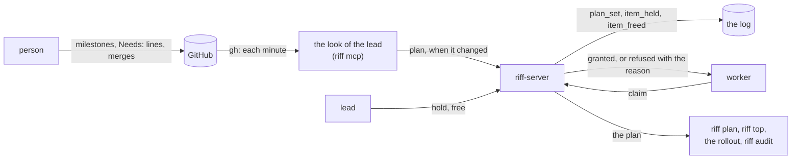
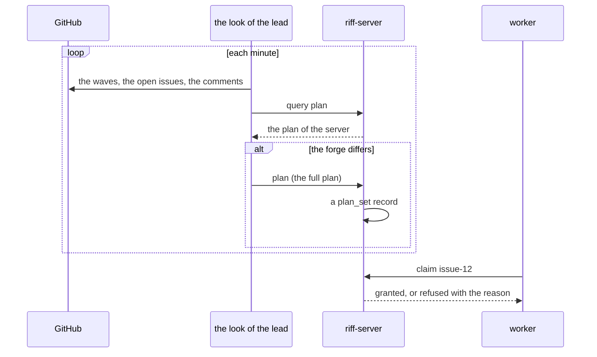
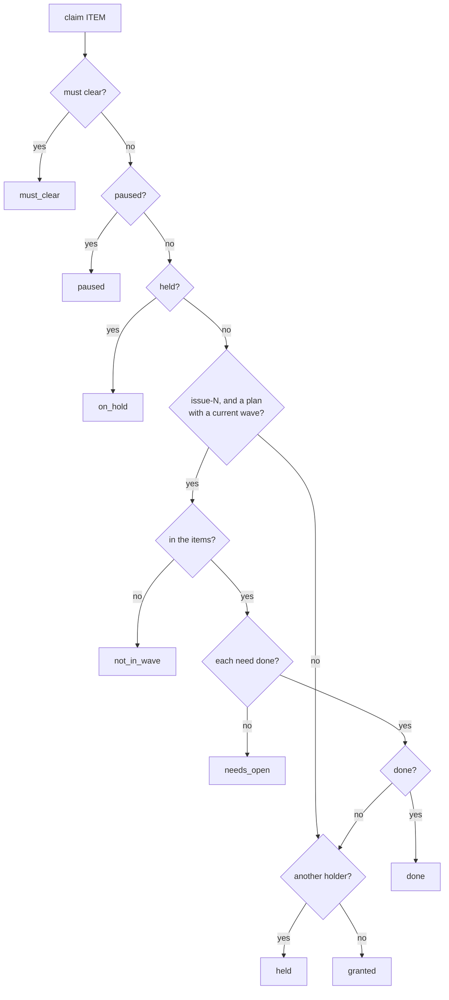

# Design: the plan on the server

This page is the design of the plan: the current wave of a repository,
the order of its items, and the held items. It builds on
[the command engine](design-engine.md): each change of the plan is a
command, with a record. The reviews are in `design/reviews/`
(`plan-01` and `plan-02`), and the decisions are at the end of this
page. When the build is done, the big picture stays in the book, and
the details go into the rustdoc.

## Goals

- The plan is state on the server. Each change of it is a record in
  the log, with the caller and the command.
- The server refuses a claim against the plan, and the refusal names
  the reason.
- A lead holds an item with a reason, and frees it again. A hold is
  not a claim.
- One source for each part of the plan, and one rule that keeps the
  copy on the server the same as the source.
- Not goals: a plan that the server reads from the forge itself, a
  plan of more than the current wave, an order inside a wave, a plan
  for a thread that is not a repository thread.

## The terms

| Term | Meaning |
|---|---|
| plan | The current wave of one repository: its items, the needs of each item, and the done items. |
| current wave | The open wave with the lowest number. A repository with no waves has no current wave. |
| item of the plan | An open issue of the current wave. Its name is `issue-N`. |
| need | An item that an item names in its `Needs:` line. A need can be in an earlier wave, or in no wave. |
| done | Merged: the issue is closed, or it has the comment `Merged in #PR (COMMIT)`. |
| held item | An item that a lead holds, with a reason. No session can claim it. |
| waits | An item of the plan with a need that is not done. |
| look | The task of the `riff mcp` of the lead that reads the forge each minute (#424, `crate::look`). |

## The picture



## 1. The source of the plan

| Part | Source | How it gets to the server |
|---|---|---|
| The current wave and its items | GitHub: the open milestone `Wave N` with the lowest N, and its open issues | the command `plan` |
| The needs of each item | GitHub: the `Needs:` line of the issue (#286) | the command `plan` |
| The done items | GitHub: a closed issue, or the comment `Merged in` | the command `plan` |
| The held items | the server | the commands `hold` and `free` |

- A person plans on GitHub, as today. The skill, the book and the
  leads keep the milestones and the `Needs:` lines.
- The server has no credential of the forge
  (01M41FZP2C4Z4J6WKRXZ5B31EH). So the server never reads GitHub. A
  client tells it the plan.
- The look of the lead reads the plan of its repository from the
  forge each minute (`crate::look::LOOK_EVERY`). It reads the plan of the
  server with the query `plan`. When the two differ, it sends the
  command `plan` with the full plan of the forge. When they are the
  same, it sends nothing. So the log gets a record only for a change.
- `riff pr wait` sends the command `plan` after a merge, and
  `riff plan sync` sends it at once. So the next item is free with no
  wait for the next look.
- The hold is a fact of the riff. GitHub has no copy of it. `riff plan`
  and `riff top` show it.
- Each lead of the repository can send `plan`. Two leads read the same
  forge, so they send the same plan. The second one finds no change
  and sends nothing. When two `plan` commands cross, the second one
  has no change, and `handle` gives a log line with no record.



### How long the two can differ

- A change on GitHub gets to the server within one look, when a lead
  of the repository runs. While no lead runs, the plan of the server
  stays as it was. The rollout also stops while no lead runs, so no new
  worker claims in that time.
- In that time a claim can follow the old plan. The refusal names the
  plan and its age: `the plan of the server is 3 minutes old; run riff
  plan sync`.
- A repository with no `plan_set` record has no plan. The server then
  checks no claim against a plan, as today.
- A plan with no current wave (each wave is closed, or the repository
  has no waves) checks no claim against a wave. The holds still apply.
  The skill says so: "When the repository has no waves, each open item
  is in the current wave."

## 2. When an item is done

- An item is done when it is merged: its issue is closed, or the issue
  has the comment `Merged in #PR (COMMIT)`. This is the rule of the
  waves in the skill. The look reads it from the forge, and the
  command `plan` carries it.
- The release of a claim is not done. A worker releases its item at
  the verify request, before the merge.
- The word of the lead is a close of the issue, or the comment
  `Merged in`, on GitHub. Then the next look, or `riff plan sync`,
  sends it. The server has no command "done" of its own: one source for
  done.
- A need that is in no wave, or in an earlier wave, is done by the
  same rule. The look reads the state of each need, also a need that is
  not an item of the plan.

## 3. The records and the commands

Release 1.0.0 fixed the format. The rules for a change of a record
(see [the engine](design-engine.md#the-rules-for-a-change-of-a-record))
give the new kinds new names. A build of 1.0.0 skips them, and writes
no checkpoint past the first one.

| Kind | Fields | Made by |
|---|---|---|
| `plan_set` | `thread`, `wave` (`number`, `title`, or none), `items` (each with `item` and `needs`), `done` | `plan` |
| `item_held` | `thread`, `item`, `reason` | `hold` |
| `item_freed` | `thread`, `item` | `free`, `plan` |

```json
{"position":3001,"written_at_ms":1791000000000,"by":{"session":"mike/3511"},"command":"plan","change":{"plan_set":{"thread":"como-technologies/riff","wave":{"number":19,"title":"Wave 19"},"items":[{"item":"issue-366","needs":[]},{"item":"issue-459","needs":["issue-416"]}],"done":["issue-416"]}}}
{"position":3002,"written_at_ms":1791000100000,"by":{"session":"mike/3511"},"command":"hold","change":{"item_held":{"thread":"como-technologies/riff","item":"issue-366","reason":"waits for the word of Mike"}}}
```

- `plan_set` holds the full plan of one repository. `apply` replaces
  the plan of its thread with it. A full plan is small: a wave has
  about 20 items. One record for each change keeps `apply` simple, and
  the record shows the whole plan at that time, for `riff audit`.
- `done` lists each item of `items` and each need that is done. A need
  that is not in `done` is open.
- `item_held` adds the hold of an item, or replaces its reason.
  `item_freed` ends it. `apply` keeps the `by` and the time of the
  `item_held` record, so that a view shows who held the item and when.
- A hold names one item by its exact name. A hold of `issue-12` stops a
  claim of `issue-12`. It does not stop `verify-issue-12`.
- A hold can name an item that is not in the plan, for example an item
  of the next wave.
- A hold does not end a claim. A hold of an item that a session holds
  stops only the next claim. The reply names the holder. The lead frees
  the claim with `riff release ITEM --session ID`, when it must.
- A `plan_set` whose `done` has a held item also ends the hold, with an
  `item_freed` record in the same chunk: a done item needs no hold.
- `apply` only stores what a record says
  (01M3WNQQWA7XGK4Y9ET8HJZ8NN). The checks are in `handle`.

### Who can send each command

| Command | Who | Refused with |
|---|---|---|
| `plan` | a lead of the repository of the thread; the owner and each admin | `not_allowed` |
| `hold` | a lead of the repository of the thread; the owner and each admin | `not_allowed` |
| `free` | a lead of the repository of the thread; the owner and each admin | `not_allowed` |
| query `plan` | each member | — |

- A worker is never the lead, so a worker cannot change the plan.
- `plan` checks the form: each item is `issue-N`, each need is
  `issue-N`, no item is twice in `items`, and the thread is a
  repository thread. Else `bad_request`.

### The checks of a claim

`handle` of `claim` checks in this order. The first check that fails
gives the refusal:

1. The worker must clear its context: `must_clear`.
2. The riff or the repository is paused: `paused`.
3. The item is held: `on_hold`. The reason names the lead, the time
   and the reason of the hold.
4. The item is `issue-N`, the repository has a plan with a current
   wave, and the item is not in `items`: `not_in_wave`. The reason
   names the current wave.
5. The item is in `items`, and a need is not in `done`: `needs_open`.
   The reason names each open need.
6. The item is in `done`: `done`.
7. Another session holds the item: `held`.



- The plan checks only an item with the name `issue-N`. A verify
  (`verify-issue-N`) and an item with another name, for example
  `wave5-live-evidence`, get only the checks 1, 2, 3 and 7. A verify
  comes after the build, so the needs of its item are no check for it.
- The rules are the same for each session: a worker, and a session
  that a person works in. A person who wants an item out of the plan
  changes the plan on GitHub, or frees the hold. The record of the
  change shows who did it.
- A claim that the session holds already is granted again, also when
  the plan changed after the first claim. A change of the plan never
  ends a claim.
- The codes `on_hold`, `not_in_wave`, `needs_open` and `done` are new.
  A client of 1.0.0 shows the reason of a refusal with a code that it
  does not know. The build checks this with a test.

### The checkpoint

The checkpoint gets the part `plans`: the plan of each repository
thread, with the position of its `plan_set` record, and each hold with
its reason, its `by` and its time. The test of the checkpoint (a load
at each position gives the state of a replay) covers the part.

## 4. What the views show

| View | It shows |
|---|---|
| `riff plan` | The plan of the repository on the server: the wave, the age of the plan, and each item with its state: free, claimed (by whom), waits (the open needs), held (the reason, by whom, since when), in verify, done. Then the holds of items that are not in the plan. |
| `riff plan hold ITEM REASON` | Holds the item. The reply says when a session holds it. |
| `riff plan free ITEM` | Frees the hold. |
| `riff plan sync` | Reads the forge and sends `plan` at once. |
| `riff top` | The board: a held item in the column of free work, with `held` and the reason; an item that waits, with `waits #416`. |
| `riff who`, `whoami` | No change. A session shows its claims. |
| The rollout | The free work comes from the plan of the server: an item of the plan with no claim, no hold, each need done, not done, and no pull request that waits for a verify or for the merge. The rollout still reads the pull requests from the forge (#424). |
| The skill | Step 2 of the start routine runs `riff plan` to find a free item. A refused claim names the reason, so the session picks another item. The lead holds an item with the `hold` tool, not with a claim. |
| The MCP tools | `hold` and `free` for the lead. The result of `claim` gives the reason of a refusal. |

- An item that waits is no free work. `riff plan` shows it with the
  open needs, so a person sees what to merge first.
- A held item is no free work. The rollout counts it as no work, so no
  worker starts for it.
- When the plan of the server is older than 5 minutes and a lead runs,
  `riff plan` says so, with `riff plan sync`.

## 5. How `riff audit` uses the plan

`riff audit` (#354) reads the records of the repository. With the plan
in the log, it reads the plan at the time of each claim, not the
forge of today.

- Rule 5 ("no claim of an item of a later wave, and no claim of an
  item with an open need") checks each claim of `issue-N` against the
  last `plan_set` record before it, and the holds at that time. A
  claim before the first `plan_set` record of the repository gets the
  check of today from the forge.
- A new rule 8: each `plan_set`, `item_held` and `item_freed` record
  has the `by` of a lead of the repository, of the owner, or of an
  admin.
- A new rule 9: no claim of an item while it was held.
- The server enforces the rules 5 and 9 at each claim. The audit
  proves it after the wave, from the log. It also finds a claim that
  the plan of the server let through while it was older than the
  forge: rule 5 then compares the claim with the forge too, and says
  "the plan of the server was old".

## Build items

Each item is a build item with a `Needs:` line. The lead puts them in
waves.

| Item | What | Needs |
|---|---|---|
| P1 | The records `plan_set`, `item_held` and `item_freed`; the commands `plan`, `hold` and `free` with their checks and `permits`; the query `plan`; the part `plans` of the riff and of the checkpoint; the fixtures of the new kinds. | |
| P2 | The checks of a claim against the plan and the holds, with the codes `on_hold`, `not_in_wave`, `needs_open` and `done`. A client of 1.0.0 shows the reason of a new code. | P1 |
| P3 | The look of the lead sends `plan` when the forge differs; `riff pr wait` sends it after a merge; `riff plan sync`. | P1, #424 |
| P4 | `riff plan`, `riff plan hold`, `riff plan free`, the MCP tools `hold` and `free`; the board of `riff top`; the rollout from the plan of the server; the skill. The book: how-tos for each command. | P2, P3 |
| P5 | `riff audit`: rule 5 from the `plan_set` records, the new rules 8 and 9. | P1, #354 |

## Decisions

1. GitHub is the source of the waves, the items, the needs and the
   done items. The server is the source of the holds.
2. The look of the lead sends the full plan when the forge differs. The
   server never reads the forge.
3. An item is done when it is merged. The release of a claim is not
   done. The server has no command "done".
4. One `plan_set` record holds the full plan of one repository.
5. A hold names one item by its exact name. A hold is not a claim, and
   it does not end a claim.
6. The plan checks only the items `issue-N`. A verify and an item with
   another name get only the hold and the checks of today.
7. The rules of the plan are the same for each session.
8. A repository with no plan, or with no current wave, gets no check
   of a wave.
9. A change of the plan never ends a claim.
