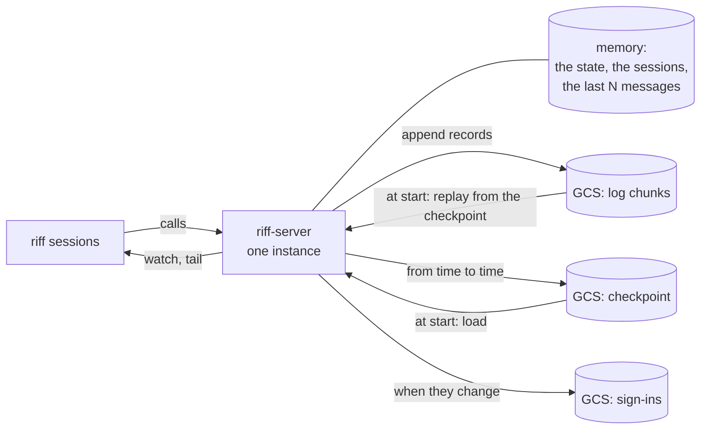
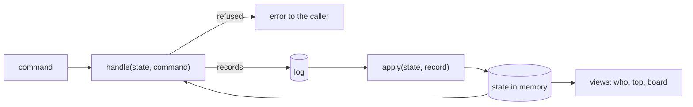
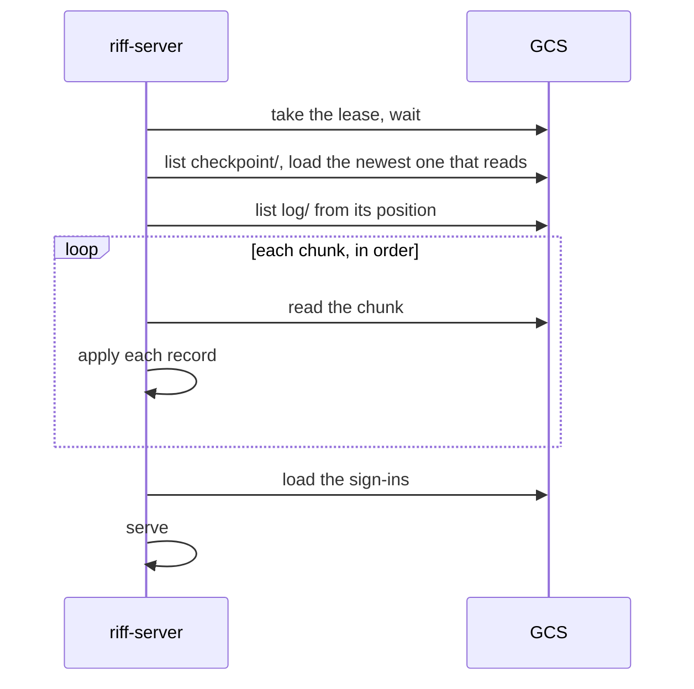

# Design: the store and the wire of riff-server (draft)

This page is a draft for review. When we agree, the big picture and the
operations stay in the book. The details go into the rustdoc.

## Target and goals

- The target: dozens of people and dozens of repositories, for 12 months
  and more. The load is less than 100 requests each second.
- The goals:
  - One instance decides each change, in one tokio runtime.
  - Each change that must not be lost is a record in one log. A start
    replays the log.
  - Each write is small. The start time and each read have a limit.
  - Old records go away by a rule.
  - The formats have clear rules for versions, and CI enforces them.
  - The cost is small. We do not operate more services.
- Not goals: more than one instance that serves, a web client, and
  searches of old history.

## The picture



## The classes of data

| Class | Data | When it is lost |
|---|---|---|
| **The log** | messages (posts, notes, direct messages, chat, with the sessions that each one woke), claims, people (members, admins, owner, riff ID), riff state (paused, running), leads, thread members, settings | never: each change is a record, and a start replays the records |
| **The checkpoint** | the state that the log gives, up to a log position; the read cursors | a start replays more of the log; a session can read a message two times, but never misses one |
| **The sign-ins** | sign-ins and their token chains | each person signs in again |
| **Memory** | sessions (each session sends its place again on its next call), presence, access tokens, DPoP replay IDs, timers, the lease, the wake channels | nothing |
| **Computed** | the state of each session, stale, the board, idle times | nothing |

## Event sourcing

riff-server follows the pattern of event sourcing with CQRS. It does not
use a framework for it.

| Term | In riff-server |
|---|---|
| command | a call: post, claim, pause, invite, and the other calls |
| event | a `Record` in the log |
| state | the riff in memory: people, threads, claims, leads, settings |
| event store | the log chunks in GCS |
| snapshot | the checkpoint |
| query, view | who, top, the board, the state of each session |



- `handle(&State, Command) -> Result<Vec<Record>, Refused>` checks a
  command against the state. It does not change the state, and it does
  no I/O.
- `apply(&mut State, &Record)` changes the state for one record. It does
  no I/O, and it does not fail. The live path and the replay use the
  same `apply`, so a replay gives the same state as the live server.
- The server runs `handle`, appends the records to the log, waits for
  the write when the reply needs it, then runs `apply` for each record.
  All of this is under the one lock.
- A view is a function of the state. It does not change the state.
- The whole riff is one aggregate. So one check can see claims, leads,
  members and threads together.

### Tests

Each rule has a test in this form:

```rust
given(&[invite("ann"), join("ann/s1", "repo")])
    .when(claim("ann/s1", "repo", "issue-7"))
    .then(&[claim_item("ann/s1", "repo", "issue-7")]);
```

- `given` applies records to an empty state.
- `when` runs `handle` with one command.
- `then` compares the records, or `then_refused` compares the error.
- The tests do no I/O, so they are fast. A replay test applies the
  records of a test log, and compares the state with the state of the
  live path.

### Why no framework

A framework such as `cqrs-es` has a stream and a lock in a database for
each aggregate, and it loads an aggregate from the store for each
command. riff-server has one instance, one log, one aggregate and the
state in memory. So a framework adds concepts and code that riff-server
does not need. The GCS store is the part that we write in each case.

## The log

### One log for the riff

- The riff has one log. Each record has a position: 1, 2, 3, and so on.
  The position gives one order for all records.
- A message also has a seq: its number in its own thread. People and
  read cursors use the seq. The server keeps the last seq of each thread
  in memory. It gives each post the next seq, and writes the seq in the
  record. So each record says where it is in its thread, and a replay
  can find a gap. See [Appendix A](#appendix-a-position-and-seq).

### The records

Each record is a protobuf message. This is an example; see [The book
shows the real code](#the-book-shows-the-real-code):

```proto
message Record {
  uint64 position = 1;
  int64 written_at_ms = 2;
  oneof change {
    Post post = 10;                     // a message; see "Signed messages"
    JoinThread join_thread = 11;
    LeaveThread leave_thread = 12;
    ClaimItem claim_item = 13;
    ReleaseItem release_item = 14;
    SetLead set_lead = 15;
    SetRiffState set_riff_state = 16;   // paused or running
    ChangePerson change_person = 17;    // invite, remove, admin, owner, take
    ChangeSetting change_setting = 18;
  }
}
```

- A `Post` keeps the signed bytes of its message unchanged. See [Signed
  messages](#signed-messages).
- A new kind of change gets a new field in the `oneof`. A build that
  does not know a kind skips the record and logs a warning.

### Signed messages

The client writes a `MessageContent`, encodes it, and signs the bytes.
The `Post` record keeps those bytes unchanged, and adds the fields that
the server owns.

```proto
message MessageContent {              // the client encodes and signs this
  string thread = 1;
  repeated Selector wake = 2;          // the sessions that the message wakes
  string text = 3;
  MessageKind message_kind = 4;
  string sender_session = 5;
  int64 sent_at_ms = 6;
}

enum MessageKind {
  MESSAGE_KIND_UNSPECIFIED = 0;
  MESSAGE_KIND_MESSAGE = 1;            // a message to read
  MESSAGE_KIND_STATUS_REQUEST = 2;     // each session that it wakes sets its status
  MESSAGE_KIND_NOTE = 3;               // it informs, and wakes no session
}

message Post {
  bytes signed_content = 1;            // the exact bytes of MessageContent that the client signed
  bytes signature = 2;
  SignatureScheme signature_scheme = 3;
  uint64 thread_seq = 4;               // the server adds this and the next field;
  repeated string woken_sessions = 5;  // they are not in the signature
}
```

`MessageKind` is the kind of a message. The `change` of a `Record` is
the kind of a log record. A note in the repo thread is a `Record` with
`change = post`, and its `MessageContent` has `MESSAGE_KIND_NOTE`.

The server checks each post:

1. It decodes `signed_content` with its schema. It refuses bytes that do
   not decode.
2. It compares the decoded fields with the call: the thread, the session
   of the sender, the selectors. It refuses a difference.
3. It checks the signature. The signature covers a fixed prefix, the
   riff ID and `signed_content`, for example `riff/message/v1`. So a
   signature cannot be used in another riff or for other data.
4. It keeps `signed_content` unchanged. It never encodes it again.

A reader checks the signature over the kept bytes, and it decodes the
bytes to use the fields. These are two separate steps, and neither
changes the bytes. So a new field never stops a check: an older build
skips a field that it does not know, and a newer build gives a missing
field its default value. See [Appendix
B](#appendix-b-signed-messages-over-versions).

A new signature scheme (a new algorithm, prefix or key type) gets a new
`SignatureScheme` value. It comes in two releases:

1. Release N can check the new scheme, but it signs with the old scheme.
2. Release N+1 signs with the new scheme.

riff-server talks only with riff N and N-1. So each build that can talk
with the server can check each message. A test fails when a build signs
with a scheme that the build before it cannot check. A build that meets
a scheme that it does not know shows the message as not verified. It
does not refuse the message.

### Chunks

- The server appends records to a queue in memory. A writer task writes
  the queue to GCS as one new object, a chunk, then empties the queue.
- The name of a chunk is its first position, with zeros in front:
  `log/00000000000000001234.pb`. So the names sort in log order. No two
  chunks have the same name, so the GCS limit of about one write each
  second for each object does not apply.
- Each chunk holds its records, each with a length in front.
- The writer writes at most one chunk at a time. While it writes, new
  records wait in the queue for the next chunk. At less than 100
  requests each second, a chunk holds a few records.
- A reply that needs its record in the log (a post, a claim, a pause)
  waits until its chunk is written. A write takes about 50 to 100 ms.

### Compaction

When the number of chunks gets large, a background task joins old chunks
into one segment object with the GCS compose call (at most 32 objects in
each call). Then it deletes the chunks. A segment has the name of its
first position too. Compaction is not in the first build.

## The checkpoint

- From time to time (each 1,000 records, or each 10 minutes when records
  came), the server writes a checkpoint:
  `checkpoint/00000000000000001234.pb`. It holds the state that the log
  gives up to that position, and the read cursors.
- The checkpoint is a protobuf message too, with a schema version.
- The server keeps the last 3 checkpoints.

## The start and the replay



- The start time depends on the size of the checkpoint and the records
  after it, not on the whole history.
- When the newest checkpoint does not read, the server uses the one
  before it.

## Reads

- `read` gives at most N unread messages (a setting; the default is
  200). It says how many it did not give.
- Memory keeps the last N messages of each active thread, for wakes and
  tail.
- Older messages come from the chunks when a session asks for them.
  Memory keeps an index from each thread to the positions of its
  messages.

## The sign-ins

- A refresh token names its chain and a generation:
  `chain.generation.secret`. The server keeps the hash of the current
  generation of each chain, and nothing for older generations.
- A refresh with the current generation gives the next generation. A
  refresh with an older generation is reuse: the server ends the
  sign-in.
- Each (sign-in, session) has at most one live chain.
- The server writes `signins.pb` at most one time each second, when
  something changed. After a crash, the snapshot can be one generation
  behind. So the server takes the current generation, or the next one,
  as good.
- Access tokens and DPoP replay IDs are in memory. After a start, each
  client refreshes one time.

## Live messages

- Watch and tail get new messages through channels in the memory of the
  instance. The server finds a missed wake in its memory.
- Each stream sends its first bytes when it opens, and a keep-alive.

## The lease

- `lease` names the instance that serves. A new instance writes its ID,
  waits, then serves. An instance that sees another ID stops.
- Each start has a gap of about 15 s. The client waits through the gap
  and shows no error.

## The wire

### Protobuf for each message

- The `.proto` files are in `riff-core`. The log, the checkpoint, the
  sign-ins and the API use them.
- `prost` makes the Rust types. `protox` reads the `.proto` files in
  Rust, so the build needs no `protoc`.
- The rules for a change:
  - Add a field with a new number.
  - Never use a number again. Mark the number of a removed field as
    `reserved`.
  - Do not change the type or the meaning of a field.
- CI runs `buf breaking` against the last release tag. A change that
  breaks an old reader or an old writer fails CI.
- Each release adds some real signed messages (bytes, signature, key) to
  the test fixtures. CI decodes and checks each fixture of each earlier
  release.
- Names are clear and say what a thing is: `MessageKind`, not `Kind`;
  `thread_seq`, not `seq`; `written_at_ms`, not `at`. Each enum value
  has the name of its enum in front, and value 0 is `UNSPECIFIED`.

### The book shows the real code

- The book does not copy code. It includes the real files with mdbook
  anchors, so a change of the code changes the book:

  ```text
  \{{#include ../../crates/riff-core/proto/record.proto:record}}
  ```

- Each `.proto` file marks the parts that the book shows with `//
  ANCHOR: name` and `// ANCHOR_END: name`.
- The same rule is true for each other code sample in the book (Rust
  types, commands in `justfile`, deploy files).

### gRPC for the calls

The calls use gRPC with `tonic`, from the same `.proto` files. One JSON
route stays: `/v1/build` gives the build of the server, so that an older
riff can see a new build and update itself.

```proto
service Riff {
  rpc Register(RegisterRequest) returns (RegisterReply);
  rpc Post(PostRequest) returns (PostReply);
  rpc Read(ReadRequest) returns (ReadReply);
  rpc Claim(ClaimRequest) returns (ClaimReply);
  rpc Release(ReleaseRequest) returns (ReleaseReply);
  rpc Who(WhoRequest) returns (WhoReply);
  // and each other call of the API
  rpc Watch(WatchRequest) returns (stream Wake);
  rpc Tail(TailRequest) returns (stream Tailed);
}
```

- Watch and tail are server streams. A bidirectional stream can come
  later for chat.
- Each call carries the DPoP proof, the access token and the build of
  riff as metadata. The DPoP proof binds the method `POST` and the URL
  of the call: the address of the server plus the gRPC path, for example
  `/riff.v1.Riff/Post`. The server sends its build as metadata too, and
  refuses a build that cannot talk with it.
- The server gives gRPC status codes: `UNAVAILABLE` for a short outage
  (the client waits and tries again), `UNAUTHENTICATED`,
  `PERMISSION_DENIED`, `FAILED_PRECONDITION` (for example, the riff is
  paused).
- Cloud Run serves gRPC over HTTP/2 end to end (`--use-http2`).
- `grpcurl` replaces `curl` to make a call by hand.

## Tools

- `riff-server log` prints the records of the log as text, from a
  position.
- `riff-server log verify` reads each chunk and each checkpoint, and
  says which ones do not read.

## Operations

### Set up

`just cloud setup` does each step. When you run it again, it changes
nothing.

1. The bucket, with object versioning on.
2. Lifecycle rules:
   - delete `log/` objects 90 days after they are written (a setting),
   - delete older versions of each object after 7 days.
3. The `riff-server` service account can read and write objects in the
   bucket.
4. Cloud Run serves over HTTP/2 end to end, for gRPC.

### Cost

For the target, we use these numbers for each day: 20,000 messages,
30,000 other records, 30,000 chunks, 150 checkpoints, 1,000 sign-in
writes. At list prices:

| Part | Each month |
|---|---|
| Writes (about 1 million) | about $5 |
| Reads (mostly at start) | less than $1 |
| Storage (less than 5 GB, with 90 days of log) | less than $1 |

Make sure of the prices when you set up. The Cloud Run instance, which
always runs, stays the largest cost.

### Limits

- Each object gets about one write each second. The chunks and the
  checkpoints have new names each time. `signins.pb` gets at most one
  write each second.
- One compose call joins at most 32 objects.

### Monitoring

`riff server` shows these facts:

- the log position, and the time and the duration of the last chunk
  write,
- the number of write errors since the start,
- the position and the age of the newest checkpoint,
- the numbers of chunks, sessions, threads and live sign-ins,
- the start time of the instance, and how long the replay took.

### Backup and restore

- Object versioning keeps each older version of an object for 7 days.
- To go back: stop the server, remove the bad chunks or checkpoint (or
  bring back an older version), then start. The start replays from the
  newest good checkpoint.
- `riff-server log verify` finds the objects that do not read.

### Deploy and rollback

- The protobuf rules and `buf breaking` make sure that an older build
  reads the records of a newer build, and the other way. So a rollback
  works.
- The checkpoint has a schema version. When a build cannot read the
  newest checkpoint, it uses an older one, or replays from the start of
  the log.

### Local development

- `riff-server` with no bucket keeps the log in memory.
- With `RIFF_DIR`, it keeps the log and the checkpoints as files in that
  directory. The tests use a temporary directory or memory, never the
  real bucket.

### Go live

Go live is one release at a wave end: the riff is paused, and no item is
claimed.

1. The lead writes its handoff in the release issue on GitHub, not in
   the riff.
2. The tag deploys the new server. It starts with an empty log, and a
   new riff ID. A new riff starts paused.
3. Each machine updates itself: the old riff sees the new build on
   `/v1/build`.
4. Each person signs in again with `riff login`, on each machine.
5. The owner comes from `RIFF_OWNER`, and the admins from `RIFF_ADMINS`.
   The owner invites the members again.
6. The lead runs `lead` again, and reads its handoff from the release
   issue.
7. The old state in the bucket goes away after 30 days.

## Build items

The items run one after another, in this order. They change the same
code.

1. The `.proto` files for the records, the checkpoint, the sign-ins and
   the API, with anchors; `prost` and `protox`; `buf breaking` in CI.
   The book includes the `.proto` files.
2. The spike: a zonal bucket that appends to an object, in our region or
   in another one.
3. The log: `handle`, `apply` and the given/when/then tests; records,
   the writer, the replay; the stores for memory, a directory and GCS.
4. The checkpoint, the start from a checkpoint, and `read` with a limit.
5. The sign-ins: chains with generations, the snapshot.
6. The gRPC API with `tonic`: each call, watch and tail as streams, DPoP
   in the metadata, the build in the metadata, the status codes. The
   client moves to it. The JSON route `/v1/build` stays, so that an
   older riff sees the new build and updates itself.
7. The tools (`riff-server log`, `log verify`), the facts in `riff
   server`, cloud setup (the bucket, HTTP/2 on Cloud Run), and the book
   (operations, restore, `grpcurl`).
8. Go live: one release, at a wave end, empty (see "Go live").

## Decisions of the review

1. The log keeps records 90 days (a setting). We change it when we learn
   more.
2. The server writes a checkpoint each 1,000 records, or each 10 minutes
   when records came (settings). We change them when we learn more.
3. The object store: first a spike with a zonal bucket that can append
   to an object. When it works, the writer appends to one open object,
   and the log has fewer objects. When it is not available, the log uses
   chunks as above. We can move the riff to another region for it.
4. We go live empty, at a wave end.
5. The gRPC API comes in the same wave as the store. So the clients
   break one time only, at go-live.

## Appendix A: position and seq

A message has two numbers:

- The position: its place in the one log. It counts each record, of each
  kind, in each thread.
- The seq: its number in its own thread. It counts only the messages of
  that thread.

An example of the log:

| Position | Record | Thread | Seq |
|---|---|---|---|
| 1041 | post | `como-technologies/riff` | 286 |
| 1042 | claim `issue-250` | | |
| 1043 | post | `chat` | 51 |
| 1044 | post | a direct thread | 7 |
| 1045 | post | `como-technologies/riff` | 287 |
| 1046 | riff state: paused | | |

- People see the seq: "message 287" in the repo thread, "message 51" in
  chat. The positions of one thread have gaps (1041, 1045).
- A read cursor is a seq for each thread. The unread count is the last
  seq less the cursor.
- A replay checks each post: its `thread_seq` is the last seq of its
  thread plus 1. A gap or a repeat shows a bad or a missing chunk.
  `riff-server log verify` finds it.

## Appendix B: signed messages over versions

### How protobuf writes a message

The message becomes one string of bytes, and the signature covers all of
it. In the string, each field has a tag (its number and its wire type),
then its value. A field with its default value is not written.

`MessageContent { thread: "chat", text: "hi" }` gives:

```text
0A 04 63 68 61 74   field 1 (thread), length 4, "chat"
1A 02 68 69         field 3 (text),   length 2, "hi"
```

A decoder reads one tag at a time. When it does not know the number of a
field, the wire type tells it how many bytes to skip.

### A new field

Release 0.9 adds `reply_to = 7` to `MessageContent`.

| Who reads | The message | The signature check | The fields |
|---|---|---|---|
| 0.8 | from a 0.9 client, with field 7 | over the kept bytes: good | fields 1 to 6; it skips field 7 and shows no reply link |
| 0.9 | from a 0.8 client, with no field 7 | over the kept bytes: good | `reply_to` is empty: not a reply |

### Why the server keeps the bytes

When a 0.8 server decodes a 0.9 message and encodes it again, it drops
field 7, because it does not know it. The new bytes are not the signed
bytes, and each later check fails. So no build encodes `signed_content`
again.

### A new signature scheme

| Release | Checks | Signs with |
|---|---|---|
| N | the old and the new scheme | the old scheme |
| N+1 | the old and the new scheme | the new scheme |

When N+1 signs with the new scheme, the server talks only with N and
N+1, and each of them can check it.
