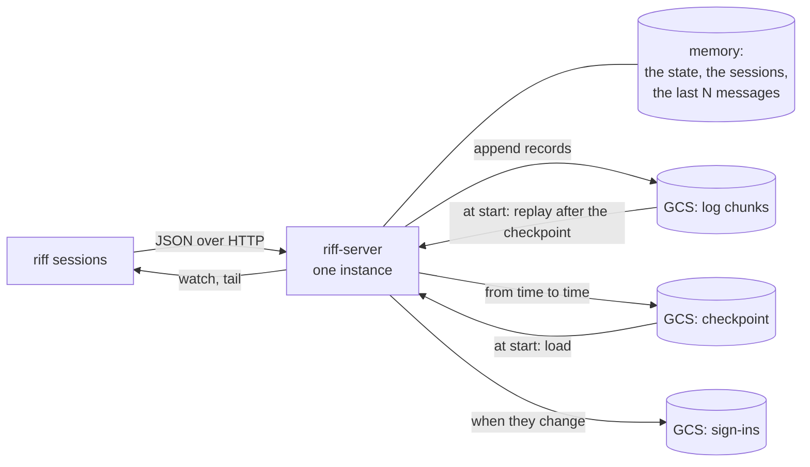
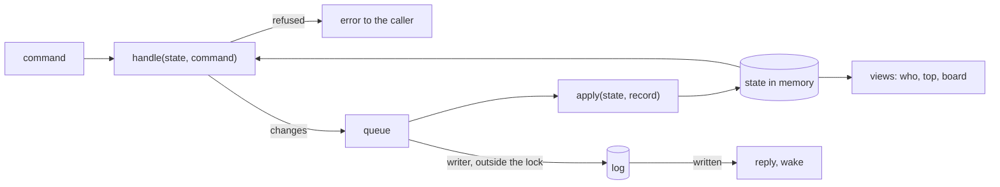

# Design: the store of riff-server

This page is the design for Wave 15 and release 1.0.0. When the build
is done, the big picture and the operations stay in the book. The
details go into the rustdoc. The reviews and the report are in
`design/reviews/`.

## Target and goals

- The target: dozens of people and dozens of repositories, for 12 months
  and more. The load is less than 100 requests each second.
- The goals:
  - One instance decides each change, in one tokio runtime.
  - Each change that must not be lost is a record in one log. A start
    loads a checkpoint and replays the log after it.
  - Each write is small. The start time and each read have a limit.
  - Old records and old sessions go away by a rule.
  - The formats have clear rules for versions, and CI enforces them.
  - The cost is small. We do not operate more services.
- Not goals: more than one instance that serves, a web client, reads
  of old history, a new wire.

## The picture



## The classes of data

| Class | Data | When it is lost |
|---|---|---|
| **The log** | messages (posts, notes, direct messages, chat, with the sessions that each one woke), claims, people (members, admins, owner, riff ID), riff state (paused, running), leads, thread members, settings, forgotten sessions | never: each change is a record, and a start replays the records |
| **The checkpoint** | the state that the log gives, up to a log position; the read cursors; the last N messages of each thread | a start replays more of the log; a session can read a message two times, but never misses one |
| **The sign-ins** | sign-ins and their token chains | each person signs in again |
| **Memory** | sessions (each session sends its place again on its next call), presence, access tokens, DPoP replay IDs, timers, the lease, the wake channels | nothing |
| **Computed** | the state of each session, stale, the board, idle times | nothing |

Each person who can write the bucket controls the riff. The records of
people and settings are not signed. The service account of riff-server
and the admins of the cloud project are the only writers.

## Event sourcing

riff-server follows the pattern of event sourcing with CQRS. It does not
use a framework for it.

| Term | In riff-server |
|---|---|
| command | a call: post, claim, pause, invite, and the other calls |
| event | a `Record` in the log |
| state | the riff in memory: people, threads, claims, leads, settings |
| event store | the log chunks in GCS |
| snapshot | the checkpoint |
| query, view | who, top, the board, the state of each session |



- `handle(&State, Command) -> Result<Vec<Change>, Refused>` checks a
  command against the state. It does not change the state, and it does
  no I/O. A `Change` has no position and no time: the log adds them.
- `apply(&mut State, &Record)` changes the state for one record. It
  does no I/O, reads no clock, and does not fail. A record that the
  state cannot take (for example, a release of a claim that is not
  there) changes nothing, and the server logs a warning. The live path
  and the replay use the same `apply`, so a replay gives the same state
  as the live server.
- Under the one lock, the server runs `handle`, gives each change its
  position and time, puts the records in the queue, and runs `apply`.
  Then it releases the lock.
- The writer takes each record in the queue into one chunk: a group
  commit. It writes outside the lock. So each call runs `handle`
  against the state of each call before it, and two claims of one item
  never both pass.
- A call that makes a record replies after its chunk is written. A
  call that makes no record (`who`, `read`, `top`) does not wait.
- The server keeps two copies of the state. `handle` checks against
  the pending state, which has each record in the queue. Each read,
  wake, view and reply uses the written state, which has only the
  records whose chunk is written. After each chunk write, the server
  applies its records to the written state. So nobody sees a record
  that is not in the log. When a chunk fails for good, the instance
  stops, and the next instance replays without it.
- A view is a function of the state. It does not change the state.
- The whole riff is one aggregate. So one check can see claims, leads,
  members and threads together.

### Tests

Each rule has a test in this form:

```rust
given(&[invite("ann"), join("ann/s1", "repo")])
    .when(claim("ann/s1", "repo", "issue-7"))
    .then(&[claim_item("ann/s1", "repo", "issue-7")]);
```

- `given` applies records to an empty state.
- `when` runs `handle` with one command.
- `then` compares the changes, or `then_refused` compares the error.
- The tests do no I/O, so they are fast. A replay test applies the
  records of a test log, and compares the state with the state of the
  live path.
- A test puts two posts in one chunk. A test measures how long each
  call holds the lock and waits for it.

### Why no framework

A framework such as `cqrs-es` has a stream and a lock in a database for
each aggregate, and it loads an aggregate from the store for each
command. riff-server has one instance, one log, one aggregate and the
state in memory. So a framework adds concepts and code that riff-server
does not need. The GCS store is the part that we write in each case.

## The log

### One log for the riff

- The riff has one log. Each record has a position: 1, 2, 3, and so on.
  The position gives one order for all records.
- A message also has a seq: its number in its own thread. People and
  read cursors use the seq. The server keeps the last seq of each thread
  in memory. It gives each post the next seq, and writes the seq in the
  record. So each record says where it is in its thread, and a replay
  can find a gap. See [Appendix A](#appendix-a-position-and-seq).

### The records

Each record is one line of JSON. The Rust types in `riff-core` are the
schema. This is an example; see [The book shows the real
code](#the-book-shows-the-real-code):

```json
{"position":1234,"written_at_ms":1790000000000,"change":{"claimed":{"session":"ann/s1","thread":"repo","item":"issue-7"}}}
```

- The change names say what happened, in the past tense: `posted`,
  `joined_thread`, `left_thread`, `claimed`, `released`, `lead_set`,
  `riff_state_set` (paused or running), `person_changed` (invite,
  remove, admin, owner, take), `setting_changed`, `session_forgotten`.
- A `posted` record keeps the signed bytes of its message unchanged.
  See [Signed messages](#signed-messages).
- The rules for a change of a record:
  - A new field has a default, and the default means "as before". An
    old build skips a field that it does not know.
  - Do not change the type or the meaning of a field. Do not use the
    name of a removed field again.
  - A new kind of change gets a new name. A build that does not know a
    kind skips the record and logs a warning with its position.
- Each release adds a sample log and some real signed messages to the
  test fixtures. CI replays each fixture of each earlier release and
  checks each message.

### Signed messages

The signature is the one of today: a JWS with a detached payload, from
the device key of the sender. The header carries the public key. The
payload is the JSON of `Content`.

```text
 sig = <header>..<signature>
       header  {"typ":"riff-message","alg":"ES256","jwk":{public key}}
       payload the JSON of Content
```

`Content` holds the user and the session of the sender, the lead mark,
the thread, the `to` selectors, the body, the kind and the time (R196).

The `posted` record keeps the payload bytes and the signature
unchanged, and adds the fields that the server owns: the thread seq
and the sessions that the message woke.

The server checks each post:

1. It decodes the payload. It refuses bytes that do not decode.
2. It compares the decoded fields with the call: the thread, the user
   and the session of the sender, the lead mark, the selectors. It
   refuses a difference. It refuses `lead = true` from a session that
   is not the lead.
3. It checks the signature with the key in the header, and checks that
   the key is the key of the token of the caller (R197).
4. It keeps the payload bytes unchanged. It never encodes them again.

A reader checks the signature over the kept bytes. Then it checks that
the thumbprint of the key is the key of a live sign-in of the user of
the sender (R199). A message whose sender's sign-in ended shows as not
verified.
Then it decodes the bytes to use the fields. It takes the user and the
lead mark only from the signed bytes. These are separate steps, and
none changes the bytes. So a new field never stops a check. See
[Appendix B](#appendix-b-signed-messages-over-versions).

The copy check compares a hash of the payload, not the bytes of the
signature, because ECDSA gives a second valid signature for the same
bytes.

A new signature scheme (a new algorithm or key type) gets a new `typ`.
It comes in two releases:

1. Release N can check the new scheme, but it signs with the old scheme.
2. Release N+1 signs with the new scheme.

riff-server talks only with riff N and N-1. So each build that can talk
with the server can check each message. A test fails when a build signs
with a scheme that the build before it cannot check. A build that meets
a scheme that it does not know shows the message as not verified.

### Chunks

- The writer writes the queue to GCS as one new object, a chunk, then
  empties the queue. It writes at most one chunk at a time. While it
  writes, new records wait in the queue for the next chunk.
- The name of a chunk is its first position, with zeros in front:
  `log/00000000000000001234.jsonl`. So the names sort in log order.
- The first line of a chunk is a header with the format version and the
  first position. Then each record is one line.
- Each write of a chunk or a checkpoint sends `ifGenerationMatch=0`, so
  it never replaces an object.
- A 412 means that another instance writes the log. The instance stops
  for good, as today (R141).
- A write that fails with a 429, a 5xx, a timeout or a failed token
  is tried again with a backoff, for 10 s. When the retry gets a 412,
  the writer reads the object: when its bytes are the same, the write
  is done. After 10 s, the instance stops for good: it gives 503 to
  each call, logs one error that names the chunk and the error, and
  exits. Cloud Run starts a new instance, and it replays from GCS.

## The checkpoint

- From time to time (each 1,000 records, or each 60 minutes when records
  came), the server writes a checkpoint:
  `checkpoint/00000000000000001234-1790000000000.json`, with the
  position and the time of the write. The keep rule reads the day from
  the name. It holds the state that the
  log gives up to that position, the read cursors, the last N messages
  of each thread, and the version of the build that wrote it.
- The server encodes a copy of the state outside the lock.
- A build writes no checkpoint past the first record that it skipped.
  A build writes no checkpoint while the newest checkpoint comes from a
  later version. `riff server` says so. A test runs a new build, an old
  build, then the new build again, and compares the state.
- The server keeps the last 3 checkpoints, and one checkpoint each day
  for 30 days.
- The server deletes a chunk only when each kept checkpoint is past it.
  No rule deletes chunks by age.

## Forget a session

A timer writes a `session_forgotten` record for each session with no
sign of life for `SESSION_EXPIRY` (30 days). `apply` drops its read
cursors, its memberships, and each direct thread whose two sessions are
gone. `apply` reads the time from the record, not from a clock.

## The start and the replay

```mermaid
sequenceDiagram
    participant S as riff-server
    participant G as GCS
    S->>G: list checkpoint/, load the newest one that reads
    S->>G: list log/ after its position
    loop each chunk, in order
        S->>G: read the chunk
        S->>S: apply each record
    end
    S->>G: load the sign-ins
    alt the load failed
        S->>S: exit; the old instance serves on
    else the load worked
        S->>G: take the lease, wait
        S->>G: read the chunks that came since, apply them
        S->>G: load the sign-ins again
        S->>S: open the port, serve
    end
```

- The new instance loads and replays before it takes the lease. It
  opens its port only after the load works. So a build that cannot load
  exits, and Cloud Run keeps the traffic on the old revision.
- The start time depends on the size of the checkpoint and the records
  after it, not on the whole history.
- When the newest checkpoint does not read, the server uses the one
  before it.
- The claims of a session come back with the log. The 5-minute claim
  timer of each session starts at the load.

## Reads

- `read` gives at most 50 messages, and a cursor for the next page.
  `riff read --all` follows the cursors by itself.
- Memory and the checkpoint keep the last 200 messages of each thread.
  Nobody reads an older message.
- One rule for each path that gives messages (`read`, `tail`, `watch`):
  the caller acts as its token, and gets a direct thread only when it
  is one of its two sessions. Each path has a given/when/then test.

## The status line

The status line of each session calls `GET /v1/me`. The reply holds only
the session of the caller: its state, claims, status, and the build. It
does not call `who` for the whole riff.

## The sign-ins

- A refresh token names its chain and a generation:
  `chain.generation.secret`. The server keeps the hash of the current
  generation of each chain, and of the generation before it for a lost
  reply. It keeps nothing for older generations.
- A refresh with the current generation gives the next generation. A
  refresh with an older generation is reuse: the server ends the
  sign-in. The server checks the DPoP key before the generation.
- Each (sign-in, session) has at most one live chain. A session chain
  ends after 24 hours with no refresh.
- The server writes `signins.json` at most one time each second, when
  something changed. A sign-in and a revoke wait for the write. A
  refresh does not. After a crash, the snapshot can be one generation
  behind. So the first refresh of each chain after a start takes the
  current generation, or the next one, as good.
- While a write of `signins.json` fails, a refresh gets 503. So the
  snapshot does not fall more generations behind.
- Until go-live, `signins.json` also holds the people: the owner, the
  admins, the members and the riff ID.
- Access tokens and DPoP replay IDs are in memory. After a start, each
  client refreshes one time. A new instance refuses each DPoP proof from
  before its start.

## Live messages

- Watch and tail get new messages through channels in the memory of the
  instance. The server finds a missed wake in its memory.
- Each stream sends its first bytes when it opens, and a keep-alive.

## The lease

- `lease` names the instance that serves. A new instance writes its ID,
  waits, then serves. An instance that sees another ID stops.
- Each start has a gap of about 15 s. The client waits through the gap.
  When a call waits for more than 1 s, the client shows one line that
  it waits. `riff top` and `riff chat` keep their screen. The client
  gives up after 60 s, as today.

## The wire

- The wire is the one of today: JSON over HTTP on `/v1`, the watch and
  tail streams, DPoP, and the `riff-build` header on each reply.
- The Rust types in `riff-core` are the schema of the wire, the log,
  the checkpoint and the sign-ins.

### The book shows the real code

- The book does not copy code. It includes the real files with mdbook
  anchors, so a change of the code changes the book:

  ```text
  \{{#include ../../crates/riff-core/src/record.rs:record}}
  ```

- Each file marks the parts that the book shows with `// ANCHOR: name`
  and `// ANCHOR_END: name`.
- `just book` fails on an `ERROR` line of mdbook. A test in the
  `hygiene` crate reads `docs/book/*.html`. It fails on an include line
  that mdbook left in the text, outside a code block, and on an empty
  code block. An example of an include in a code block, as above, is
  escaped, and the test skips it.

## Tools

- `riff-server log` prints the records of the log as text, from a
  position.
- `riff-server log verify` reads each chunk and each checkpoint from the
  oldest kept checkpoint, and names each line that does not read.
- `riff-server log cut --after POSITION` deletes each chunk and each
  checkpoint after the position. It prints the records that it removes,
  and the threads. It refuses to cut before the oldest kept checkpoint.
- The tools take a token from the metadata server of Cloud Run, or from
  the Google sign-in of the person. So they run on a laptop too.

## Operations

### Set up

`just cloud setup` does each step. When you run it again, it changes
nothing.

1. A standard bucket in the region of today, with object versioning on.
2. A lifecycle rule: delete older versions of each object after 7 days.
3. The `riff-server` service account can read and write objects in the
   bucket.
4. `--memory 1Gi` on the Cloud Run service.

### Cost

The numbers come from `design/measures.md`: the load of 2026-09-29, 2
people, scaled to 36 people with 8 live sessions and 20 new session IDs
each day for each person. The prices are the list prices of GCS
Standard in `us-central1`: $0.005 for each 1,000 writes, $0.020 for
each GB each month. Make sure of the prices when you set up.

| Item | Today | At 36 people | Each month |
|---|---:|---:|---:|
| Records each day | 950 | 27,700 | |
| Records each second, peak hour | 0.06 | 1.7 | |
| Chunk writes | 29,000 a month | 830,000 a month | $4.20 |
| Log kept (about 31 days of chunks) | 30 MB | 0.9 GB | $0.02 |
| A checkpoint | 1.6 MB | 160 MB | |
| Checkpoints kept (3, and 1 each day for 30 days) | 53 MB | 5.3 GB | $0.11 |
| Older versions of deleted checkpoints (7 days, a checkpoint each hour) | 0.15 GB | 56 GB | $1.12 |
| Sign-ins | 4.8 MB | not scaled | $0 |
| **GCS** | | | **about $5.50** |

- The GCS write time is not measured. `riff server` shows the time of
  the last chunk write.
- The direct threads are most of the checkpoint: about 24,800 of them
  at 36 people.
- The checkpoint settings: keep "each 1,000 records". Change "each 10
  minutes" to "each 60 minutes". At 36 people, a checkpoint each 10
  minutes keeps about 170 GB of older versions, for $3.40 each month.
- The Cloud Run instance, which always runs, stays the largest cost.

### Monitoring

`riff server` shows these facts:

- serves, or 503 and why; the last error,
- the log position, and the time and the duration of the last chunk
  write,
- the number of write errors and skipped records since the start,
- the position, the age and the version of the newest checkpoint,
- the numbers of chunks, sessions, cursors, threads and live sign-ins,
- the memory in use,
- the start time of the instance, and how long the replay took.

Each log line of riff-server is JSON with a `severity` field, so a
Cloud Logging filter finds the errors. An alert on `severity>=ERROR`
goes to the owner.

### Backup and restore

- Object versioning keeps each older version of an object for 7 days.
- To go back to a position:
  1. Stop the server: set the instances of the service to 0.
  2. `riff-server log verify`, to find the first bad record.
  3. `riff-server log cut --after POSITION`. A cut loses each change
     after the position: the tool names them.
  4. Start the server: set the instances back to 1.

### Deploy and rollback

- The rules for a change of a record, and the fixtures in CI, make sure
  that an older build reads the records of a newer build, and the other
  way. So a rollback to N-1 works.
- A rollback of riff-server past a release line is also a rollback of
  each machine: `riff update --tag`.

### Local development

- `riff-server` with no bucket keeps the log in memory.
- With `RIFF_DIR`, it keeps the log and the checkpoints as files in that
  directory. The tests use a temporary directory or memory, never the
  real bucket.

### Go live

Go live is one release at a wave end: the riff is paused, and no item is
claimed.

1. The lead writes its handoff in the release issue on GitHub, not in
   the riff.
2. The tag deploys the new server. It starts with an empty log, and a
   new riff ID. A new riff starts paused.
3. The new server reads the old `tokens` object one time, and writes a
   record for each member, admin and the owner. So nobody invites a
   member again.
4. Each machine updates itself: the old riff sees the new build in the
   `riff-build` header of each reply.
5. Each person signs in again with `riff login`, on each machine.
6. The lead runs `lead` again, and reads its handoff from the release
   issue.
7. The old objects (`sessions`, `tokens`, `threads/`) stay until the
   first wave after go-live ends, for a rollback. Then the lead deletes
   them. The new server uses the same `lease` object, so an old and a
   new instance never serve at the same time.

## Build items

Items 1 to 3 need nothing, and run at the same time. Items 4 to 9 run
one after another, in this order. They change the same code.

1. Measure the load of today: the records each day by kind, the size
   of the state, and the p50 and p99 of a GCS write from Cloud Run.
   Take 8 live sessions and 20 new session IDs each day for each
   person. Update the cost table.
2. The status line calls `GET /v1/me`.
3. `just book` fails on a missing include or anchor.
4. The log: `handle`, `apply` and the given/when/then tests; the
   records as JSON lines; the writer with a group commit outside the
   lock; the replies after the write; the retry and the stop; the
   replay; the stores for memory, a directory and GCS; the rule for who
   reads a thread.
5. The checkpoint: the start from a checkpoint, the version rules, the
   last N messages, `read` with pages, the delete of chunks by
   checkpoint, and the forgotten sessions.
6. The sign-ins: chains with generations, the snapshot.
7. The start order: load, then the lease, then the port.
8. The tools (`riff-server log`, `log verify`, `log cut`), the facts in
   `riff server`, the JSON log lines and the alert, cloud setup, and the
   book (operations, restore).
9. Go live: one release, at a wave end (see "Go live").

## Decisions

1. The wire stays JSON over HTTP. No gRPC.
2. The log, the checkpoint and the sign-ins are JSON. No protobuf.
3. A standard bucket. No zonal bucket, and no compaction.
4. The log keeps each chunk that a kept checkpoint needs. No rule
   deletes chunks by age.
5. The server writes a checkpoint each 1,000 records, or each 60
   minutes when records came (settings). See "Cost".
6. The default rule for a new field is a requirement.
7. We go live with an empty log at a wave end, and import the members
   one time.

## Appendix A: position and seq

A message has two numbers:

- The position: its place in the one log. It counts each record, of each
  kind, in each thread.
- The seq: its number in its own thread. It counts only the messages of
  that thread.

An example of the log:

| Position | Record | Thread | Seq |
|---|---|---|---|
| 1041 | posted | `como-technologies/riff` | 286 |
| 1042 | claimed `issue-250` | | |
| 1043 | posted | `chat` | 51 |
| 1044 | posted | a direct thread | 7 |
| 1045 | posted | `como-technologies/riff` | 287 |
| 1046 | riff state set: paused | | |

- People see the seq: "message 287" in the repo thread, "message 51" in
  chat. The positions of one thread have gaps (1041, 1045).
- A read cursor is a seq for each thread. The unread count is the last
  seq less the cursor.
- A replay checks the positions: each record is the last position plus
  1. A gap or a repeat shows a bad or a missing chunk. `riff-server log
  verify` finds it.

## Appendix B: signed messages over versions

### A new field

Release 1.1 adds `reply_to` to `Content`.

| Who reads | The message | The signature check | The fields |
|---|---|---|---|
| 1.0 | from a 1.1 client, with `reply_to` | over the kept bytes: good | it skips `reply_to` and shows no reply link |
| 1.1 | from a 1.0 client, with no `reply_to` | over the kept bytes: good | `reply_to` is empty: not a reply |

### Why the server keeps the bytes

When a 1.0 server decodes a 1.1 message and encodes it again, it drops
`reply_to`, because it does not know it. The new bytes are not the
signed bytes, and each later check fails. So no build encodes the
payload again.

### A field that limits a message

A new field that limits the meaning of a message (for example, "only
for this worktree") needs a new signature scheme. Else an old build
shows the message with a wider meaning.

### A new signature scheme

| Release | Checks | Signs with |
|---|---|---|
| N | the old and the new scheme | the old scheme |
| N+1 | the old and the new scheme | the new scheme |

When N+1 signs with the new scheme, the server talks only with N and
N+1, and each of them can check it.
