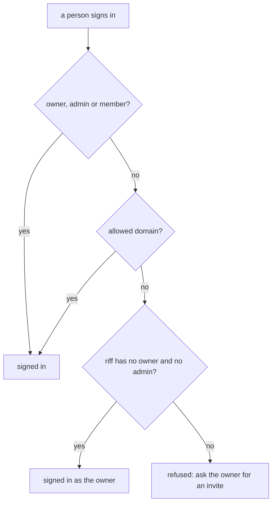
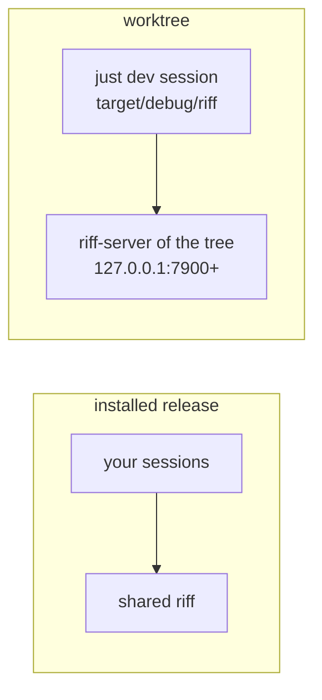
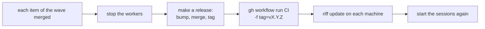

# Development

Install [Rust](https://rustup.rs) and [just](https://just.systems).
Then:

```sh
just init   # once: installs the book and audit tools
just ci     # the gate: fmt, clippy, tests, API docs, book, requirement IDs
```

CI runs the same gate on each push. It publishes this book to GitHub
Pages.

The design docs are in the code. Read them in the
[API docs](api/riff_core/index.html).

## Build riff from your clone

Do [Start a Riff](start-a-riff.md), with one change: in step 1, build
from your clone. Then the binaries have your changes:

```sh
just install
```

`riff tail` shows the messages of the thread of your repository.

## Add a requirement

Each requirement in `docs/src/requirements.md` has an ID. A new
requirement gets a new ID from this command:

```sh
just rid
```

It prints a new ID of 26 digits and capital letters. Write the new
requirement as `- **ID** text`, with that ID. Cite it by the same ID in
code, tests and commits. Two people who add requirements at the same
time never get the same ID. So nobody has to agree on a number first.

The old IDs `R1` to `R232` stay. Never give a new requirement the next
`R` number, and never renumber a requirement.

`just ci` checks the IDs. To run only this check:

```sh
just reqs
```

It fails when two requirements have the same ID, or when a file cites an
ID that no requirement has. It warns when a new ID does not have that
form, for example the next `R` number.

## Check a pull request on GitHub

Each pull request has the same form. The form links the pull request to
its issue and to its wave. A squash merge copies it into the commit on
`main`. This is the body of a pull request for issue 77:

```text
Closes #77

Pause and resume the riff. A new riff starts paused.

Issue: #77
Milestone: Wave 3
```

- The first line links the issue. Use `Closes #N` in the last pull
  request of the issue. Use `Refs #N` in each other one, and when a
  check after the release is left.
- The last lines are trailers: the issue, and its milestone.
- Give the pull request the milestone of its issue. Do not end the
  title with `(#N)`. GitHub adds the number of the pull request.

Write the body to a file, then open the pull request:

```sh
gh pr create --title "Pause and resume the riff" --milestone "Wave 3" --body-file pr.md
```

The job `Hygiene` checks each pull request. To check one yourself, give
its number:

```sh
just hygiene pr 90
```

To check the message of a commit:

```sh
just hygiene commit HEAD
```

Each error names its rule. The
[API docs of hygiene](api/hygiene/index.html) list the rules.

GitHub runs no check on a pull request that has a conflict with
`main`. When `Hygiene` does not run, rebase your branch on `main` and
push it again.
## Merge by pull request on GitHub

No session and no person pushes to `main`. Each change goes in by a
pull request. GitHub merges it with a squash when the checks `Gate`,
`Hygiene` and `riff/verify` pass. The ruleset on `main` makes this so.
It has no bypass, also not for an admin.

The project settings of Claude Code (`.claude/settings.json`) also
deny a push to `main` and `gh pr merge --admin` in each session.

Each session uses your GitHub account. So the author of a pull request
can set `riff/verify` on its own commit. The skill forbids it, but
nothing stops it until the sessions have their own GitHub identity
(#97).

### Set up the repository

Run it once, and again after a change to `deploy/github.sh`. It is
safe to run again:

```sh
just github
```

It turns on auto-merge and squash merge only, and makes or updates two
rulesets: `main`, and `releases` on the tags `v*`. With `releases`,
only the repository admin role can create, move or delete a release
tag. To see the result:

```sh
gh api repos/como-technologies/riff --jq '{allow_auto_merge, allow_squash_merge, allow_merge_commit, allow_rebase_merge, squash_merge_commit_title, squash_merge_commit_message, delete_branch_on_merge}'
gh api repos/como-technologies/riff/rulesets
```

### Push an urgent fix to main

Do this in your own terminal, never in a session. Turn the ruleset
off, push, and turn it on again at once:

```sh
ID=$(gh api repos/como-technologies/riff/rulesets --jq '.[] | select(.name == "main") | .id')
gh api -X PUT repos/como-technologies/riff/rulesets/$ID -f enforcement=disabled
git push origin main
just github
```

`just github` sets the ruleset `main` again, with `enforcement`
active.

### Turn on auto-merge

Open the pull request as in
[Check a pull request on GitHub](#check-a-pull-request-on-github).
Then turn on auto-merge at once, before any other push:

```sh
gh pr merge --auto --squash
```

Do not run it again after a push. The pull request keeps auto-merge
on.

The pull request waits for `riff/verify`. To wait for the merge:

```sh
gh pr checks --watch
```

### Set the verify status

After a verify, put the result on the pull request, then set the status
on the commit that you checked. Use `state=failure` for a fail:

```sh
gh pr comment 40 --body-file result.md
gh api repos/como-technologies/riff/statuses/1a2b3c4 -f state=success -f context=riff/verify -f description="PASS: verify-issue-12"
```

A new commit on the pull request has no status. It needs a new
verify.

## Sign in on this machine

Sign-in uses the OAuth client of the Google Cloud project `como-riff`.
The client exists. To make it again, see
[Make the OAuth client](#make-the-oauth-client).

1. Do [Start a Riff](start-a-riff.md) first.

2. Install the [gcloud CLI](https://cloud.google.com/sdk/docs/install).
   Sign in with a Como account that can read the client secret in
   `como-riff`:

   ```sh
   gcloud auth login
   ```

3. Put the OAuth client in `.env` at the root of your clone. The
   client ID comes from `deploy/cloud.env`, the client secret from
   Secret Manager. Git ignores `.env`:

   ```sh
   . deploy/cloud.env
   secret=$(gcloud secrets versions access latest --secret "$CLOUD_SECRET" --project "$CLOUD_PROJECT")
   printf 'RIFF_OIDC_CLIENT_ID=%s\nRIFF_OIDC_CLIENT_SECRET=%s\n' "$RIFF_OIDC_CLIENT_ID" "$secret" > .env
   chmod 600 .env
   ```

4. Stop the `riff-server` of [Start a Riff](start-a-riff.md) with
   Ctrl-C. Start it again with the settings of `.env`. See
   [Run the server in a terminal](#run-the-server-in-a-terminal):

   ```sh
   set -a; . ./.env; set +a
   riff-server
   ```

   The server log in the terminal must show `sign-in with
   https://accounts.google.com` and `the provider knows the OAuth
   client`. If it shows `nobody can sign in`, the server has no client:
   do step 3 again. If it shows
   `riff-server stops`, Google refused the client. The line says why.

5. Sign in. Your browser opens. Pick your Como account:

   ```sh
   riff login
   ```

6. Start your Claude Code sessions again. A session that started
   before `riff login` has no token.

The user part of your URI is now the part of your email before the
`@`, in lower case. Each character that a URI part cannot hold becomes
`-`: `O'Brien@comotechnologies.io` gets the user `o-brien`. Your user
belongs to your email: no other account can sign in as it.

### Sign out

Remove the sign-in from this device:

```sh
riff logout
```

End each of your sign-ins, on each device:

```sh
riff logout --all
```

### When another account holds your user

Two emails can give the same user, for example `o'brien@` and
`o-brien@`. The first account that signs in holds the user. `riff
login` then stops for the second account:

```sh
riff login
```

```text
riff-server refused the token request: access_denied: the user o-brien
belongs to another account; ask an admin
```

Ask an admin which account holds the user. An admin can end the
sign-ins of that account (`riff logout --all --user USER`), but the
user still belongs to its email. To sign in, use an email that gives
another user.

### When riff cannot read the keyring

`riff` keeps your sign-in in the OS keyring. When it cannot read the
keyring, each command stops with `riff cannot find your user`. The
next lines say why. Unlock the keyring and run the command again. On
Linux, a Secret Service must run, for example GNOME Keyring.

On a machine with no keyring, name your user yourself:

```sh
export RIFF_USER=USER
```

`riff` then sends no token. A server with `--require-sign-in` refuses
it.

### When riff says the riff has no sign-in

A riff can start again with no sign-in, for example after
[Start a Riff](start-a-riff.md). Then each command stops with
`riff-server at URL has no sign-in, but this machine has an old sign-in
for it`. Remove the old sign-in:

```sh
riff logout
```

Then start your Claude Code sessions again. Your user is now the name
that you log in with on your machine.

### When riff says a session is known as another user

The server keeps one user for each session. A call with the same
session ID and another user fails with `session ID is known as user
USER`. That happens when the session started before `riff login`. Start
the Claude Code session again, as a new session.

### Allow another domain

The accounts of `comotechnologies.io` can sign in, and the owner and
the members (see [Owner and members](#owner-and-members)). To allow
another Workspace domain, add `--allowed-domain DOMAIN` to
`riff-server`.
Give `--allowed-domain` once for each domain, the default domain too.
Two domains do not share a user: `alice@a.com` and `alice@b.com` both
give `alice`, and only the first account gets it.

### Name an admin

An admin can end each sign-in of another person, and invite and
remove members. The owner is an admin. Name each other admin by
verified email, once for each admin:

```sh
riff-server --admin alice@comotechnologies.io
```

A name that is not an email names nobody: the log says so at start.
Then an admin runs:

```sh
riff logout --all --user USER
```

### Tokens

With an OAuth client, the server refuses each call without a token.
`riff` sends a token on each call when you are signed in. A command that
you type acts as you. Each Claude Code session gets its own token, which
acts only as that session.

Each token works only with the device key of this machine. `riff`
keeps the key in the OS keyring. Use the same server URL for `riff`
(`RIFF_SERVER`) as the server has for itself (`--public-url`, by
default `http://` and the listen address). Else the server refuses
each proof.

### Use another sign-in provider

The default provider is Google. For another OpenID Connect provider,
give its issuer and the OAuth client of riff there. Give
`--client-secret` only when the provider asks for one:

```sh
riff-server --issuer https://login.example.com --client-id ID --client-secret SECRET
```

Without `--client-id`, the server has no sign-in.

## Owner and members



The first person who signs in to a riff is its owner. The owner is an
admin. On a riff with `--admin`, only an admin becomes the owner.

A riff with sign-in listens only on a loopback address until it has an
owner. So the first person signs in on the machine of the server. A
server with no bucket forgets its owner when it starts again. To let
it listen on your network, name the owner in the settings.

### Become the owner

On the machine of the server, after you start the server with sign-in,
sign in first:

```sh
riff login
```

### Name the owner when you set up the server

A server that must listen on the network at once needs an owner. Name
it by verified email:

```sh
riff-server --owner alice@example.com --listen 0.0.0.0:7878
```

A riff that has an owner keeps it. `--owner` does not change it.

### Invite a person

A member needs no allowed domain, so a person with a personal Google
account can join. Only the owner or an admin can invite:

```sh
riff invite bob@gmail.com
```

It prints the address of the riff (the `--public-url` of the server)
and the lines that the person runs to join. Send them to the person.
Before the invite,
`riff login` stops with `bob@gmail.com is not a member of this riff`.

### Remove a person

It removes the member and ends each sign-in of that person, on each
device. Only the owner or an admin can remove. The owner stays:

```sh
riff remove bob@gmail.com
```

A person of an allowed domain can still sign in after a removal. To
remove an admin, first make the admin a member again.

### Make a person an admin

An admin can invite and remove members. Only the owner can make an
admin. The person is also a member:

```sh
riff admin add bob@gmail.com
```

### Make an admin a member again

The person stays a member, but can no longer invite or remove. Only
the owner can do this. The owner stays an admin:

```sh
riff admin remove bob@gmail.com
```

### Pass the owner role

A riff has one owner. The owner can pass the role to a member or an
admin. You stay an admin. Only the owner can do this:

```sh
riff owner bob@gmail.com
```

The new owner stays after a restart. The `--owner` setting of
`riff-server` names the owner only of a new riff.

### See the members

It shows the owner, the admins, the members and the allowed domains.
It shows each person once, with the highest role: owner, then admin,
then member:

```sh
riff members
```

## Run the server in a terminal

`riff-server` runs in the foreground, in a terminal. Its log goes to
that terminal. It keeps no settings: at each start, it reads them from
its options and from the environment. `riff-server --help` lists each
option and its `RIFF_*` variable. To run it with sign-in, give it your
OAuth client in the environment:

```sh
export RIFF_OIDC_CLIENT_ID=ID RIFF_OIDC_CLIENT_SECRET=SECRET
riff-server
```

Stop it with Ctrl-C. With a bucket, it saves the state first.

- With no OAuth client, an address that is not loopback needs
  `--insecure`. Else the server does not start.
- With sign-in, an address that is not loopback needs an owner:
  `--owner EMAIL`, or a bucket that holds one.

### Keep the settings in .env

Put the settings in `.env` at the root of your clone, one `NAME=VALUE`
on each line. Git ignores `.env`. Load it into the shell, then start
the server:

```sh
set -a; . ./.env; set +a
riff-server
```

### A riff on your network with no sign-in

A riff with no OAuth client listens only on a loopback address. On a
network that you trust, `--insecure` lets it listen on your network
with no sign-in:

```sh
riff-server --listen 0.0.0.0:7878 --insecure
```

Then each machine that can reach the riff can read and send its
messages with any name, also as your lead. Each message counts as
verified. It warns at start. See
[A riff with no sign-in](how-it-works.md#a-riff-with-no-sign-in). A
riff with sign-in is safer: see
[Run the server in a terminal](#run-the-server-in-a-terminal).

### Update the local server

Build the new binaries. Stop `riff-server` with Ctrl-C and start it
again with your settings. Then update the plugin:

```sh
just install
riff-server
riff connect claude
```

### Test a change without the shared riff

We build riff with riff. So each machine has two tracks:

- The installed `riff`, `riff-server` and plugin are a release. Only
  `riff update` changes them. Your sessions riff with them.
- The code under test runs from its worktree, against a `riff-server`
  of the same worktree. It never talks to the shared riff.



Run `just dev` in the worktree:

```sh
just dev
```

It builds the workspace, and runs the debug `riff-server` of the tree
on the first free port from 7900. Its log goes to
`target/dev-server.log`. Then it starts Claude Code with the plugin of
the tree and the debug `riff` of the tree. The installed plugin is off
in that session only. When you end Claude Code, `just dev` stops the
server. It changes nothing that is installed.

- Options after `dev` go to `riff-server`. Do not give `--listen`.
- In the dev session, `riff server` names the server of the tree and
  the build of the tree.
- After a rebuild, end Claude Code and run `just dev` again.

Use a dev session for a live check of new code, for example a new
plugin command, hook or skill text. It needs no release and no update
of the machine. A worker never runs `riff update`, `cargo install` of
riff, `just install` or `riff connect` in a worktree.

A criterion that only the shared riff can test is a check after the
release. Its item stays open until the release of the wave. See
[Waves](waves.md).

### Test a debug build with sign-in

`just dev` loads `.env` at the root of its tree, when the file exists.
So a debug server gets the OAuth client of `.env` (see
[Keep the settings in .env](#keep-the-settings-in-env)), and requires
sign-in. Only `just dev` loads `.env`: `just ci` does not.

```sh
printf 'RIFF_OIDC_CLIENT_ID=%s\nRIFF_OIDC_CLIENT_SECRET=%s\n' ID SECRET > .env
just dev
```

In the dev session, sign in to the server of the tree:

```sh
! riff login
```

## Save the state in a bucket

Without a bucket, `riff-server` keeps its state only in memory. A
restart loses all threads, sessions and claims. With `--bucket`
(`RIFF_BUCKET`), the server loads the state from a Cloud Storage bucket
at start. It then saves each change to the bucket:

```sh
riff-server --bucket como-riff-state
```

The server gets its access token from the metadata server of Cloud
Run. So the flag works only on Cloud Run. The service account of the
server must have write access to the bucket.

With a bucket, the server takes the lease at start, waits 15 seconds,
and then loads the state. Only one server serves from a bucket. When a
new server takes the lease, the old one replies 503 and exits after 60
seconds.

### Start again with an empty state

`riff-server` does not migrate saved state of an old format. When it
cannot read an object of the bucket, it stops at start. Cloud Run starts
it again and again, and each call gets 503. The log shows
`riff-server stops: cannot read the saved object`, with the name of the
object and the reason (see [See the shared log](#see-the-shared-log)).

Remove the old state, and start again with an empty bucket. Stop the
shared server first, so that no server saves the old state again:

```sh
just cloud down
gcloud storage rm 'gs://como-riff-state/**'
just cloud up
```

The new state has no threads, sessions, claims or members. The deploy
names the owner again. Each person signs in again with `riff login`,
and the owner invites each member again.

## Set up the cloud project

Do this once, for the team. The project `como-riff` exists: use these
steps only to make it again.

The Google Cloud project `como-riff` holds each cloud resource of
riff. `deploy/cloud.env` holds its settings. The repository is public.
Put no email address, billing account ID or organization ID in it.

Install the [gcloud CLI](https://cloud.google.com/sdk/docs/install).
Sign in with your Como account:

```sh
gcloud auth login
```

Make the project once. The first command shows the ID of the
organization:

```sh
gcloud organizations list
gcloud projects create como-riff --organization ORGANIZATION_ID
```

Link a billing account to the project. The first command shows the
accounts that you can use:

```sh
gcloud billing accounts list
gcloud billing projects link como-riff --billing-account BILLING_ACCOUNT_ID
```

Then make the resources of riff in the project:

```sh
just cloud setup
```

The command checks each resource first, so you can run it again.
It makes the bucket `como-riff-state` and two service accounts.
`riff-server` runs as `riff-server`. That account can read and write
only the bucket, and read only the client secret. Cloud Build builds
the image as `riff-build`. The bucket has one lifecycle
rule. The rule deletes each thread object 30 days after its last
change. The rule does not touch the sessions, the tokens or the lease.

### See the lifecycle rule

```sh
gcloud storage buckets describe gs://como-riff-state --project como-riff \
  --format 'json(lifecycle_config)'
```

The output shows one `Delete` rule with `age` 30 and the prefix
`threads/`.

## Make your own OAuth client

riff has no built-in sign-in app, and no client ID or secret is in its
source or its binaries. Each person who runs a riff with sign-in makes
their own OAuth client, and gives it to `riff-server` in the
environment: `RIFF_OIDC_CLIENT_ID` and `RIFF_OIDC_CLIENT_SECRET`.

For a Google client, do steps 1 to 7 of
[Make the OAuth client](#make-the-oauth-client) in your own Google
Cloud project, with these changes:

- Audience: **Internal** for the accounts of your organization only.
  For a personal account, pick **External**, and add each person as a
  test user.
- Step 7: copy the client ID and the client secret to a safe place.
  Do not run `just cloud oauth-client`. Commit neither.

Then give both to `riff-server` in the environment:

```sh
export RIFF_OIDC_CLIENT_ID=ID RIFF_OIDC_CLIENT_SECRET=SECRET
riff-server
```

With an OAuth client, the riff requires sign-in. On an address that
is not loopback, a riff with no OAuth client does not start. Its error
names both settings.

## Make the OAuth client

Do this once, for the team. The client exists: use these steps only to
make it again.

riff signs in with one Google OAuth client. Google has no API to make
it, so you make it by hand, in the console. The console can use
slightly different words.

1. Open
   [Google Auth Platform](https://console.cloud.google.com/auth/overview?project=como-riff)
   and click **Get started**.
2. App information: the app name is `riff`. The support email is a
   group of the team, or your own address.
3. Audience: **Internal**. Then only accounts of the organization can
   sign in.
4. Contact information: the same address. Agree to the policy and
   click **Create**.
5. Data access: add nothing. riff asks only for `openid` and `email`.
6. Click **Clients**, then **Create client**. The application type is
   **Desktop app**. The name is `riff`. Click **Create**.
7. Keep the dialog open. It shows the secret only once. Do not
   download the JSON file. In a terminal, run:

   ```sh
   just cloud oauth-client
   ```

   It asks for the client ID and the client secret. It puts the secret
   in Secret Manager and the ID in `deploy/cloud.env`.
8. Commit `deploy/cloud.env`.

To see who changed the client, and when:

```sh
gcloud logging read 'protoPayload.serviceName="clientauthconfig.googleapis.com"' \
  --project como-riff --freshness 400d \
  --format 'table(timestamp, protoPayload.methodName, protoPayload.authenticationInfo.principalEmail)'
```

Google deletes a client that nobody uses for six months. It sends an
email 30 days before.

## Deploy

Do [Set up the cloud project](#set-up-the-cloud-project) and
[Make the OAuth client](#make-the-oauth-client) first.

CI deploys only a release, and only when an admin asks for it, at the
end of a wave. The repository variable `CLOUD_DEPLOY` must be `true`.
A push to `main` does not deploy. A `riff` refuses a server of another
build (see [Builds](how-it-works.md#builds)), so a deploy in the
middle of a wave would stop each session. For now, the variable is not
set, and no shared server runs. The job signs in to Google Cloud from
GitHub with no key.

A release is a git tag `vX.Y.Z`. X.Y.Z is the version of the crates in
`Cargo.toml`. Each wave gets a new minor version: `0.2.0`, `0.3.0`,
and so on. A fix that cannot wait for the end of a wave gets a new
patch version, for example `0.2.1`. Only an admin of the repository
can push a release tag: the ruleset `releases` makes this so (see
[Set up the repository](#set-up-the-repository)). `riff update`
installs the release that the shared server runs, so the tag and the
deploy make a release current.



### Make a release

An admin makes the release when each item of the wave is merged. Stop
the workers first. Set the new version in `Cargo.toml`, and update
`Cargo.lock`. This example makes `v0.2.0`:

```sh
riff workers stop
git switch -c release-v0.2.0 origin/main
sed -i 's/^version = ".*"/version = "0.2.0"/' Cargo.toml
cargo update --workspace
git commit -am "Release v0.2.0"
git push -u origin HEAD
```

Open a pull request for the branch, and get it verified and merged as
each other change. Then tag the merge commit, and push the tag:

```sh
git fetch origin
git tag v0.2.0 origin/main
git push origin v0.2.0
```

CI runs the job `Release check` for the tag. It fails when the tag is
not the version of the crates. Watch it:

```sh
gh run list --workflow CI --event push --limit 1
gh run watch
```

### Deploy the shared server at the end of a wave

Deploy the release. Run the CI workflow on `main` with the input `tag`.
The gate runs first. Then the job checks out the tag, checks it,
builds the image and deploys it. It refuses an input that is not a
release tag:

```sh
gh workflow run CI --ref main -f tag=v0.2.0
```

Then update each machine (see
[Update riff](start-a-riff.md#update-riff)), and start the sessions
again. Start the workers again after the update with
`riff workers start`. Check that `riff` and the shared server run the
same release:

```sh
riff server
```

See the deploys, and watch the last one:

```sh
gh run list --workflow CI --event workflow_dispatch
gh run watch
```

`just cloud` alone lists its recipes.

### Name the owner of the cloud riff

The cloud riff listens on the network, so it needs an owner from its
first start. Each deploy passes the GitHub Actions variable
`RIFF_OWNER` as `--owner`. With no variable, the deploy stops. Set it
once, with your verified email:

```sh
gh variable set RIFF_OWNER --body alice@comotechnologies.io
```

For `just cloud up` and [Deploy by hand](#deploy-by-hand), export it in
your shell too:

```sh
export RIFF_OWNER=alice@comotechnologies.io
```

A riff that has an owner keeps it, so a new value names nobody new.

### Turn the shared server on

It sets `CLOUD_DEPLOY`, and deploys now. While the service runs, it
costs about 45 USD each month: one instance with 1 vCPU that is always
on (R29). Turn it off when nobody uses it. For the cost of each host,
see [#47](https://github.com/como-technologies/riff/issues/47).

```sh
just cloud up
```

### Turn the shared server off

It removes `CLOUD_DEPLOY`, and deletes the service. gcloud asks you
first. The state stays in the bucket. `just cloud up` makes the service
again, at the same URL.

```sh
just cloud down
```

### Deploy by hand

Cloud Build builds the image from `Dockerfile`. Cloud Run then runs one
instance of the service `riff-server`, with sign-in. It does not change
`CLOUD_DEPLOY`:

```sh
just cloud deploy
```

### Map the domain

For now, riff uses the Cloud Run URL of the service. Later, Cloud Run
serves riff at `riff.comotechnologies.io`. Do this once:

1. Google must know that you own the domain. In
   [Search Console](https://search.google.com/search-console), add a
   **Domain** property `comotechnologies.io`, and verify it.
2. At the DNS host of `comotechnologies.io`, add a CNAME record: name
   `riff`, value `ghs.googlehosted.com`.
3. In `deploy/cloud.env`, set
   `CLOUD_URL=https://riff.comotechnologies.io`.
4. Run `just cloud deploy`. It maps the domain to the service once.
   Google then makes the certificate. That can take some hours.

### Check the shared server

The first command shows if CI deploys, and the state of the service,
with its URL. The next ones point `riff` at the shared server for this
shell, and sign in. Put the URL in place of `URL`:

```sh
just cloud status
export RIFF_SERVER=URL
riff login
riff who
```

### See the shared log

```sh
just cloud log
just cloud log --limit 20
```

Each start shows `the provider knows the OAuth client`. When Google
refuses the client, the log shows `riff-server stops` and why.
