# Development

Install [Rust](https://rustup.rs) and [just](https://just.systems).
Then:

```sh
just init   # once: installs the book and audit tools
just ci     # the checks that your change can break
```

The Gate on GitHub runs each check on each pull request. CI publishes
this book to GitHub Pages.

The design docs are in the code. Read them in the
[API docs](api/riff_core/index.html).

## Run the checks before a push

Run this command before each push:

```sh
just ci
```

It compares your tree with `origin/main` and runs only the checks that
your change can break. It first prints one line that says which checks
it runs, and why:

```text
just ci runs each check: crates/riff/src/main.rs is not a text file
```

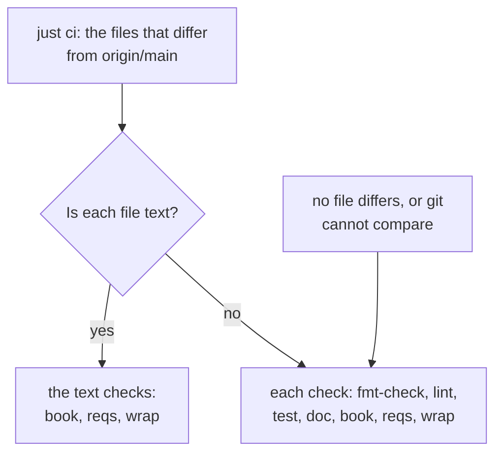

A file is text when it is in `docs/` or `design/`, or when it is a
`.md` file outside `crates/`. The files that differ are the commits of
your branch, the changes that are not committed, and the new files
that are not in git. The text checks build no test and run no clippy.

`just ci` uses the `origin/main` of your clone. To compare with the
newest `main`, fetch first:

```sh
git fetch origin
```

## Run each check

To run each check for each change, for example before a release:

```sh
just ci-full
```

It runs `fmt-check`, `lint`, `test`, `doc`, `book`, `reqs` and `wrap`.
The Gate on GitHub runs the same command. Tests read the pages of the
book. So a change of only text that passes `just ci` can still fail a
test in the Gate.

## Build riff from your clone

Do [Start a Riff](start-a-riff.md), with one change: in step 1, build
from your clone. Then the binaries have your changes:

```sh
just install
```

`riff tail` shows the messages of the thread of your repository.

## Add a requirement

Each requirement in `docs/src/requirements.md` has an ID. A new
requirement gets a new ID from this command:

```sh
just rid
```

It prints a new ID of 26 digits and capital letters. Write the new
requirement as `- **ID** text`, with that ID. Cite it by the same ID in
code, tests and commits. Two people who add requirements at the same
time never get the same ID. So nobody has to agree on a number first.

The old IDs `R1` to `R232` stay. Never give a new requirement the next
`R` number, and never renumber a requirement.

`just ci` checks the IDs. To run only this check:

```sh
just reqs
```

It fails when two requirements have the same ID, or when a file cites an
ID that no requirement has. It warns when a new ID does not have that
form, for example the next `R` number.

## Check the book

`just ci` builds the book and checks it. To run only this step:

```sh
just book
```

It fails on a missing include file, a missing anchor, or an empty code
block. Each error names its rule and the page:

| Rule | Finds |
|---|---|
| `mdbook` | An `ERROR` line of mdbook, for example a missing file. |
| `include` | An include line that mdbook left in the text. |
| `empty-code` | A code block with no text, for example a missing anchor. |
| `tracked` | A file in git that the build changed. |

To show an include line as an example, put it in a code block and
escape it: `\{{#include file.rs:name}}`. The check skips it.

The theme of the book, `docs/gruvbox`, is not in git. `just book`
installs it when it is missing. The install does not change
`docs/book.toml`. To install the theme again, remove it and build:

```sh
rm -r docs/gruvbox
just book
```

The build must not change a file in git. When `just book` reports the
rule `tracked`, see what changed, and find the step that writes the
file:

```sh
git diff
```

## Check the wrap of the book

Each prose line of a page in `docs/src` is at most 72 characters.
`just ci` checks it. To run only this check:

```sh
just wrap
```

Each error has the rule `wrap`. It names the page, the line and its
length. The check skips a code block, a row of a table and a heading.
It also skips a line with only one link or one code span: a wrap
cannot make that line shorter.

## Check a pull request on GitHub

Each pull request has the same form. The form links the pull request to
its issue and to its wave. A squash merge copies it into the commit on
`main`. This is the body of a pull request for issue 77:

```text
Closes #77

Pause and resume the riff. A new riff starts paused.

Issue: #77
Milestone: Wave 3
```

- The first line links the issue. Use `Closes #N` in the last pull
  request of the issue. Use `Refs #N` in each other one, and when a
  check after the release is left.
- The last lines are trailers: the issue, and its milestone.
- Give the pull request the milestone of its issue. Do not end the
  title with `(#N)`. GitHub adds the number of the pull request.

`riff pr open` writes this body and opens the pull request (see
[Open a pull request](how-it-works.md#open-a-pull-request)).

The job `Hygiene` checks each pull request. To check one yourself, give
its number:

```sh
just hygiene pr 90
```

To check the message of a commit:

```sh
just hygiene commit HEAD
```

Each error names its rule. The
[API docs of hygiene](api/hygiene/index.html) list the rules.

GitHub runs no check on a pull request that has a conflict with
`main`. When `Hygiene` does not run, rebase your branch on `main` and
push it again.
## Merge by pull request on GitHub

No session and no person pushes to `main`. Each change goes in by a
pull request. GitHub merges it with a squash when the checks `Gate`,
`Hygiene` and `riff/verify` pass. The ruleset on `main` makes this so.
It has no bypass, also not for an admin.

The project settings of Claude Code (`.claude/settings.json`) also
deny a push to `main` and `gh pr merge --admin` in each session.

Each session uses your GitHub account. So the author of a pull request
can set `riff/verify` on its own commit. The skill forbids it, but
nothing stops it until the sessions have their own GitHub identity
(#97).

### Set up the repository

Run it once, and again after a change to `deploy/github.sh`. It is
safe to run again:

```sh
just github
```

It turns on auto-merge and squash merge only, and makes or updates two
rulesets: `main`, and `releases` on the tags `v*`. With `releases`,
only the repository admin role can create, move or delete a release
tag. To see the result:

```sh
gh api repos/como-technologies/riff --jq '{allow_auto_merge, allow_squash_merge, allow_merge_commit, allow_rebase_merge, squash_merge_commit_title, squash_merge_commit_message, delete_branch_on_merge}'
gh api repos/como-technologies/riff/rulesets
```

### Push an urgent fix to main

Do this in your own terminal, never in a session. Turn the ruleset
off, push, and turn it on again at once:

```sh
ID=$(gh api repos/como-technologies/riff/rulesets --jq '.[] | select(.name == "main") | .id')
gh api -X PUT repos/como-technologies/riff/rulesets/$ID -f enforcement=disabled
git push origin main
just github
```

`just github` sets the ruleset `main` again, with `enforcement`
active.

### Turn on auto-merge

`riff pr open` turns on auto-merge at once, before any other push. Do
not run `gh pr merge` after a push. The pull request keeps auto-merge
on. It waits for `riff/verify`: see
[Wait for the merge](how-it-works.md#wait-for-the-merge) and
[Report a verify](how-it-works.md#report-a-verify). A new commit on
the pull request has no status. It needs a new verify.

## See the tokens of an issue

riff counts the tokens that each claim takes, and the models that did
the work. Run the commands in your clone. They need `gh`.

The tokens of one issue: the total, then each work claim and each
verify claim, with its models:

```sh
riff usage 12
```

Each issue of a wave with its total, and the sum:

```sh
riff usage --wave "Wave 3"
```

Each session of this machine, with the tokens of each item. The line
`no issue` has the tokens outside each claim, for example of the lead:

```sh
riff usage
```

Each line shows the four kinds of tokens: input, output, cache write
and cache read. A cache read costs much less than an output token.

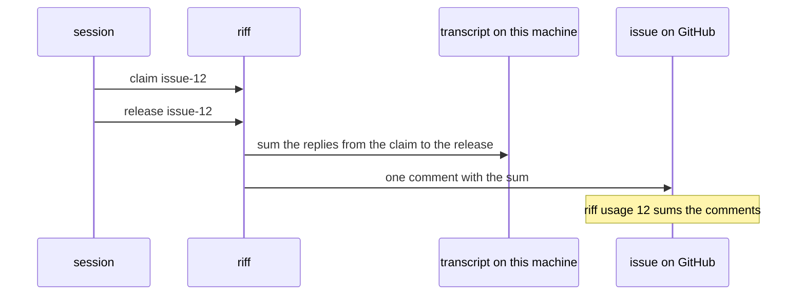

- riff reads the transcripts of the agent tool on the machine of the
  session. A claim counts from its `claim` to its `release`. A new
  start or the end of the session also ends it.
- `issue-12` and `verify-issue-12` are claims of the issue 12. riff
  puts one comment on the issue for each claim.
- The numbers are public on the issue. The comment holds the item, the
  kind of the claim, the first characters of the session ID, the
  times, the models and the tokens. It holds no text of a transcript,
  no path and no email.
- Each person who can write a comment can write one with numbers. So
  `riff usage 12` names who wrote each comment that it sums. It takes
  only numbers and names from a comment, and a comment of another
  person never replaces your numbers.
- Tokens in a time with two claims of one session count for the claim
  that started last.
- With no `gh`, or for an item that names no issue, the release still
  works. The tokens stay on the machine, and `riff usage` shows them.
- After the merge, `riff pr wait` adds one comment with the total of
  the issue. A later release of a claim of the issue writes that
  comment again.

## Sign in on this machine

Sign-in uses the OAuth client of the Google Cloud project `como-riff`.
The client exists. To make it again, see
[Make the OAuth client](#make-the-oauth-client).

1. Do [Start a Riff](start-a-riff.md) first.

2. Install the [gcloud CLI](https://cloud.google.com/sdk/docs/install).
   Sign in with a Como account that can read the client secret in
   `como-riff`:

   ```sh
   gcloud auth login
   ```

3. Put the OAuth client in `.env` at the root of your clone. The
   client ID comes from `deploy/cloud.env`, the client secret from
   Secret Manager. Git ignores `.env`:

   ```sh
   . deploy/cloud.env
   secret=$(gcloud secrets versions access latest --secret "$CLOUD_SECRET" --project "$CLOUD_PROJECT")
   printf 'RIFF_OIDC_CLIENT_ID=%s\nRIFF_OIDC_CLIENT_SECRET=%s\n' "$RIFF_OIDC_CLIENT_ID" "$secret" > .env
   chmod 600 .env
   ```

4. Stop the `riff-server` of [Start a Riff](start-a-riff.md) with
   Ctrl-C. Start it again with the settings of `.env`. See
   [Run the server in a terminal](#run-the-server-in-a-terminal):

   ```sh
   set -a; . ./.env; set +a
   riff-server
   ```

   The server log in the terminal must show `sign-in with
   https://accounts.google.com` and `the provider knows the OAuth
   client`. If it shows `nobody can sign in`, the server has no client:
   do step 3 again. If it shows
   `riff-server stops`, Google refused the client. The line says why.

5. Sign in. Your browser opens. Pick your Como account:

   ```sh
   riff login
   ```

6. Start your Claude Code sessions again. A session that started
   before `riff login` has no token.

The user part of your URI is now the part of your email before the
`@`, in lower case. Each character that a URI part cannot hold becomes
`-`: `O'Brien@comotechnologies.io` gets the user `o-brien`. Your user
belongs to your email: no other account can sign in as it.

### Sign out

Remove the sign-in from this device:

```sh
riff logout
```

End each of your sign-ins, on each device:

```sh
riff logout --all
```

### When another account holds your user

Two emails can give the same user, for example `o'brien@` and
`o-brien@`. The first account that signs in holds the user. `riff
login` then stops for the second account:

```sh
riff login
```

```text
riff-server refused the token request: access_denied: the user o-brien
belongs to another account; ask an admin
```

Ask an admin which account holds the user. An admin can end the
sign-ins of that account (`riff logout --all --user USER`), but the
user still belongs to its email. To sign in, use an email that gives
another user.

### When riff cannot read the keyring

`riff` keeps your sign-in in the OS keyring. When it cannot read the
keyring, each command stops with `riff cannot find your user`. The
next lines say why. Unlock the keyring and run the command again. On
Linux, a Secret Service must run, for example GNOME Keyring.

On a machine with no keyring, name your user yourself:

```sh
export RIFF_USER=USER
```

`riff` then sends no token. A server with `--require-sign-in` refuses
it.

### When riff says the riff has no sign-in

A riff can start again with no sign-in, for example after
[Start a Riff](start-a-riff.md). Then each command stops with
`riff-server at URL has no sign-in, but this machine has an old sign-in
for it`. Remove the old sign-in:

```sh
riff logout
```

Then start your Claude Code sessions again. Your user is now the name
that you log in with on your machine.

### When riff says a session is known as another user

The server keeps one user for each session. A call with the same
session ID and another user fails with `session ID is known as user
USER`. That happens when the session started before `riff login`. Start
the Claude Code session again, as a new session.

### Allow another domain

The accounts of `comotechnologies.io` can sign in, and the owner and
the members (see [Owner and members](#owner-and-members)). To allow
another Workspace domain, add `--allowed-domain DOMAIN` to
`riff-server`.
Give `--allowed-domain` once for each domain, the default domain too.
Two domains do not share a user: `alice@a.com` and `alice@b.com` both
give `alice`, and only the first account gets it.

### Name an admin

An admin can end each sign-in of another person, and invite and
remove members. The owner is an admin. Name each other admin by
verified email, once for each admin:

```sh
riff-server --admin alice@comotechnologies.io
```

A name that is not an email names nobody: the log says so at start.
Then an admin runs:

```sh
riff logout --all --user USER
```

### Tokens

With an OAuth client, the server refuses each call without a token.
`riff` sends a token on each call when you are signed in. A command that
you type acts as you. Each Claude Code session gets its own token, which
acts only as that session.

Each token works only with the device key of this machine. `riff`
keeps the key in the OS keyring. Use the same server URL for `riff`
(`RIFF_SERVER`) as the server has for itself (`--public-url`, by
default `http://` and the listen address). Else the server refuses
each proof.

### Use another sign-in provider

The default provider is Google. For another OpenID Connect provider,
give its issuer and the OAuth client of riff there. Give
`--client-secret` only when the provider asks for one:

```sh
riff-server --issuer https://login.example.com --client-id ID --client-secret SECRET
```

Without `--client-id`, the server has no sign-in.

## Owner and members

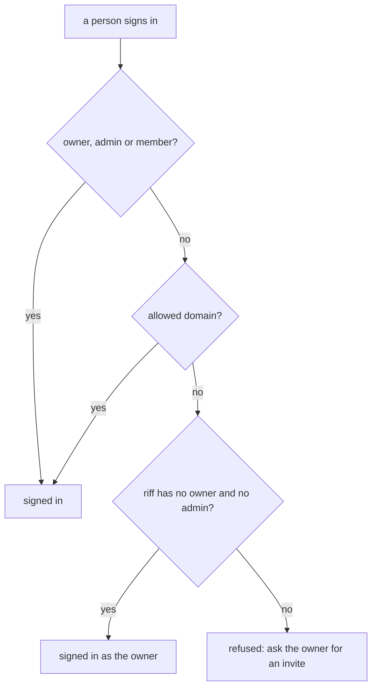

The first person who signs in to a riff is its owner. The owner is an
admin. On a riff with `--admin`, only an admin becomes the owner.

A riff with sign-in listens only on a loopback address until it has an
owner. So the first person signs in on the machine of the server. A
server with no bucket forgets its owner when it starts again. To let
it listen on your network, name the owner in the settings.

### Become the owner

On the machine of the server, after you start the server with sign-in,
sign in first:

```sh
riff login
```

### Name the owner when you set up the server

A server that must listen on the network at once needs an owner. Name
it by verified email:

```sh
riff-server --owner alice@example.com --listen 0.0.0.0:7878
```

A riff that has an owner keeps it. `--owner` does not change it.

### Invite a person

A member needs no allowed domain, so a person with a personal Google
account can join. Only the owner or an admin can invite:

```sh
riff invite bob@gmail.com
```

It prints the address of the riff (the `--public-url` of the server)
and the lines that the person runs to join. Send them to the person.
Before the invite,
`riff login` stops with `bob@gmail.com is not a member of this riff`.

### Remove a person

It removes the member and ends each sign-in of that person, on each
device. Only the owner or an admin can remove. The owner stays:

```sh
riff remove bob@gmail.com
```

A person of an allowed domain can still sign in after a removal. To
remove an admin, first make the admin a member again.

### Make a person an admin

An admin can invite and remove members. Only the owner can make an
admin. The person is also a member:

```sh
riff admin add bob@gmail.com
```

### Make an admin a member again

The person stays a member, but can no longer invite or remove. Only
the owner can do this. The owner stays an admin:

```sh
riff admin remove bob@gmail.com
```

### Pass the owner role

A riff has one owner. The owner can pass the role to a member or an
admin. You stay an admin. Only the owner can do this:

```sh
riff owner bob@gmail.com
```

The new owner stays after a restart. The `--owner` setting of
`riff-server` names the owner only of a new riff. An admin can also
ask for the role: see
[Take the owner role](start-a-team-riff.md#take-the-owner-role).

### See the members

It shows the owner, the admins, the members and the allowed domains.
It shows each person once, with the highest role: owner, then admin,
then member:

```sh
riff members
```

```text
owner            mike@example.com
admins           ada@example.com
members          bob@gmail.com
allowed domains  example.com
```

A riff with no owner shows the owner `none`. Its last line, in
yellow, says how an admin takes the owner role.

## Run the server in a terminal

`riff-server` runs in the foreground, in a terminal. Its log goes to
that terminal. It keeps no settings: at each start, it reads them from
its options and from the environment. `riff-server --help` lists each
option and its `RIFF_*` variable. To run it with sign-in, give it your
OAuth client in the environment:

```sh
export RIFF_OIDC_CLIENT_ID=ID RIFF_OIDC_CLIENT_SECRET=SECRET
riff-server
```

Stop it with Ctrl-C. With a bucket, it saves the state first.

`riff-server` has one command, `riff-server log`. It runs no server:
see [The tools of the log](#the-tools-of-the-log).

- With no OAuth client, an address that is not loopback needs
  `--insecure`. Else the server does not start.
- With sign-in, an address that is not loopback needs an owner:
  `--owner EMAIL`, or a bucket that holds one.

### Read the log of the server

Each line of the log is one JSON object, so that Cloud Logging can
filter it. The field `severity` is `DEBUG`, `INFO`, `WARNING` or
`ERROR`. The field `message` has the text. To read the log as text in
your terminal, use `jq`:

```sh
riff-server | jq -r '"\(.time) \(.severity) \(.message)"'
```

An error in the options comes before the log starts. It is plain text
on stderr.

### Keep the settings in .env

Put the settings in `.env` at the root of your clone, one `NAME=VALUE`
on each line. Git ignores `.env`. Load it into the shell, then start
the server:

```sh
set -a; . ./.env; set +a
riff-server
```

### A riff on your network with no sign-in

A riff with no OAuth client listens only on a loopback address. On a
network that you trust, `--insecure` lets it listen on your network
with no sign-in:

```sh
riff-server --listen 0.0.0.0:7878 --insecure
```

Then each machine that can reach the riff can read and send its
messages with any name, also as your lead. Each message counts as
verified. It warns at start. See
[A riff with no sign-in](how-it-works.md#a-riff-with-no-sign-in). A
riff with sign-in is safer: see
[Run the server in a terminal](#run-the-server-in-a-terminal).

### Update the local server

Build the new binaries. Stop `riff-server` with Ctrl-C and start it
again with your settings. Then update the plugin:

```sh
just install
riff-server
riff connect claude
```

### Test a change without the shared riff

We build riff with riff. So each machine has two tracks:

- The installed `riff`, `riff-server` and plugin are a release. Only
  `riff update` changes them. Your sessions riff with them.
- The code under test runs from its worktree, against a `riff-server`
  of the same worktree. It never talks to the shared riff.

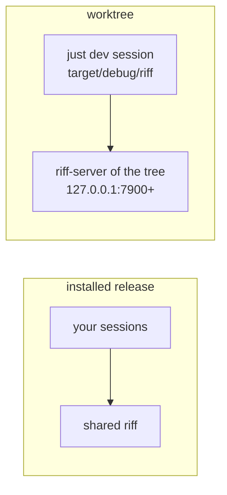

Run `just dev` in the worktree:

```sh
just dev
```

It builds the workspace, and runs the debug `riff-server` of the tree
on the first free port from 7900. Its log goes to
`target/dev-server.log`. Then it starts Claude Code with the plugin of
the tree and the debug `riff` of the tree. The installed plugin is off
in that session only. `just dev` sets `RIFF_ON=1`, so riff is on in the
session with no `riff enable`. When you end Claude Code, `just dev`
stops the server. It changes nothing that is installed.

- Options after `dev` go to `riff-server`. Do not give `--listen`.
- In the dev session, `riff server` names the server of the tree and
  the build of the tree.
- After a rebuild, end Claude Code and run `just dev` again.

A test run and a dev session never touch the riff of your machine:
its sign-in, keyring, settings or local files. `just dev` sets
`RIFF_HOME` to `target/dev-home` of the tree. With `RIFF_HOME`, `riff`
keeps its settings, local files and secrets in that dir, and never
opens the OS keyring. `just test` and `just ci` set `RIFF_SERVER` to
`http://127.0.0.1:9`, where nothing listens, so a test reaches neither
the shared riff nor the riff of your machine. Each test runs `riff`
and `riff-server` through the helper crate `isolated`: a temp home of
its own for each test, and the same `RIFF_SERVER` unless the test
names its own server. A test fails a test file that runs a binary of
riff without the helper.

Use a dev session for a live check of new code, for example a new
plugin command, hook or skill text. It needs no release and no update
of the machine. A worker never runs `riff update`, `cargo install` of
riff, `just install` or `riff connect` in a worktree.

A criterion that only the shared riff can test is a check after the
release. Its item stays open until the release of the wave. See
[Waves](waves.md).

### Test a debug build with sign-in

`just dev` loads `.env` at the root of its tree, when the file exists.
So a debug server gets the OAuth client of `.env` (see
[Keep the settings in .env](#keep-the-settings-in-env)), and requires
sign-in. Only `just dev` loads `.env`: `just ci` does not.

```sh
printf 'RIFF_OIDC_CLIENT_ID=%s\nRIFF_OIDC_CLIENT_SECRET=%s\n' ID SECRET > .env
just dev
```

In the dev session, sign in to the server of the tree:

```sh
! riff login
```

## Save the state in a bucket

Without a bucket or a directory, `riff-server` keeps its log only in
memory. A restart loses all threads, claims and members. With
`--bucket` (`RIFF_BUCKET`), the server writes each change to the log in
a Cloud Storage bucket. At start, it loads the newest checkpoint and
replays the log after it:

```sh
riff-server --bucket como-riff-state
```

The server gets its access token from the metadata server of Cloud
Run. So the server works with a bucket only on Cloud Run. The service
account of the server must have write access to the bucket.
[The tools of the log](#the-tools-of-the-log) also work with a bucket
from your machine.

With a bucket, the server loads the checkpoint and replays the log at
start. Then it takes the lease, waits 15 seconds, and opens its port.
Only one server serves from a bucket. When a new server takes the
lease, the old one replies 503 and exits after 60 seconds. A server
that cannot load takes no lease, and the old one serves on. See
[how it works](how-it-works.md#wait-while-the-server-starts).

### Start again with an empty state

`riff-server` migrates only the saved state of release 0.8.0 (see
[Go live with release 1.0.0](#go-live-with-release-100)). When it
cannot read an object of the bucket, it stops at start, before it takes
the lease. An old instance that still runs serves on. With no old
instance, Cloud Run starts the server again and again, and each call
gets 503. The log shows
`riff-server stops: cannot read the saved object`, with the name of the
object and the reason (see [See the shared log](#see-the-shared-log)).

Remove the old state, and start again with an empty bucket. Stop the
shared server first, so that no server saves the old state again:

```sh
just cloud down
gcloud storage rm 'gs://como-riff-state/**'
just cloud up
```

The new state has no threads, sessions, claims or members. The deploy
names the owner again. Each person signs in again with `riff login`,
and the owner invites each member again.

## Keep the state in a directory

For local work, `--dir` (`RIFF_DIR`) keeps the log, the checkpoints,
the sign-ins (`signins.json`) and the lease as files in a directory. It
works as a bucket: the server loads the checkpoint and replays the
log, then waits 15 seconds for the lease, and then opens its port:

```sh
riff-server --dir ~/.local/state/riff-server
```

The log is in `log/` of the directory, one file for each chunk. The
checkpoints are in `checkpoint/`. To start again with an empty state,
stop the server and remove the directory.

With `--dir`, the port of the server is closed for the first 15
seconds. Wait for the line `riff-server listens on` in the log before
you run the first `riff` command. A `riff` that runs already, for
example `riff watch`, waits through a restart by itself.

## The tools of the log

`riff-server log` reads and repairs the log of a riff. It runs no
server. Name the store with `--dir DIR` or `--bucket BUCKET`, before or
after the command.

### Print the log

`riff-server log` prints each record as one line of text: the
position, the time, the kind of the change, its facts and its cause.
The cause is the kind of the command and its caller.

```sh
riff-server log --dir ~/.local/state/riff-server
```

```text
1  2026-09-30T12:00:00Z  pause_set  the riff  paused  (make_riff, the server)
2  2026-09-30T12:00:01Z  joined_thread  acme/app by riff://ann@heron/acme/app?session=s1  (register, the session ann/s1)
3  2026-09-30T12:00:02Z  pause_set  the riff  running  (resume, the session ann/s1)
4  2026-09-30T12:00:05Z  claimed  issue-7 in acme/app by riff://ann@heron/acme/app?session=s1  (claim, the session ann/s1)
5  2026-09-30T12:00:09Z  posted  acme/app #1 note from riff://ann@heron/acme/app?session=s1, woke 0: "started: issue-7"  (post, the session ann/s1)
```

A record from before release 1.0.0 has no cause. Its line ends with
`(cause not known)`.

To print only the records from a position, add `--from`:

```sh
riff-server log --from 1200 --dir ~/.local/state/riff-server
```

### Find who did what

Each change of the riff is a record of the log, and each record names
its cause. So the log shows who made each change. To find each change
of one item, or each change of one session:

```sh
riff-server log --dir ~/.local/state/riff-server | grep issue-7
riff-server log --dir ~/.local/state/riff-server | grep 'the session ann/s1)'
```

### Find who changed the people

The people of the riff are records of the log too: who joined, who is
a member, an admin or the owner, and each request for the owner role.
To find each change of one person, or each change that one person
made:

```sh
riff-server log --dir ~/.local/state/riff-server | grep bob@gmail.com
riff-server log --dir ~/.local/state/riff-server | grep 'the person ada)'
```

```text
12  2026-10-01T12:00:00Z  person_joined  ada@gmail.com as ada  (admit, the sign-in ada@gmail.com)
13  2026-10-01T12:00:00Z  owner_set  ada@gmail.com  (admit, the sign-in ada@gmail.com)
14  2026-10-01T12:01:00Z  member_invited  bob@gmail.com  (invite, the person ada)
21  2026-10-01T12:09:00Z  member_removed  bob@gmail.com  (remove, the person ada)
```

| Record | Meaning |
|---|---|
| `riff_made` | The riff has its ID. |
| `person_joined` | An email signed in for the first time. It holds its USER. |
| `member_invited`, `member_removed` | An email is a member, or it is not. A removal ends each sign-in of the person. |
| `admin_set` | An email is an admin, or a member again. |
| `owner_set` | An email is the owner. With no email, the owner is gone. |
| `owner_asked`, `owner_denied` | An admin asks for the owner role, or the owner keeps it. |
| `signins_ended` | Each sign-in of a person ended: `riff logout --all`. |

An email is in a record, and in the answer to a member. It is in no
line of the log of the server: the line of a refused change of the
people has its `code` and no `reason`.

A command that changed nothing has no record. `riff-server` writes one
line to its own log for it, with the field `result`:

| `result` | Meaning |
|---|---|
| `refused` | The server refused the command. The line has the `code` and the `reason`. A change of the people has no `reason`. |
| `no_change` | The server took the command, and nothing changed. |
| `failed` | The server did not write the change, and stopped. The severity is `ERROR` when the write failed. It is `WARNING`, with the `reason`, when the server stopped first. |
| `denied` | The server refused the token of the call, or the call had none. The line has the `path` of the call. |
| `dropped` | The server refused more calls than it writes `denied` lines for. The line has the `count` of the lines that it did not write. |

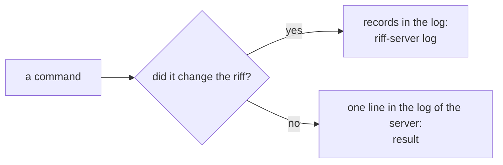

To find these lines, keep the log of the server in a file, and filter
it with `jq`:

```sh
riff-server | tee -a server.log
jq -c 'select(.result == "refused")' server.log
jq -c 'select(.result == "denied")' server.log
```

```text
{"severity":"INFO","time":"2026-10-01T12:00:00.000Z","message":"refused","target":"engine","caller":{"session":"bob/b1"},"command":"claim","result":"refused","code":"held","reason":"ann@heron:app (s1) holds issue-7 in acme/app."}
{"severity":"INFO","time":"2026-10-01T12:00:03.000Z","message":"denied","target":"engine","named":{"session":"bob/b1"},"proved":false,"path":"/v1/claim","result":"denied","code":"bad_token"}
```

- `caller` is the caller that the token proved. `key` is the
  thumbprint of the device key of that token. It is not a secret.
- `named` is the caller that a refused call named. No token proved it.
- No line holds the body of a message, a token or an email.

For the shared server, filter the shared log:

```sh
just cloud log --log-filter 'jsonPayload.result="refused"'
```

The log keeps its records for about 30 days.

### Find how many refused calls have no line

The server writes at most 100 `denied` lines in 10 seconds. For each
10 seconds with more refused calls, it writes one `dropped` line. Its
`count` is the number of `denied` lines that it did not write:

```sh
jq -c 'select(.result == "dropped")' server.log
```

```text
{"severity":"WARNING","time":"2026-10-01T12:00:10.000Z","message":"dropped","target":"engine","count":900,"result":"dropped"}
```

For the shared server:

```sh
just cloud log --log-filter 'jsonPayload.result="dropped"'
```

### Check the log

`riff-server log verify` reads each checkpoint, and each chunk from the
oldest kept checkpoint. It names each object and each line that does
not read, and each gap in the positions. It exits with 1 when it finds
a problem.

```sh
riff-server log verify --dir ~/.local/state/riff-server
```

A good log gives one line:

```text
The log reads: 3 chunks, 1234 records from position 1 to 1234, 1 checkpoint.
```

A bad log gives one line for each problem, then the last good position
and the command that shows each record after it:

```text
/home/ann/.local/state/riff-server/log/00000000000000001201.jsonl line 3: EOF while parsing a value at line 1 column 30
1 problem in 3 chunks and 1 checkpoint. The last good record of the log is at position 1201.
To see each record after it, and the command that removes them, run: riff-server log cut --after 1201
```

### Cut the log

A cut loses each change after a position. It has two steps: a dry
run, then the cut.

#### See what a cut removes

`riff-server log cut --after POSITION` removes nothing. It prints each
record and each checkpoint that the cut removes, the threads of these
records, and the command that removes them.

```sh
riff-server log cut --after 1201 --dir ~/.local/state/riff-server
```

```text
1202  (a line that does not read: EOF while parsing a value at line 1 column 30)
1203  2026-09-30T12:00:05Z  claimed  issue-7 in acme/app by riff://ann@heron/acme/app?session=s1  (claim, the session ann/s1)
A cut removes 2 records and 0 checkpoints after position 1201. Threads: acme/app.
This run removed nothing. To remove them, stop the server and run: riff-server log cut --after 1201 --yes
```

#### Remove the records

Stop the server first. Then add `--yes`:

```sh
riff-server log cut --after 1201 --yes --dir ~/.local/state/riff-server
```

```text
1202  (a line that does not read: EOF while parsing a value at line 1 column 30)
1203  2026-09-30T12:00:05Z  claimed  issue-7 in acme/app by riff://ann@heron/acme/app?session=s1  (claim, the session ann/s1)
Removed 2 records and 0 checkpoints after position 1201. Threads: acme/app.
```

A cut also ends each sign-in that started after the new end of the
log. At its next start, the server drops these sign-ins, and each
sign-in of a person that the log does not know after the cut. Each
such person signs in again with `riff login`.

The command keeps only the good part of the log: its first records
that read and have the right positions, up to the position. It removes
each line after the first problem, also a line with a lower position,
and each later chunk. So a line that it prints never stays, and the
log reads after the cut. When the position of a removed line stays in
the log from an earlier chunk, the line says so.

The command refuses a position before the oldest kept checkpoint. The
chunks before that checkpoint are gone, so no start can replay them.

#### When the cut refuses: a server holds the lease

With `--yes`, the command refuses while a server holds the lease of
the store. The refusal names the instance of the server:

```text
riff-server: cannot cut: the server instance 5f0c…e1 holds the lease, and wrote it at 2026-09-30T12:00:05Z. Stop the server first. A lease ends when its server shuts down, or 90 seconds after its last write.
```

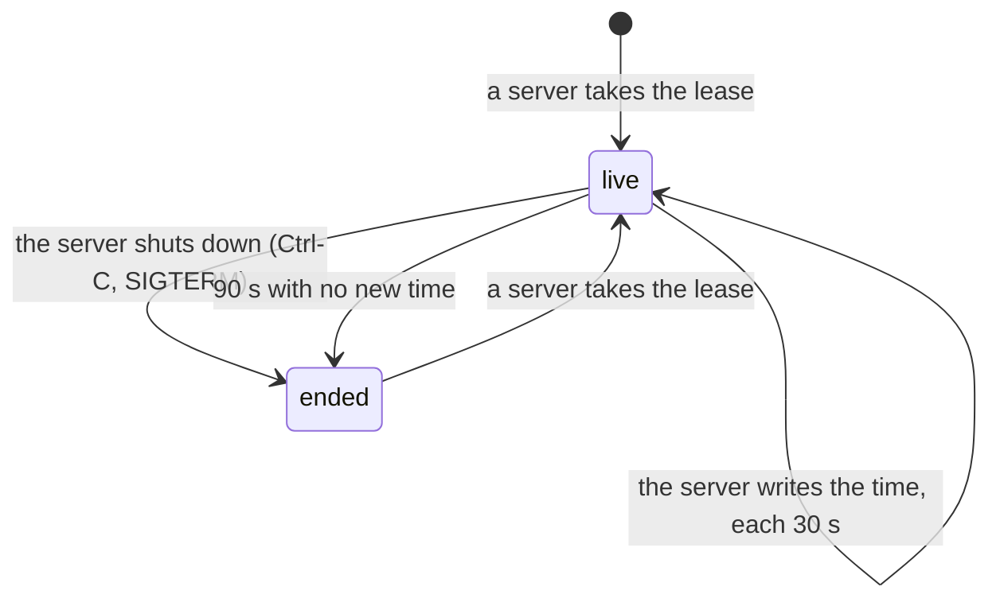

- After Ctrl-C or `just cloud down`, the lease ends at once. Run the
  command again.
- After a server that stopped with no shutdown, for example a crash,
  wait 90 seconds. Then run the command again. It waits 10 seconds
  more, before it reads the log.
- The server logs the ID of its instance at start: `took the lease
  as`.
- The command reads the time in the lease with the clock of your
  machine. Your clock can be at most 50 seconds ahead of the clock of
  the server. Check your clock before a cut on the bucket.
- A lease from riff-server 0.8.0 or older has no time, so it does not
  end. The refusal names the lease object. Stop the server, delete the
  object, and run the command again:

  ```sh
  gcloud storage rm gs://como-riff-state/lease
  ```

  A server that still runs stops when the object is gone.

On Cloud Run, the server needs CPU that is always on
(`--no-cpu-throttling`) and exactly one instance. Then it writes the
time also when it gets no call. `deploy/deploy.sh` sets both.

#### The cut takes the lease

With `--yes`, the command takes the lease for the time of the cut, with
an ID of its own that starts with `cut-`. It ends the lease after the
cut. A dry run does not write the lease.

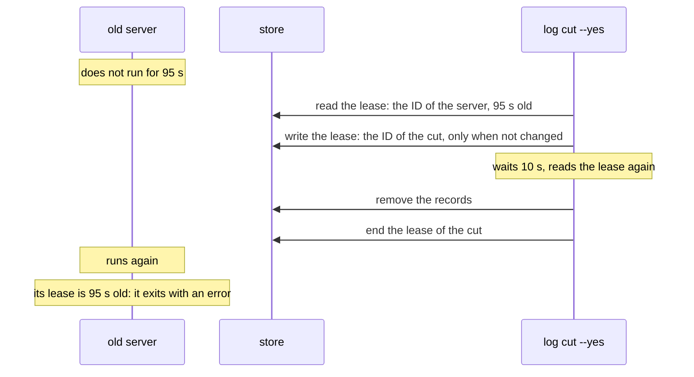

- A server that did not run for some time, for example a stopped
  process or a machine that slept, holds the removed records in its
  memory. It finds the ID of the cut in the lease, or it finds that its
  own lease is 90 seconds old. It then stops for good and serves no
  more. In the second case, `riff-server` exits with an error, so that
  Cloud Run starts a new instance, which loads the log from the store.
- When a server writes the lease at the same time as the cut, the cut
  refuses and removes nothing.
- Start no server during a cut. When a server took the lease during
  the cut, the command names it and exits with 1. Stop that server,
  then check the log again.

### Use the tools on the bucket

On your machine, a tool takes the access token of your Google sign-in.
Sign in once with gcloud. Your account must have access to the objects
of the bucket.

```sh
gcloud auth login
riff-server log verify --bucket como-riff-state
```

On Cloud Run, a tool takes the token of the metadata server, as the
server does.

`--bucket` and `--dir` do not go together, also from the environment.
When your shell sets `RIFF_DIR`, remove it for the command:

```sh
env -u RIFF_DIR riff-server log verify --bucket como-riff-state
```

### Go back to a position

When the server cannot load its log, or the log holds a bad change, cut
the log before the bad record.

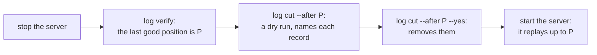

For a server on your machine, stop it with Ctrl-C. Then run:

```sh
riff-server log verify --dir ~/.local/state/riff-server
riff-server log cut --after POSITION --dir ~/.local/state/riff-server
riff-server log cut --after POSITION --yes --dir ~/.local/state/riff-server
riff-server --dir ~/.local/state/riff-server
```

For the shared server, stop the service first, so that no instance
writes the log. Check out the release that ran, so that
`just cloud up` deploys the same build:

```sh
just cloud down
riff-server log verify --bucket como-riff-state
riff-server log cut --after POSITION --bucket como-riff-state
riff-server log cut --after POSITION --yes --bucket como-riff-state
git checkout vX.Y.Z
just cloud up
```

The bucket keeps each older version of an object for 7 days. So you
can get back an object that a cut deleted:

```sh
gcloud storage ls --all-versions 'gs://como-riff-state/log/**'
gcloud storage cp 'gs://como-riff-state/log/NAME#GENERATION' gs://como-riff-state/log/NAME
```

## Set up the cloud project

Do this once, for the team. The project `como-riff` exists: use these
steps only to make it again.

The Google Cloud project `como-riff` holds each cloud resource of
riff. `deploy/cloud.env` holds its settings. The repository is public.
Put no email address, billing account ID or organization ID in it.

Install the [gcloud CLI](https://cloud.google.com/sdk/docs/install).
Sign in with your Como account:

```sh
gcloud auth login
```

Make the project once. The first command shows the ID of the
organization:

```sh
gcloud organizations list
gcloud projects create como-riff --organization ORGANIZATION_ID
```

Link a billing account to the project. The first command shows the
accounts that you can use:

```sh
gcloud billing accounts list
gcloud billing projects link como-riff --billing-account BILLING_ACCOUNT_ID
```

Then make the resources of riff in the project:

```sh
just cloud setup
```

The command checks each resource first, so you can run it again.
It makes the bucket `como-riff-state` and two service accounts.
`riff-server` runs as `riff-server`. That account can read and write
only the bucket, and read only the client secret. Cloud Build builds
the image as `riff-build`.
CI signs in as `riff-deploy`, from `main` and from the tags `v*` of the
repository only. When the identity provider exists, the command sets
this condition on it again.

The bucket is a standard bucket with object versioning: it keeps each
older version of an object. It has two lifecycle rules. One rule
deletes an older version after 7 days. The other rule deletes each
thread object 30 days after its last change.

The service gets 1 GiB of memory, because `riff-server` keeps the state
in memory. Each deploy sets it. When a service runs with another limit,
the setup sets it at once: Cloud Run then starts a new instance.

### See the lifecycle rules

```sh
gcloud storage buckets describe gs://como-riff-state --project como-riff \
  --format 'json(lifecycle_config,versioning_enabled)'
```

The output shows versioning on, and two `Delete` rules: one with `age`
30 and the prefix `threads/`, and one with `daysSinceNoncurrentTime` 7.

### Get an email for each error

The setup makes an alert in the cloud project. When a log line of
`riff-server` has the severity `ERROR` or more, Google Cloud sends an
email to the owner, at most one each 5 minutes. The repository is
public, so give your email in `RIFF_OWNER`:

```sh
RIFF_OWNER=YOUR_EMAIL just cloud setup
```

With no `RIFF_OWNER`, the setup makes no alert, and says so. The alert
has the name `riff-server-errors`. Its rule is in `deploy/alert.json`.
To send the email to another address, delete the channel `riff-owner`
in the console of Google Cloud, and run the setup again.

## Make your own OAuth client

riff has no built-in sign-in app, and no client ID or secret is in its
source or its binaries. Each person who runs a riff with sign-in makes
their own OAuth client, and gives it to `riff-server` in the
environment: `RIFF_OIDC_CLIENT_ID` and `RIFF_OIDC_CLIENT_SECRET`.

For a Google client, do steps 1 to 7 of
[Make the OAuth client](#make-the-oauth-client) in your own Google
Cloud project, with these changes:

- Audience: **Internal** for the accounts of your organization only.
  For a personal account, pick **External**, and add each person as a
  test user.
- Step 7: copy the client ID and the client secret to a safe place.
  Do not run `just cloud oauth-client`. Commit neither.

Then give both to `riff-server` in the environment:

```sh
export RIFF_OIDC_CLIENT_ID=ID RIFF_OIDC_CLIENT_SECRET=SECRET
riff-server
```

With an OAuth client, the riff requires sign-in. On an address that
is not loopback, a riff with no OAuth client does not start. Its error
names both settings.

## Make the OAuth client

Do this once, for the team. The client exists: use these steps only to
make it again.

riff signs in with one Google OAuth client. Google has no API to make
it, so you make it by hand, in the console. The console can use
slightly different words.

1. Open
   [Google Auth Platform](https://console.cloud.google.com/auth/overview?project=como-riff)
   and click **Get started**.
2. App information: the app name is `riff`. The support email is a
   group of the team, or your own address.
3. Audience: **Internal**. Then only accounts of the organization can
   sign in.
4. Contact information: the same address. Agree to the policy and
   click **Create**.
5. Data access: add nothing. riff asks only for `openid` and `email`.
6. Click **Clients**, then **Create client**. The application type is
   **Desktop app**. The name is `riff`. Click **Create**.
7. Keep the dialog open. It shows the secret only once. Do not
   download the JSON file. In a terminal, run:

   ```sh
   just cloud oauth-client
   ```

   It asks for the client ID and the client secret. It puts the secret
   in Secret Manager and the ID in `deploy/cloud.env`.
8. Commit `deploy/cloud.env`.

To see who changed the client, and when:

```sh
gcloud logging read 'protoPayload.serviceName="clientauthconfig.googleapis.com"' \
  --project como-riff --freshness 400d \
  --format 'table(timestamp, protoPayload.methodName, protoPayload.authenticationInfo.principalEmail)'
```

Google deletes a client that nobody uses for six months. It sends an
email 30 days before.

## Deploy

Do [Set up the cloud project](#set-up-the-cloud-project) and
[Make the OAuth client](#make-the-oauth-client) first.

CI deploys only a release. An admin pushes the release tag at the end
of a wave, and CI deploys it. The repository variable `CLOUD_DEPLOY`
must be `true`. A push to `main` does not deploy. A `riff` refuses a
server of another build (see [Builds](how-it-works.md#builds)), so a
deploy in the middle of a wave would stop each session. The job signs
in to Google Cloud from GitHub with no key. Only `main` and the tags
`v*` can sign in.

A release is a git tag `vX.Y.Z`. X.Y.Z is the version of the crates in
`Cargo.toml`. [Versions](how-it-works.md#versions) tells you the
level: a patch, a minor or a major. Only an admin of the repository
can push a release tag: the ruleset `releases` makes this so (see
[Set up the repository](#set-up-the-repository)). `riff update`
installs the release that the shared server runs, so the tag and the
deploy make a release current.

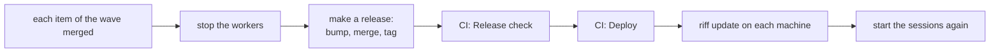

### Make a release

An admin makes the release when each item of the wave is merged. Stop
the workers first. Set the new version in `Cargo.toml` and in the
`plugin.json` of the plugin, and update `Cargo.lock`. Pick the level
with
[The test for each release](how-it-works.md#the-test-for-each-release).
When `main` already has the new version, keep it. This example makes
`v0.2.0`:

```sh
riff workers stop
git switch -c release-v0.2.0 origin/main
sed -i 's/^version = ".*"/version = "0.2.0"/' Cargo.toml
sed -i 's/"version": ".*"/"version": "0.2.0"/' crates/riff/claude-plugin/riff/.claude-plugin/plugin.json
cargo update --workspace
git commit -am "Release v0.2.0"
git push -u origin HEAD
```

Open a pull request for the branch. Its body states the level and the
reason in one line. Write the line in plain words that a person
understands (ASD-STE100), for example:

```text
Level: minor. Old and new sessions work together, but they act differently: a new session asks for a verify in a new way.
```

Give it the label `release`. The release notes leave out the pull
requests with this label:

```sh
gh pr create --title "Release v0.2.0" --label release --body-file pr.md
```

Get it verified and merged as each other change. Then tag the merge
commit, and push the tag:

```sh
git fetch origin
git tag v0.2.0 origin/main
git push origin v0.2.0
```

Write the start of the release notes in `notes.md`: the level line
of the pull request. It also lists the commands that each person
runs, for example `riff update --tag v0.2.0` when the old `riff`
cannot read the new server. Publish the release on the tag. GitHub
adds each pull request merged since the last release. The GitHub
releases are the changelog of riff:

```sh
gh release create v0.2.0 --verify-tag --title v0.2.0 --notes-file notes.md --generate-notes
```

When the last tag is not the release before this one, name the tag of
that release, for example `--notes-start-tag v0.1.0`.

CI runs the job `Release check` for the tag. It fails when the tag is
not the version of the crates. When it passes, the job `Deploy`
deploys the tag to the shared server. See
[Deploy the shared server at the end of a wave](#deploy-the-shared-server-at-the-end-of-a-wave).
Watch both jobs:

```sh
gh run list --workflow CI --event push --limit 1
gh run watch
```

### Deploy the shared server at the end of a wave

The release tag deploys itself. When you push the tag `vX.Y.Z` (see
[Make a release](#make-a-release)), the job `Release check` runs
first. Then the job `Deploy` checks out the tag, checks it, builds the
image and deploys it. A tag that is not `vX.Y.Z` does not deploy. One
deploy runs at a time.

Then update each machine: each person runs `riff update`, or has
`riff update --auto on` (see
[Update riff](start-a-riff.md#update-riff) and
[Update riff by itself](how-it-works.md#update-riff-by-itself)).
Start the sessions again. Start the workers again after the update with
`riff workers start`. Check that `riff` and the shared server run the
same release:

```sh
riff server
```

### Go live with release 1.0.0

Release 1.0.0 keeps the state in one log. Its first start on the
bucket of release 0.8.0 is the import: it reads the old objects
(`sessions`, `tokens`, `threads/`) one time, and writes their state to
the log. It needs no flag. See
[how it works](how-it-works.md#the-update-to-release-100-keeps-your-work).

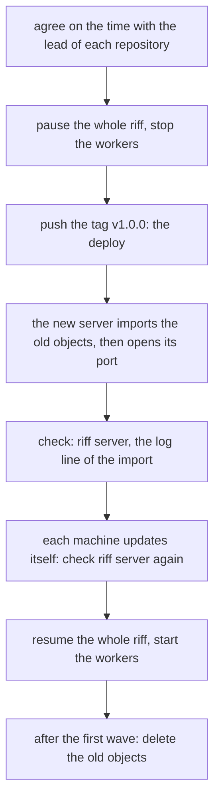

1. Agree on the time of the deploy with the lead of each other
   repository of the riff. Post the time in each repository thread.
2. Pause the whole riff. Each session pushes its work, and keeps its
   claims. Then stop the workers of your machine. Each machine still
   has riff 0.8.0: its `riff pause` pauses the whole riff, and it has
   no `--riff` flag:

   ```sh
   riff pause
   riff workers stop
   ```

   `riff workers` lists each other host with workers. Stop the workers
   of each one:

   ```sh
   riff workers stop --host HOST
   ```

3. Make the release (see [Make a release](#make-a-release)). The tag
   deploys it.
4. Check the import. The log of the server has one line for it, with
   the number of records and of sign-ins:

   ```sh
   riff server
   just cloud log --log-filter 'jsonPayload.message:"imported the objects"'
   ```

   riff 0.8.0 shows the release of the new server on its `release`
   line: `v1.0.0 … another build; this riff cannot talk to it`. Its
   last line is `Run riff update`. When an old object does not read,
   the new server does not start, and the old server serves on: the
   line shows `v0.8.0  same build ✓`. The log names the object.
5. Each machine updates itself. No person runs `riff login`. Then
   check the riff ID on each machine:

   ```sh
   riff who
   riff server
   ```

   `riff who` checks the riff ID of your sign-in against the riff ID
   of the server. Another riff ID removes the sign-in. So when
   `riff server` then shows `v1.0.0  same build ✓` on the `release`
   line and `yes, signed in as USER` on the `sign-in` line, the riff
   ID is the one of before.
6. The whole riff is paused after the import. The owner or an admin
   resumes it. riff then starts the workers by itself:

   ```sh
   riff resume --riff
   ```

   When the rollout is off (`riff workers interval` shows 0), start
   the workers with a count:

   ```sh
   riff workers start 2
   ```

The import changes no old object. Keep them until the first wave after
go-live ends. Then delete them:

```sh
gcloud storage rm gs://como-riff-state/sessions gs://como-riff-state/tokens 'gs://como-riff-state/threads/**'
```

To roll back before that, deploy release 0.8.0 again (see
[Deploy a release again, or roll back](#deploy-a-release-again-or-roll-back)).
The old server reads the old objects, so each change since go-live is
lost. Before the next go-live, delete the log, so that the new server
imports again:

```sh
gcloud storage rm 'gs://como-riff-state/log/**' 'gs://como-riff-state/checkpoint/**' gs://como-riff-state/signins.json
```

### Deploy a release again, or roll back

Run the CI workflow on `main` with the input `tag`. Use it to deploy a
release again, or to deploy an older release. The gate runs first.
The job refuses an input that is not a release tag:

```sh
gh workflow run CI --ref main -f tag=v0.2.0
```

See the deploys by hand, and watch the last one:

```sh
gh run list --workflow CI --event workflow_dispatch
gh run watch
```

`just cloud` alone lists its recipes.

### Name the owner of the cloud riff

The cloud riff listens on the network, so it needs an owner from its
first start. Each deploy passes the GitHub Actions variable
`RIFF_OWNER` as `--owner`. With no variable, the deploy stops. Set it
once, with your verified email:

```sh
gh variable set RIFF_OWNER --body alice@comotechnologies.io
```

For `just cloud up` and [Deploy by hand](#deploy-by-hand), export it in
your shell too:

```sh
export RIFF_OWNER=alice@comotechnologies.io
```

A riff that has an owner keeps it, so a new value names nobody new.

### Turn the shared server on

It sets `CLOUD_DEPLOY`, and deploys now. While the service runs, it
costs about 45 USD each month: one instance with 1 vCPU that is always
on (R29). Turn it off when nobody uses it. For the cost of each host,
see [#47](https://github.com/como-technologies/riff/issues/47).

```sh
just cloud up
```

### Turn the shared server off

It removes `CLOUD_DEPLOY`, and deletes the service. gcloud asks you
first. The state stays in the bucket. `just cloud up` makes the service
again, at the same URL.

```sh
just cloud down
```

### Deploy by hand

Cloud Build builds the image from `Dockerfile`. Cloud Run then runs one
instance of the service `riff-server`, with sign-in. It does not change
`CLOUD_DEPLOY`:

```sh
just cloud deploy
```

### Map the domain

For now, riff uses the Cloud Run URL of the service. Later, Cloud Run
serves riff at `riff.comotechnologies.io`. Do this once:

1. Google must know that you own the domain. In
   [Search Console](https://search.google.com/search-console), add a
   **Domain** property `comotechnologies.io`, and verify it.
2. At the DNS host of `comotechnologies.io`, add a CNAME record: name
   `riff`, value `ghs.googlehosted.com`.
3. In `deploy/cloud.env`, set
   `CLOUD_URL=https://riff.comotechnologies.io`.
4. Run `just cloud deploy`. It maps the domain to the service once.
   Google then makes the certificate. That can take some hours.

### Check the shared server

The first command shows if CI deploys, and the state of the service,
with its URL. The next ones point `riff` at the shared server for this
shell, and sign in. Put the URL in place of `URL`:

```sh
just cloud status
export RIFF_SERVER=URL
riff login
riff who
```

### See the shared log

```sh
just cloud log
just cloud log --limit 20
```

Each start shows `the provider knows the OAuth client`. When Google
refuses the client, the log shows `riff-server stops` and why.

### Find the errors in the shared log

Each log line has a severity. To see only the lines with the severity
`ERROR` or more:

```sh
just cloud errors
just cloud errors 20
```

`riff server` shows the last error of the instance that runs now. See
[the facts of the server](how-it-works.md#see-the-facts-of-the-server).

## Rehearse a release on the stage

The stage is a second `riff-server` on Cloud Run, in the project
`como-riff`. `deploy/stage.env` holds its settings. It has its own
service `riff-stage`, bucket, accounts, sign-in client and secret. It
holds no data of the shared riff, and no setting of the stage names a
resource of the shared riff. It has no domain, no alert and no CI
deploy.

Rehearse a release that moves the state of the shared riff, before its
tag. The rehearsal shows the hand-over on a real bucket: the release
before serves and saves, while the new build takes the lease, reads
the state and serves. Put the results on the issue of the release.

Only a person runs these steps: each step writes to the cloud or signs
in. A worker never runs `just cloud`.

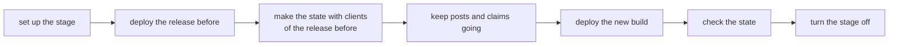

Each recipe of `just cloud` takes the name of the settings first. With
no name, a recipe uses `deploy/cloud.env`: the shared riff.

### Set up the stage

Do this once. Sign in to gcloud, and make the resources of the stage:

```sh
gcloud auth login
just cloud setup stage
```

Then make the sign-in client of the stage. Do steps 6 and 7 of
[Make the OAuth client](#make-the-oauth-client), with the name
`riff-stage`. In step 7, give the name of the settings:

```sh
just cloud oauth-client stage
```

It puts the secret in Secret Manager and the ID in
`deploy/stage.env`. Commit that file.

### Deploy a release on the stage

Give the release tag. The deploy uses the image that CI built for the
tag, so CI must have deployed that tag before. The stage needs an
owner, as the shared riff:

```sh
export RIFF_OWNER=YOUR_EMAIL
just cloud deploy stage v0.8.0
just cloud status stage
```

With no tag, Cloud Build builds the image from your tree:

```sh
just cloud deploy stage
```

A riff of a new bucket starts paused. Resume it after the first
deploy (see the next step).

### Make clients of the release before

Each client has a home of its own: its binaries, its settings, its
secrets and its Claude Code settings. So the rehearsal never changes
the `riff` of your machine. Make two homes, one for each person. Use
two accounts of the organization: `ann` is the owner (`RIFF_OWNER`),
and `bob` is the second account.

```sh
for who in ann bob; do
  cargo install --locked --git https://github.com/como-technologies/riff \
    --tag v0.8.0 --root ~/stage/$who riff
  git init -q ~/stage/$who/app
  git -C ~/stage/$who/app remote add origin https://github.com/acme/app
done
git init -q ~/stage/ann/web
git -C ~/stage/ann/web remote add origin https://github.com/acme/web
```

Open one terminal for each person. Put the person in place of `WHO`.
The update by itself installs into the home too:

```sh
export STAGE=~/stage/WHO
export PATH=$STAGE/bin:$PATH RIFF_HOME=$STAGE CARGO_INSTALL_ROOT=$STAGE
export CLAUDE_CONFIG_DIR=$STAGE/claude
export RIFF_SERVER=https://riff-stage-816917641970.us-central1.run.app
riff login
riff update --auto on
```

In the terminal of `ann`, invite `bob`, and resume the riff:

```sh
riff invite BOB_EMAIL
riff resume
```

### Make the state of a real riff

Each command runs as one session: `RIFF_SESSION` names it. Make a
lead, a worker with a claim, signed posts, a status request, unread
messages and a direct thread, in two repositories.

In the terminal of `ann`, in `~/stage/ann/app`:

```sh
cd ~/stage/ann/app
RIFF_SESSION=ann-lead riff lead
sleep infinity | RIFF_WORKER=1 RIFF_SESSION=ann-w1 riff mcp &
RIFF_SESSION=ann-w1 riff claim issue-1
RIFF_SESSION=ann-lead riff tell ann-w1 "request: claim issue-2"
RIFF_SESSION=ann-lead riff post --kind status --to user=ann
RIFF_SESSION=ann-lead riff post --to user=bob "a message that bob does not read"
cd ~/stage/ann/web
RIFF_SESSION=ann-web riff post "a post in a second repository"
```

In the terminal of `bob`, in `~/stage/bob/app`:

```sh
cd ~/stage/bob/app
RIFF_SESSION=bob-1 riff claim issue-3
RIFF_SESSION=bob-1 riff post --to user=ann,lead=true "a question for the lead of ann"
```

Keep a copy of the state before the deploy:

```sh
RIFF_SESSION=ann-lead riff who > ~/stage/who-before.txt
RIFF_SESSION=ann-lead riff read --all > ~/stage/read-before.txt
```

### Keep posts and claims going during the deploy

In the terminal of `bob`, post and claim each second. The loop keeps
each line of output:

```sh
for i in $(seq 1 300); do
  RIFF_SESSION=bob-1 riff post "hand-over $i" && echo "posted $i"
  RIFF_SESSION=bob-1 riff claim "hand-over-$i" && echo "claimed $i"
  sleep 1
done 2>&1 | tee ~/stage/hand-over.txt
```

In a third terminal, in your clone, deploy the new build from the
commit of the release:

```sh
git switch --detach COMMIT
just cloud deploy stage
just cloud log stage --limit 100
```

### Check the hand-over

In the terminal of each person, check:

- No `riff login` is necessary: each command works with no new
  sign-in.
- `riff who` shows the same sessions, leads, workers and claims as
  `who-before.txt`.
- `riff read --all` shows the same messages as `read-before.txt`, and
  each signed message is still verified.
- Each post and each claim with `posted` or `claimed` in
  `hand-over.txt` is in the riff.
- `riff whoami` shows that the riff is paused.
- Each client updated itself: `riff server` shows the same build for
  `riff` and the riff. The output of the update is in `update.log` of
  the home. Before the tag, no release of the new build exists, so the
  update by itself can fail: `update.log` then says why. Write it in
  the results, and install the build of the commit in each home with
  `cargo install --locked --path crates/riff --root $STAGE`.
- `riff resume` lets the work go on: a new claim and a new post work.

```sh
RIFF_SESSION=ann-lead riff who
RIFF_SESSION=ann-lead riff read --all
RIFF_SESSION=ann-lead riff whoami
riff server
riff resume
RIFF_SESSION=ann-lead riff post "the work goes on"
```

Put the results on the issue of the release.

### Turn the stage off

It deletes the service. The state stays in the bucket. To rehearse
again from an empty state, remove the state too:

```sh
just cloud down stage
gcloud storage rm 'gs://como-riff-stage-state/**'
```
