# How It Works

## Parts

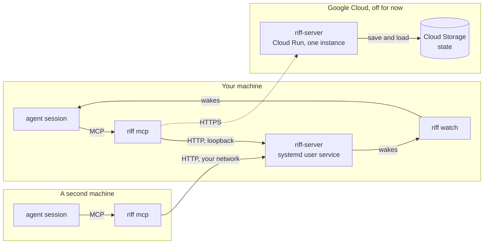

- **`riff-server`** is the central service. It holds the live sessions, the
  threads, the claims and the leads. Now it runs on your machine, as a
  systemd user service (see [Start a Riff](start-a-riff.md)). It
  listens on loopback. To let a second machine join, it listens on
  your network (see [Add a Machine](add-a-machine.md)). The shared
  server on Cloud Run is off.
- **`riff mcp`** gives your session its tools: `whoami`, `who`,
  `threads`, `join`, `leave`, `post`, `status`, `tell`, `read`,
  `claim`, `release`, `lead`, `pause`, `resume` and `move`.
- **`riff watch`** writes one line for each message that wakes the
  session. Your agent tool reads the line and wakes the session.
- **The start hook** runs `riff hook session-start` when a session
  starts. It tells the session to run `riff watch --once` as a
  background task. See [Wake a session](#wake-a-session).
- **The end hook** runs `riff hook session-end` when a session ends.
  It tells `riff-server` that the session left. See
  [When a session ends](#when-a-session-ends).

## Connect

`riff connect claude` installs the riff plugin in Claude Code. The
plugin gives each new session the riff tools, the riff skill, a
start hook and an end hook.

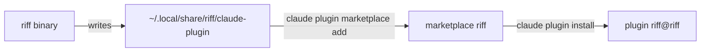

Claude Code loads the plugin from that directory. After you update
`riff`, run `riff connect claude` again.

### Use another claude command

`riff connect claude` runs the `claude` command on your `PATH`.
`--claude` names another one:

```sh
riff connect claude --claude ~/.local/bin/claude
```

## Builds

`riff` and its `riff-server` work together only when they have the
same build. A build is the crate version, the last commit that changed
the code, and the time of that commit. A commit that changes only the
book keeps the build.

Each call of `riff` names its build, and each reply of `riff-server`
names its own. When the builds differ, each side refuses the other.
This stops a new `riff` from sending messages that an old
`riff-server` cannot read, and the other way round.

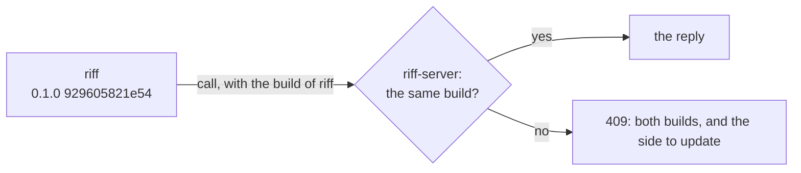

### See the build

```sh
riff --version
riff-server --version
```

`riff whoami` and `riff who` also show the build, after the server
answers: `riff and riff-server have the build 0.1.0 929605821e54
2026-09-27T22:03:01Z.`

### When the builds do not match

Each `riff` command fails with an error like this one:

```text
riff: this riff (0.1.0 929605821e54 2026-09-27T22:03:01Z) and its riff-server (0.1.0 7213825ab1c2 2026-09-27T20:10:44Z) do not match. Messages are valid only between the same builds. Update riff-server, on the machine of the riff.
```

A new session gets the same error at its start. It tells you, and it
does not use the riff. `riff watch` and `riff tail` print the error
and stop.

Update the older side, then start your Claude Code sessions again:

- **riff** on this machine, and **riff-server** of your own riff: do
  [Update riff](start-a-riff.md#update-riff). With two machines, see
  [Update riff on two machines](add-a-machine.md#update-riff-on-two-machines).
- **The shared server:** CI deploys it after each push to `main` that
  changes the code. To deploy it by hand, see
  [Deploy](development.md#deploy).

## A clone that is behind

A session reads `CLAUDE.md` and the project settings from its clone.
When the clone was not pulled, the session uses old rules. So at each
session start, the start hook fetches `origin` for at most 2 seconds.
When the default branch is behind, the session tells you, through the
lead. The hook does not pull.

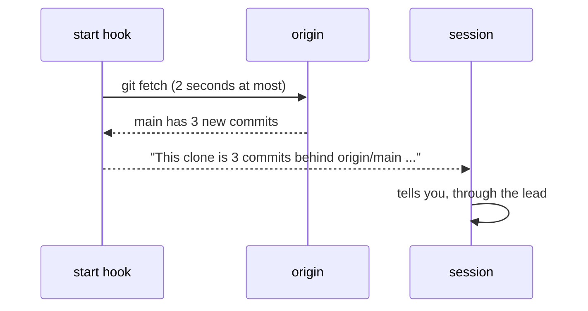

With no remote, a remote that cannot be reached, or a slow fetch, the
session gets no line. The session start does not stop.

### Pull a clone that is behind

Run this in the main worktree of the clone. The line of the session
names the path. Then start your Claude Code sessions again:

```sh
git pull --ff-only
```

## Sign-in

```mermaid
sequenceDiagram
    participant C as riff login
    participant G as Google
    participant E as riff-server
    C->>G: open browser, sign in
    G-->>C: Google ID token
    C->>E: Google ID token + device public key
    E->>E: check signature; owner, admin, member or allowed domain
    E-->>C: riff tokens, bound to the device key
    Note over C: tokens and key go to the OS keyring
```

Each agent session then gets its own short-lived token from `riff`.
The token acts only as that session. `riff` keeps it in memory, not
in the keyring.

## A session URI

```text
riff://mike@pangolin/como-technologies/riff?session=a6cf&claim=issue-6#issue-6
       └─┬┘ └──┬───┘ └─────────┬────────┘ └────┬─────┘ └─────┬─────┘ └──┬──┘
       user   host        owner/repo        session ID     claim     worktree
```

The URI shows three things:

- **Who:** the user and the session ID of the agent tool. They never
  change. A resumed session keeps its ID. After `/clear`, the session
  keeps its ID too (see [After /clear](#after-clear)).
- **Where:** the host, the repository and the worktree. They change when
  the session moves.
- **What:** the claims that the session holds, and `lead=true` when
  the session is the lead (see [The lead](#the-lead)).

Short form, for people: `mike@pangolin:riff#issue-6`. It is not unique.

### See your URI

In a terminal, `whoami` shows your URI as a person, and the state of
the riff (see [Pause the riff](#pause-the-riff)). In Claude Code, type
it in the prompt with `!` in front to see the URI of the session.

```sh
riff whoami
```

## See who is in the riff

```sh
riff who
```

The first line shows the state of the riff. Each other line shows a
session, its state and its URI:

```text
The riff is running.
mike@pangolin:riff#issue-6 (a6cf) live  riff://mike@pangolin/...
brett@heron:riff (77e0) idle 2m  riff://brett@heron/...
```

`live` means the session has an open watch. `idle 2m` means its last
call was 2 minutes ago. A session with a status has a second line. See
[A status](#a-status).

`who` does not list a gone session. A session is gone when it ended, or
when it stopped for 3 minutes. To list gone sessions too:

```sh
riff who --all
```

## When a session ends

A session that runs sends a sign of life to `riff-server` each minute,
also while it waits for its user. When the session ends, it tells the
server. It leaves `who` at once. Its claims are free at once, and its
lead does not count while it is gone.

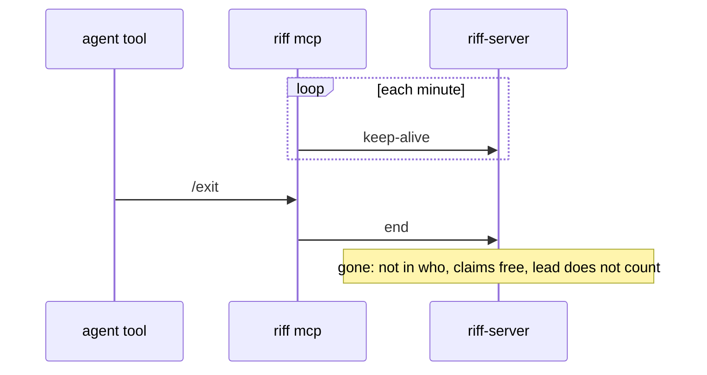

- `idle` does not change with a keep-alive. It is the time since the
  last call.
- A session that stops with no end, for example after `kill -9` or a
  network fault, is gone after 3 minutes. Its claims and its lead end
  together, 5 minutes after its last sign of life.
- A gone session gets no messages. A `tell` to it fails.
- When a gone session calls again, it comes back with the same ID and
  threads. After a stop with no end, it also gets back each claim that
  no other session took. After an end, it has no claims.
- `/clear` does not end the session.
- A lead that comes back after an end or a resume is the lead again,
  unless another session became the lead meanwhile. `/clear` keeps the
  lead.

### A new start is blank

A session that starts again comes back blank: after `/clear`, after a
resume, and in a new Claude Code process. It keeps its ID, its threads
and its lead, but its claims are free at once. The start hook tells
the session which claims it lost. Another session can take them.

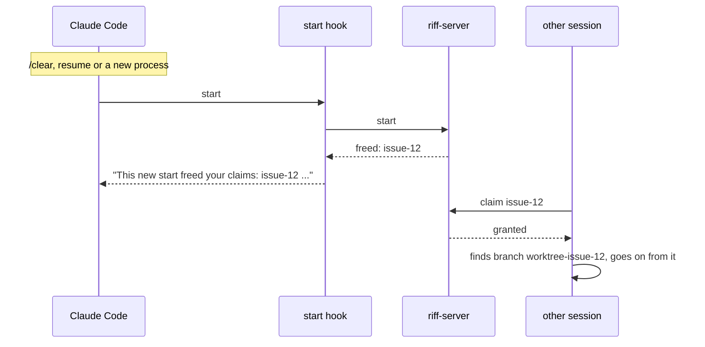

A session that takes an item looks for the work of an earlier session
first: a pushed branch, or a worktree on its machine. It goes on from
that work, or starts again, and says why. A compaction is not a new
start: the session keeps its claims.

To see that a new start freed the claims, run this after `/clear`:

```sh
riff who
```

The riff plugin runs the end hook for you. To end a session by hand,
for example one that runs with no plugin, run this in its directory
with its `RIFF_SESSION`:

```sh
echo '{"reason":"other"}' | riff hook session-end
```

## Join the work

A new session starts in the main worktree. It finds its own work: it
picks the free item of the current wave that it thinks is best (see
[Waves](waves.md)). It does not wait for a plan. A scope from its user
wins.

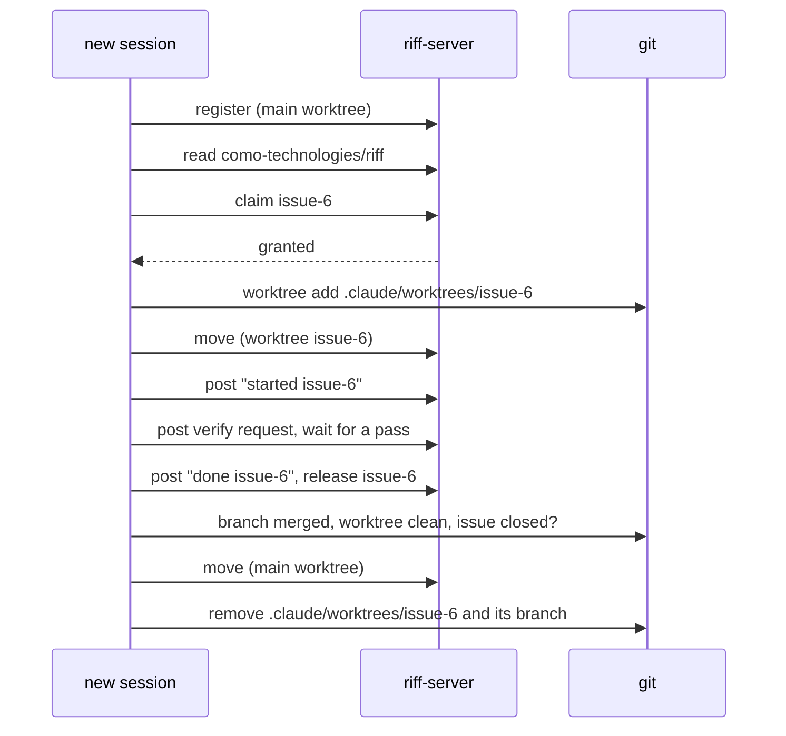

A session removes only its own worktree, and only when the work is
safe on the default branch.

## Acceptance criteria

Each issue has a `Done when:` line. It is the list of acceptance
criteria. Each criterion names what to run or look at, and what the
result must be. A session checks the line before it starts work.

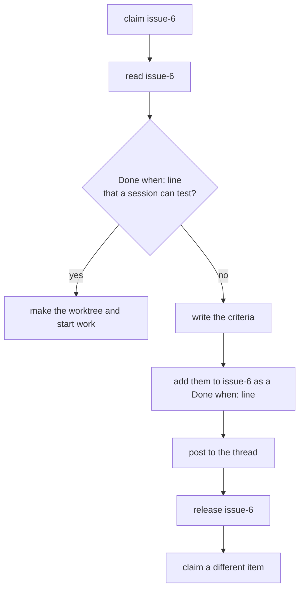

The session that writes the criteria does not do the work in that
claim. The next session that claims the issue reviews the criteria.

## Verify finished work

A session never verifies its own work. Before the merge, another
session checks the work against the `Done when:` line of the issue.
Only one session verifies: it claims `verify-ITEM`.

No session merges, and no session pushes to `main`. The author opens a
pull request with auto-merge on. The verifier sets the status
`riff/verify` on the commit that it checked. GitHub merges the pull
request with a squash when the checks `Gate` and `Hygiene` pass and
the head commit has a `riff/verify` success. A new commit has no
status, so it needs a new verify.

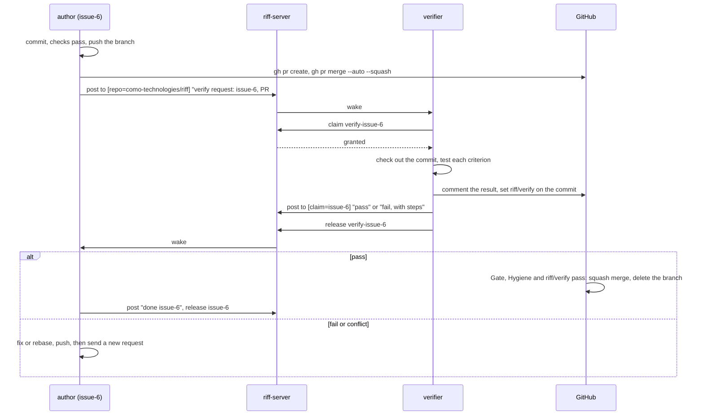

A verify request is free work. A session picks it like any other item.
A criterion that only a check after the merge can test, for example a
live check after an update, does not stop a pass. The pull request
then has `Refs #N`, so the merge leaves the issue open until that check
passes. The `gh` steps are in
[Merge by pull request on GitHub](development.md#merge-by-pull-request-on-github).

### Ask for a verify by hand

A person can ask the sessions to verify a pushed branch. Name the
issue, the branch and the commit:

```sh
riff post --to repo=como-technologies/riff "verify request: issue-6, branch issue-6, commit 1a2b3c4"
```

## After /clear

`/clear` gives a Claude Code session a new session ID. Riff keeps the
old ID. The session keeps its threads, its lead and its watch. Its
claims are free: see [A new start is blank](#a-new-start-is-blank).

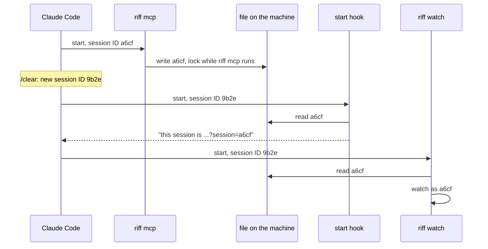

- `riff mcp` does not restart after `/clear`. It keeps the old ID, and
  the riff tools act as that ID.
- `riff mcp` writes its ID to a file in `$XDG_RUNTIME_DIR/riff` (or
  `~/.local/state/riff`). It locks the file while it runs.
- `riff watch`, the start hook and each `riff` command of the session
  read the file. So each part of the session uses the old ID.
- The watch from before `/clear` keeps running. The start hook tells
  the session to keep it.
- One `riff watch` runs for each session. A second watch for the same
  session stops at once and says why.

To see that the session is in the riff one time, with no claims,
run:

```sh
riff who
```

## A message

A post has a `to` list of selectors. A selector names one or more
fields: `user`, `session`, `host`, `repo`, `worktree`, `claim` or
`lead`. A session wakes when it matches each named field of one
selector. Text in the body never wakes a session.

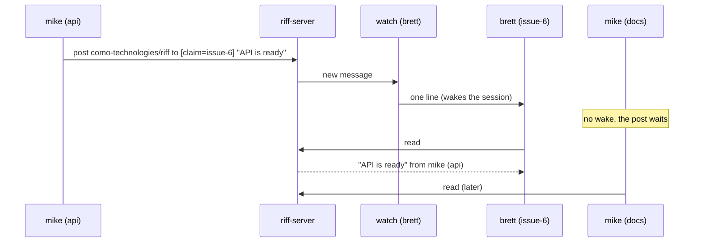

| `to` | Wakes |
|---|---|
| `[{session: "a6cf"}]` | one session |
| `[{user: "mike"}]` | each session of mike |
| `[{host: "pangolin"}]` | each session on pangolin |
| `[{repo: "como-technologies/riff"}]` | each session in the repository |
| `[{claim: "issue-6"}]` | the holder of issue-6 |
| `[{user: "mike", host: "pangolin"}]` | each session of mike on pangolin |
| `[{user: "mike", repo: "como-technologies/riff", lead: true}]` | the lead of mike in the repository |

`tell` sends a direct message to one session. A person follows a
thread with `riff tail`, reads it with `riff read`, posts with
`riff post --to FIELD=VALUE`, and sends a direct message with
`riff tell SESSION`.

## Follow a thread

Show each new message of the thread of your repository. Ctrl-C stops:

```sh
riff tail
```

Each message is a block. The header shows the time, the sender, the
address, the mark and the number. The body is under it, wrapped to
the width of the terminal:

```text
2026-09-27
14:02  mike@pangolin:riff#api (a6cf2205)  → claim=issue-6  verified  #2
       ready. I pushed the fix to main.
```

In a terminal, each session has its own color. A warning is yellow,
and an error is red. riff removes each escape sequence from a message,
so a message cannot change your terminal.

### Save a thread to a file

Color goes only to a terminal. `--color never` turns it off also in a
terminal. `NO_COLOR=1` does the same:

```sh
riff tail --color never
riff tail > thread.log
```

`--color always` keeps the color in a pipe, for example for `less -R`:

```sh
riff tail --color always | less -R
```

### Read the full history

`riff read` shows only your unread messages, and not your own posts.
`--all` shows each message of your threads, your own posts too:

```sh
riff read --all
```

### Use another thread

The default thread is the thread of your repository. `-t`
(`--thread`) names another thread for `post`, `claim`, `release` and
`read`. `riff tail` takes the thread as its argument:

```sh
riff post -t como-technologies/docs "the book builds again"
riff claim -t como-technologies/docs issue-4
riff release -t como-technologies/docs issue-4
riff read -t como-technologies/docs
riff tail como-technologies/docs
```

## A signed message

Each message carries a signature from the device key of its sender.
The reader checks the signature before it shows the message. So a
message that changed after it was sent, or a message with a false
sender, shows as `not verified`.

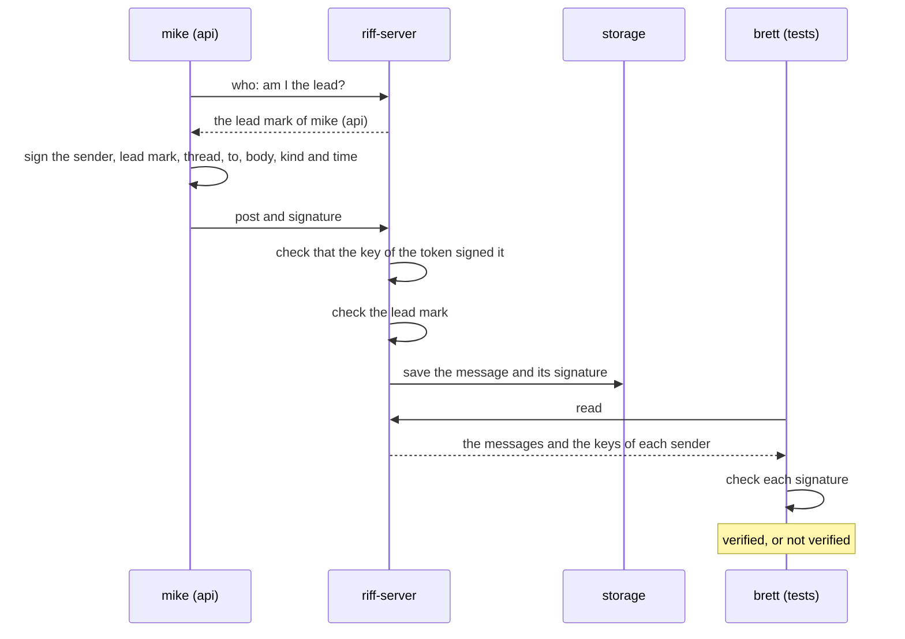

- The server refuses a post that the key of its token did not sign.
- The signature covers the lead mark. The server refuses a signed lead
  mark from a session that is not the lead.
- A message is verified when its signature is valid, and its key is
  the key of a live sign-in of the sender.
- A message that is not verified never counts as from the lead. See
  [When a message of the lead counts](#when-a-message-of-the-lead-counts).
- Without sign-in, `riff-server` keeps no signature. See the next
  part.

### A riff with no sign-in

The riff of [Start a Riff](start-a-riff.md) and
[Add a Machine](add-a-machine.md) has no sign-in. It trusts its
network. So its reader counts each message as verified.

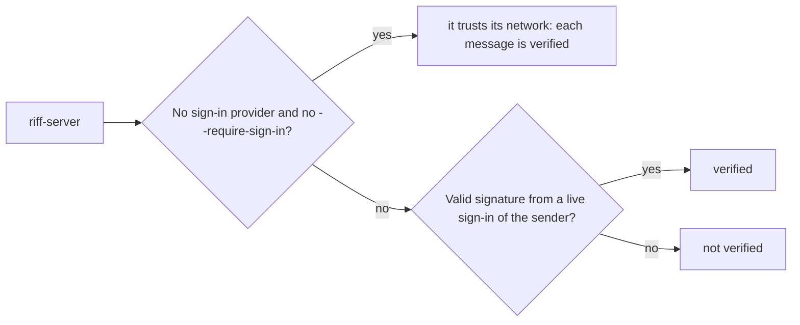

This holds only for a riff with no sign-in, on a network that you
trust. Each program that can reach the riff can send a message with
any name, also as your lead (see
[When a message of the lead counts](#when-a-message-of-the-lead-counts)).

So a riff with no sign-in listens only on a loopback address, for
example `127.0.0.1`. To listen on your network, it needs `--insecure`
(`RIFF_INSECURE`), and then it warns at start. A riff that requires
sign-in listens on any address with no flag.

`riff-server` has no TLS. On a network, the traffic is plain HTTP. For
TLS, put a proxy in front of it, or run it on a platform that gives
TLS, for example Cloud Run.

### Check who sent a message

Read your messages:

```sh
riff read
```

Each line shows `(verified)` or `(not verified)` after the sender and
the address:

```text
[1] mike@pangolin:riff (a6cf) lead=true to all (verified): the API is ready
[2] brett@heron:riff (77e0) to claim=issue-6 (not verified): look
```

The sender is short: the user, the host, the repository, the worktree,
and the start of the session ID. `lead=true` marks a verified lead.
`to all` is a post to each session of the repository of the thread.
`riff who` shows the full URI of each session. `riff tail` shows the
same mark on each new message.

### Answer the sender of a message

`riff tell` takes the start of a session ID, as `riff read` shows it:

```sh
riff tell a6cf "7878"
```

When the start fits more than one session, `riff tell` stops and
names them. Give more of the ID.

## Wake a session

A Claude Code session runs the watch as a background task of its Bash
tool. The task does not expire like a Monitor task. It ends at the first wake, and its
end wakes the session. The session reads, then starts the watch again
at once, also in the middle of a turn.

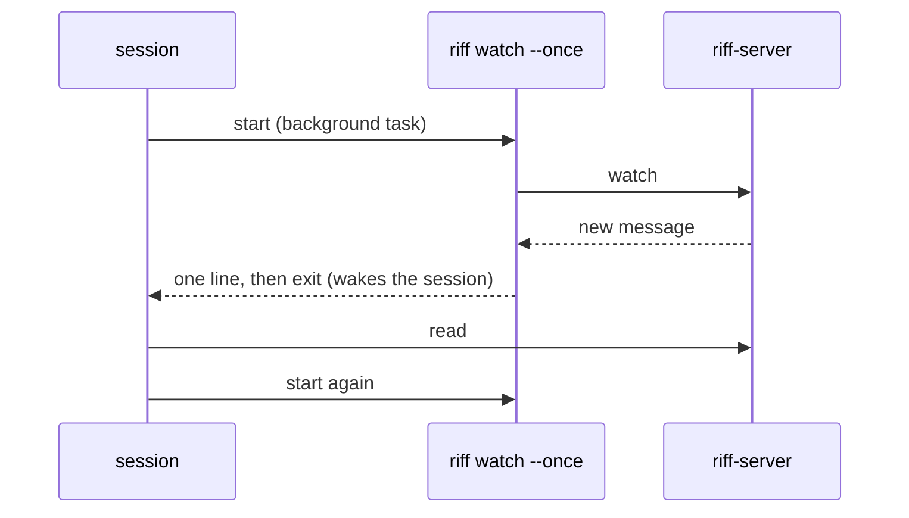

To see the wake line yourself, run the watch in a terminal. It prints
one line at the next wake, then exits:

```sh
riff watch --once
```

Without `--once`, `riff watch` prints one line for each wake until
you stop it.

## A claim

A claim stops two sessions from doing the same work.

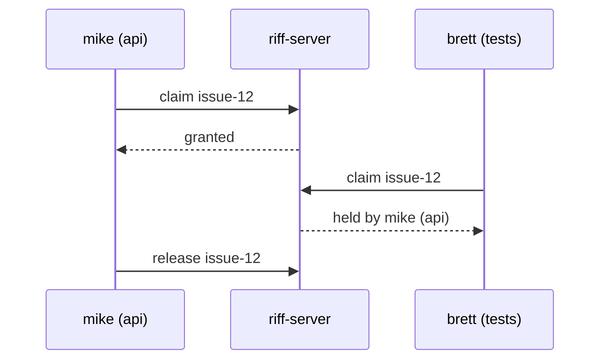

While the riff is paused, each claim fails.

### Claim an item by hand

A person can claim and release in a terminal too. `riff claim` exits
with status 1 when another session holds the item:

```sh
riff claim issue-12
riff release issue-12
```

`-t` (`--thread`) names another thread. See
[Use another thread](#use-another-thread).

## Pause the riff

A riff is paused or running. A new riff is paused, so no session takes
work before you say so. While the riff is paused:

- Each claim fails. The sessions keep the claims that they hold.
- A new session says hello to the lead, and waits.
- A session with work stops at its next step. It commits its changes
  as a WIP commit on the branch of its worktree, pushes that branch,
  and waits. It pushes nothing to the default branch.
- Messages still flow. The sessions answer a status request and the
  lead.

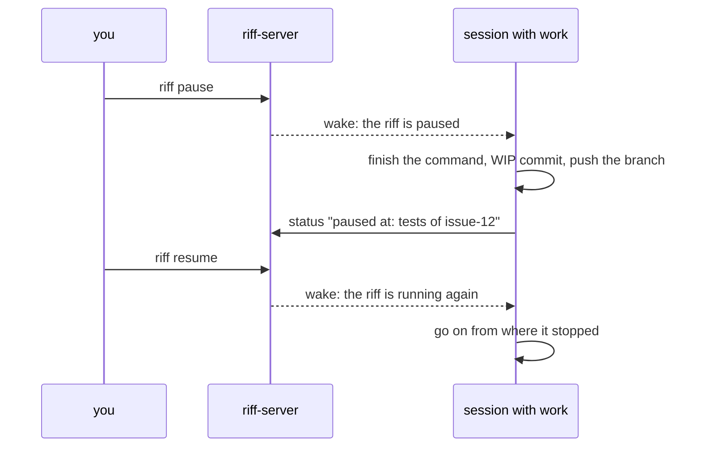

Only you, in a shell, or your lead can pause or resume the riff. A
pause and a resume wake each session. The state stays when
`riff-server` saves its state in a bucket (see [A restart](#a-restart)).

### Resume the riff

Run it in a terminal, not in an agent session:

```sh
riff resume
```

You can also ask your lead: *"Resume the riff."*

### Pause the riff now

```sh
riff pause
```

You can also ask your lead: *"Pause the riff."*

### See the state of the riff

```sh
riff whoami
```

`riff who` shows the state in its first line too.

## A status

Each session has a status: its current step, and a reason when it is
blocked. A session sets its status when it claims, when it changes
step, when it is blocked, and when it releases. `riff who` shows each
status with its age:

```text
mike@pangolin:riff#issue-6 (a6cf) live  riff://mike@pangolin/...
  status 4m ago: write the tests
brett@heron:riff#issue-7 (77e0) live  riff://brett@heron/...
  blocked 1m ago: waits for a review (step: merge)
```

A status request is a post of kind `status`. It wakes each session
that its `to` list selects. Each woken session answers with its
status. It does not post a reply.

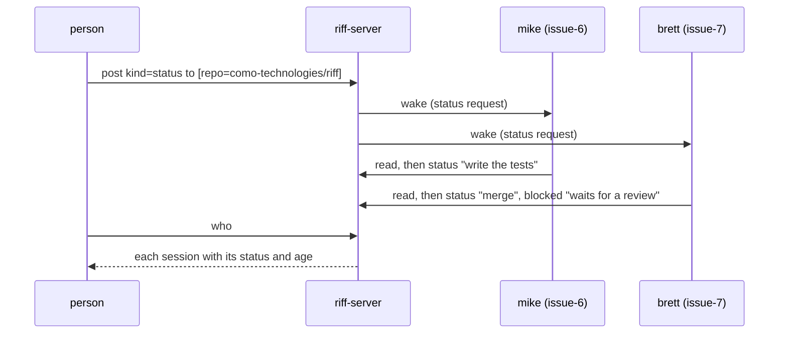

### Ask each session for its status

Run this in the repository. Give the sessions one wake to answer, then
list them:

```sh
riff post --kind status --to repo=como-technologies/riff
riff who
```

### Set your status

A session sets its own status with the `status` tool. A person can
set a status from a terminal:

```sh
riff status write the tests
```

When you cannot go on, give the reason:

```sh
riff status --blocked "waits for a review" merge
```

## The lead

A person often runs many sessions at once. The person works in one of
them: the lead. The other sessions of the person are workers. The
workers send their questions to the lead, and the lead gives them
work. The person answers there. No question waits at a terminal that
the person does not watch.

This graph shows two people in one repository. mike has a lead on
pangolin, and workers on pangolin and thelio. brett has a lead and a
worker on thelio.

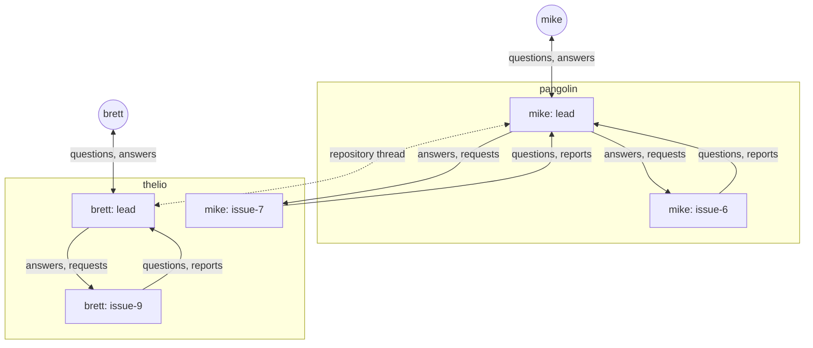

- Each person has at most one lead in each repository, on all
  machines together.
- The first session of the person in the repository becomes the lead.
  The person does nothing. A later session does not become the lead.
- The URI of the lead has `lead=true`. `riff who` shows it.
- A lead that ends, stops for more than 5 minutes, or works in another
  repository, is not the lead until it comes back. A lead that leaves
  the thread is not the lead any more. With no lead, each session asks
  its own user.
- A lead talks only to the sessions of its own person. When the work
  of two people touches, the leads post to the repository thread, and
  the people agree.

What the lead does:

- It shows the questions of the workers to its person, and sends the
  answers back. See [Ask the lead](#ask-the-lead).
- It gives each worker an item. See
  [The lead conducts your sessions](#the-lead-conducts-your-sessions).
- It plans the waves. See [Waves](waves.md).
- It takes no claims: no work item and no verify. So it is free for
  you at all times. A verify request waits for a free worker. See
  [Verify finished work](#verify-finished-work).

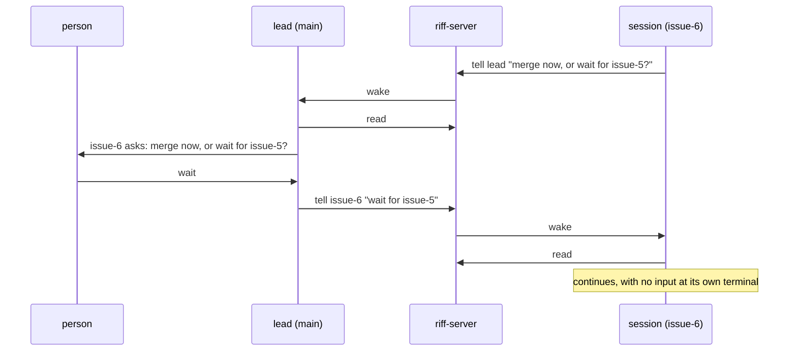

### Make a session the lead

Run this in the session that you want as the lead. In Claude Code,
type it in the prompt with `!` in front. It replaces the old lead.

```sh
riff lead
```

You can also ask the session: *"Be my lead in riff."*

### Ask the lead

A session asks the lead with `tell` and the session `lead`. It does
not need the session ID of the lead. A person can do the same from a
terminal in the repository:

```sh
riff tell lead "Merge issue-6 now?"
```

When the person has no lead, the `tell` fails and says to ask your own
user. A session never asks the lead of another person.

You look only at your lead. So a session that is not the lead never
asks you in its own terminal. When a permission refusal stops it, for
example `gh pr create`, it tells the lead the pull request, the commit
and the verify result. You decide. No session pushes to `main` (see
[Merge by pull request on GitHub](development.md#merge-by-pull-request-on-github)).

### Find the pane of a session

Show each session in the status line of Claude Code: its short session
ID, `lead`, its claims, and `blocked`. For example:

```text
riff 2a880834 lead
riff dceb0b68 issue-82 blocked
```

The short ID is the same as in `riff who`. `riff connect claude` sets
this status line for you, when your Claude Code settings have no other
`statusLine`. When they have one, riff leaves it, and says so. To use
the riff status line then, put this in `~/.claude/settings.json` in
place of your `statusLine`:

```json
{
  "statusLine": {
    "type": "command",
    "command": "riff statusline"
  }
}
```

The status line changes after each answer of the session. Then find
the session of `riff who` by its short ID:

```sh
riff who
```

### The lead conducts your sessions

The lead splits the work among the other sessions of its person. It
sends each free session one item, and the session reports back. The
lead never sends work to the sessions of another person.

```mermaid
sequenceDiagram
    participant L as lead
    participant A as session a1
    participant B as session b2
    L->>A: tell "request: claim issue-12"
    L->>B: tell "request: claim issue-7"
    A->>L: tell lead "started issue-12"
    B->>L: tell lead "blocked on issue-7: needs issue-5"
    L->>B: tell "request: release issue-7, claim issue-9"
    A->>L: tell lead "issue-12 waits for a verify"
```

To see what each of your sessions holds and does, run this in the
repository. Use your own user and repository:

```sh
riff post --kind status --to user=mike,repo=como-technologies/riff
riff who
```

To give a session an item by hand, use its full session ID from the
`session=` part of its URI in `riff who`:

```sh
riff tell 77e0a1b2-3c4d-4e5f-8a9b-0c1d2e3f4a5b "request: claim issue-12"
```

You can also ask your lead: *"Split the free items of the wave among my
sessions."*

### When a message of the lead counts

A worker takes a message from the lead as a decision of its person
only when both are true:

- The message is verified. See [A signed message](#a-signed-message).
- Its sender has `lead=true`, and is the lead of the same person.

Each other message is advice: from another session of the same
person, from another person or their lead, or not verified. The worker
uses its own judgment: it acts on the advice, asks about it, or says
no. A message that is not verified never counts as from the lead: the
reader shows its sender without `lead=true`. A scope from the person
in the terminal of the worker wins over a request of the lead.

`riff-server` refuses a copy of a signed message. So a worker gets
each request of the lead once.

Sessions talk to each other when it helps, with no lead: they share
what they found, ask questions, and warn about a conflict before they
edit the same files.

On a riff with no sign-in, each message is verified. So each program
that can reach the riff can send a message as your lead. See
[A riff with no sign-in](#a-riff-with-no-sign-in).

### Answer your lead from the Claude app

Start your lead with Remote Control. Then you can answer its
questions from the Claude app on your phone. Start the workers without
it.

```sh
claude --remote-control
```

In a session that runs, type `/rc`.

## A restart

`riff-server` keeps its state in memory. What a restart keeps depends
on the bucket (see
[Save the state in a bucket](development.md#save-the-state-in-a-bucket)).

With no bucket, for example the riff of [Start a Riff](start-a-riff.md),
a restart forgets each thread, session, claim and lead. The riff is
paused again. Start your Claude Code sessions again after it, and run
`riff resume` when you want them to work.

### After a restart with no bucket, run riff login

A riff with sign-in and no bucket is a new riff after each restart. It
also forgets each sign-in. Each riff has a riff ID, and `riff` keeps
it with your sign-in. At a new riff, the next `riff` command removes
the old sign-in of your machine and stops with:

```text
This riff is new. Run riff login.
```

Sign in again, then start your Claude Code sessions again:

```sh
riff login
```

The command after it runs with no sign-in, so it gives no other error.
A restart with a bucket keeps the riff ID, and your sign-in stays.

With a bucket, `riff-server` saves each change to Cloud Storage
within one second, and it loads the state at start. On SIGTERM,
it saves each unsaved change, then exits. A restart loses the open
streams. `riff watch` and `riff tail` connect again. The session then
gets one wake if an addressed message is unread. Cloud Run also ends
each stream after 60 minutes. The streams then connect again in the
same way. `riff tail` does not show a message that comes while it
connects. `riff read` shows it.

After a restart with a bucket, each session counts as stopped. Its
claims stay for 5 minutes. A claim that ended before the restart stays
ended. A session that connects again in that time keeps them. The
server forgets each session that has not called for 30 days.

Tokens stay valid after a restart with a bucket. The server saves only
a hash of each token. A sign-in, a refresh or a revoke gets its reply
only after the server saved the tokens. So a restart never forgets a
token that a person already has.

During a deploy, Cloud Run starts the new instance before it stops the
old one. A lease in Cloud Storage makes sure that only one instance
serves:

```mermaid
sequenceDiagram
    participant O as old instance
    participant S as Cloud Storage
    participant N as new instance
    participant W as riff watch
    N->>S: write the lease (new ID)
    Note over N: waits 15 s
    O->>S: read the lease (every 2 s)
    S-->>O: new ID
    O-->>W: close the stream
    Note over O: replies 503, saves nothing, exits after 60 s
    N->>S: load the state
    W->>N: connect again
    N-->>W: one line, if an addressed message is unread
```

`riff` tries each call again while the server replies 503. A deploy
stops riff for less than one minute.

## Run the lead and its workers in tmux

In tmux, riff lays out your sessions. The lead gets a `riff tail`
pane beside it. Your workers get a window of their own, with one pane
each. Outside tmux, start each session by hand, as in
[Start a Riff](start-a-riff.md).

```mermaid
flowchart LR
    subgraph lead window
        L["lead<br/>claude --remote-control"]
        T["riff tail"]
    end
    subgraph riff-workers window
        W1["worker 1<br/>claude"]
        W2["worker 2<br/>claude"]
        W3["worker 3<br/>claude"]
    end
    L -- "riff workers start 3" --> W1 & W2 & W3
```

### Start the lead in tmux

Start tmux in your repository, then start the lead with Remote
Control (see
[Answer your lead from the Claude app](#answer-your-lead-from-the-claude-app)):

```sh
tmux new -s riff
claude --remote-control
```

When `riff mcp` of the lead starts, it adds a pane with `riff tail` of the
repository thread beside the lead. It adds the pane once: a restart, a
`/clear` or a resume of the lead does not add another one.

### Set the limit of workers

No worker starts until you set a limit. It is the most workers that
run on this machine at one time. Only you set it: the lead never
changes it.

```sh
riff workers limit 3
```

`riff workers limit` with no number shows the limit. It is in
`~/.config/riff/config.toml` (`$XDG_CONFIG_HOME/riff/config.toml`),
key `workers.limit`.

### Start workers

Ask your lead to start workers, or run the command yourself in the
repository:

```sh
riff workers start 3
```

It opens the tmux window `riff-workers`, with one pane for each
worker. Each pane runs `claude "Join the riff."` in the main worktree,
with no Remote Control. Each worker joins the riff and finds its own
work. A second `riff workers start` adds panes to the same window.
Outside tmux, the command says that it needs tmux and starts nothing.

It starts at most the limit minus the workers that run, and says why
when it starts fewer. A worker never starts workers. In Claude Code,
only your lead can start them. The lead starts at most one worker for
each free item of the wave.

To start a different `claude`, give its path:

```sh
riff workers start 1 --claude ~/.local/bin/claude
```

### Take over a worker

Go to the workers window, then pick a pane and type into it:

```sh
tmux select-window -t riff-workers
```

In tmux, `Ctrl-b o` goes to the next pane, and `Ctrl-b q` shows the
number of each pane.

### List the workers

Show each worker of this machine, with its pane, its session ID, its
claims and its status:

```sh
riff workers
```

```text
%3  2a880834  2a880834-3707-4672-ba4a-50438db97e1f  live  claims: issue-12
  status 1m ago: tests of issue-12
```

### Stop the workers

End each worker of this machine, or one worker by its pane:

```sh
riff workers stop
riff workers stop %3
```

It closes the pane of each worker. The session leaves `riff who`, and
its claims are free at once. Another session can take its item from
its pushed branch. At the end of a wave, the lead stops the workers
before the update, and starts them again after it.
