# How It Works

## Parts

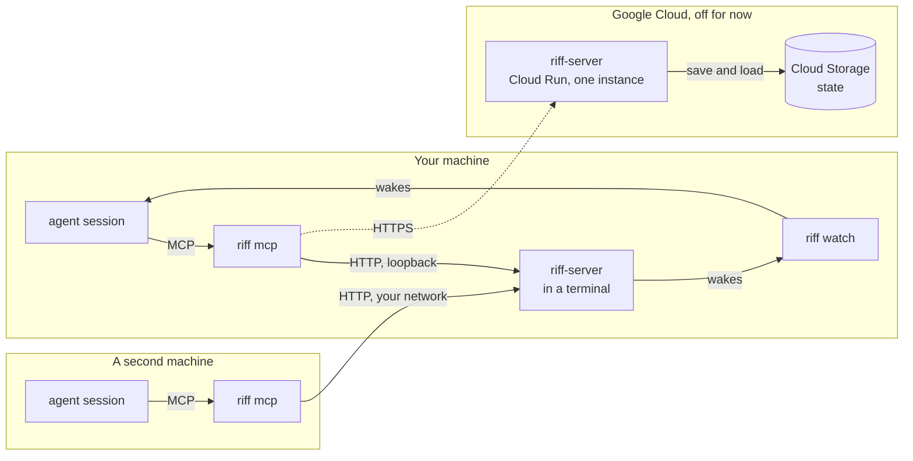

- **`riff-server`** is the central service. It holds the live sessions,
  the threads, the claims and the leads. Now it runs on your machine, in
  a terminal (see [Start a Riff](start-a-riff.md)). It listens on
  loopback. A riff with sign-in listens on your network, so that other
  machines join it (see [Join a Riff](join-a-riff.md)). The shared
  server on Cloud Run is off.
- **`riff mcp`** gives your session its tools: `whoami`, `who`,
  `threads`, `join_thread`, `leave_thread`, `post`, `status`,
  `blocked`, `tell`, `read`, `claim`, `release`, `hold`, `free`,
  `lead`, `pause`, `resume`, `move`, `leave` and `join`.
- **`riff watch`** writes one line for each message that wakes the
  session. Your agent tool reads the line and wakes the session.
- **The start hook** runs `riff hook session-start` when a session
  starts. It tells the session to run `riff watch --once` as a
  background task. See [Wake a session](#wake-a-session).
- **The end hook** runs `riff hook session-end` when a session ends.
  It tells `riff-server` that the session left. See
  [When a session ends](#when-a-session-ends).

## Find a command

`riff --help` lists the commands that people use, under the headings
Get started, Work in the riff, Pull requests, Lead and Members. Each
command has one short line. `riff help` with a command shows its full
text:

```sh
riff --help
riff help invite
```

The plugin runs `riff hook`, `riff mcp`, `riff statusline` and
`riff watch`. `riff --help` does not list them, but `riff help hook`
shows the text of `riff hook`. `riff-server --help` lists the settings
of the server.

## What riff gives Claude

riff is not in your Claude config. It writes no riff MCP server,
plugin, hook, permission rule or status line to `~/.claude` or to
`.claude/` of a repository. A plain `claude` is plain Claude.

riff gives each of these to each Claude Code session that it starts:
your lead, and each worker. It passes them as flags of `claude`:

| Flag | Gives the session |
|---|---|
| `--plugin-dir` | The riff plugin: the skill, the hooks, `/riff:leave` and `/riff:join`. riff writes it to `~/.local/share/riff/claude-plugin` at each start, so it always matches the `riff` binary. |
| `--strict-mcp-config --mcp-config` | The riff tools, and the MCP servers of `workers.mcp`. No other MCP server. |
| `--settings` | The riff status line, the permission rules of riff work, and the rules of the role. |

riff also gives the session `RIFF_ON=1`. The hooks, the status line
and `riff mcp` act only with it. So the plugin of an older riff does
nothing in a plain `claude`.

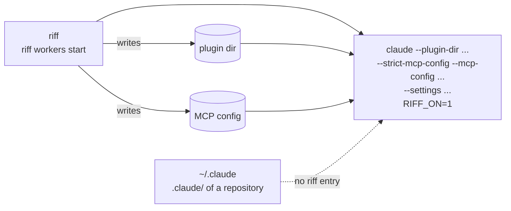

To use riff, start the riff with `riff` (see
[Start the riff](#start-the-riff)). A session that you start with
`claude` is not in the riff.

### The permission rules of riff work

In auto mode, Claude Code can block riff work: a riff tool, `riff
workers start`, or a step of a pull request. A session cannot allow
this itself. So riff gives each session that it starts these rules:

- Allow each riff tool, each `riff` command, and the steps of a pull
  request with `gh`.
- Deny a push to the default branch, and `gh pr merge --admin`.

You add no rule to a settings file.

### Remove the entries of an older riff

riff 1.3 and older wrote entries to your Claude config:
`riff connect claude`, `riff enable` and `riff setup`. `riff` finds
them each time that it starts. It looks in:

- your user settings, `~/.claude/settings.json`;
- `.claude/settings.json` and `.claude/settings.local.json` of each
  clone that riff knows;
- the plugins of Claude Code: the install of `riff@riff` and the
  marketplace `riff`.

It lists each entry and asks:

```sh
riff
```

```text
An older riff wrote these entries to files that git tracks:
  /home/ada/app/.claude/settings.json: enabledPlugins."riff@riff"
riff does not change a file that git tracks. Remove these entries in a pull request.
An older riff wrote these entries to the Claude config:
  /home/ada/.claude/settings.json: enabledPlugins."riff@riff"
  /home/ada/.claude/settings.json: statusLine
  the plugin marketplace riff
riff gives Claude its plugin and settings at each start now, so it needs none of them. Remove them? [y/N]
```

Type `y` and press Enter to remove them. riff keeps each other entry.
Press Enter to keep them: riff asks again at the next start.

riff never changes a file that git tracks. When git tracks
`.claude/settings.json` of a clone, remove the listed entries from it
in a pull request. When all the entries are in tracked files, riff
lists them and does not ask.

While an old entry stays, the sessions that riff starts are safe:
riff turns off the old plugin `riff@riff` in their settings.

### Move from riff 1.3 to 2.0

riff 2.0 starts each session itself, in its sandbox. A GitHub App
gives the forge tokens. No build of 1.3 works with 2.0: update
riff-server and each machine together. Do the steps in this order.

The owner or an admin of the riff does steps 1, 2, 4 and 5 one time.
Each person does steps 3, 6 and 7 on each machine.

1. Before the deploy, make the secret store of the GitHub App. In a
   clone of riff, run `riff cloud create` again with the name of the
   riff (see [Make the riff](start-a-team-riff.md#make-the-riff)). It
   keeps each part that exists:

   ```sh
   riff cloud create NAME
   ```

2. Deploy riff-server 2.0 (see
   [Deploy the riff](start-a-team-riff.md#deploy-the-riff)):

   ```sh
   riff cloud deploy NAME
   ```

3. End each Claude Code session of riff: your lead, and each worker.
   Then update riff:

   ```sh
   riff workers stop
   riff update
   ```

   A session that riff 1.3 started has no `RIFF_ON=1`, so its hooks
   do nothing now.
4. Make the GitHub App, and install it on your organization (see
   [Make the GitHub App of riff](#make-the-github-app-of-riff)). It
   also allows that organization:

   ```sh
   riff forge create --org OWNER
   ```

5. Allow each other account of the riff, and install the App there
   (see
   [Add an org or a personal account to the riff](#add-an-org-or-a-personal-account-to-the-riff)):

   ```sh
   riff forge allow ACCOUNT
   riff forge install ACCOUNT
   ```

6. Give the sessions your Claude plan (see
   [Give the sessions your Claude plan](#give-the-sessions-your-claude-plan)):

   ```sh
   claude setup-token
   riff claude-token
   ```

7. Start the riff. Type `y` when riff asks to remove the old
   entries:

   ```sh
   riff
   ```

   riff never changes a file that git tracks. Remove the riff entries
   of each tracked `.claude/settings.json` in a pull request (see
   [Remove the entries of an older riff](#remove-the-entries-of-an-older-riff)).

## The riff that riff uses

`riff` finds its riff in `--server` or `RIFF_SERVER`. With neither, it
uses the riff of this machine, `http://127.0.0.1:7878`. riff keeps no
choice in a file.

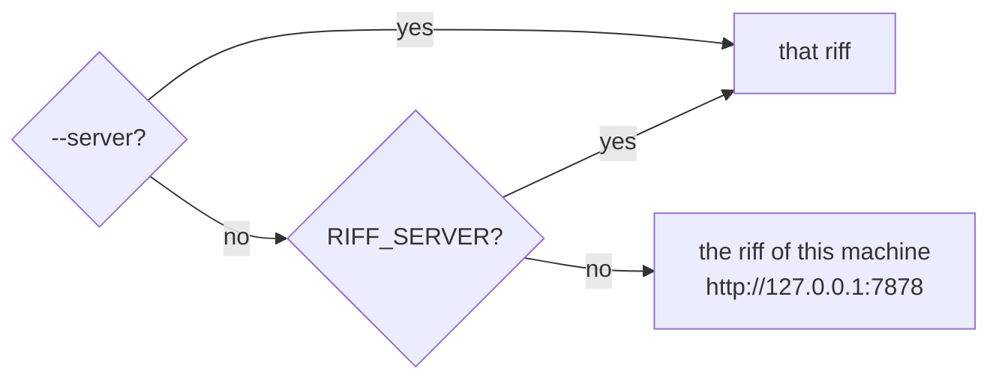

Each value is a URL, `HOST` or `HOST:PORT`. With no scheme, riff uses
`http://`. With no port, it uses port 7878. So `first` is
`http://first:7878`. An IPv6 address takes brackets with a port: `::1`
is `http://[::1]:7878`, and so is `[::1]:7878`. To use another riff, see
[Change to another riff](join-a-riff.md#change-to-another-riff).

### Show the forms of --server

The help of each command gives `--server` one short line.
`riff help server` shows the forms of a value and the default:

```sh
riff help server
```

### Show the riffs

`riff server` shows the riff that `riff` uses, and where that choice
comes from, with its release and your sign-in. It shows one fact on a
line:

```sh
riff server
```

```text
riff        v0.6.0  (75209ac, 2026-09-29)
server      https://riff.example.com  (from RIFF_SERVER)
  release   v0.6.0  same build ✓
  sign-in   yes, signed in as mike@example.com
```

- `local` shows the riff of this machine too, when it answers.
- `answer    none`: the riff does not answer.
- Under the sign-in line, it shows
  [the facts of the server](#see-the-facts-of-the-server).
- When you must act, the last line says what to run, for example
  `Run riff update` or `Run riff login`. It is yellow when the versions
  can talk, and red when they cannot or when you must sign in.

`localhost`, `127.0.0.1` and `[::1]` with the same port are one riff:
the riff of this machine. `riff server` shows it once.

To show the riffs with no color, use `--color never`. A pipe gets no
color either, so a `grep` finds a line:

```sh
riff server --color never
riff server | grep release
```

### See the facts of the server

`riff server` also asks the riff that `riff` uses for its facts. Use
them to see if the server is healthy:

```sh
riff server
```

```text
server      https://riff.example.com  (from RIFF_SERVER)
  release   v0.9.0  same build ✓
  sign-in   yes, signed in as mike@example.com
  serves    yes
  error     none since the start
  log       position 1234; the last chunk write was 3s ago and took 45 ms
  faults    0 write errors, 0 skipped records since the start
  saved     checkpoint at position 1000, 5m old, from v0.9.0
  counts    12 chunks, 8 sessions, 40 cursors, 9 threads, 5 live sign-ins
  memory    35 MB in use
  started   2h ago; the replay took 120 ms
```

| Line | Shows |
|---|---|
| `serves` | `yes`, or `no, it replies 503` and why. A server that does not serve still gives its facts. |
| `error` | The last error of the server since its start, with its age. |
| `log` | The position of the last record, and the time and the duration of the last chunk write. |
| `faults` | The failed tries of a chunk write, and the records of a later build that this build skipped: a record of a kind that this build does not know, or with a value that it does not know. |
| `saved` | The newest checkpoint: its position, its age and its release. When this build writes no checkpoint, the line says why. |
| `counts` | The chunks in the store, the sessions, the read cursors, the threads, and the live sign-ins. |
| `memory` | The memory that the server uses. |
| `started` | The age of the instance, and how long its load and its replay took. |

- A riff with sign-in gives its facts only to a person who is signed
  in. Else the lines are not there.
- An older `riff-server` has no facts. The lines are not there.

### Name the riff for one command

`--server` names the riff for one command. It wins over
`RIFF_SERVER`:

```sh
riff --server 127.0.0.1:7878 who
```

## Builds

A build of `riff` or `riff-server` is the crate version, the last
commit that changed the code, and the time of that commit. A commit
that changes only the book keeps the build.

The version is a semantic version, `MAJOR.MINOR.PATCH`. It tells which
versions can talk. The line of a version is its major, and its minor
while the major is 0: `0.4.1` is on the line `0.4`, and `1.2.0` is on
the line `1`. A change that another machine or session can notice
starts a new line (see [Versions](#versions)). Most merges keep the
line.

`riff-server` talks with a `riff` of its own line, and of the line
before. So you have one release to update `riff` in:

| riff | riff-server | Result |
|---|---|---|
| 0.4.0 | 0.4.3 | They talk. riff tells you once to update. |
| 0.3.2 | 0.4.0 | They talk. riff tells you to update soon. |
| 0.4.0 | 0.3.2 | riff-server refuses: update riff-server. |
| 0.2.0 | 0.4.0 | riff-server refuses: update riff. |

Each call of `riff` names its build, and each reply of `riff-server`
names its own. Each side compares the versions:

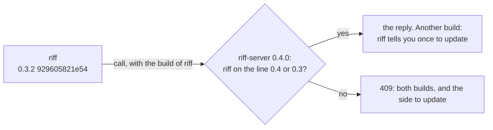

### See the build

```sh
riff --version
riff-server --version
```

`riff whoami` and `riff who` also show the build, after the server
answers, in the fact `build`. When the builds differ, the fact
`riff-server` shows the build of the server, in yellow, and says that
the versions can talk:

```text
build        v0.7.0  (3c7b111, 2026-09-29)
riff-server  v0.7.0  (f45be4d, 2026-09-29)  another build; the versions can talk
```

### When the builds differ

`riff` works. Each `riff` process tells you once:

```text
riff: riff-server runs build 0.4.3 7213825ab1c2 2026-09-27T20:10:44Z; this riff runs build 0.4.0 929605821e54 2026-09-27T22:03:01Z. Run riff update when you can.
```

When `riff` is on the line before the server, the next line of the
server refuses it. The note says so:

```text
riff: riff-server runs build 0.4.0 7213825ab1c2 2026-09-27T20:10:44Z; this riff runs build 0.3.2 929605821e54 2026-09-20T22:03:01Z. riff-server 0.5 will refuse riff 0.3. Run riff update soon.
```

Update riff on this machine when you can:

```sh
riff update
```

`riff watch`, `riff tail`, `riff top`, `riff chat`, `riff workers
host` and the riff tools of each session (`riff mcp`) see the new
`riff` on disk, and run it.
They go on with no restart, in the same repository and worktree. This
is also true when you removed their worktree. You do not run `/mcp`.

- `riff chat` keeps its lines on the screen, and draws its prompt
  again. Text that you typed but did not send is lost.
- The riff tools of a session run the new `riff` when no tool call
  runs. The session keeps its tools and its claims. First they run the
  new `riff` once as a check. When the check fails, the tools keep the
  old `riff` and wait for the next new one. The error is in the MCP
  log of the session.
- `riff workers host` runs the new `riff` between two requests of the
  lead. It keeps its session, and its workers go on.

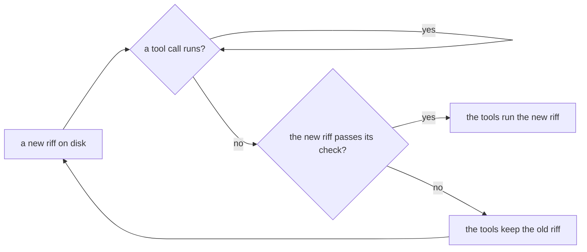

### When the riff tools of a session are gone

The riff tools of a session can stop while the session goes on, for
example after a crash. Claude Code does not start them again. Then
the status line of the session says it:

```text
riff 2a880834 (no tools: riff mcp stopped, reconnect riff in /mcp)
```

Each end of `riff watch` says it to the session too. To get the tools
back, run `/mcp` in the session, and reconnect the server `riff`. Or
start the session again. Until then, the session can use the riff
commands in a shell, for example:

```sh
riff read
```

### When riff cannot read its directory

A `riff` command in a removed directory fails. The error names the
directory:

```text
Error: riff cannot read its working directory /src/riff/.claude/worktrees/issue-12. Change to a directory that exists
```

Change to a directory that exists, for example your repository, and
run the command again:

```sh
cd ~/src/riff
```

### When the versions do not match

Each `riff` command fails with an error like this one:

```text
riff: this riff (0.2.0 929605821e54 2026-09-27T22:03:01Z) and its riff-server (0.4.0 7213825ab1c2 2026-09-28T20:10:44Z) do not match. riff-server 0.4 talks only with riff 0.4 and 0.3. Update riff on this machine, then start your sessions again. See https://como-technologies.github.io/riff/how-it-works.html#when-the-versions-do-not-match
```

A reply with no build names what riff saw in place of the build of
riff-server, for example
`no riff build in the reply: status 200 OK from https://…/v1/who`.

A new session gets the same error at its start. It tells you, and it
does not use the riff. `riff watch` and `riff tail` print the error
once, try again every 5 seconds, and go on when the versions can
talk.
[`riff server`](#show-the-riffs) shows both builds.

Update the older side:

- **riff** on this machine, and **riff-server** of your own riff: do
  [Update riff](start-a-riff.md#update-riff). When you joined a riff,
  see [Update riff](join-a-riff.md#update-riff) of Join a Riff.
- **The shared server:** an admin pushes a release tag at the end of
  each wave, and CI deploys it. A push to `main` does not deploy it.
  See
  [Deploy the shared server at the end of a wave](development.md#deploy-the-shared-server-at-the-end-of-a-wave).

Then start your Claude Code sessions again.

### Releases

`riff update` installs a release, not the newest commit of `main`. A
release is a git tag `vX.Y.Z` of the repository (see
[Make a release](development.md#make-a-release)). It picks the release
this way:

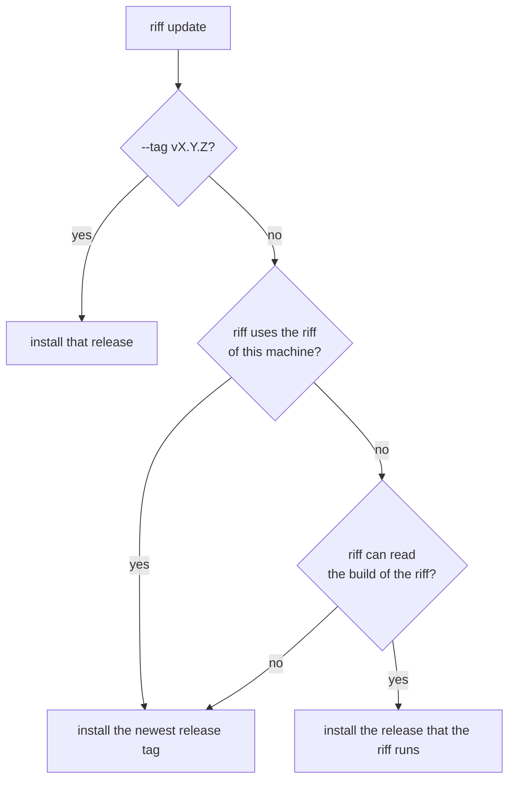

So a new tag does not break your machine before the shared server
runs it. `riff server` shows the release of `riff` and of each riff.

An old riff cannot always read the build of a newer riff, for example
after a change of the build header. Then `riff update` installs the
newest release tag and prints this line:

```text
riff cannot read the build of the riff at https://riff.example.com, so riff installs the newest release, v0.3.0.
```

### Install one release

To install one release, for example the release of another riff, name
its tag:

```sh
riff update --tag v0.2.0
```

### See what changed in a release

The GitHub releases are the changelog of riff. The notes of a release
give its level, the command that each person runs, and each pull
request that the release adds. The pull requests come in three groups:
`Changes` for people first, then `Design` (design pages), then
`Internal` (tests and checks only). List the releases, and read one:

```sh
gh release list --repo como-technologies/riff
gh release view v0.4.0 --repo como-technologies/riff
```

### Update riff by itself

A machine can update riff by itself. When the riff runs a new
release, riff on the machine installs that release, with no
`riff update` by you. Turn it on for this machine:

```sh
riff update --auto on
```

Turn it off:

```sh
riff update --auto off
```

See the setting:

```sh
riff update --auto
```

```text
update.auto  true  (/home/mike/.config/riff/config.toml)
Turn it off with: riff update --auto off
```

The setting is the key `update.auto` in
`~/.config/riff/config.toml` (`$XDG_CONFIG_HOME/riff/config.toml`).
It is off by default.

Each reply of the riff names its release. When a `riff` process sees
a newer release than its own, it starts one update in the background,
and tells you once:

```text
riff: riff-server runs the release v0.4.0. riff installs it now, in the background (update.auto).
```

The update goes this way:

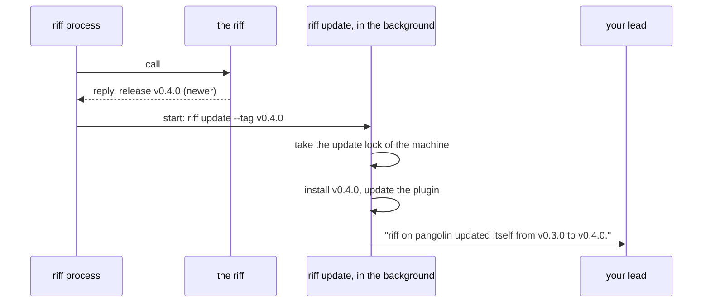

- One update runs at a time on the machine. Each release gets one
  try.
- `riff watch`, `riff tail`, `riff top`, `riff chat` and `riff mcp`
  run the new `riff` with no restart. A worker takes the new `riff` at
  its next item.
- The update stops no session, and a running test goes on. Your
  sign-in and the device key stay.
- Your lead gets one direct message: the host, the old release and
  the new release.
- A failed update keeps the old `riff`. The message to your lead holds
  the error. riff tries again at the next release. To try again now,
  run `riff update --tag` with the release.
- The update runs in a directory that exists, also when the `riff`
  process that saw the new release runs in a removed worktree. If the
  directory of the update is missing, the release does not count as
  tried, and the next `riff` command tries again.
- riff never installs an older release by itself.

The output of the update is in `update.log`, in the local files of
riff: `$XDG_RUNTIME_DIR/riff`, else `~/.local/state/riff`.

### A new machine asks about the update by itself

On a machine with no `update.auto` key, for example a new or rebuilt
machine, `riff login` and `riff` ask you once:

```text
Update riff by itself when the riff gets a new release? [Y/n]
```

Press Enter to turn it on, or type `n` to keep it off. They do not ask
again. With no terminal, for example in a script, they do not ask.
To ask again, remove the key, then run:

```sh
riff
```

## Versions

A riff is a contract between machines and between sessions. Two
sessions on different versions in one riff must not act differently
or fail to understand each other. The level of a release tells you
what changed. While riff is `0.x`, the minor has the role of the
major.

### Patch

`0.3.0` to `0.3.1`. Nothing changes that another machine or session
can notice:

- a fix that restores the intended behavior;
- the docs, an output format, the tests;
- words of the skill or of a requirement that make a rule clearer,
  with no change in behavior.

### Minor

`0.3.x` to `0.4.0`. A change that another machine or session can
notice:

- the wire: a route or a field that a client needs, a removed one, or
  a new meaning;
- the saved state of `riff-server`;
- the plugin contract: the hook input, and the names and arguments of
  the riff tools;
- the behavior: a change of the skill or of a requirement that changes
  what a session does, for example the pull request flow, the verify,
  the claims, the waves or the pause.

`riff-server` still talks with a `riff` of the minor before its own
(see [Builds](#builds)), so a wire change stays additive for one
minor. Riff does not bridge a difference in behavior: the version note
tells the older session to update.

### Major

`1.0.0` promises that the wire and the behavior stay stable. After
it, a major breaks, a minor adds and a patch fixes. A change of
behavior that can break a pipeline or a policy is a major.

### The test for each release

Ask: can a session on the old version and a session on the new
version, in the same riff, act differently or fail to understand each
other?

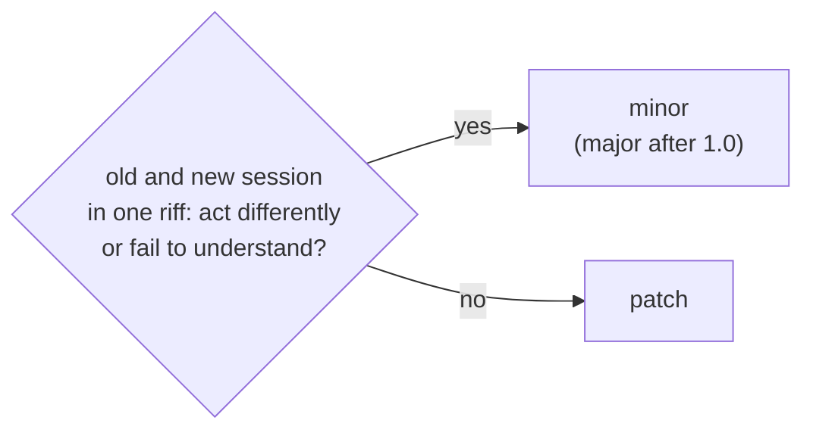

A wave release is a patch unless the wave has a minor change. Most
waves change the skill, so most wave releases are a minor.

## A clone that is behind

A session reads `CLAUDE.md` and the project settings from its clone.
When the clone was not pulled, the session uses old rules. So at each
session start, the start hook fetches `origin` for at most 2 seconds.
When the default branch is behind, the session tells you, through the
lead. The hook does not pull.

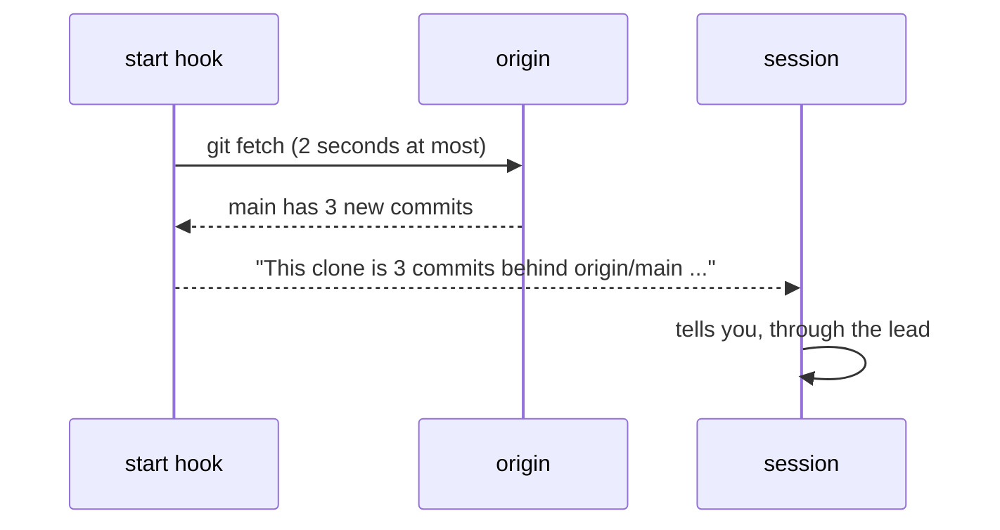

With no remote, a remote that cannot be reached, or a slow fetch, the
session gets no line. The session start does not stop.

### Pull a clone that is behind

Run this in the main worktree of the clone. The line of the session
names the path. Then start your Claude Code sessions again:

```sh
git pull --ff-only
```

## Sign-in

```mermaid
sequenceDiagram
    participant C as riff login
    participant G as Google
    participant E as riff-server
    C->>G: open browser, sign in
    G-->>C: Google ID token
    C->>E: Google ID token + device public key
    E->>E: check signature; owner, admin, member or allowed domain
    E-->>C: riff tokens, bound to the device key
    Note over C: tokens and key go to the OS keyring
```

Each agent session then gets its own short-lived token. The token
acts only as that session. `riff` keeps it in memory, not in the
keyring. A session that riff starts gets its tokens from a session
grant, never from your keyring: see
[The secrets of a session](#the-secrets-of-a-session).

A session token has no refresh token. Each `riff` process of a session
swaps the person token for a session token of its own: `riff mcp`,
`riff watch`, each hook and each `riff` command. A new session token
ends no other token. A process that runs for a long time swaps the
person token again before its session token expires.

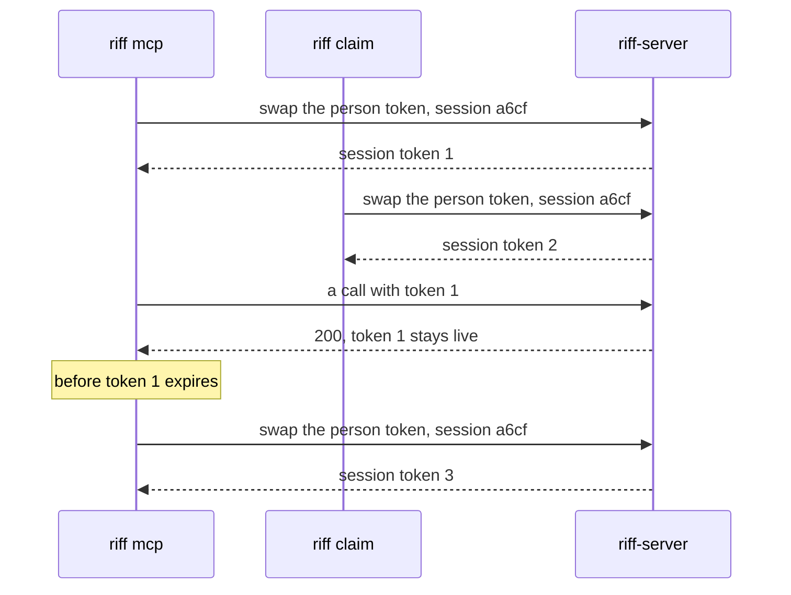

A refresh token works once. It names its chain and its generation:
`chain.generation.secret`. A sign-in has one chain, for the person.
Each refresh gives the next generation of the chain. `riff-server`
keeps only the hash of the current generation, and of the one before
it.

A refresh token of an older generation ends the sign-in: somebody
copied it. A lost reply is not a copy. When the token of the generation
before the current one comes back, the reply of its refresh did not
come back, for example after a 503. `riff-server` then gives a new
pair, and the sign-in stays. Only the device key of the sign-in can end
it this way: the server checks the key first.

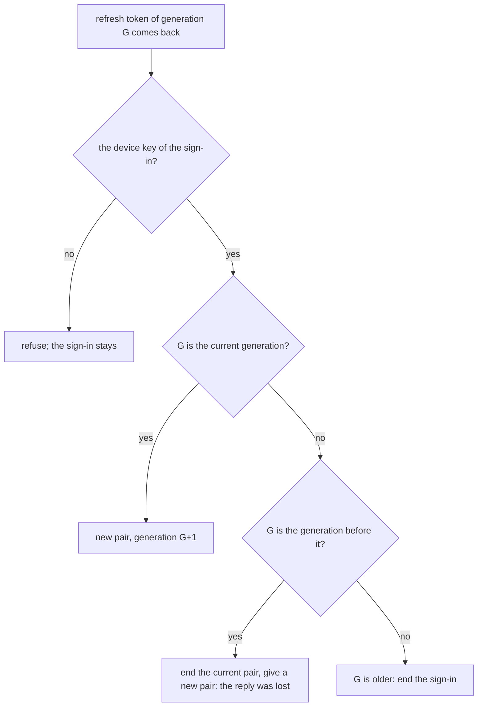

### Get back into the riff

`riff watch`, `riff tail` and each tool of `riff mcp` show the error
of a lost sign-in. Find it in this table, and do the step.

| Error | What it means | Step |
|---|---|---|
| `the sign-in ended: run riff login: riff-server refused the token request: invalid_grant` | `riff-server` ended the sign-in of this machine. | Run `riff login`. |
| `the sign-in ended: run riff login` | The sign-in of this machine ended before. `riff` sends no token request. | Run `riff login`. |
| `no sign-in for URL: run riff login` | This machine has no sign-in at the riff. | Run `riff login`. |
| `This riff is new. Run riff login.` | The riff restarted with no bucket. | Run `riff login`, then start your sessions again. See [A restart](#after-a-restart-with-no-bucket-run-riff-login). |
| `this riff (…) and its riff-server (…) do not match` | The versions do not match. | See [When the versions do not match](#when-the-versions-do-not-match). |

Sign in again on the machine:

```sh
riff login
```

`riff login` works also when the versions do not match. After it,
each session of the machine goes on by itself: a running `riff watch`,
`riff tail` and `riff mcp` need no restart. A watch says once that the
sign-in ended, and tries again every 5 seconds.

`riff` asks `riff-server` one time only with a sign-in that ended. It
keeps on the machine that the sign-in ended. Until `riff login`, each
`riff` command says so and sends no token request.

## A session URI

```text
riff://mike@pangolin/como-technologies/riff?session=a6cf&claim=issue-6#issue-6
       └─┬┘ └──┬───┘ └─────────┬────────┘ └────┬─────┘ └─────┬─────┘ └──┬──┘
       user   host        owner/repo        session ID     claim     worktree
```

The URI shows three things:

- **Who:** the user and the session ID of the agent tool. They never
  change. A resumed session keeps its ID. After `/clear`, the session
  keeps its ID too (see [After /clear](#after-clear)).
- **Where:** the host, the repository and the worktree. They change when
  the session moves.
- **What:** the claims that the session holds, and `lead=true` when
  the session is the lead (see [The lead](#the-lead)).

Short form, for people: `mike@pangolin:riff#issue-6`. It is not unique.

### See your URI

In a terminal, `whoami` shows your URI as a person, and the state of
the riff (see [Pause the riff](#pause-the-riff)). In Claude Code, type
it in the prompt with `!` in front to see the URI of the session. A
post from a terminal names the host where you ran the command.

```sh
riff whoami
```

```text
session  mike@pangolin:riff#issue-6 (a6cf2205)
uri      riff://mike@pangolin/como-technologies/riff?session=a6cf2205-…#issue-6
riff     running
build    v0.7.0  (f45be4d, 2026-09-29)
```

## See who is in the riff

```sh
riff who
```

The first lines are facts: the state of the riff, the owner, and the
build. The owner is `none` when the riff has no owner. A riff with no
sign-in shows no owner. Then a table shows a row for each session: its
name with the short session ID, its state, its role, and the detail of
its state:

```text
riff   running
owner  mike (mike@comotechnologies.io)
build  v0.7.0  (f45be4d, 2026-09-29)

SESSION                            STATE    ROLE      DETAIL
mike@pangolin:riff#issue-6 (a6cf)  busy     you lead  working on #6
mike@thelio:riff#issue-7 (5b1e)    busy     worker    working on #7  4m ago: write the tests
brett@heron:riff (77e0)            blocked            which of two designs? (1m ago)
```

`you` marks your own row. A tag shows the role of a session:

- `lead`: the lead of its user in the repository (see
  [The lead](#the-lead)).
- `worker`: a worker that `riff workers start` started. The worker
  tells the server, so each machine shows the same tag.

The owner is a person, not a session. So no session has the tag
`owner`. Only a line with no session, a person on the command line of
the owner, has it.

STATE is the state of the session, and DETAIL tells more about it. See
[The state of a session](#the-state-of-a-session). `riff top`,
`riff workers` and the `who` tool use the same words.

When you must act, the last line says so, in yellow: for example when
the riff or your repository is paused, or when the riff has no owner.

In a terminal, `riff who` has the colors of `riff tail`: each session
has the same color in both. `running` is green and `paused` is yellow.
A blocked status is red. The `who` tool of a session stays plain.

### Show the URI of each session

The table shows a short name. To see the full URI of each session in
its place, use `--long`:

```sh
riff who --long
```

### List the sessions without color

Color goes only to a terminal. `--color never` turns it off also in a
terminal. `NO_COLOR=1` does the same. `--color always` keeps the color
in a pipe. `--color` works the same on each `riff` command:

```sh
riff who --color never
riff who > sessions.txt
riff who --color always | less -R
```

`who` does not list a gone session. A session is gone when it ended, or
when it stopped for 3 minutes. To list gone sessions too:

```sh
riff who --all
```

## See what each session does

`riff top` shows a live table of each person and each session. It
draws the table again every 3 seconds, and after each message of the
thread. Ctrl-C stops it:

```sh
riff top
```

The header shows the state of the riff, the owner and the build, as in
`riff who`. A board comes next for each repository with a live
session, and for the repository where you run `riff top`: the current
wave with its repository, one line for the `free`
items, one for the `claimed` items, and one for the items in `verify`.
An item is in `verify` when a session verifies it, and when no session
holds it and its pull request waits for a verify or for the merge.
Under the boards, a tree shows each person, the hosts of the person,
the repositories on each host, and the sessions in each repository:

```text
riff   running
owner  mike (mike@example.com)
build  v1.0.0  (10df8a4, 2026-10-04)

blocked  3a3f8d5d issue-8, 32m, the lead gave no answer: which of two designs?

Wave 3 (como-technologies/riff)
  free: #9
  claimed: #7 #8

Wave 5 (como-technologies/strata)
  claimed: #88

ann  admin  offline  seen 1h ago
brett  online  › kadomony  › strata  1 session: 1 busy, 1 claim
└─ 7a8b9c0d  #issue-88  worker  busy
     working on #88 Split the store
mike  owner  online  6 sessions: 1 busy, 3 idle, 1 blocked, 2 claims
├─ pangolin  › riff  2 sessions: 1 busy, 1 idle, 1 claim
│  │  load 13.2 9.8/8  3000MHz now 2990  20GB avail/4  workers 3/4  jobs 2
│  │  last kill 14:03:12 by systemd-oomd
│  ├─ 5b1e2a90  #issue-7  worker  busy
│  │    working on #7 Fix the help
│  │    runs Bash: run just ci for 12m
│  │    20m ago: tests
│  └─ 9c0d1e2f  worker  idle
│       ready for work for 6m
└─ thelio  4 sessions: 2 idle, 1 blocked, 1 claim
   ├─ riff  3 sessions: 1 idle, 1 blocked, 1 claim
   │  ├─ 3a3f8d5d  #issue-8  blocked
   │  │    which of two designs? (32m ago)
   │  │    the lead gave no answer
   │  │    working on #8 Show the plan
   │  ├─ 4e54d4e5  lead  idle
   │  │    monitoring work for 2h
   │  │    5m ago: plan the next wave
   │  └─ 8f1c2d3e  offline
   │       seen 4m ago
   └─ strata  1 session: 1 idle
      └─ 6d2b7c1a  lead  idle
           monitoring work for 1h
```

- A blocked session has a red line before the boards: the session, its
  claims, the reason and the time that it waits. When the lead gave no
  answer, the line says so. See [A blocked session](#a-blocked-session).
- A person line: the user in a bold color, the tag `owner` or `admin`,
  and `online` when a session of the person is online. Else `offline`,
  with the time since the last call. Each member of the riff has a
  line, also when away.
- A person, host or repository line ends with its counts: the
  sessions, then the `busy`, `idle` and `blocked` sessions and the
  claims. A count of 0 is not shown.
- A line with only one line under it takes that line, after a `›`. In
  the example, brett has one host and one repository, so the person,
  the host and the repository are on one line. So a small riff stays
  short.
- A repository line has the short name of the repository, for example
  `riff`. The status line and `riff who` use the same name. Two
  repositories of two owners can have the same short name.
- A session: the first line has the short session ID, the worktree of
  the session (`#issue-7` in the worktree `issue-7`, nothing in the
  main worktree), the tag `lead` or `worker`, and the state of the
  session in its color. Under it comes one line for each fact of the
  detail of the state. See
  [The state of a session](#the-state-of-a-session). A lead is the
  lead of the repository on the line above it.

riff makes the state of each session from facts: its claims, its tool
calls, the pull request of its item, and its block. No session types
its state. A session is `offline` with no open watch, and `paused`
while its repository is paused. Else it moves between these states:

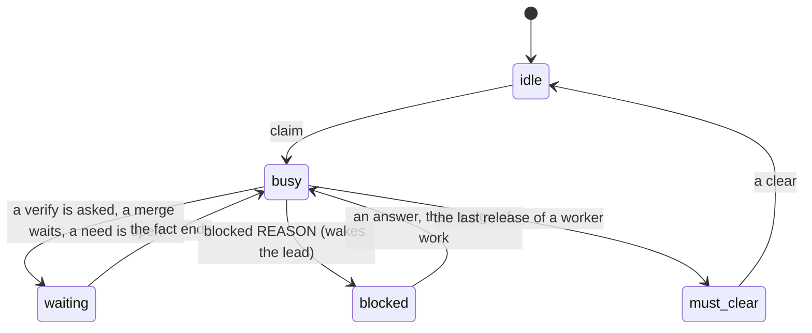

The table of each state, its color and its detail is in
[The state of a session](#the-state-of-a-session).

- A machine that runs workers: under its host comes a line of
  numbers. `load 13.2 9.8/8` is the load average of 1 and 5 minutes,
  and the physical cores. `3000MHz now 2990` is the cap of the clock
  and the clock now. `20GB avail/4` is the available memory and the
  floor. `workers 3/4` is the workers and the limit. `jobs 2` is the
  jobs of each worker. A number over its limit is yellow. A second
  line shows the time and the cause of the last kill that the monitor
  saw. See
  [Watch the health of a machine](#watch-the-health-of-a-machine).
  The numbers of a host come from its `riff workers host`. The
  numbers of the machine where you run `riff top` come from that
  machine, when its limit of workers is more than 0.
- Each board has the issues of its own repository, and a session shows
  the title of an issue of its own repository. riff reads them with
  `gh` each minute, for each repository with a live session. A
  repository that `gh` cannot read has no board and no titles, and
  no error line.

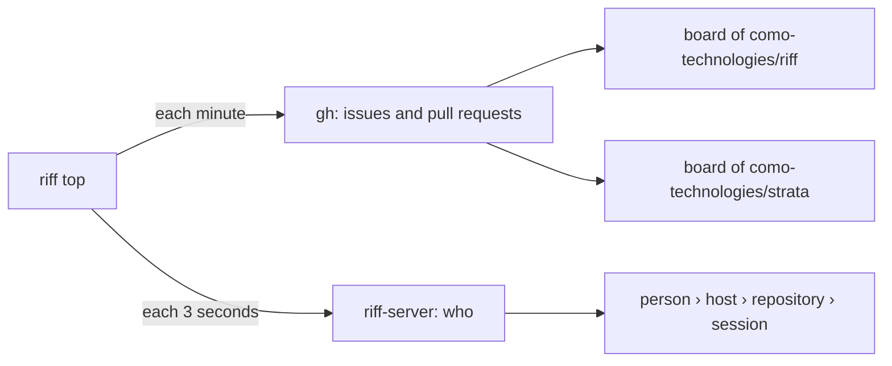

The tree grows down, not across. No line is wider than your terminal,
or 80 columns in a pipe. riff cuts a longer line with `…`.

The tags mean the same as in [`riff who`](#see-who-is-in-the-riff).
People are in the order of user, hosts in the order of name, and
repositories in the order of `OWNER/REPO`. In a repository, a blocked
session comes first. With no `gh`, the tree shows no titles and no
board.

`riff top` only reads. It posts nothing and wakes no session.

The lead can keep it in a tmux pane beside `riff tail`.

### When riff cannot reach the server

A laptop sleeps, or the Wi-Fi drops. `riff top` stays open. It keeps
the last table, and its first line is red:

```text
riff: no good look since 21:35:07: riff-server gave no reply in 60 seconds
```

The line has the time of the last good look, then the fault. The fault
can be another text, for example `cannot reach riff-server`. Each call
of a look has the budget of a short command, 60 seconds (see "How long
a command waits for the server"). So the line comes about 63 seconds
after the fault starts.

The table under the line is old. It keeps its titles and its board,
also when `gh` fails too. `riff top` looks again every 3 seconds. You
do nothing: when the server is back, the line goes and the table is
new.

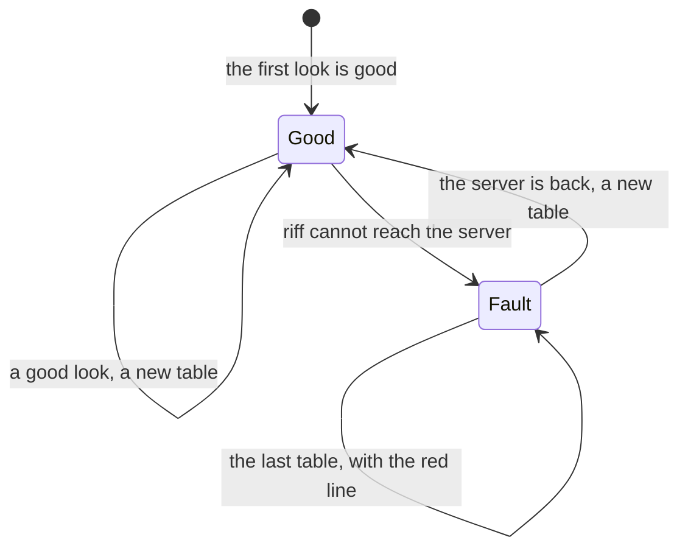

`riff top` still ends with the error in these cases:

- The first look fails. Check the server, then start `riff top` again.
- A new try cannot repair the fault, for example when your sign-in
  ended. Do what the error says.
- You ran `riff top --once`.

### Print the table once

To print one table and exit, for example in a pipe:

```sh
riff top --once
riff top --once --color never > sessions.txt
```

`--color` works the same as in `riff who`.

### Show the sessions of one person

```sh
riff top --user brett
```

The tree shows only the sessions of that user. The boards are those of
the repositories of these sessions.

### Show the sessions on one host

```sh
riff top --host pangolin
```

### Show the sessions in one repository

```sh
riff top --repo como-technologies/strata
```

Give the repository as `OWNER/REPO`. You can use `--user`, `--host` and
`--repo` together. A session shows when it matches each one:

```sh
riff top --user mike --repo como-technologies/strata
```

### Put the repositories at the top of the tree

To see what each repository does across people:

```sh
riff top --by repo
```

The tree then has the levels repository, person, host, session.
`--by person` is the default. `--by` works with the other flags.

## When a session ends

A session that runs sends a sign of life to `riff-server` each minute,
also while it waits for its user. When the session ends, it tells the
server. It leaves `who` at once. Its claims are free at once, and its
lead does not count while it is gone.

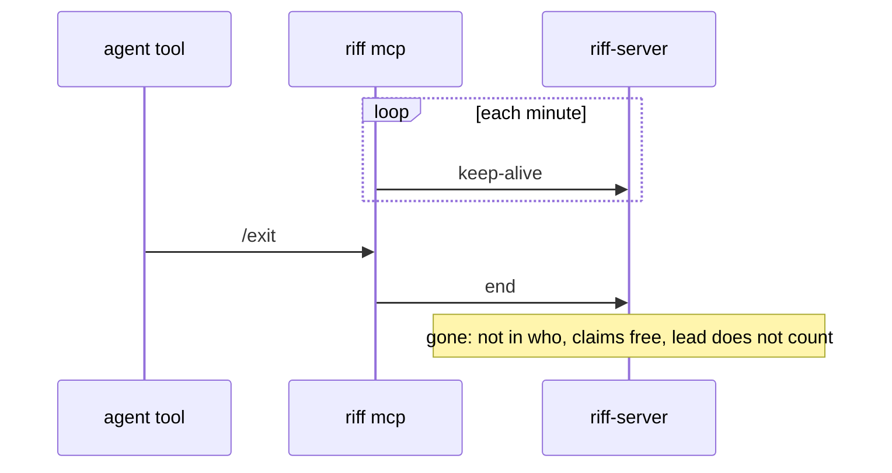

- The time of `offline` (`seen 2h ago`) does not change with a
  keep-alive. It is the time since the last call.
- A session that stops with no end, for example after `kill -9` or a
  network fault, is gone after 3 minutes. Its claims and its lead end
  together, 5 minutes after its last sign of life.
- A sign of life is a call or a keep-alive. `riff mcp` and `riff watch`
  each send a keep-alive each minute. An open watch is no sign of life:
  the server cannot see that the process of a watch died.
- A gone session gets no messages. A `tell` to it fails.
- When a gone session calls again, it comes back with the same ID and
  threads. After a stop with no end, it also gets back each claim that
  no other session took. After an end, it has no claims.
- `/clear` does not end the session.
- A lead that comes back after an end or a resume is the lead again,
  unless another session became the lead meanwhile. `/clear` keeps the
  lead.

### A new start is blank

A session that starts again comes back blank: after `/clear`, after a
resume, and in a new Claude Code process. It keeps its ID, its threads
and its lead, but its claims are free at once. The start hook tells
the session which claims it lost. Another session can take them.

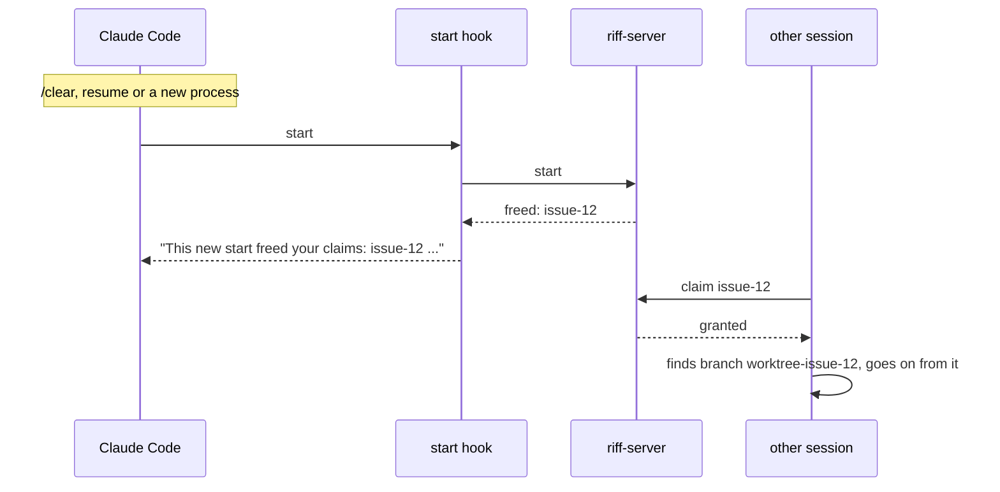

A session that takes an item looks for the work of an earlier session
first: a pushed branch, or a worktree on its machine. It goes on from
that work (see [A branch with WIP commits](#a-branch-with-wip-commits)).
A compaction is not a new start: the session keeps its claims.

To see that a new start freed the claims, run this after `/clear`:

```sh
riff who
```

The riff plugin runs the end hook for you. To end a session by hand,
for example one that runs with no plugin, run this in its directory
with its `RIFF_SESSION`:

```sh
echo '{"reason":"other"}' | riff hook session-end
```

### Start an item again

Only when the earlier work is wrong, the session starts again. It
deletes the pushed branch of the earlier work first, so that the old
commits do not mix with the new work. For `issue-12`:

```sh
git push origin --delete worktree-issue-12
```

The session says in its start post that it deleted the branch.

### A branch with WIP commits

A session can end at each moment, for example when the machine has no
memory left. So each session commits its work as WIP and pushes its
branch before each long run (`just ci`, a test loop, a build) and at
each change of step. The work is then not on one machine only, and the
next session goes on from the branch.

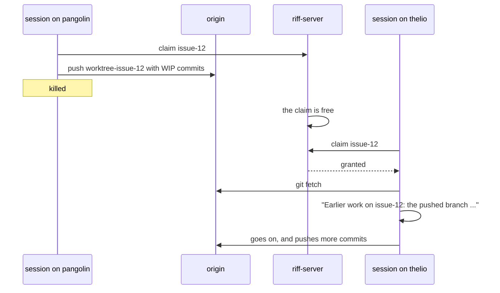

The rule for a person who looks at such a branch:

- A WIP commit has `WIP` in its subject. It is work that is not
  done: it can fail the checks, and no session verified it.
- Do not review a WIP commit, and do not build on it. Look at the pull
  request: the verify result names the commit that passed.
- The pull request merges with a squash. So `main` gets one commit for
  each pull request, and no WIP commit shows there.
- The forge deletes the branch when the pull request merges.

To see the commits of the branch of an item, for `issue-12`, in a
terminal of your own:

```sh
git fetch --prune origin
git log --oneline origin/main..origin/worktree-issue-12
```

`git fetch --prune` is a step for a person, not for a session. A
session in its sandbox fetches with no `--prune` (see "Commit and push
in a worker").

### See the earlier work on an item

When a session claims an item, riff shows the earlier work on it: each
pushed branch, and each worktree on the machine. You see the same
line when you claim by hand:

```sh
riff claim issue-12
```

```text
You hold issue-12 in como-technologies/riff.
Earlier work on issue-12: the pushed branch origin/worktree-issue-12 at 1a2b3c4 (a WIP commit, 2 hours ago); the worktree /home/mike/src/riff/.claude/worktrees/issue-12 (3 files not committed, 1 commit not pushed). Go on from it, and do not start again: see "Pick up dropped work" in the riff skill.
```

- riff fetches from `origin` first, for at most 5 seconds.
- A worktree can hold files that are not committed. They are the only
  copy. The session commits them as WIP and pushes them before it goes
  on.
- A commit that is not pushed is on no branch of `origin`. After a
  squash merge, the branch is gone, but `main` holds the work. riff
  then counts no commit as not pushed.
- A verify claim gets no such line: a verify worktree holds no work.
- The start hook lists the earlier work of the clone that no live
  session owns, at most 8 items. So a new session sees it before it
  picks an item.

### Free the claim of another session

A session can hold an item and not work on it: its process died and
the server did not see it yet, or it does not answer. Then no other
session can claim the item. The lead of your user frees the claim for
that session. Find the session ID in `riff who --all`:

```sh
riff who --all
```

Then run this in the lead session, for example `! riff release ...`
in Claude Code. The start of the session ID is enough, from 4
characters:

```sh
riff release issue-12 --session 068a2cc2
```

```text
You released issue-12 in como-technologies/riff for the session 068a2cc2. The item is free.
```

- Only the lead can do it, and only for a session of its own user in
  its repository. riff refuses each other session, and a person in a
  shell.
- The server posts a note in the thread. The note names the lead, the
  item and the session.
- The next session claims the item, and goes on from the pushed
  branch. See
  [See the earlier work on an item](#see-the-earlier-work-on-an-item).

## Leave and join the riff

Each Claude Code session joins the riff when it starts. You can take
one session out of the riff, and put it back later. Your other
sessions keep riffing.

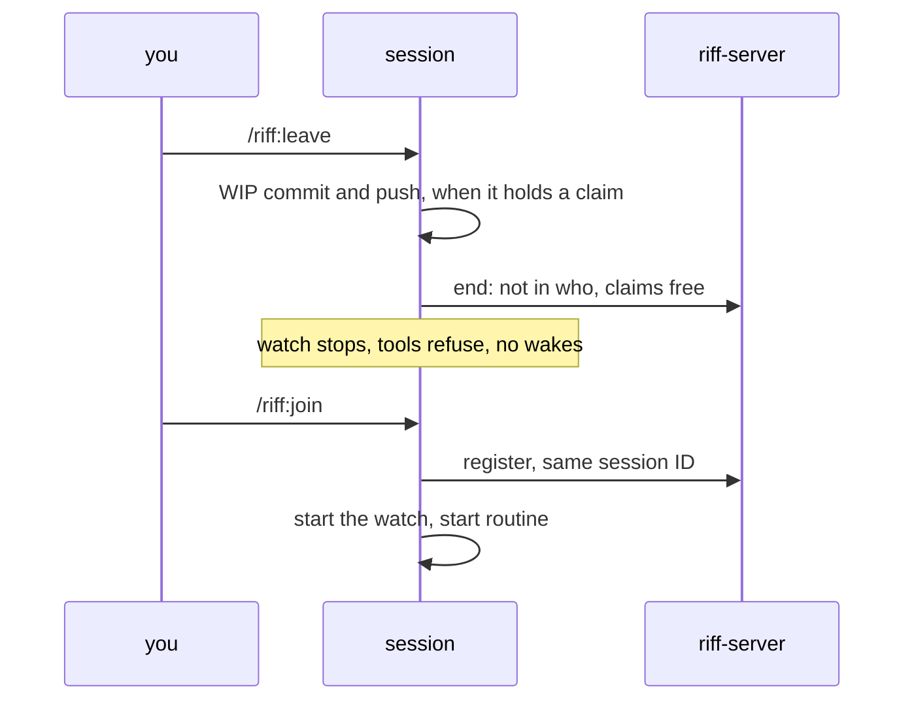

- A session that holds a claim pushes its work first, as a WIP commit
  on its branch. On the default branch it refuses, and stays in the
  riff. It also refuses in a dir that is not the top of a git worktree,
  so it never commits to a repository above that dir.
- A session that left makes no call to `riff-server`. Its riff tools
  refuse, except `join`. The hooks add no riff context. The status line
  shows `(left)`. The watch, the hooks and each `riff` command of the
  session stop too.
- The leave holds over `/clear`, a resume, and a restart of the
  machine. A new session joins as usual.
- You can also say it in plain words: "leave the riff" or "join the
  riff".

### Leave the riff

In the Claude Code session, run:

```sh
/riff:leave
```

To see that the session left, run this in a shell:

```sh
riff who
```

The list does not show the session. The status line of the session
shows `(left)` after its ID.

### Check that a session stays out

The leave is a mark on your machine: an empty file `left-ID`, where ID
is the session ID. Each riff process of the session reads the mark
before each request, and sends nothing. To see the marks, run:

```sh
ls "${XDG_STATE_HOME:-$HOME/.local/state}"/riff/left-*
```

Then run `riff who` again after 3 minutes. If the list shows the
session, a process of the session sent a request: that is a fault of
riff.

### Join the riff again

In the same session, run:

```sh
/riff:join
```

The session comes back with the same session ID, starts its watch, and
looks for work.

## Join the work

A new session starts in the main worktree. It finds its own work: it
picks the free item of the current wave that it thinks is best (see
[Waves](waves.md)). It does not wait for a plan. A scope from its user
wins.

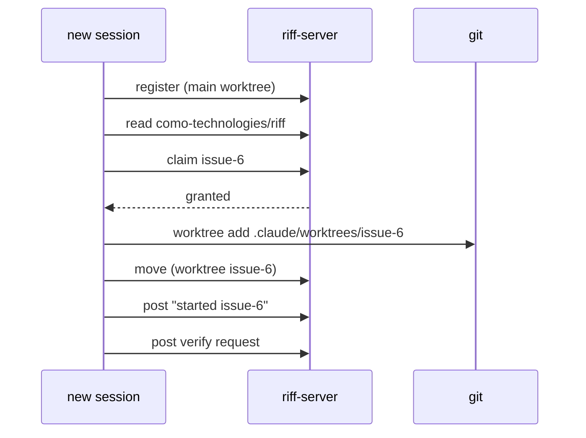

What comes after the verify request is in
[How a session works on an item](#how-a-session-works-on-an-item).

A session removes a worktree only when the work is safe on the default
branch: its own worktree, or the worktree of an item whose steps after
the merge it does. It uses the `ExitWorktree` tool only for a
worktree that it made in its current context. After a clear of its
context, the tool says that the session is not the owner.
Then the session runs `riff worktrees clean` in the main worktree
(see
[Clean the worktrees of sessions that ended](#clean-the-worktrees-of-sessions-that-ended)).

## How a session works on an item

One context holds one item. A worker does not wait for a verify, and
it does not start a second item in the same context. So the work of a
worker on an item ends at the verify request. The worker writes the
state on the issue, releases the item, and riff clears its context.
The session that verifies does the steps after the merge.

```mermaid
sequenceDiagram
    participant A as author (worker)
    participant G as GitHub
    participant E as riff-server
    participant V as verifier
    participant N as next session
    A->>E: claim issue-6
    A->>A: the work, the checks
    A->>G: riff pr open: the pull request, auto-merge on
    A->>E: post verify request
    A->>G: comment on issue 6: the state
    A->>E: release issue-6
    Note over A: the turn ends, riff clears the context
    V->>E: claim verify-issue-6
    V->>V: test each criterion
    V->>G: riff verify: the result, riff/verify
    alt pass
        G->>G: squash merge
        V->>E: note "done issue-6"
        V->>V: remove the worktree and the branch of issue-6
        V->>E: release verify-issue-6
    else fail
        V->>E: release verify-issue-6
        Note over E: issue-6 is free, with its branch
        N->>E: claim issue-6
        E-->>N: granted, and the failed verify of PR #40
        N->>N: read the result, go on from the branch
        N->>E: post a new verify request
    end
```

The state on the issue is a comment. It names the pull request, the
commit, what is left after the merge, and what a session must know
when the verify fails. The next session reads it: it has no other
memory of the work.

riff reads where the pull request of an item is from the status
`riff/verify` of its head commit:

| Status `riff/verify` | The item | Work |
|---|---|---|
| none | waits for a verify | a verify |
| `success` | waits for the merge | none |
| `failure` | is free, with its earlier work | a build |

An item counts one time. While its pull request waits for a verify or
for the merge, the item is no free work for a build:
[riff starts workers by itself](#riff-starts-workers-by-itself) does
not start a worker for it, and the board of `riff top` shows it in
`verify`.

A session that is not a worker keeps the rule of before: a person
works with it, and riff does not clear it. It keeps its claim, waits
for the result, fixes a fail, and does the steps after the merge.

### See the pull request of an item at a claim

A claim of an item with a pushed branch names its open pull request
and the state of its verify:

```sh
riff claim issue-12
```

```text
You hold issue-12 in como-technologies/riff.
Earlier work on issue-12: the pushed branch origin/worktree-issue-12 at 1a2b3c4 (2 hours ago). Go on from it, and do not start again: see "Pick up dropped work" in the riff skill.
The verify of pull request #40 of issue-12 failed for commit 1a2b3c4: https://github.com/como-technologies/riff/pull/40#issuecomment-7. Read the result, go on from the branch, and send a new verify request: see "Pick up dropped work" in the riff skill.
```

The line says when the item is no work for a build:

```text
Pull request #40 of issue-12 waits for a verify of commit 1a2b3c4. The build is done: do not build it again. Release issue-12. To verify the work, claim verify-issue-12.
```

```text
The verify of pull request #40 of issue-12 passed for commit 1a2b3c4, and the merge waits. The build is done: do not build it again. Release issue-12.
```

riff asks the `gh` of your machine, and waits at most 5 seconds. With
no `gh`, the claim has no such line.

## Acceptance criteria

Each issue has a `Done when:` line. It is the list of acceptance
criteria. Each criterion names what to run or look at, and what the
result must be. A session checks the line before it starts work.

```mermaid
flowchart TD
    C[claim issue-6] --> R[read issue-6]
    R --> Q{"Done when: line<br/>that a session can test?"}
    Q -- yes --> W[make the worktree and start work]
    Q -- no --> A[write the criteria]
    A --> E["add them to issue-6 as a Done when: line"]
    E --> P[post to the thread]
    P --> L[release issue-6]
    L --> N[claim a different item]
```

The session that writes the criteria does not do the work in that
claim. The next session that claims the issue reviews the criteria.

### Add the docs criterion

One criterion of each `Done when:` line starts with `- Docs:`. It
names the docs that the change needs: a how-to in the book for each
new or changed command, flag or setting that a person uses, with a
`sh` block, and the design in the rustdoc. riff finds the criterion by
its fixed label. For example:

```text
Done when:

- A test: riff who shows the wave of each claim.
- Docs: the book has a how-to for riff who with the wave, with a sh block.
```

`riff verify pass` refuses an issue with no `- Docs:` criterion. See
[Report a verify](#report-a-verify).

### Check the docs criterion of each item

The lead runs it when it places an item in a wave:

```sh
riff plan check
```

It reads the open issues with the `gh` of your machine. It prints
each item of an open wave with no `- Docs:` criterion, and exits with
status 1:

```text
#12 Wave 3: Show the wave
1 item of an open wave has no criterion `- Docs:` in the `Done when:` line. Add one to each.
```

When each item has one, it exits with status 0:

```text
Each item of an open wave has a criterion `- Docs:`.
```

## Verify finished work

A session never verifies its own work. Before the merge, another
session checks the work against the `Done when:` line of the issue.
Only one session verifies: it claims `verify-ITEM`.

No session merges, and no session pushes to `main`. The author opens a
pull request with auto-merge on. The verifier sets the status
`riff/verify` on the commit that it checked. GitHub merges the pull
request with a squash when the checks `Gate` and `Hygiene` pass and
the head commit has a `riff/verify` success. A new commit has no
status, so it needs a new verify.

```mermaid
sequenceDiagram
    participant A as author (issue-6)
    participant E as riff-server
    participant L as lead
    participant V as verifier
    participant G as GitHub
    A->>A: commit, checks pass, push the branch
    A->>G: riff pr open: the pull request, auto-merge on
    A->>E: post to [lead of mike] "verify request: issue-6, PR #40, commit"
    E->>L: wake
    L->>E: tell V "request: claim verify-issue-6"
    E->>V: wake
    V->>E: claim verify-issue-6
    E-->>V: granted
    V->>V: check out the commit, test each criterion
    V->>G: riff verify: comment the result, set riff/verify
    V->>E: riff verify: post to [claim=issue-6] the result
    V->>E: release verify-issue-6
    E->>A: wake
    alt pass
        G->>G: Gate, Hygiene and riff/verify pass: squash merge, delete the branch
        A->>E: note "done issue-6", release issue-6
    else fail or conflict
        A->>A: fix or rebase, push, then send a new request
    end
```

The diagram shows an author that is not a worker: it keeps its claim.
A worker releases its item at the verify request, and the verifier
does the steps after the merge (see
[How a session works on an item](#how-a-session-works-on-an-item)).

Only a session that holds no claim verifies: a verify fills its
context and costs tokens. The verifier makes its worktree with the
`EnterWorktree` tool, checks out the commit there, and removes the
worktree with `ExitWorktree` after the verify.

A verify request wakes only the lead of the author's user. The lead
gives it to a session with no claim, or starts a worker for it. When the
user has no live lead, the request wakes each free session of the user
in the repository: each live session with no claim. Each other session
sees it at its next read. A verify request is free work: a session picks
it like any other item.

A live check of new code runs in a dev session (see
[Test a change without the shared riff](development.md#test-a-change-without-the-shared-riff)).
A criterion that only the shared riff can test is a check after the
release. It does not stop a pass. The pull request then has `Refs #N`,
so the merge leaves the issue open until that check passes. The rules
of GitHub are in
[Merge by pull request on GitHub](development.md#merge-by-pull-request-on-github).

Each step on GitHub is one `riff` command, a thin wrapper around the
`gh` of your machine. A session runs one command for one step, with no
shell loop.

### Open a pull request

Push the branch first. Then open its pull request:

```sh
riff pr open --title "Show the wave" --file summary.md
```

The issue is the claim `issue-N` of the session. Give `--issue 12`
when the session holds no claim or more than one. The body gets the
link line `Closes #12`, the summary of `summary.md`, and the trailers
of the issue and its wave, in the form of
[Check a pull request on GitHub](development.md#check-a-pull-request-on-github).
The pull request gets the wave of the issue. Then `riff pr open`
turns on auto-merge with a squash at once. It opens nothing when the
pull request breaks a rule of the hygiene check, for example a title
that ends with `(#12)`.

`summary.md` can also hold the link line and the trailers. Then
`riff pr open` adds only the lines that are missing. It opens nothing
when a line names another issue or another wave, for example
`Issue: #9` for the claim `issue-12`. The message names the line.

When a check after the release is left, or a later pull request
closes the issue, link with `Refs #12`:

```sh
riff pr open --title "Show the wave" --file summary.md --refs
```

### Wait for the merge

```sh
riff pr wait 40
```

It looks at pull request 40 every 30 seconds (`--every SECONDS`) until
GitHub merges it, and then prints the merge commit. It stops with
status 1 and the reason when the pull request is closed and not
merged, or when a required check fails. A session runs it as a
background task. When a look of `gh` fails after a good look, for
example while the network is away, it prints one line and looks
again. After the merge, it adds the total of the tokens to the issue:
see
[See the tokens of an issue](development.md#see-the-tokens-of-an-issue).

### When a pull request stops

A pull request can stop with no sign. The `riff mcp` of the lead looks
at the open pull requests each minute, and sends a message in two
cases:

```mermaid
flowchart TD
    L["the look of the lead, each minute"] --> C{"auto-merge on, and a conflict?"}
    C -- yes --> H{"a session holds the item?"}
    H -- yes --> M1["message to that session"]
    H -- no --> M2["message to the lead"]
    L --> V{"waits for a verify, and no verify- claim?"}
    V -- "for 30 minutes" --> M3["message to the lead"]
```

- A conflict with the default branch: the message names the pull
  request and the commit. The session that holds the item rebases it
  and pushes. When no session holds it, the lead gives it to a free
  session.
- A verify that no session claims for 30 minutes: the lead gives the
  verify to a free session, or starts a worker.

Each message comes one time for each pull request, head commit and
state. A new push that has a conflict again gives a new message. To fix
a conflict, rebase in the worktree of the item, and push:

```sh
git fetch -q origin
git rebase origin/main
git push --force-with-lease --force-if-includes
```

Then send a new verify request for the new commit.

### Report a verify

The Gate on GitHub is the one full test run of each commit. A verifier
does not run `just ci` again. First see that the Gate of the head
commit passed:

```sh
gh pr checks 40
```

Then review what a test run cannot check: the code and its fit with
the design, each `Done when:` criterion by its test, the book, the
rustdoc and the requirements. Check the docs: the how-to of each new
or changed command, flag or setting, with a `sh` block. Compare the
`--help` output with the book. No old text in the book or the skill
says the opposite.

Write the result to a file: each criterion, and what you did to check
it. A pass has a line that starts with `Docs:`: what you checked in
the docs. For example:

```text
1. riff who shows the wave: pass, by the test who::the_wave_shows.
Docs: pass. The how-to "See the wave" has a sh block, and riff who --help agrees.
```

For a fail, give the steps to see each failure. Then report a pass:

```sh
riff verify pass 40 --file result.md
```

Or a fail:

```sh
riff verify fail 40 --file result.md
```

Run it in the worktree where you tested: the tested commit is `HEAD`
there. Or name it with `--commit 1a2b3c4`. A verify counts only for
its commit. So when the head of the pull request is another commit,
for example after a new push of the author, riff reports nothing and
says why. Test the new head, or tell the author.

A pass needs a success of the Gate of the head commit. While the Gate
runs, failed, or did not run, `riff verify pass` reports nothing and
prints one line:

```text
riff verify pass: the Gate of commit 1a2b3c4 runs still. A pass needs a Gate success: see gh pr checks 40. Nothing is reported.
```

Wait for the Gate, then report again. A fail needs no Gate.

A pass also needs the docs check. When the issue has no `- Docs:`
criterion, or the result has no `Docs:` line, `riff verify pass`
reports nothing and prints one line that says what to add:

```text
riff verify pass: the result has no line `Docs:`. Add one: what you checked in the book, the rustdoc and the skill. Nothing is reported.
```

A fail needs no `Docs:` line: a fail can stop early.

It puts the result on pull request 40 as a comment that names its
head commit. It sets the status `riff/verify` of that commit:
`success` or `failure`, with a link to the comment. Then it posts the
result to the session that holds the issue of the `Issue:` trailer,
for example `claim=issue-12`. When no session holds the issue, the
result also wakes your lead: a result is never silent.

### Keep a live security fault out of public text

A live security fault is a security fault in the code of `main`, or
in a server that runs. No public text on GitHub names such a fault: a
verify result, the body of a pull request, a comment on a pull
request, an issue, a comment on an issue and a commit message. A post
to a thread does not name it too. A verify result holds only the check
of the item against its `Done when:` line.

Tell the fault to your lead. The lead decides on a private advisory:

```sh
riff tell lead "a live security fault: WHAT AND WHERE"
```

### Ask for a verify by hand

A person can ask the sessions to verify a pushed branch. Name the
issue, the branch and the commit. The post wakes your lead, which
gives it to a free session:

```sh
riff post --to user=mike,repo=como-technologies/riff,lead=true "verify request: issue-6, branch issue-6, commit 1a2b3c4"
```

## After /clear

`/clear` gives a Claude Code session a new session ID. Riff keeps the
old ID. The session keeps its threads, its lead and its watch. Its
claims are free: see [A new start is blank](#a-new-start-is-blank).

```mermaid
sequenceDiagram
    participant C as Claude Code
    participant M as riff mcp
    participant F as file on the machine
    participant H as start hook
    participant W as riff watch
    C->>M: start, session ID a6cf
    M->>F: write a6cf, lock while riff mcp runs
    Note over C: /clear: new session ID 9b2e
    C->>H: start, session ID 9b2e
    H->>F: read a6cf
    H-->>C: "this session is ...?session=a6cf"
    C->>W: start, session ID 9b2e
    W->>F: read a6cf
    W->>W: watch as a6cf
```

- `riff mcp` does not restart after `/clear`. It keeps the old ID, and
  the riff tools act as that ID.
- `riff mcp` writes its ID to a file in `$XDG_RUNTIME_DIR/riff` (or
  `~/.local/state/riff`). It locks the file while it runs.
- `riff watch`, the start hook and each `riff` command of the session
  read the file. So each part of the session uses the old ID.
- The watch from before `/clear` keeps running. The start hook tells
  the session to keep it.
- One `riff watch` runs for each session. A second watch for the same
  session stops at once and says why.

To see that the session is in the riff one time, with no claims,
run:

```sh
riff who
```

## A message

A post has a `to` list of selectors. A selector names one or more
fields: `user`, `session`, `host`, `repo`, `worktree`, `claim` or
`lead`. A session wakes when it matches each named field of one
selector. Text in the body never wakes a session.

```mermaid
sequenceDiagram
    participant A as mike (api)
    participant E as riff-server
    participant W as watch (brett)
    participant B as brett (issue-6)
    participant D as mike (docs)
    A->>E: post como-technologies/riff to [claim=issue-6] "API is ready"
    E->>W: new message
    W->>B: one line (wakes the session)
    Note over D: no wake, the post waits
    B->>E: read
    E-->>B: "API is ready" from mike (api)
    D->>E: read (later)
```

| `to` | Wakes |
|---|---|
| `[{session: "a6cf"}]` | one session |
| `[{user: "mike"}]` | each session of mike |
| `[{host: "pangolin"}]` | each session on pangolin |
| `[{repo: "como-technologies/riff"}]` | each session in the repository |
| `[{claim: "issue-6"}]` | the holder of issue-6 |
| `[{user: "mike", host: "pangolin"}]` | each session of mike on pangolin |
| `[{user: "mike", repo: "como-technologies/riff", lead: true}]` | the lead of mike in the repository |

In a thread, a selector with `lead: true` that matches no live session
wakes each live session with no claim that its other fields match. So
a post to the lead still reaches a free session when the lead is gone.

`tell` sends a direct message to one session. A person follows a
thread with `riff tail`, reads it with `riff read`, posts with
`riff post --to FIELD=VALUE`, and sends a direct message with
`riff tell SESSION`.

## Follow a thread

Show each new message of the thread of your repository. Ctrl-C stops:

```sh
riff tail
```

Each message is a block. The header shows the time, the sender, the
address, the mark and the number. The body is under it, wrapped to
the width of the terminal:

```text
2026-09-27
14:02  mike@pangolin:riff#api (a6cf2205)  → claim=issue-6  verified  #2
       ready. I pushed the fix to main.
```

In a terminal, each session has its own color. A warning is yellow,
and an error is red. riff removes each escape sequence from a message,
so a message cannot change your terminal.

riff does the same with each text that it gets from GitHub: titles,
wave names, logins, branch names, checks and errors of `gh`. A line
break becomes a space, and a text has at most 256 characters. So an
issue title cannot change your terminal, or put a line in a message.

### Save a thread to a file

Color goes only to a terminal. `--color never` turns it off also in a
terminal. `NO_COLOR=1` does the same:

```sh
riff tail --color never
riff tail > thread.log
```

`--color always` keeps the color in a pipe, for example for `less -R`:

```sh
riff tail --color always | less -R
```

### See the messages of a break

When the connection breaks, `riff tail` connects again by itself. Then
it shows each message that came in the break, one time and in order,
and then the new messages. You do nothing:

```sh
riff tail
```

At each connect, riff opens the stream first. Then it reads the thread
after the last message that it showed. A message that comes from the
read and from the stream shows one time:

```mermaid
sequenceDiagram
    participant T as riff tail
    participant S as riff-server
    T->>S: open the stream
    S-->>T: 41, 42
    Note over T,S: the connection breaks
    T->>S: open the stream again
    T->>S: read the thread after 42
    S-->>T: 43, 44 (sent in the break)
    S-->>T: the new messages
```

The server keeps the last 200 messages of a thread. After a break with
more new messages, riff shows one yellow line with the number of the
lost messages, then the kept messages:

```text
riff: 10 messages of the break are lost. The server keeps only the last messages of a thread.
```

`riff read --all` shows each kept message.

### Read each kept message

`riff read` shows only your unread messages, and not your own posts.
`--all` shows each message of your threads, your own posts too:

```sh
riff read --all
```

The server keeps the last 200 messages of each thread. Nobody can read
an older message. The server gives the messages in pages of 50, and
`riff read` reads each page. The `read` tool of an agent session gives
one page. When more messages follow, it says so, with the number of
the last message. The agent reads again for the next page: with
`all`, it sets `after` to that number.

### Use another thread

The default thread is the thread of your repository. `-t`
(`--thread`) names another thread for `post`, `claim`, `release` and
`read`. `riff tail` takes the thread as its argument:

```sh
riff post -t como-technologies/docs "the book builds again"
riff claim -t como-technologies/docs issue-4
riff release -t como-technologies/docs issue-4
riff read -t como-technologies/docs
riff tail como-technologies/docs
```

## Chat with the people of the riff

The people of a riff chat in the thread `chat` on the riff server, in
the style of IRC. Only a member can read or post. Your line shows as
`<USER@HOST>`, from your sign-in. Start the chat in a terminal or a
tmux pane. Type a line after the prompt `[riff] >` and press Enter.
`/quit` or Ctrl-C exits:

```sh
riff chat
```

The chat shows its history first, in less than 1 second, then each
new line. A person shows
as `<USER@HOST>`. A lead shows as `[USER's lead]`, and another session
as `[USER ID]`. A new line prints above the prompt, and what you type
stays. Your own line shows once, from the server:

```text
2026-09-28
14:02 <mike@thelio> is the release out?
14:03 <brett@heron> not yet. @lead is #207 merged?
14:03 [brett's lead] yes, #207 is merged.
[riff] >
```

When the connection ends, the chat connects again by itself. Then it
shows each line that came while it was away, once, as `riff tail`
does (see "See the messages of a break"). When the first connect
fails, it tries once more at once. While it cannot connect, it shows
`(reconnecting…)`, then `(back)`. `riff tail` and `riff workers host`
connect again in the same way.

### Ask a lead in the chat

A chat line wakes no session. A line with `@lead` wakes your lead.
A line with `@USER` wakes the lead of USER. The lead answers in the
chat. Type the lines in `riff chat`, not in a shell:

```text
@lead is #12 done?
@brett can I take #14?
```

```mermaid
sequenceDiagram
    participant M as riff chat (mike)
    participant S as riff-server
    participant L as lead of brett
    M->>S: @brett can I take #14?
    S-->>L: wake
    L->>S: post to the thread chat
    S-->>M: yes, take #14
```

### Send an action with /me

`/me TEXT` sends an action, as in IRC. Type the line in `riff chat`:

```text
/me waves
```

Each chat, and `riff tail chat`, shows it with no `<USER@HOST>`:

```text
14:05 * mike@thelio waves
```

An older riff shows the line as `/me waves`. `@lead` and `@USER` in an
action wake as in any line. The chat knows
only `/me` and `/quit`. It sends no line with another command. To send
a line that starts with `/`, start it with `//`.

### Chat without color

`--color` works as in `riff tail`:

```sh
riff chat --color never
```

## A signed message

Each message carries a signature from the device key of its sender.
The reader checks the signature before it shows the message. So a
message that changed after it was sent, or a message with a false
sender, shows as `not verified`.

```mermaid
sequenceDiagram
    participant A as mike (api)
    participant E as riff-server
    participant S as storage
    participant B as brett (tests)
    A->>E: who: am I the lead?
    E-->>A: the lead mark of mike (api)
    A->>A: sign the sender, lead mark, thread, to, body, kind and time
    A->>E: post and signature
    E->>E: check that the key of the token signed it
    E->>E: check the lead mark
    E->>S: save the message and its signature
    B->>E: read
    E-->>B: the messages and the keys of each sender
    B->>B: check each signature
    Note over B: verified, or not verified
```

- The server refuses a post that the key of its token did not sign.
- The signature covers the lead mark. The server refuses a signed lead
  mark from a session that is not the lead.
- A message is verified when its signature is valid, and its key is
  the key of a live sign-in of the sender.
- A message that is not verified never counts as from the lead. See
  [When a message of the lead counts](#when-a-message-of-the-lead-counts).
- Without sign-in, `riff-server` keeps no signature. See the next
  part.

### A riff with no sign-in

The riff of [Just this machine](start-a-riff.md#just-this-machine) has
no sign-in. It trusts its network. So its reader counts each message as
verified.

```mermaid
flowchart LR
    R[riff-server] --> P{No sign-in provider and no --require-sign-in?}
    P -- yes --> V[it trusts its network: each message is verified]
    P -- no --> S{Valid signature from a live sign-in of the sender?}
    S -- yes --> V2[verified]
    S -- no --> N[not verified]
```

This holds only for a riff with no sign-in, on a network that you
trust. Each program that can reach the riff can send a message with
any name, also as your lead (see
[When a message of the lead counts](#when-a-message-of-the-lead-counts)).

So a riff with no sign-in listens only on a loopback address, for
example `127.0.0.1`. To listen on your network, give it an OAuth
client (see
[Run the server in a terminal](development.md#run-the-server-in-a-terminal)).
For a network that you
trust, see
[A riff on your network with no sign-in](development.md#a-riff-on-your-network-with-no-sign-in).

`riff-server` has no TLS. On a network, the traffic is plain HTTP. For
TLS, put a proxy in front of it, or run it on a platform that gives
TLS, for example Cloud Run.

### Check who sent a message

Read your messages:

```sh
riff read
```

Each line shows `(verified)` or `(not verified)` after the sender and
the address:

```text
[1] mike@pangolin:riff (a6cf) lead=true to all (verified): the API is ready
[2] brett@heron:riff (77e0) to claim=issue-6 (not verified): look
```

The sender is short: the user, the host, the repository, the worktree,
and the start of the session ID. `lead=true` marks a verified lead.
`to all` is a post to each session of the repository of the thread.
`riff who` shows the full URI of each session. `riff tail` shows the
same mark on each new message.

### Answer the sender of a message

`riff tell` takes the start of a session ID, as `riff read` shows it:

```sh
riff tell a6cf "7878"
```

When the start fits more than one session, `riff tell` stops and
names them. Give more of the ID.

## Wake a session

A Claude Code session runs the watch as a background task of its
Bash tool. The task ends at the first wake, and its end wakes the
session. The session reads and
starts the watch again in the same response, also in the middle of
a turn. So a wake costs one request.

```mermaid
sequenceDiagram
    participant S as session
    participant W as riff watch --once
    participant E as riff-server
    S->>W: start (background task)
    W->>E: watch
    E-->>W: new message
    W-->>S: one line, then exit (wakes the session)
    S->>E: read
    S->>W: start again
```

To see the wake line yourself, run the watch in a terminal. It prints
one line at the next wake, then exits:

```sh
riff watch --once
```

Without `--once`, `riff watch` prints one line for each wake until
you stop it.

### The watch ends before the limit of a background task

Claude Code stops a background task after 2 hours at most. Its notice
tells the session not to start the task again. A session with no watch
gets no wake, and `riff who` shows it `offline`.

So `riff watch --once` ends by itself when no wake came in 100
minutes. It prints one line and exits with status 0:

```text
riff: no wake came in 100 minutes. This watch ends before the time limit of a background task. It is a normal end. Call the riff read tool with no thread and start the watch again at once, in the same response.
```

The session reads and starts the watch again, as after a wake. The new
watch starts at once, so the session stays live. No wake is lost: a new
watch wakes the session when an addressed message is unread.

```mermaid
sequenceDiagram
    participant S as session
    participant W as riff watch --once
    participant E as riff-server
    S->>W: start (background task)
    W->>E: watch
    Note over W: no wake in 100 minutes
    W-->>S: one line, then exit 0
    S->>E: read
    S->>W: start again
    E-->>W: new message
    W-->>S: one line, then exit (wakes the session)
```

When Claude Code stops the watch at its own limit, the session does
the same: it reads and starts the watch again, also when the notice
says not to. Only a line of the watch itself, "Do not start the watch
again now", stops a new start.

Without `--once`, the watch has no limit. An update of riff does not
start the time again.

### Change the limit of the watch

Show the limit:

```sh
riff watch limit
```

```text
watch.limit  6000  (/home/mike/.config/riff/config.toml)
riff watch --once ends after 6000 seconds with no wake. Set it with: riff watch limit SECONDS
```

Set another limit in seconds, for a harness with a shorter limit. This
sets 50 minutes:

```sh
riff watch limit 3000
```

0 turns the limit off. The setting is the key `watch.limit` in
`~/.config/riff/config.toml` (`$XDG_CONFIG_HOME/riff/config.toml`). A
watch reads it when it starts.

### Post a note

A wake costs the woken session a read of its whole context. So a post
wakes only the sessions that must act. Each other post is a note. A
note wakes nobody. The sessions that its `--to` selects see it at
their next read:

```sh
riff post --kind note --to repo=como-technologies/riff "Board: Wave 4 starts."
```

The skill tells each session which posts wake:

| Post | Wakes |
|---|---|
| A board, "started", "done", other news | nobody: a note |
| A verify request | the lead of the author's user, or its free sessions when no lead is live |
| A verify result | the holder of the item: `claim=ITEM`. With no holder, also the lead of the verifier |
| A question or a request | the one session: `tell` |
| A status request | the sessions that it selects |

## A claim

A claim stops two sessions from doing the same work.

```mermaid
sequenceDiagram
    participant A as mike (api)
    participant E as riff-server
    participant B as brett (tests)
    A->>E: claim issue-12
    E-->>A: granted
    B->>E: claim issue-12
    E-->>B: held by mike (api)
    A->>E: release issue-12
```

While the riff or the repository is paused, each claim there fails.
The answer names the pause, who set it, and who can end it.

### Claim an item by hand

A person can claim and release in a terminal too. `riff claim` exits
with status 1 when another session holds the item:

```sh
riff claim issue-12
riff release issue-12
```

`-t` (`--thread`) names another thread. See
[Use another thread](#use-another-thread).

## Hold an item

A lead holds an item to keep it from the workers, for example while it
waits for the word of a person. A hold is not a claim. No worker can
claim a held item. Each other session can, and its answer has the
hold as a warning.

```mermaid
sequenceDiagram
    participant L as lead
    participant E as riff-server
    participant W as worker
    participant S as session of a person
    L->>E: hold issue-12 "waits for the word of Mike"
    W->>E: claim issue-12
    E-->>W: on_hold: held by the lead since TIME: REASON
    S->>E: claim issue-12
    E-->>S: granted, with a warning
    L->>E: free issue-12
```

- Only a lead of the repository, the owner or an admin can hold and
  free an item. A worker cannot.
- A hold names one item by its exact name. A hold of `issue-12` does
  not stop `verify-issue-12`.
- A hold does not end a claim. It stops only the next claim of a
  worker. Only `free` ends a hold.
- The lead session uses the `hold` and `free` tools.

### Hold an item by hand

Run it in a terminal in the repository. The reason has 1 to 200
characters:

```sh
riff plan hold issue-12 waits for the word of Mike
```

```text
issue-12 in como-technologies/riff is on hold now: no worker can claim it. `riff plan free issue-12` frees it.
```

A hold of a held item replaces its reason. `-t` (`--thread`) names
another repository thread.

### Free a held item

```sh
riff plan free issue-12
```

```text
issue-12 in como-technologies/riff is free of its hold: a worker can claim it.
```

## Pause the riff

riff has two pauses:

- The pause of one repository. It stops the sessions of that
  repository. The other repositories go on.
- The pause of the whole riff. It stops each session. A new riff is
  paused, so no session takes work before you say so.

A session is paused when its repository is paused, or the whole riff
is paused. While a session is paused:

- Each claim fails. The sessions keep the claims that they hold.
- A new session says hello to the lead, and waits.
- A session with work stops at its next step. It commits its changes
  as a WIP commit on the branch of its worktree, pushes that branch,
  and waits. It pushes nothing to the default branch.
- Messages still flow. The sessions answer a status request and the
  lead.

```mermaid
sequenceDiagram
    participant P as you
    participant E as riff-server
    participant W as session with work
    P->>E: riff pause
    E-->>W: wake: the repository is paused
    W->>W: finish the command, WIP commit, push the branch
    W->>E: keep the claims, wait
    P->>E: riff resume
    E-->>W: wake: the repository is running again
    W->>W: go on from where it stopped
```

| Pause | Who can set and end it |
|---|---|
| your repository | you, in a shell in that repository, or your lead there |
| a repository that you name | the owner or an admin |
| the whole riff | the owner or an admin |

A riff with no sign-in has no owner: each person there can set each
pause. A pause and a resume wake each session that they stop or start.
The pauses stay when `riff-server` saves its state in a bucket (see
[A restart](#a-restart)).

### Pause your repository

Run it in a terminal in your repository, not in an agent session:

```sh
riff pause
```

You can also ask your lead: *"Pause the repository."*

### Resume your repository

```sh
riff resume
```

You can also ask your lead: *"Resume the repository."* When the whole
riff is paused too, the answer says so. Then the sessions wait for the
resume of the riff.

### Pause the whole riff

Only the owner or an admin can. Use it for example for a release:

```sh
riff pause --riff
```

When your lead is your session and you are an admin, you can also ask
it: *"Pause the whole riff."*

### Resume the whole riff

```sh
riff resume --riff
```

A repository that has a pause of its own stays paused. The answer
names it.

### Pause a repository of another person

Only the owner or an admin can. Name the repository:

```sh
riff pause --repo acme/app
riff resume --repo acme/app
```

### See the pauses

```sh
riff whoami
```

```text
riff     running
paused   como-technologies/strata by the session brett/62b2
```

The fact `riff` is the pause of the whole riff, with who set it. Each
fact `paused` is a repository that is paused, with who set its pause.
`riff who` and `riff top` show the same facts.

## A status

riff makes the state of each session from facts. No session reports
it. Each session also has a status: its current step, in its own
words. The words help a person, and make no state. `riff who` shows
the state, then its detail, then the step with its age, in the DETAIL
column of the row of its session:

```text
SESSION                            STATE    ROLE  DETAIL
mike@pangolin:riff#issue-6 (a6cf)  busy           working on #6  runs Bash: run just ci for 4m  6m ago: write the tests
brett@heron:riff#issue-7 (77e0)    waiting        working on #7  waits for a verify of PR #418
```

The facts come from three places:

```mermaid
flowchart LR
    H["the hooks of the session:<br/>each tool call, the end of each turn"] --> F[(a file on the machine)]
    F --> K["riff mcp: the keep-alive"]
    G["riff pr open, riff verify, riff pr wait,<br/>the look of the lead (gh)"] --> S
    K --> S["riff-server"]
    C["claims, pauses, clears"] --> S
    S --> W["the state in riff who, riff top, riff workers"]
```

- The hooks see each tool call, each prompt of the person and the end
  of each turn. A hook writes the newest fact to a file on the
  machine, and makes no call. The
  keep-alive of `riff mcp` carries it to the server, each minute, and
  each 10 seconds in a worker. A riff tool and `riff watch` are no
  work. The text of a Bash call is its description, never its command.
- The server has no credential of GitHub. `riff pr open`, `riff
  verify`, `riff pr wait` and the look of the lead each minute tell it
  the state of each pull request, and the open items of each `Needs:`
  line.
- The claims, the pauses and the clears are in the server already.

A status request is a post of kind `status`. It wakes each session
that its `to` list selects. Each woken session answers with its
status. It does not post a reply.

```mermaid
sequenceDiagram
    participant P as person
    participant E as riff-server
    participant A as mike (issue-6)
    participant B as brett (issue-7)
    P->>E: post kind=status to [repo=como-technologies/riff]
    E->>A: wake (status request)
    E->>B: wake (status request)
    A->>E: read, then status "write the tests"
    B->>E: read, then status "merge"
    P->>E: who
    E-->>P: each session with its state, and its status with the age
```

### Ask each session for its status

Run this in the repository. Give the sessions one wake to answer, then
list them:

```sh
riff post --kind status --to repo=como-technologies/riff
riff who
```

### The state of a session

`riff-server` derives the state from the facts, and `riff who`, `riff
top`, `riff workers` and the `who` tool show it. The first state that
matches wins:

| State | Color | When | Detail |
|---|---|---|---|
| `offline` | grey | the session has no open watch. A lead is not offline while it calls | `seen 2h ago` |
| `paused` | yellow | the riff or the repository of the session is paused | the claims, and `stopped at:` the step |
| `blocked` | red | the session said `blocked`, and the block holds. Not the lead | the reason with its age, `the lead gave no answer` when the lead gave none, then the claims |
| `must clear` | yellow | a worker released its last claim | `must clear its context before its next claim` |
| `waiting` | cyan | each claim waits for a verify, a merge, or an item of its `Needs:` line that is open and has no comment `Merged in #`. Or the lead waits for its person | the claims, then `waits for a verify of PR #418`, `waits for the merge of PR #418` or `waits for #12`. The lead: `waiting for mike: REASON` |
| `busy` | green | the session holds a claim. Or the lead is in a turn | `working on #7`, or `reviewing #7` for a verify claim, then the work, then the step |
| `idle` | dim | each other session | `ready for work for 6m`, or `monitoring work for 6m` for the lead, then a current step |

The work is the newest fact of the hooks: `runs Bash: run just ci for
12m`, `works, 5s ago` between two tools, or `turn ended 5m ago`.

The author of an item waits for the verify, then for the merge. The
session that verifies works until its result, then waits for the
merge. A wait wakes nobody: the verify request is the wake. A wait
ends when its fact ends.

The lead takes no claims: it conducts the other sessions. So its
state comes from its facts. See
[The state of the lead](#the-state-of-the-lead). An idle lead shows
`monitoring work`. The time of `idle` counts from the last release of
the session. For `must clear`, see
[A worker that must clear its context](#a-worker-that-must-clear-its-context).

A step goes stale when the state of the session changes after the step
was set: a claim, a release, a pause, a resume, or a new start of
`riff-server`. A stale step is dim, and says `stale`.

```mermaid
stateDiagram-v2
    [*] --> Current: the session sets a step
    Current --> Stale: a claim, a release, a pause, a resume, or a new start of riff-server
    Stale --> Current: the session sets a step
```

To see the state of each session:

```sh
riff who
riff top --once
```

```text
SESSION                  STATE  ROLE    DETAIL
mike@thelio:riff (4e54)  idle   lead    monitoring work for 2h
mike@thelio:riff (9c0d)  idle   worker  ready for work for 6m
```

### Set your status

A session sets its own status with the `status` tool. A person can
set a status from a terminal:

```sh
riff status write the tests
```

### The state of the lead

The lead has no claims. riff makes its state from what it does:

| State | When | Detail |
|---|---|---|
| `busy` | the hooks see a turn that runs | the work, for example `runs Bash: deploy the stage for 2m` |
| `waiting` | the lead said `blocked` and waits for its person | `waiting for mike: run riff owner --take (3m ago)` |
| `idle` | the turn ended, and nothing waits | `monitoring work for 6m` |

```mermaid
stateDiagram-v2
    [*] --> idle
    idle --> busy: a prompt or a wake starts a turn
    busy --> idle: the turn ends
    busy --> waiting: blocked REASON
    waiting --> busy: the next prompt of the person
```

A lead that calls only the command line, with no `riff watch` open,
still shows in `riff who` and `riff top` while it calls. Each `riff`
call, `riff status` too, is a sign of life. After 3 minutes with no
call, the lead is gone.

### Say that the lead waits for you

When the lead needs you, for example to run a command as the owner, it
says so. riff shows it as `waiting`, with your name and the reason:

```sh
riff blocked run riff owner --take
```

```text
You wait for your person: run riff owner --take. Ask your user. The next prompt ends the wait.
```

The lead sends no message: you read its terminal. A message of
another session does not end the wait. Your next prompt in the lead
ends it. The `blocked` tool does the same.

### Show a long step

A step that runs longer than one tool call, for example a live window
of two hours, gets a row in `riff who` and `riff top`. Start it:

```sh
riff step start live window
```

```text
mike@pangolin:riff (4e54)  busy  lead  runs Bash: run the live window for 2m  live window for 40m
```

When it ends well:

```sh
riff step done
```

When it fails, give the reason. `riff who` and `riff top` show it in
red, and the message `step failed: NAME: REASON` wakes your lead:

```sh
riff step fail the stage gave 502
```

```text
mike@pangolin:riff (9c0d)  idle  ready for work for 5m  live window failed 1m ago: the stage gave 502
```

A new `riff step start` replaces the old step. A failed step shows
until the next `riff step` command. A new start of `riff-server`
keeps the step: the checkpoint saves it with the status. Its age
goes on from its first start.

### A blocked session

A session is blocked when it cannot go on with no decision of a
person. One command says so. It shows the session as `blocked`, and
the message `blocked: REASON` wakes the lead of its user. A session
calls the `blocked` tool. From a terminal:

```sh
riff blocked "which of two designs?"
```

Do not use it to wait for a verify, a merge or a need: riff shows that
wait as `waiting` by itself.

A message that wakes the blocked session is its answer. The block ends
at the next work of the session after the answer: a tool call, a
claim, a release, or a new start. A prompt of your own in the session
also ends it. The lead is not blocked: it waits for you. See
[Say that the lead waits for you](#say-that-the-lead-waits-for-you).
A note or a status request is no answer. The answer ends the line
`the lead gave no answer` at once.

When the lead gives no answer, riff tells the person:

```mermaid
sequenceDiagram
    participant W as blocked session
    participant S as riff-server
    participant L as the lead
    participant P as you
    W->>S: blocked "which design?"
    S->>L: blocked: which design? (wake 1)
    Note over S: 15 minutes, no answer
    S->>L: blocked: ... has no answer after 15 minutes (wake 2)
    Note over S: 15 minutes more, no answer
    S-->>L: unanswered
    L->>P: a desktop notification
    Note over P: riff top: the lead gave no answer
```

The `riff mcp` of the lead looks each minute. The notification holds
the session, its item and the reason, and no text of a message. It
needs a desktop: a display and `notify-send`, as on GNOME. A machine
with no desktop gets no notification, and nothing fails.

### Set the wake time of a block

The time is a setting of the machine of the lead. The default is 15
minutes. Run this on the machine of the lead:

```sh
riff lead blocked --wake 30
```

```text
lead.wake  30  (/home/mike/.config/riff/config.toml)
lead.notify  true  (/home/mike/.config/riff/config.toml)
A block with no answer for 30 minutes wakes the lead again. After 30 minutes more, riff top shows "the lead gave no answer", and a desktop notification tells you. Turn it off with: riff lead blocked --notify off
```

Run `riff lead blocked` with no flag to see the settings. The keys are
`lead.wake` and `lead.notify` in the settings file.

### Turn off the desktop notification

```sh
riff lead blocked --notify off
```

`riff top` still shows `the lead gave no answer`. Turn the
notification on again with `riff lead blocked --notify on`.

### See what the lead does

The lead does not need to set its step. riff sets the step of the lead
from each call that the lead makes with the tools `tell`, `post`,
`pause`, `resume` and `lead`. Look at the row of the lead:

```sh
riff who
```

```text
SESSION                  STATE  ROLE  DETAIL
mike@thelio:riff (4e54)  idle   lead  monitoring work for 2m  12s ago: told 075ff6a7
```

| The lead calls | The step |
|---|---|
| `tell` | `told 075ff6a7` |
| `post` | `posted a message: …` or `posted a note: Waves: new item #314` |
| `post` with kind `status` | `asked for status` |
| `pause`, `resume` | `paused the repository`, `resumed the repository` |
| `pause`, `resume` of the whole riff | `paused the riff`, `resumed the riff` |
| `lead` | `became the lead` |

The step of a post shows the message in one line of at most 80
characters. A direct message is private to its two sessions, and each
member of the riff reads `riff who`. So the step of a `tell` shows
only the session.

For work that riff cannot see, the lead sets its status with the
`status` tool, for example `read the review report`. That status stays
until the next of these calls. A step does not end a block of the
lead. The step of each other session changes only when the session
sets it.

## The lead

A person often runs many sessions at once. The person works in one of
them: the lead. The other sessions of the person are workers. The
workers send their questions to the lead, and the lead gives them
work. The person answers there. No question waits at a terminal that
the person does not watch.

This graph shows two people in one repository. mike has a lead on
pangolin, and workers on pangolin and thelio. brett has a lead and a
worker on thelio.

```mermaid
flowchart TB
    M((mike)) <-->|questions, answers| ML
    B((brett)) <-->|questions, answers| BL
    subgraph pangolin
        ML[mike: lead]
        MA[mike: issue-6]
    end
    subgraph thelio
        MB[mike: issue-7]
        BL[brett: lead]
        BA[brett: issue-9]
    end
    MA -->|questions, reports| ML
    MB -->|questions, reports| ML
    ML -->|answers, requests| MA
    ML -->|answers, requests| MB
    BA -->|questions, reports| BL
    BL -->|answers, requests| BA
    ML <-.->|repository thread| BL
```

- Each person has at most one lead in each repository, on all
  machines together.
- The first session of the person in the repository becomes the lead,
  when it starts. The person does nothing. A later session does not
  become the lead. A worker never becomes the lead: see
  [When your only session is a worker](#when-your-only-session-is-a-worker).
- The URI of the lead has `lead=true`. `riff who` shows it.
- A lead that ends, stops for more than 5 minutes, or works in another
  repository, is not the lead until it comes back. A lead that leaves
  the thread is not the lead any more. With no lead, each session asks
  its own user.
- A lead talks only to the sessions of its own person. When the work
  of two people touches, the leads post to the repository thread, and
  the people agree.

What the lead does:

- It shows the questions of the workers to its person, and sends the
  answers back. See [Ask the lead](#ask-the-lead).
- It gives each worker an item. See
  [The lead conducts your sessions](#the-lead-conducts-your-sessions).
- It plans the waves. See [Waves](waves.md).
- It takes no claims: no work item and no verify. So it is free for
  you at all times. A verify request waits for a free worker. See
  [Verify finished work](#verify-finished-work).

```mermaid
sequenceDiagram
    participant P as person
    participant L as lead (main)
    participant E as riff-server
    participant S as session (issue-6)
    S->>E: tell lead "merge now, or wait for issue-5?"
    E->>L: wake
    L->>E: read
    L->>P: issue-6 asks: merge now, or wait for issue-5?
    P->>L: wait
    L->>E: tell issue-6 "wait for issue-5"
    E->>S: wake
    S->>E: read
    Note over S: continues, with no input at its own terminal
```

### Make a session the lead

Run this in the session that you want as the lead. In Claude Code,
type it in the prompt with `!` in front. It replaces the old lead.

```sh
riff lead
```

You can also ask the session: *"Be my lead in riff."*

### When your only session is a worker

A worker is never the lead. So when each of your sessions in a
repository is a worker, you have no lead there. This is what you see:

- `riff who` shows no session of you with the tag `lead`.
- A `tell` to `lead` fails, and says to ask your own user. So a worker
  asks you in its own terminal.
- A verify request goes to each of your live sessions with no claim.
- No session of you can pause or resume the riff. You can, from a
  terminal.
- `riff lead` in a worker fails: `a worker cannot be the lead. Make
  another session the lead.`

To get a lead, start a session that is not a worker in the repository.
It becomes the lead when it starts:

```sh
cd ~/src/riff
claude
riff who
```

```mermaid
flowchart TD
    S[a session registers or starts] --> W{a worker?}
    W -- yes --> N[not the lead]
    W -- no --> F{another session of the person holds in the repository?}
    F -- yes --> N
    F -- no --> L[the lead]
```

### Ask the lead

A session asks the lead with `tell` and the session `lead`. It does
not need the session ID of the lead. A person can do the same from a
terminal in the repository:

```sh
riff tell lead "Merge issue-6 now?"
```

When the person has no lead, the `tell` fails and says to ask your own
user. A session never asks the lead of another person.

You look only at your lead. So a session that is not the lead never
asks you in its own terminal. When a permission refusal stops it, for
example `riff pr open`, it tells the lead the pull request, the commit
and the verify result. You decide. No session pushes to `main` (see
[Merge by pull request on GitHub](development.md#merge-by-pull-request-on-github)).

### Find the pane of a session

The status line of Claude Code names the session as `riff top` and
`riff who` do: `USER@HOST:REPO#WORKTREE (ID)`. Then it shows the role
(`lead` or `worker`), the state (for example `idle`, `busy`, `paused`
or `blocked`) and the claims. For a lead in the main clone and a worker
in a worktree:

```text
mike@pangolin:riff (2a880834) lead idle
mike@pangolin:riff#issue-82 (dceb0b68) worker blocked issue-82
```

When the line is longer than 80 characters, it drops the user and the
host. The repository and the worktree stay:

```text
riff#issue-82 (dceb0b68) worker busy issue-82 issue-83 verify-issue-123
```

One function makes the label for the status line, `riff who` and
`riff top`, so the three always agree. riff gives this status
line to each session that it starts, in the flag settings of `claude`
(see [What riff gives Claude](#what-riff-gives-claude)). Your settings
file does not change.

The status line changes after each answer of the session. Each time,
it asks riff-server with the call `GET /v1/me`. The reply holds only
this session and the build of the server, not the whole riff. The call
changes nothing on the server.

```mermaid
sequenceDiagram
    participant C as Claude Code
    participant S as riff statusline
    participant R as riff-server
    C->>S: the session ID on stdin
    S->>R: GET /v1/me
    R-->>S: this session, the build
    S-->>C: mike@pangolin:riff (2a880834) lead idle
```

Then find the session in `riff top` or `riff who` by its label:

```sh
riff top
```

### See a new release in the status line

When the riff runs a newer release than your session, the status line
adds a tag. For example:

```text
mike@pangolin:riff (2a880834) lead idle update v0.6.0: riff update
```

| Tag | What it means | What to do |
|---|---|---|
| `update v0.6.0: riff update` | This machine has an older release. | Run `riff update`. |
| `updating to v0.6.0` | With `update.auto` on, riff installs the release now, in the background. | Wait. |
| `v0.6.0 installed` | The release is installed. The session still runs the old one. | Wait. The riff tools of the session run the new release when no tool call runs. |

To update this machine:

```sh
riff update
```

A dev build or another commit of the same release shows no tag. The
status line asks the riff nothing more for the tag. When the riff does
not answer in time, the status line shows no tag. To update by itself,
see [Update riff by itself](#update-riff-by-itself).

### The lead conducts your sessions

The lead splits the work among the other sessions of its person. It
sends each free session one item, and the session reports back. The
lead never sends work to the sessions of another person.

```mermaid
sequenceDiagram
    participant L as lead
    participant A as session a1
    participant B as session b2
    L->>A: tell "request: claim issue-12"
    L->>B: tell "request: claim issue-7"
    A->>L: tell lead "started issue-12"
    B->>L: tell lead "blocked on issue-7: needs issue-5"
    L->>B: tell "request: release issue-7, claim issue-9"
    A->>L: tell lead "issue-12: the verify request is sent, and I released the item"
```

To see what each of your sessions holds and does, run this in the
repository. Use your own user and repository:

```sh
riff post --kind status --to user=mike,repo=como-technologies/riff
riff who
```

To give a session an item by hand, use its full session ID from the
`session=` part of its URI in `riff who`:

```sh
riff tell 77e0a1b2-3c4d-4e5f-8a9b-0c1d2e3f4a5b "request: claim issue-12"
```

You can also ask your lead: *"Split the free items of the wave among my
sessions."*

### When a message of the lead counts

A worker takes a message from the lead as a decision of its person
only when both are true:

- The message is verified. See [A signed message](#a-signed-message).
- Its sender has `lead=true`, and is the lead of the same person.

Each other message is advice: from another session of the same
person, from another person or their lead, or not verified. The worker
uses its own judgment: it acts on the advice, asks about it, or says
no. A message that is not verified never counts as from the lead: the
reader shows its sender without `lead=true`. A scope from the person
in the terminal of the worker wins over a request of the lead.

`riff-server` refuses a copy of a signed message. So a worker gets
each request of the lead once.

Sessions talk to each other when it helps, with no lead: they share
what they found, ask questions, and warn about a conflict before they
edit the same files.

On a riff with no sign-in, each message is verified. So each program
that can reach the riff can send a message as your lead. See
[A riff with no sign-in](#a-riff-with-no-sign-in).

### Answer your lead from the Claude app

Start your lead with Remote Control. Then you can answer its
questions from the Claude app on your phone. Start the workers without
it.

```sh
claude --remote-control
```

In a session that runs, type `/rc`.

## The sandbox of each role

riff runs four roles: the lead, a worker, a verifier and the test run
of a session. Each role has one profile. The profile says what the
processes of the role may read, write and reach. The sandbox of a
session, its forge token and its permission rules come from that one
profile.

```mermaid
flowchart LR
    S["the paths of a session"] --> P["the profile of its role"]
    P --> F["files and ports: Landlock"]
    P --> T["forge token"]
    P --> R["permission rules"]
```

### What a session may do

| | lead | worker | verifier | test run |
|---|---|---|---|---|
| Write | the worktrees of the clone, the objects, refs, logs and worktrees of the git dir of the clone, its own state folder, its temp, its Claude folder | its worktree, its target, the objects, refs, logs and worktrees of the git dir of the clone, its own state folder, its temp, its Claude folder | the same as a worker, for its verify worktree | its temp, its target |
| Read | the system, its tools, its permission rules, the clone, the folder of riff, and what it writes | the same, and the git dir of the clone | the same as a worker | the system, its tools, what it writes, and its worktree |
| Network | riff server, forge, registries, model | the same | the same | loopback only |
| Forge | read, plan, comment, push, pull request | read, comment, push, pull request | read, comment, verify status | none |

No role reads your home as a whole, your keyring, your D-Bus, your
SSH or GnuPG keys, or the sign-in of `gh`. The key of the GitHub App
of riff is never on your machine. riff refuses a path of a session
that is not absolute or that has a `..` part.

- **Its own Claude folder.** Each session gets its own Claude folder:
  `~/.local/share/riff/claude/SESSION` (or `$XDG_DATA_HOME/riff/...`).
  No session writes your `~/.claude`, so no session changes your
  settings, your sign-in or your memory.
- **Its permission rules.** The file of the permission rules of a
  session is `~/.local/share/riff/rules/SESSION.json`. The session
  reads it and cannot write it.
- **The files of each start.** riff writes the MCP config of the lead
  and the workers to `~/.local/share/riff/given/workers-mcp.json`, and
  the plugin to `~/.local/share/riff/claude-plugin`. Each session
  reads them, and no session writes them. So no session changes the
  MCP servers or the hooks of the next `claude`.
- **The state of riff.** See "The folders of riff and of a session"
  below.
- **The git dir of the clone.** No session writes the `config`, the
  `hooks`, the `info` or the `packed-refs` of the git dir of the
  clone: git runs or reads them later, outside each sandbox. The lead
  writes no file of the clone: its workers change the code.
- **Ports.** A session connects to the TCP ports of its profile (443
  and the port of the riff server), and to the local port range of
  the kernel, so that a test server on port 0 works.
- **Other processes.** A session cannot send a signal to a process
  outside its sandbox, or read its environment in
  `/proc/PID/environ`.
- **No crash report.** A crash in a session or in its test run makes
  no core file, and starts no crash dialog on your desktop: the core
  size limit is 1 byte.
- **No tmux and no unix socket with a name.** A session cannot reach
  your tmux servers, also not the tmux server of riff. riff removes
  `TMUX` and `TMUX_PANE`, and a session cannot make a unix socket with
  a name: not for tmux, D-Bus, your keyring or an SSH agent. A pair of
  sockets still works.

#### Keep your cargo registry token out of the sessions

riff gives no cargo registry token to a session or a test run. A
session and a test run read only the parts of your cargo home that
cargo needs: `bin`, `registry`, `git`, `config.toml` and `config`. They
do not read `credentials.toml` or `credentials`, where `cargo login`
keeps your token. So keep the token in `credentials.toml`, not in
`config.toml`. `cargo login` does it for you:

```sh
cargo login
```

#### How riff applies the sandbox

Each worker pane runs `riff workers run`. It starts `claude` through
`riff workers sandbox`, the last step before `claude`. The pane of the
lead runs `riff workers lead`, and it starts `claude` through `riff
workers sandbox --role lead` too. `riff workers
sandbox` makes the profile from the paths of the session, follows each
symlink, and restricts itself with Landlock. Then it runs `claude` in
its place. Each child of `claude` (Bash, `cargo`, the tests) gets the
same sandbox, and cannot make it wider.

```mermaid
flowchart LR
    W["riff workers run"] --> S["systemd-run, nice"]
    S --> X["riff workers sandbox"]
    X -->|"Landlock"| C["claude and each child"]
```

riff starts no session with no sandbox. On a kernel with no Landlock,
the pane shows one error line, and `claude` does not start. Check that
your kernel has Landlock:

```sh
cat /sys/kernel/security/lsm
```

The list names `landlock`. riff uses each right of the kernel. Linux
7.0 has Landlock ABI 8. ABI 8 cannot stop a connect to a unix socket
with a path, for example your D-Bus socket. Linux 7.1 (ABI 9) can. So
riff also applies a seccomp filter: no session makes a unix socket
with a name, on each kernel.

#### Run the tests of a worker

A session in the sandbox cannot make the namespaces of a test run.
So `riff workers sandbox` starts a broker before the sandbox: `riff
workers broker`, outside the sandbox. In a worker, `riff test-run`
(and so `just test` and `just check`) asks the broker, and the broker
runs the test run outside the sandbox, with the output in the pane of
the worker:

```mermaid
sequenceDiagram
    participant W as riff test-run in the worker
    participant B as riff workers broker
    participant T as riff test-run outside
    W->>B: test-run, the folder, the output
    B->>B: check the list of operations, the folder, the variables
    B->>T: run it in the sandbox of a test run
    T-->>W: the output
    B-->>W: the exit code
```

Run the tests in a worker as everywhere:

```sh
just check
```

The broker runs only the operations of its list (`test-run` and
`outside`), in the worktree of the session. It refuses each other
request. It refuses a folder with a `..` part. It runs in the real
folder that it checked, not in the folder of the request, so a link
that changes after the check does not move the run. It takes
only the variables of cargo and of the tests from the request: never
`PATH` or `LD_PRELOAD`. The folders that a test run writes come from
the broker, not from the request: the target of the session and the
pool of build jobs. A target that is a link to a folder outside the
worktree gives no test run.

A test run takes its clone and its worktree from riff, not from git.
The broker gets them when the session starts. The folder of the
request only picks where the command runs. So a `.git` file that a
session writes in its worktree cannot make a test run read another
repository.

#### Run one command outside the sandbox

The sandbox is always on. No switch turns it off. When a session needs
one command outside its sandbox, for example a command with `sudo`,
it asks. The owner or an admin of the riff approves or denies the
request. Then the broker runs the command one time.

```mermaid
sequenceDiagram
    participant S as riff outside ask (the session)
    participant R as riff-server
    participant A as an admin, in a terminal
    participant B as the broker (outside)
    S->>R: the command, the folder, the reason
    R-->>A: a message to the lead: the request and its ID
    S->>B: run the request ID
    A->>R: riff outside approve ID
    B->>R: take the request (one time)
    B->>B: check the folder, run the command
    B-->>S: the exit code
```

The session asks in its worktree. Give the reason, then the command
after `--`:

```sh
riff outside ask --reason "the test needs root" -- sudo true
```

riff prints the ID of the request, and waits for a decision for up to
one hour. The exit code of `riff outside ask` is the exit code of the
command.

The owner or an admin sees the requests of the last hour in a
terminal:

```sh
riff outside list
```

Approve a request by its ID:

```sh
riff outside approve 7f3a9c21
```

Or deny it:

```sh
riff outside deny 7f3a9c21
```

- Only the owner or an admin decides, with the sign-in of a person in
  a terminal. A worker or an agent session gets a refusal. riff-server
  refuses the token of a session, so no session approves its own
  request.
- The broker runs the command and the folder that riff-server keeps,
  not what the session sends. The folder must be in the worktree of the
  session. The command gets the environment of the broker, with no
  secret of the session.
- A request runs one time. To run the command again, ask again.
- riff-server keeps the requests in its memory for one hour. A restart
  of the server drops them.
- riff-server posts each step to the thread of the repository: who
  asked, the command, the folder, the reason, and who approved or
  denied it. The ask wakes your lead.

#### Commit and push in a worker

A worker writes only the parts of the git dir of the clone that a
commit, a fetch and a push of its worktree need. It cannot write the
`config` or the `hooks` of the clone: git runs the programs that they
name, also outside each sandbox. riff runs its own git commands with
no hooks. So in a worker, push with no `-u`, and fetch with no
`--prune`:

```sh
git fetch -q origin
git push -q --force-with-lease --force-if-includes origin HEAD
```

riff prunes the main clone outside the sandbox, when it fast-forwards
it. `riff claim` fetches with no `--prune` too.

#### riff sets the git dirs of a worktree

A session writes its worktree and `.git/worktrees/NAME` of the clone.
So it can change the `.git` file of its worktree, or the `commondir`
or `gitdir` file there, to name a git dir of its own. A config in that
git dir can name a program, for example a filter. So riff does not
read the git dirs from these files. Each git command that riff runs in
a worktree gets them from riff:

| Variable | Value |
|---|---|
| `GIT_DIR` | `MAIN/.git/worktrees/NAME` |
| `GIT_COMMON_DIR` | `MAIN/.git` |
| `GIT_WORK_TREE` | `MAIN/.claude/worktrees/NAME` |

```mermaid
flowchart LR
    R["riff: git in a worktree"] --> C{"in .claude/worktrees of the clone,<br/>no link, git knows NAME"}
    C -->|yes| G["git with GIT_DIR, GIT_COMMON_DIR,<br/>GIT_WORK_TREE from riff"]
    C -->|no| K["no git: kept, with the reason"]
```

riff runs no git in a worktree that is a link, that is not in
`.claude/worktrees` of the clone, or that has no
`.git/worktrees/NAME`. It also runs none when the clone sets
`extensions.worktreeConfig`, or when the `commondir` file of the
worktree names another git dir. Then `riff worktrees clean` keeps the
worktree and prints `kept: it is not a worktree of an agent session`.

A git of riff also goes into no submodule: a submodule that a session
makes has a config of its own. riff sets `diff.ignoreSubmodules=all`
and `submodule.recurse=false` for each git command.

#### riff reads a worktree with the rights of a worker

git can start a program when it reads the files of a worktree, for
example a filter of `git lfs` for each file that `.gitattributes`
names. A session writes `.gitattributes`. So each git step of riff
that reads the files of a worktree (`status`, `add`, `commit`,
`merge-tree`) runs in a child, `riff workers git`, with the sandbox of
a worker on that worktree. A program that git starts there writes only
what a worker writes, for example not in your home. With no Landlock,
the step does not run. The push of a WIP commit needs the network and
your sign-in, so it stays outside, with the git dirs of riff and no
hook.

```mermaid
flowchart LR
    C["riff worktrees clean"] --> W["riff workers git: Landlock and seccomp of a worker"]
    W --> S["git status, add, commit"]
    C --> P["git push: outside, git dirs of riff, no hook"]
```

To run git in a worktree as riff does, for `issue-12`, in the main
clone:

```sh
riff workers git --worktree .claude/worktrees/issue-12 -- status
```

#### The lead in its sandbox

The lead starts workers, stops them, reaps their old processes and
opens the `riff tail` pane. In its sandbox, it reaches no tmux server
and sends no signal to a process outside. So the broker of the lead
does these steps outside the sandbox. You use the same commands in the
lead as before:

```sh
riff workers start 2
riff workers stop %7
riff workers reap
```

```mermaid
sequenceDiagram
    participant L as riff in the lead (sandbox)
    participant B as broker of the lead (outside)
    participant T as tmux, the processes of a worker
    L->>B: workers-stop %7
    B->>T: is %7 a worker of this clone?
    B->>T: kill-pane %7, stop its processes
    B-->>L: Stopped 1 worker.
```

The broker of the lead runs only its list of operations. The broker of
a worker refuses each of them.

| Operation | What the broker does |
|---|---|
| `worker-panes` | lists the worker panes of the machine |
| `tail-pane` | adds the `riff tail` pane beside the lead |
| `workers-start` | starts 1 to 64 workers, with the `claude`, the riff server and the clone of the broker |
| `workers-stop` | stops a worker of this clone, or each worker of this clone |
| `workers-reap` | stops the old processes of a worker of this clone |
| `oom-journal` | reads the lines of `systemd-oomd`, to find why a worker died |

The broker of the lead also runs the operations of the own pane, as
the broker of each worker does. The compact at the end of a wave uses
them. See
[A worker in its sandbox clears its context](#a-worker-in-its-sandbox-clears-its-context).

tmux marks each worker pane with its main clone (`@riff-clone`). The
broker of a lead stops and reaps only the workers of its own clone,
also when you name the pane of a worker of another repository. A
worker that riff started before this release has no mark: stop it
with `riff workers stop` in a terminal outside the lead.

The lead has its own Claude folder,
`~/.local/share/riff/claude/lead-OWNER-REPO`. Its memory starts empty
there. To keep the memory of the lead of an older riff, copy it one
time before you start the riff. Put the folder name of your clone in
`~/.claude/projects` in place of `-home-ada-src-riff`:

```sh
mkdir -p ~/.local/share/riff/claude/lead-como-technologies-riff/projects
cp -r ~/.claude/projects/-home-ada-src-riff ~/.local/share/riff/claude/lead-como-technologies-riff/projects/
```

To see the sandbox of the lead, run this in the main clone:

```sh
riff workers sandbox --show --role lead --name lead-como-technologies-riff
```

#### See the sandbox of a worker

Each worker pane shows one line when its sandbox is on:

```text
riff: the sandbox is on: Landlock ABI 8 (a part of the rights of ABI 9), 41 path rules, 28234 port rules.
```

To see each path and port of the sandbox, run this in the worktree of
the worker, as that session (with its `RIFF_SESSION` and `TMPDIR`):

```sh
riff workers sandbox --show
```

It prints the write paths, the read paths, the devices, the ports, and
what your kernel applies. It starts no program. Add `--role lead` or
`--role verifier` for another role. Add `--name NAME` for the Claude
folder and the rules file of another session than `RIFF_SESSION`, for
example `--name lead-como-technologies-riff`.

#### Not yet in the sandbox

The sandbox wave (Wave 22) puts the profiles to work, one part at a
time. "The shared surfaces with no control yet" in "The threat model
of the sandbox" lists each part that is left, with its issue. The
release 2.0.0 comes with each part.

### The folders of riff and of a session

riff keeps its state on your machine in the folder of riff:
`$RIFF_HOME/state`, else `$XDG_RUNTIME_DIR/riff`, else
`~/.local/state/riff`. Only riff outside each sandbox writes it. Each
session in a sandbox reads it, and writes only its own folder in it.

| Folder | Who writes it | What it holds |
|---|---|---|
| the folder of riff | only riff outside each sandbox | the tmux config, the list of clones, the deaths of workers, the pool of build jobs |
| `sessions/SESSION` in it | only the session SESSION | the files of that session, for example the start of its context |
| `jobs/fifo`, `jobs/take.lock`, `jobs/hold.lock` in it | riff, each session and each test run | the tokens of the pool of build jobs |
| the temp folder of a session | the session; riff writes its forge token there with no follow of a link | the temp files and the forge token of the session |

```mermaid
flowchart LR
    O["riff outside"] -->|"writes"| R["the folder of riff"]
    S["a session in its sandbox"] -->|"reads"| R
    S -->|"writes"| W["sessions/SESSION"]
    O -->|"reads, no follow of a link"| W
```

When riff outside writes or reads a file in a folder that a session
writes, it follows no link. A link there makes the step fail, and
your file at the end of the link does not change. riff deletes the
folder of a session when the session ends.

A session also writes the worktree folder of the clone
(`.claude/worktrees`), so it can put a link or a `.git` file there.
When a sandbox starts, riff refuses to make the profile, and the
session does not start, when:

- the start dir has a link below the worktree folder. riff takes the
  start dir from `PWD`, so it sees the link that your shell went
  through;
- git gives a clone that is not the start dir or a folder above it,
  for example from a `.git` file that names the git dir of another
  repository;
- git gives a worktree that is not the clone, the worktree folder, or
  one folder in it.

To see whether riff makes a profile in a folder, run this there:

```sh
riff workers sandbox --show
```

To see the folder of each session that runs on this machine:

```sh
ls "${XDG_RUNTIME_DIR:-$HOME/.local/state}/riff/sessions"
```

### See the permission rules of a worker

riff gives each worker the Claude Code permission rules of its
profile, in its `--settings`. They add to your own rules:

- They allow the read of each path that the worker reads, and the read
  and the edit of each path that it writes.
- They deny the read and the edit of each file and folder of your home
  that holds no path of the profile. riff looks at your home when the
  worker starts. They also deny your keyring, your D-Bus, your SSH and
  GnuPG keys and the sign-in of `gh`.
- They deny the edit of each `settings.json` and `settings.local.json`
  of Claude Code, so a worker cannot widen its own rules.

A worker starts with no item, so its profile has the folder of all
worktrees of the clone (`.claude/worktrees`). Run this in the clone to
see the rules that a worker gets:

```sh
riff workers rules
```

When riff cannot make the profile, for example when a tool path is your
home, the worker starts with no rules of a profile and prints why in
its pane.

### What riff needs of systemd

riff uses systemd only on the host side, outside each sandbox. No
profile reaches a bus of systemd: not your user bus, not the private
socket of your user manager, not the system bus. So no process in a
sandbox calls systemd. The wrapper of each worker, `riff workers run`,
runs in its tmux pane, outside the sandbox. It is the one process of a
worker that calls systemd.

```mermaid
flowchart LR
    W["riff workers run<br/>(outside the sandbox)"] -->|"systemctl --user set-property"| S["riff-workers.slice"]
    W -->|"systemd-run --user --scope"| C["scope of the worker"]
    C --> X["sandbox: claude and each child"]
    X -. "no bus" .-> S
```

| riff needs | For | With no systemd |
|---|---|---|
| The user manager: the slice `riff-workers.slice` | the memory limit and the CPU share of all workers | the workers run with no memory limit |
| The user manager: one scope for each worker | riff finds and stops each process of a worker | riff finds the processes by their environment |
| `systemd-oomd` and its lines in the journal | the cause of a kill in the note to the lead, and the kills in the monitor | the note and the monitor show no cause |

riff needs no systemd to run. Each part has a way to work with no
systemd, and riff says so one time. To see what the user manager
gives the workers on your machine:

```sh
systemctl --user status riff-workers.slice
```

## The forge token of each role

The lead and the workers never get your sign-in. riff starts
`claude` with an empty environment, and adds only a short list of
variables (the `KEPT_VARS` of `riff::profile`). So `GH_TOKEN`, your
`gh` sign-in, your git helpers, your ssh agent and your D-Bus never
reach a session. The tmux server of riff also starts with only these
variables and your D-Bus, so its panes do not hold the others either.
The wrapper of a session needs your D-Bus for your keyring: see
[The secrets of a session](#the-secrets-of-a-session).

No `ANTHROPIC_` variable reaches `claude`, also not
`ANTHROPIC_API_KEY`. A session uses only the plan sign-in of your
Claude Code, so its use counts on your plan, and API billing never
starts by accident.

riff-server gives each session a forge token of its role, with the
GitHub App of riff. GitHub refuses each other step of the session. The
private key of the App lives in Secret Manager. Only the service
account of riff-server reads it. It is never on your machine, and no
session ever sees it.

```mermaid
flowchart LR
    P[your environment] -->|only the kept variables| T[tmux server of riff]
    T --> C[claude of the lead or a worker]
    F[riff forge token files] -->|GH_CONFIG_DIR, git helper of riff| C
    P -. GH_TOKEN, gh sign-in, git helpers, ssh agent .-> N[stays out]
```

| Role | GitHub permissions of its token |
|---|---|
| lead, worker | contents, issues, pull requests: write; actions, checks, statuses, metadata: read |
| verifier | issues, pull requests, statuses: write; actions, checks, contents, metadata: read |
| test run | no token |

- A worker token pushes a branch and opens a pull request. It cannot
  set the `riff/verify` status.
- A verifier token sets the status. It cannot push or merge.
- No token can approve a deploy, change a ruleset or a workflow, or
  push a `v*` tag.
- GitHub keeps the waves and the labels with the comments on issues, so
  the lead and worker tokens are the same. riff-server keeps the plan
  to the lead.

### How riff-server picks the role

The wrapper of each session (`riff workers run` for a worker, `riff
workers lead` for the lead) runs outside the sandbox. It asks
riff-server for the token of its session. riff-server picks the role
and the repository from its own facts, never from the ask:

- A session gets a token only while riff-server knows it: it
  registered, it did not end, and it showed a sign of life in the
  last 5 minutes. The wrapper of a worker registers its session
  before `claude` starts.
- The lead of a person gets the lead token. Its wrapper asks before
  the session of the lead starts, so it asks as the person. It gets
  the token only while the person has a lead in that repository. The
  wrapper asks again each minute, and at once when the session
  starts.
- A session with a `verify-` claim gets the verifier token.
- Each other session gets the worker token.

The token is for the repository of the session only, in the facts of
riff-server. One App serves each repository where it is installed: in
an organization or in a personal account. riff-server finds the
installation of the App on that repository.

### Which accounts get tokens

The App is public, so a person of each GitHub account can install it.
riff-server makes tokens only for the repositories of the accounts
that the owner or an admin of the riff allowed. An installation on
each other account gives no token.

### The life of a token

A token lasts one hour. The wrapper asks for a new one 10 minutes
before the end. riff-server makes the new token, then revokes the old
one. So a session never holds two good tokens. A lead token of the
person stays good until it ends: two wrappers of one person can share
it.

At a claim, a release, the end of a session, or the end of the allow
of an account, riff-server compares the role of each token with its
facts. It revokes each token whose role changed. The wrapper removes
the old token files and asks for a token of the new role. So a session
never holds the rights of two roles.

A session can die with no end call. riff-server compares the tokens
with its facts each minute. 5 minutes after the last sign of life of
a session, its claims end, and riff-server revokes its token.

```mermaid
sequenceDiagram
    participant W as riff workers run (outside the sandbox)
    participant S as riff-server
    participant K as Secret Manager
    participant G as GitHub
    W->>S: POST /v1/forge/token (signed-in session)
    S->>S: role from the facts of the server: lead, a verify- claim, else worker
    K-->>S: the App, at the start of the server
    S->>G: JWT, then access_tokens for the one repository and the rights of the role
    G-->>S: a token for one hour
    S->>G: revoke the old token of this session, when the role changed
    S-->>W: the token and its end time
    W->>W: token files for gh and git
```

### What you see in the log

riff-server writes one line for each token in its log: the session,
the repository, the role and the end time. It writes one line for each
revoke. A line never holds a token. To see them:

```sh
riff cloud log shared
```

### With no App or no sign-in

The session starts with no forge token, and its pane shows a line
`riff: no forge token for this session` with the reason. `gh` and
`git push` fail in the session. The reasons:

- The riff has no sign-in: riff-server cannot know the person, so it
  gives no token.
- The riff has no GitHub App: an admin makes it (see "Make the GitHub
  App of riff").
- No admin allowed the account of the repository: the line names
  `riff forge allow OWNER` (see "Allow an account").
- riff-server does not know the session, or it ended.
- The person has no lead in the repository: the lead token waits
  until the session of the lead starts.
- The App is not installed on the repository: the line names
  `riff forge install OWNER` (see "Add an org or a personal account to
  the riff").

### Make the GitHub App of riff

An owner or an admin of the riff makes the App one time, with one
command. Run it in a terminal, not in a worker or an agent session.
Put the GitHub organization that owns the App in place of `OWNER`, for
example `como-technologies`:

```sh
riff forge create --org OWNER
```

Your browser opens on a page of riff-server. The page sends the
manifest of the App to GitHub: its name `riff-OWNER`, the permissions of
the roles and no more, no webhook, and "Any account" can install it.

1. On GitHub, click "Create GitHub App". You can change the name
   first.
2. GitHub sends the browser back to riff-server. riff-server gets the
   App ID and the private key from GitHub, and puts them in the secret
   of the App in Secret Manager. The key never goes to your machine.
3. The browser opens the install page of the App on `OWNER`. Pick the
   repositories of the riff, and click "Install".

The command waits for the install, at most 10 minutes. Then it allows
`OWNER` (see "Allow an account"), and runs `riff forge check` when you
run it in a clone of a repository of `OWNER`.

```mermaid
sequenceDiagram
    participant R as riff forge create
    participant B as browser
    participant S as riff-server
    participant G as GitHub
    R->>S: a new start (an owner or an admin)
    S-->>R: the start page, good for 10 minutes
    R->>B: open the start page
    B->>G: the manifest of the App
    Note over B,G: click "Create GitHub App"
    G-->>B: back to riff-server, with a code
    B->>S: the code
    S->>G: the code for the App ID and the key
    S->>S: the key goes to Secret Manager
    S-->>B: the install page of the App
    R->>S: the App is installed?
    R->>S: allow OWNER, then riff forge check
```

The riff of a cloud instance needs the secret of the App first.
`riff cloud create NAME` makes it, and lets only riff-server read it
and add a version. For an instance that you made before, run it again,
and deploy:

```sh
riff cloud create shared
riff cloud deploy shared
```

### Make the App by hand

With no browser on the machine of the admin, make the App on GitHub,
and give it to the riff with its key file:

1. On GitHub, open Settings, Developer settings, GitHub Apps, and
   click "New GitHub App".
2. Give it a name, for example `riff`, and a homepage URL, for
   example the URL of the riff repository.
3. Clear "Active" under Webhook.
4. Under Repository permissions, set: Actions: read, Checks: read,
   Commit statuses: read and write, Contents: read and write, Issues:
   read and write, Metadata: read, Pull requests: read and write. Set
   no other permission.
5. Under "Where can this GitHub App be installed?", select "Any
   account". Click "Create GitHub App".
6. Write down the App ID. Click "Generate a private key". GitHub
   downloads a `.pem` file.
7. Click "Install App", and install it on the repositories of the
   riff.

Then store the App in its secret, and start the server again with a
deploy. Run this in the clone of the repository that holds the cloud
settings:

```sh
riff cloud forge shared APP_ID ~/Downloads/riff.private-key.pem
riff cloud deploy shared
```

`riff cloud forge` stores the App ID and the key as one version of the
secret of the App, and lets only the service account of riff-server
read it. Delete the downloaded key file.

Then allow the accounts of the riff. See "Allow an account".

### Add an org or a personal account to the riff

The App of riff is public: each GitHub account can install it. To add
an account, for example the personal account `n8behavior`, the owner
or an admin of the riff allows it. Then a person of that account
installs the App:

```sh
riff forge allow n8behavior
riff forge install n8behavior
```

`riff forge install` opens the install page of the App, with
`n8behavior` as the account. The person of that account picks the
repositories and clicks "Install". The command waits for the install,
at most 10 minutes. Then it runs `riff forge check` when you run it in
a clone of a repository of that account. Run it in a terminal, not in
a worker or an agent session.

### Allow an account

The owner or an admin of the riff allows each GitHub account
(organization or personal account) whose repositories get forge
tokens. For example, for the organization `acme` and the personal
account `mike`:

```sh
riff forge allow acme
riff forge allow mike
```

Each allow is a record in the log of the riff, with who did it. To see
the allowed accounts:

```sh
riff forge allow
```

To allow an account no more:

```sh
riff forge allow acme --remove
```

riff-server revokes the tokens of the sessions of that account at
once.

### Check the GitHub App

Run this in the clone of a repository of the riff. riff-server makes a
token of each role, shows its permissions, and revokes it at once. It
never shows the token:

```sh
riff forge check
```

Each line shows a role and its permissions. A line with an error names
the permission that the App lacks: add it in the settings of the App,
then accept the new permissions on the installation.

Workers that start after the deploy get their tokens. Stop the old
workers with `riff workers stop`; the rollout starts new ones.

## The secrets of a session

No process of a session reads your keyring. The wrapper of each
session (`riff workers run` for a worker, `riff workers lead` for the
lead) runs outside the sandbox. Before it starts `claude`, it reads
your sign-in from your keyring and gives `claude` these variables:

| Variable | What it holds |
|---|---|
| `RIFF_SESSION_KEY` | A new key of this session only |
| `RIFF_SESSION_GRANT` | A session grant of riff-server: it acts only as this session, and only with the session key |
| `RIFF_USER` | Your user, so no process of the session asks your keyring |
| `CLAUDE_CODE_OAUTH_TOKEN` | The token of your Claude plan, when you gave it to riff |

The forge token of the role comes in files of the temp folder of the
session. See
[The forge token of each role](#the-forge-token-of-each-role).

```mermaid
sequenceDiagram
    participant W as riff workers run (outside the sandbox)
    participant K as your keyring
    participant S as riff-server
    participant C as claude, riff mcp, hooks
    W->>K: your sign-in and your device key
    W->>W: a new session key
    W->>S: your token, the session, a proof of each key
    S-->>W: the session grant
    W->>C: start with the grant, the key and your user
    C->>S: the grant and a proof of the session key
    S-->>C: a session token
    C->>S: calls, and posts signed with the session key
    C-->>W: claude ends
    W->>S: end the grant, with a proof of the session key
```

- Each `riff` process of the session swaps the grant for a session
  token of its own. The grant does not change, so all processes of
  the session use it.
- The session key signs the posts of the session. riff-server lists it
  with the keys of your devices, so the readers verify the posts.
- When `claude` of the session ends, by each way, the wrapper ends the
  grant, with a proof of the session key. A leave of the riff
  (`/riff:leave`) keeps it, so the session can join again.
- A grant also ends when your sign-in ends (`riff logout --all`, or a
  removal from the riff), and 7 days after its last use. riff-server
  keeps only a hash of it, and keeps it through a restart.
- In a session, a riff command that needs your keyring stops with
  `a riff session has no keyring`.
- No grant, key or plan token goes into a message, a log line or a
  file of the worktree.
- When the machine has no sign-in at the server, for example a riff of
  this machine only, the session gets no grant. It needs none.

The lead gets a session ID of its own from its wrapper, in
`RIFF_SESSION` and `claude --session-id`, so its grant acts only as
the lead.

### Give the sessions your Claude plan

A session uses only your Claude plan, never an API key. Make a token
of your plan one time on each machine, and give it to riff:

```sh
claude setup-token
riff claude-token
```

Paste the whole output of `claude setup-token`, then press Enter and
`Ctrl-D`. riff finds the token (it starts with `sk-ant-`) and keeps it
in your keyring. You can also pipe it in:

```sh
riff claude-token < token.txt
```

Each session that riff starts on this machine after that gets the
token as `CLAUDE_CODE_OAUTH_TOKEN`. The token never goes to
riff-server or to another person. Sessions that run keep the old
environment: stop the workers with `riff workers stop`, and the
rollout starts new ones.

To remove the token from this machine:

```sh
riff claude-token --remove
```

## The threat model of the sandbox

riff trusts you and the code of riff. It does not trust an AI
session, or a test that a session writes. A session can try each
thing that its sandbox allows.

| Actor | Holds | Runs |
|---|---|---|
| You | your home, your keyring, your SSH keys, the sign-in of `gh`, your Claude plan token | outside each sandbox |
| The lead | its grant, the forge token of the lead | in its sandbox; its broker runs its tmux steps |
| A worker or a verifier | its grant, the forge token of its role, its worktree | in its sandbox |
| A test run | its temp folder and its target | in its own namespaces, with loopback only |
| riff outside: the wrapper, the broker, `riff worktrees clean`, `riff workers host`, the start of `riff` | your rights | outside each sandbox, as you |
| riff-server | the facts of each session, the key of the GitHub App | on the shared server |
| GitHub | the repository, the ruleset of `main` | on GitHub |

```mermaid
flowchart LR
    subgraph M["your machine"]
        O["you and riff outside"]
        subgraph S["sandbox of a session"]
            A["claude and each child"]
            subgraph T["test run"]
                X["each test"]
            end
        end
    end
    A -->|"broker request"| O
    A -->|"files it writes"| O
    A -->|"grant, token request"| R["riff-server"]
    R -->|"forge token"| A
    A -->|"push, pull request"| G["GitHub"]
```

The arrows that go out of a sandbox are the shared surfaces. riff
keeps one rule on each of them:

- Nothing that a session writes is run, or read as config, by a
  process outside a sandbox, with no check.
- A trusted service (the broker, riff-server) takes no path, role or
  repository from a request. It takes them from its own facts.

### The shared surfaces

Each row is a surface with a control, and the test of that control.

<!-- surfaces -->
| Surface | A session writes or asks | Read or run outside by | Control | Test |
|---|---|---|---|---|
| The git dir of the clone | a worker: its objects, refs, logs and worktrees | each git command of riff in the clone | a worker writes no config and no hooks; riff runs git with no hooks, no fsmonitor and no submodule | `a_worker_does_only_what_its_profile_allows`, `a_worker_commits_and_pushes_with_no_write_of_the_git_config` |
| The git dirs of a worktree | the `.git` file of its worktree, `gitdir` and `commondir` in `.git/worktrees/NAME` | `riff worktrees clean` | riff sets the git dirs itself, and runs no git in a worktree that names another git dir | `worktrees_clean_runs_no_program_of_a_git_dir_that_a_session_names`, `a_link_or_a_way_out_of_the_worktree_gives_no_git`, `a_clone_with_a_config_of_each_worktree_gives_no_git` |
| The files of a worktree | each file, for example `.gitattributes` | `git status`, `add` and `commit` of riff | these git steps run in the sandbox of a worker | `worktrees_clean_reads_a_worktree_with_the_rights_of_a_worker` |
| A broker request | an operation, a folder and variables | `riff workers broker` | only the operations of its list, a folder in the worktree, only the variables of cargo and the tests | `an_unknown_operation_is_refused`, `the_broker_keeps_only_the_variables_of_the_tests`, `a_test_run_in_a_worker_runs_through_the_broker` |
| The folders of a test run | a target, a planted `.git` file | `riff test-run` | the target, the clone and the worktree come from the broker | `a_test_run_writes_no_folder_that_the_request_names`, `a_planted_git_file_gives_a_test_run_no_other_git_dir` |
| The environment of a test run | the variables of the request | each test | an empty environment, then only `TEST_RUN_VARS` | `no_credential_and_no_unknown_variable_of_the_parent_reaches_a_test` |
| The cargo home | a read of the registry token | `cargo` of the person | no role reads `credentials.toml` or `credentials` | `no_session_and_no_test_run_reads_the_cargo_registry_tokens` |
| A forge token request | a call as its session | riff-server | the role and the repository come from the facts of the server; a new claim revokes the old token | `the_server_takes_the_repository_from_its_facts_not_from_the_call`, `each_role_gets_its_rights_on_the_repository_of_its_session_only`, `a_change_of_claim_revokes_the_old_token` |
| The session grant | a call with its grant | riff-server | the grant acts only as its session; only the session key ends it | `a_grant_acts_only_as_its_session_and_lives_through_a_restart`, `only_the_session_key_ends_a_grant_and_its_tokens`, `a_session_works_with_only_its_environment_and_leaks_no_secret` |
| The permission rules of a session | a write of its rules file | `claude` | the rules file is outside each write path | `no_role_writes_the_permission_rules_of_its_session`, `a_worker_does_only_what_its_profile_allows` |
| The plugin of riff and the git config of the person | a write | `claude`, git | a session reads them only | `a_worker_does_only_what_its_profile_allows` |
| The Claude folder of the person | a write of its settings | the `claude` of the person | no session writes it; each session has its own Claude folder | `a_worker_does_only_what_its_profile_allows`, `no_role_edits_a_settings_file_of_claude_code` |
| The tmux servers and the D-Bus | a connect | tmux, D-Bus services | no unix socket with a name; no `TMUX`; the bus is a secret path | `a_worker_reaches_no_tmux_server`, `no_role_reaches_the_home_the_keyring_or_the_bus_of_the_person` |
| The other processes of the person | a signal, a read of `/proc/PID/environ` | each process | the scope of signals of Landlock; no trace | `a_worker_does_only_what_its_profile_allows` |
| The user manager of systemd | a call | systemd | no profile reaches a bus of systemd | `the_worker_profile_has_no_access_to_the_systemd_user_bus` |
| A host request | a request in the name of the lead | `riff workers host` | only a signed request of the lead | `a_host_refuses_a_request_that_is_not_from_the_lead` |
| The stop file | `.riff-stop` in its temp folder | the wrapper | the wrapper reads only that the file is there | `the_server_stops_an_idle_worker_through_its_wrapper` |
| The lead | the worktrees of the clone and the git parts of a worker; an operation of its broker | each git command of riff, tmux, the processes of its workers | the lead writes no config, hooks, info, packed-refs or other file of the clone; its tmux steps and signals are operations of its broker, only on the workers with the clone mark of its clone | `a_lead_in_its_sandbox_starts_and_stops_a_worker_through_the_broker`, `the_lead_writes_no_config_hooks_info_or_packed_refs_of_the_clone`, `a_stop_of_a_worker_of_another_clone_stops_nothing`, `only_the_broker_of_a_lead_runs_the_operations_of_the_lead` |
| The MCP config of a session | a write of `workers-mcp.json` | the `claude` of the lead and of each worker | the file is in the given folder of riff, outside each write path | `a_lead_in_its_sandbox_starts_and_stops_a_worker_through_the_broker` |
| The refs of the clone | a worker: its refs, also `refs/remotes/origin/HEAD`, and the `HEAD` of its worktree | the fast-forward of the main clone, `riff worktrees clean`, the rules of riff | riff asks `origin` for the default branch and names each ref in full; the branch of a worktree comes from its name; riff refuses a branch name that starts with `-`, and puts `--` before each name | `the_fast_forward_takes_the_default_branch_from_origin_not_from_a_planted_ref`, `the_default_branch_comes_from_origin_not_from_a_planted_ref`, `worktrees_clean_takes_the_branch_from_the_name_not_from_the_head`, `worktrees_clean_puts_two_dashes_before_each_name` |
| The pane of a session | an operation of the own pane: read, type, the end over the limit | tmux, the end of its worker | each acts only on the pane of the session that asks, and takes no pane | `the_operations_of_the_own_pane_act_only_on_the_pane_of_the_session`, `a_worker_in_its_sandbox_gets_clear_in_its_own_pane_through_the_broker`, `a_worker_in_its_sandbox_over_the_limit_ends_through_the_broker` |
| The folder of riff | a read of `tmux.conf`, `clones`, `worker-deaths` and the pool | `riff` at its start, the tmux server, the rollout, the wrapper, each workers host | no session writes the folder of riff; each AI role writes only its own folder in it | `no_ai_role_writes_the_folder_of_riff`, `a_worker_does_only_what_its_profile_allows` |
| The own folder of a session | its files, for example the start of its context | `riff workers reap` | the reap reads only the own folder of that worker, with no follow of a link | `the_reap_reads_the_start_only_from_the_own_folder_of_the_worker` |
| The pool of build jobs | a token of the pipe | the wrapper of each worker, `riff test-run` | a session and a test run write only the pipe and the locks of a taker | `no_ai_role_writes_the_folder_of_riff`, `the_run_writes_only_the_files_of_the_pool_that_a_taker_writes` |
| The temp folder of a session | a link in the place of a file or a folder | the wrapper (the forge token), `riff test-run` (the run folder), the broker (the sign-in lock) | each write opens the folder and the file with no follow of a link | `a_planted_link_in_the_temp_folder_gets_no_token`, `a_run_folder_binds_the_folders_that_riff_made`, `a_planted_link_gets_no_sign_in_lock` |
| The write paths of a profile | a link or a `.git` file in its worktree | the sandbox, at its start | the start dir has no link below the worktree folder; the clone of git is the start dir or above it; the worktree is the clone, its worktree folder or one folder in it; the target stays in the worktree; else the session does not start | `a_link_out_of_the_worktree_gives_no_sandbox_and_no_write`, `a_link_in_the_worktree_folder_to_another_repository_gives_no_sandbox`, `a_git_file_that_names_another_clone_gives_no_sandbox`, `a_worktree_below_a_worktree_gives_no_sandbox` |
<!-- /surfaces -->

### The shared surfaces with no control yet

Each row is a surface with no control yet. It names its issue, or an
accept. Mike signed off this table on 2026-10-08 (#644).

<!-- open-surfaces -->
| Surface | A session writes or asks | Read or run outside by | Risk | Decision |
|---|---|---|---|---|
| The locks and the compact record | `workers-limit.lock`, `clear-ID.lock`, the compact lock and record | the hooks and checks of riff | a step of riff waits | Accept (Mike, 2026-10-08): a lock or a record holds no command |
| The folder of a broker request | a folder | `riff workers broker` | the broker runs in another folder than the one it checked | #614, #654 |
| The variables of a broker request | a bus address | `riff test-run` | a test run gets a variable that is not of cargo or the tests | #654 |
| The worktrees of other sessions | the worktrees folder of the clone | the other sessions | a worker changes the work of another session | #645 |
| Forge tokens in an allowed account | a session in a repository of the account | riff-server | each member of the riff gets a token for each repository of an allowed account where it has a session | Accept (Mike, 2026-10-08): the owner admits each member, and the token has the rights of the role only |
| The lead token of a person | a token with no session | riff-server | the token lives up to one hour after the allow or the lead ends | Accept (Mike, 2026-10-08): one hour at most |
| A session grant with no process | none | riff-server | the grant stays 7 days when `claude` does not start | Accept (Mike, 2026-10-08): only the session key uses it, and the key was only in the wrapper |
<!-- /open-surfaces -->

To check the two tables, and that each test is there:

```sh
cargo test -p hygiene --test all surfaces::
```

## A restart

`riff-server` keeps its state in memory. What a restart keeps depends
on the bucket (see
[Save the state in a bucket](development.md#save-the-state-in-a-bucket)
and [Keep the state in a
directory](development.md#keep-the-state-in-a-directory)).

With no bucket and no directory, for example the riff of
[Start a Riff](start-a-riff.md), a restart forgets each thread, session,
claim and lead. The riff is
paused again. Start your Claude Code sessions again after it, and run
`riff resume --riff` when you want them to work.

### After a restart with no bucket, run riff login

A riff with sign-in and no bucket is a new riff after each restart. It
also forgets each sign-in. Each riff has a riff ID, and `riff` keeps
it with your sign-in. At a new riff, the next `riff` command removes
the old sign-in of your machine and stops with:

```text
This riff is new. Run riff login.
```

Sign in again, then start your Claude Code sessions again:

```sh
riff login
```

The command after it runs with no sign-in, so it gives no other error.

### A restart with a bucket

A restart with a bucket keeps the riff ID, and your sign-in stays.

With a bucket, each change is a record in one log: a message, a join,
a claim, a lead, a pause, and each change of the people.
`riff-server` writes the records as chunks to
Cloud Storage. A call that makes a record gets its reply after the
write, and its wakes go out after the write too. So nobody sees a
change that a restart can lose. Each record names its cause: the
caller and the command. See
[Find who did what](development.md#find-who-did-what).

From time to time, the server writes a checkpoint: the whole state at
one position of the log, with the read cursors. At start, it loads the
newest checkpoint and replays only the records after it. So a start
stays fast while the log grows. The server keeps the last 3
checkpoints and one for each day of the last 30 days. It deletes each
chunk that no kept checkpoint needs.

```mermaid
flowchart LR
    C[call] --> H[check against the state]
    H -->|refused| E[error]
    H -->|records| Q[queue]
    Q --> W[writer: one chunk for each write]
    W --> L[(log in Cloud Storage)]
    L -->|written| R[reply, wake, tail]
    T[each 1,000 records or 60 minutes] --> K[(checkpoint)]
    K -->|at start: load| P[replay the records after it]
    L --> P
```

On SIGTERM, `riff-server` writes each record in the queue, then exits.
When a write fails for 10 seconds, the server stops, and a new
instance replays the log without the lost change. The call of that
change got an error, and `riff` tries it again. A restart loses the open
streams. `riff watch` and `riff tail` connect again. The session then
gets one wake if an addressed message is unread. Cloud Run also ends
each stream after 60 minutes. The streams then connect again in the
same way. `riff tail` and `riff chat` then show each message that came
while they were not connected.

After a restart with a bucket, each session counts as stopped. Its
claims and its lead stay for 5 minutes. A session that connects again
in that time keeps them. The sessions and their statuses are in
memory. The read cursors are in the checkpoint. So `who` shows a
session again only after it calls, a status is gone, and `riff read`
can show a message two times. It never misses one.

The server forgets a session after 30 days with no sign of life. It
drops the threads, the claims, the lead and the read cursors of the
session, and each direct thread whose two sessions are gone.

A sign-in stays valid after a restart with a bucket. The server saves
the sign-ins and their chains in the object `signins.json`, with only a
hash of each refresh token. It writes the object at most one time each
second. The access tokens are only in memory: after a restart, `riff`
refreshes one time by itself.

The people are not in that object. Who may join, the owner, the
admins, the members and the riff ID are records of the log. So they
stay after a restart, and the log shows who changed them. See
[Find who changed the people](development.md#find-who-changed-the-people).

A removal ends each sign-in of the person. The server writes the
record first, and then ends the sign-ins. Each sign-in keeps the
position of the log at its start. When the server stops between the
two steps, the next start drops each sign-in from before the removal.
So a removed person never gets in again with an old sign-in.

```mermaid
sequenceDiagram
    participant A as admin
    participant E as riff-server
    participant L as log
    participant S as signins.json
    A->>E: riff remove bob@gmail.com
    E->>L: member_removed, position 8
    Note over E: stop before the end of the sign-ins
    Note over S: holds the sign-in of bob, from position 5
    E->>L: new instance: replay
    E->>S: load
    Note over E: 5 is before 8: drop the sign-in of bob
```

A sign-in gets its reply only after the server wrote the object. A
refresh gets its reply before the write. So after a crash,
the object can be one generation behind. The first refresh of each
chain after a start takes the saved generation, or the next one, as
good. While a write of the object fails, a refresh gets 503, and `riff`
tries again.

```mermaid
sequenceDiagram
    participant C as riff
    participant E as riff-server
    participant S as signins.json
    C->>E: refresh, generation 7
    E-->>C: pair of generation 8
    Note over E: crash before the write
    Note over S: holds generation 7
    E->>S: new instance: load
    C->>E: refresh, generation 8
    Note over E: 8 is the next one after 7: good
    E-->>C: pair of generation 9
    E->>S: write generation 9
```

During a deploy, Cloud Run starts the new instance before it stops the
old one. A lease in Cloud Storage makes sure that only one instance
serves. The new instance loads the state first. It takes the lease and
opens its port only when the load works:

```mermaid
sequenceDiagram
    participant O as old instance
    participant S as Cloud Storage
    participant N as new instance
    participant W as riff watch
    N->>S: load the sign-ins, the checkpoint and the log
    alt the load fails
        Note over N: exits: no lease, no open port
        Note over O: serves on
    else the load works
        N->>S: write the lease (new ID)
        Note over N: waits 15 s
        O->>S: read the lease (every 2 s)
        S-->>O: new ID
        O-->>W: close the stream
        Note over O: replies 503, saves nothing, exits after 60 s
        N->>S: read the chunks that came since the load
        N->>S: list the checkpoints again
        Note over N: opens its port
        W->>N: connect again
        N-->>W: one line, if an addressed message is unread
    end
```

A new build that cannot read the state never serves. Cloud Run sends
calls to a new instance only when its port is open, so the old instance
serves on.

The claims of each session come back with the log. Each session has 5
minutes from the load to call again. After that, its claims are free.

The old instance can write a checkpoint until it reads the new lease.
So the new instance lists the checkpoints again after its wait. At a
rollback, the old instance runs a later release. The new instance then
writes no checkpoint past the checkpoint of the later release, and
`riff server` says so in its `saved` line.

### The update to release 1.0.0 keeps your work

Release 1.0.0 keeps the state of the riff in a new form: one log. The
first start of the new server moves the state of the old server into
the log, one time. You do nothing for it.

```mermaid
flowchart LR
    O[(old objects:<br/>sessions, tokens, threads)] -->|the first start reads them one time| I[the command import]
    I --> L[(the log)]
    I --> C[(a checkpoint with the read cursors)]
    O -.->|they stay for a rollback| O
```

- The riff keeps its ID, its owner, its admins and its members.
- Your sign-in stays. Do not run `riff login`.
- Each session keeps its threads, its claims, its lead and its read
  cursors. A thread keeps its last 200 messages.
- `riff` on your machine updates itself, or tells you to run
  `riff update`.
- The whole riff is paused after the move. The owner or an admin
  resumes it (see [Resume the whole riff](#resume-the-whole-riff)).

Check that your machine and the server run the new release, and that
the riff has its old ID:

```sh
riff server
```

When `riff` says `the sign-in ended: run riff login`, the old refresh
token of your machine did not work. It works one time only. Sign in
again:

```sh
riff login
```

### Wait while the server starts

Each start of the server has a gap of about 15 seconds. `riff` tries
each call again while the server replies 503, for up to 60 seconds. You
do nothing. When a call waits for more than 1 second, `riff` shows one
line:

```text
(waits for riff-server…)
```

`riff chat` shows the line above its prompt. `riff top` keeps its table,
and shows the line below it.

A server on one machine with `--dir` opens its port only after the
gap. Before that, each connect is refused. A `riff` that got a reply
from the server before waits in the same way: `riff mcp`,
`riff watch`, `riff chat` and `riff top` go on after a restart. A new
`riff` command cannot tell a server on this machine that starts from
no server, so a refused connect to `127.0.0.1` or `localhost` ends it
at once. Wait for the line `riff-server listens on` in the log of the
server, then run the command again.

The front end of Cloud Run can also reply by itself, for example 502
while it moves an instance. Such a reply has no `riff-build` header.
`riff` tries the call again in the same way. It does not show a
version error for it.

### When a connection dies with no sign

A laptop sleeps, or its address changes. Then a connection to the
server can die with no sign. So each call and each stream of `riff`
has time limits:

| Limit | Value | What riff does |
|---|---|---|
| A connect | 5 s | The call or the stream fails, and riff tries again. |
| One try of a call | 20 s | riff tries the call again, while the budget of the call lasts. |
| A stream with no byte | 45 s | The stream ends, and riff connects again. |

The server sends a keep-alive line on each stream each 15 seconds. So
a stream that is alive never meets the limit of 45 seconds. A stream
of `riff watch`, `riff tail`, `riff chat` or `riff workers host` that
died comes back in at most 45 seconds. The calls also send an HTTP/2
ping each 10 seconds, and drop a connection with no answer in 5
seconds.

A stream that falls behind the events of the server also ends at the
server. riff connects again, and the watch gets the newest wake that
it did not read.

```mermaid
sequenceDiagram
    participant R as riff tail
    participant S as riff-server
    R->>S: open the stream
    S-->>R: a keep-alive line each 15 s
    Note over R,S: the laptop sleeps: no byte comes
    R->>R: 45 s with no byte: the stream ends
    R->>S: open the stream again
```

You do nothing. To see it, keep `riff tail` open, sleep the laptop,
and wake it again. In at most 45 seconds, it shows the messages of the
sleep, then the new messages:

```sh
riff tail
```

## Run the lead and its workers in tmux

`riff` starts the lead in tmux (see [Start the riff](#start-the-riff)).
In tmux, riff lays out your sessions. The lead gets a `riff tail`
pane beside it. Your workers get a window of their own, with one pane
each.

```mermaid
flowchart LR
    subgraph lead window
        L["lead<br/>claude --remote-control"]
        T["riff tail"]
    end
    subgraph riff-workers window
        W1["worker 1<br/>claude"]
        W2["worker 2<br/>claude"]
        W3["worker 3<br/>claude"]
    end
    L -- "riff workers start 3" --> W1 & W2 & W3
```


### How long a command waits for the server

Each call of `riff` to the server has a budget: the longest time from
its first try to its end.

| Call | Budget |
|---|---|
| A short command, for example `riff who` or `riff post` | 60 seconds |
| A tool call of an agent session, a line of `riff chat`, a look of `riff top`, a call of `riff workers host` | 60 seconds |
| The start of a Claude Code session | 3 seconds |
| The status line | 2 seconds, one try |
| The end of a session | 3 seconds |

When a try gets no reply, riff tries again after a short wait, while
the budget lasts. The wait grows from a quarter of a second to 5
seconds. A reply that says no, for example `held`, gets no new try.

```mermaid
flowchart TD
    T[a try] -->|a reply| R[the command shows it]
    T -->|a refusal| N[the command shows why]
    T -->|no reply, a cut, 502, 503 or 429| W{budget left?}
    W -->|yes| A[wait, then a new try with the same call ID]
    A --> T
    W -->|no| E["riff-server at URL gave no reply in 60 seconds"]
```

Each try of one call sends the same call ID. So the server runs a
command one time only, also when a reply was lost and riff sent the
command again. A post or a claim never runs two times.

A command with no server on this machine ends at once:

```sh
riff who
```

```text
Error: cannot reach riff-server at http://127.0.0.1:7878
```

### Start the riff

Run `riff` with no command in a terminal. It is the one step that
starts the lead of a repository:

```sh
riff
```

riff shows the repositories that it knows on this machine, with the
state of each. The clone of the current directory is in the list too:

```text
The riff repositories on this machine:
  1  como-technologies/riff    running, 4 live sessions  /home/ada/src/riff
  2  como-technologies/strata  paused, 0 live sessions  /home/ada/src/strata
Type a number, or the path of a new clone:
```

Type a number, or the path of a clone that is not in the list. riff
keeps each clone that you pick, so the list shows it the next time.

riff then shows the tmux session of that repository. When it does not
run yet, riff starts it with the lead in the main clone, with Remote
Control (see
[Answer your lead from the Claude app](#answer-your-lead-from-the-claude-app)):
`claude --remote-control`. The lead gets a temp folder of its own and
the forge token of the lead, and none of your credentials (see
[The forge token of each role](#the-forge-token-of-each-role)). The
lead runs in the sandbox of its role, and gets the permission rules of
its profile (see
[The lead in its sandbox](#the-lead-in-its-sandbox)). riff writes the
rules at each start of a lead, to its rules file, for example
`~/.local/share/riff/rules/lead-como-technologies-riff.json`. When riff
cannot make the rules, it says why in one line and starts the lead
with no rules of a profile. When the session runs, riff shows it and
starts no second lead. To leave the session and keep it running, press
`Ctrl-b d`. Run `riff` again to come back.

riff runs its own tmux server, with the socket `riff` and a config of
its own. Your `~/.tmux.conf` does not change a riff pane. The server
gets only the kept variables of your environment. To list the
sessions of that server by hand:

```sh
tmux -L riff ls
```

Outside tmux, `riff workers` and `riff workers stop` use the tmux
server of riff.

When `riff mcp` of the lead starts, it adds a pane with `riff tail` of
the repository thread beside the lead. It adds the pane once: a restart,
a `/clear` or a resume of the lead does not add another one.

Only the lead gets the `riff tail` pane. You have one lead in each
repository, on one machine. It is not one lead for each machine. A
session that is not the lead gets no pane, also when it is the only
session on its machine.

### Watch the riff on another machine

On a machine with no lead, start `riff tail` yourself. Name the
thread, so that the directory does not matter:

```sh
riff tail como-technologies/riff
```

### Start each session in the main clone

Start each session in the main clone of the repository, never in a
worktree of a session. tmux opens a new pane in the directory of the
current pane. When that pane is in a worktree of a session, the new
session starts in that worktree. It can change the work of the other
session.

Open a new pane in the main clone, then start the session:

```sh
tmux split-window -c ~/src/como-technologies/riff
```

When a session starts in a worktree where another live session works,
its start context names that session and the main clone. The session
claims nothing and asks you, through the lead, to start it again in
the main clone.

### Set the limit of workers

No worker starts until you set a limit. It is the most workers that
run on this machine at one time. Only you set it: the lead never
changes it.

```sh
riff workers limit 3
```

`riff workers limit` with no number shows the limit. It is in
`~/.config/riff/config.toml` (`$XDG_CONFIG_HOME/riff/config.toml`),
key `workers.limit`:

```text
workers.limit  3  (/home/mike/.config/riff/config.toml)
Set it with: riff workers limit N
```

### Change a worker setting while the riff runs

You can change a worker setting at each moment, on the machine of the
lead or on a workers host:

```sh
riff workers limit 4
```

The lead gets one message for each change, with the setting, the old
value, the new value and the host. It also says what the change does:

```text
workers: limit 3 to 4 on pangolin: the rollout starts 1 worker.
```

```mermaid
sequenceDiagram
    participant P as you on pangolin
    participant H as riff workers host on pangolin
    participant L as riff mcp of the lead
    participant A as lead
    P->>H: riff workers limit 4
    H->>L: status: limit 4
    L->>L: the next look: limit 3 to 4
    L->>A: note: limit 3 to 4 on pangolin: the rollout starts 1 worker
    L->>H: workers start 1
```

The note comes first. Then the rollout starts the worker, in the same
look.

| You change | The lead gets |
|---|---|
| `riff workers limit` on its machine or on a host | `workers: limit 3 to 4 on pangolin.` |
| `riff workers interval` on its machine | `workers: interval 10 to 0 on thelio: the rollout is off, and riff starts no worker by itself.` |
| `riff workers mcp` on its machine or on a host | `workers: mcp [riff] to [riff, github] on pangolin: each new worker there loads them.` |
| `riff workers idle` | `workers: idle on the server: per host 1 to 2, after 60 to 300 seconds.` |

The message is a note: it does not wake the lead. One message wakes
the lead: a higher limit while free work waits and the rollout is off.
It names the command that starts the workers:

```text
workers: limit 1 to 3 on pangolin: free work waits, and the rollout is off. Start workers with: riff workers start 2 --host pangolin
```

### Lower the limit while workers run

A lower limit stops no worker in the middle of an item. When more
workers run than the limit, each worker that ends its item ends, in
place of its clear. This goes on until the workers are as many as the
limit.

```sh
riff workers limit 2
```

The lead gets a note with the change:

```text
workers: limit 4 to 2 on pangolin: 4 workers run there. 2 workers end after their item. riff stops no worker in the middle of an item.
```

`riff workers` shows how many workers end after their item:

```text
pangolin  limit 2  runs 4: 2 workers end after their item
```

For each worker that ends, the lead gets a note:

```text
workers: limit 2, runs 4 on pangolin: the worker in the pane %3 ends after its item, in place of a clear. 3 workers run there now.
```

```mermaid
flowchart TD
    R["a worker releases its last claim, and its turn ends"] --> C{"more workers than the limit?"}
    C -- no --> K["riff clears its context: the next item"]
    C -- yes --> E["the worker ends: riff closes its pane"]
```

A limit of 0 ends each worker after its item.

To stop a worker at once, also in the middle of an item, see [Stop the
workers](#stop-the-workers).

### Limit the workers of a machine

Each worker builds and tests. Too many compile jobs at one time fill
the memory of the machine. The OS then kills a worker with its work.
So riff limits the workers of a machine. No worker and no lead has to
remember a limit. Only you set the limits: the lead never changes
them.

```mermaid
flowchart TD
    S["riff workers start"] --> F{"available memory<br/>less than the floor?"}
    F -- yes --> N["start no worker, say why"]
    F -- no --> M["give the slice riff-workers.slice<br/>its memory limit and CPU weight"]
    M --> W["each worker: claude in a scope of the slice,<br/>with nice 10 and the pool of build jobs"]
    W --> K{"the workers take<br/>too much memory?"}
    K -- yes --> L["the OS stops work of the workers only.<br/>The lead gets a message"]
```

| Limit | Default | Command |
|---|---|---|
| The most workers | 0 | `riff workers limit` |
| The compile jobs and test threads of all workers | one pool: hardware threads - 2 - workers (the limit, or the workers that run when they are more), 1 or more; no new token while the memory pressure is above 10 % | `riff workers jobs` |
| The priority of the workers | nice 10 | `riff workers nice` |
| The memory of all workers | three quarters of the memory | `riff workers memory` |
| The available memory that a new worker needs | 4 GB | `riff workers floor` |
| The folder of the temp files of the workers | `~/.cache/riff/tmp` | `riff workers tmp` |

riff sets the limits when a worker starts. It does not change them
while the workers run. Only the pool watches the memory pressure.

#### Choose the limit from the memory

All workers together run at most the hardware threads of the machine
less 2 compile jobs (see
[See the pool of build jobs](#see-the-pool-of-build-jobs)). Plan 1 GB
of memory for each compile job, and 1 GB for each worker:

```text
memory of the workers in GB = hardware threads - 2 + limit
```

This number must be less than the memory of the workers: three
quarters of the memory of the machine. Leave the last quarter for your
own work. For example, pangolin has 16 hardware threads and 30 GB.
With 4 workers, the workers need 18 GB of the 23 GB that they get:

```sh
riff workers limit 4
```

When the memory gets short, the pool slows the builds down by itself
(see
[The pool and the memory pressure](#the-pool-and-the-memory-pressure)).
`riff workers` shows the cores, the memory and the available memory of
the machine. When the number does not fit, set fewer jobs (see
[Set the jobs of a worker](#set-the-jobs-of-a-worker)). Each worker
also has a worktree with its own build files. In the riff repository,
they take 23 to 44 GB of disk for each worker.

#### See the pool of build jobs

All workers of a machine take their compile jobs and test threads
from one pool. When only one worker builds, it gets the full pool. When
three workers build, they share it. The pool is a named pipe: a
jobserver of GNU make 4.4, which cargo reads. Each byte in it is a
token for one job.

```mermaid
flowchart LR
    P[("pool of the machine<br/>pangolin: 10 tokens")]
    A["worker 1: cargo build<br/>1 job of its own + tokens"] <--> P
    B["worker 2: cargo build<br/>1 job of its own + tokens"] <--> P
    C["worker 3: cargo test<br/>riff workers test-run takes<br/>each free token:<br/>one test thread for each"] <--> P
```

Each cargo has one job of its own, with no token. So the pool holds
the hardware threads less 2, less the workers. The hardware threads
are the logical CPUs: a compile job also waits for the disk and the
memory, so the second thread of a core does work too. The workers are
the limit of workers, or the workers that run when they are more. Then
all builds together run at most the hardware threads less 2 jobs.
pangolin has 16 hardware threads and a limit of 4:

```text
tokens = 16 - 2 - 4 = 10
one build alone:      10 + 1 = 11 jobs
four builds at once:  10 + 4 = 14 jobs
```

A test program runs its tests as threads, and Rust does not read the
pool. So riff gives each worker a test runner. For each test program,
it waits for one token, then takes each free token. It runs the
program with one test thread for each token, and gives the tokens back
at the end, also when the test is killed. When you set
`RUST_TEST_THREADS` yourself, the runner takes that number of tokens,
and the test runs with your number:

```sh
RUST_TEST_THREADS=1 cargo test -p riff --test all limits::
```

When you lower the limit, the workers that run go on (see
[Limit the workers of a machine](#limit-the-workers-of-a-machine)). Then
more workers run than the pool counts. Each worker after the count
keeps one token out of the pool, and gives it back when other workers
end. So 4 workers with a limit of 2 do not get twice the cores:

```text
pool for 2 workers = 16 - 2 - 2 = 12 tokens
4 workers run:       2 tokens kept out
four builds at once: (12 - 2) + 4 = 14 jobs
```

The first worker makes the pool, and it ends with the last worker. See
the pool, the tokens in use and the memory pressure:

```sh
riff workers jobs
```

```text
workers.jobs  0  (/home/mike/.config/riff/config.toml)
The machine has 8 physical cores and 16 hardware threads. All workers take their compile jobs and test threads from one pool of 10 tokens: the hardware threads less 2, less 4 workers (the limit, or the workers that run when they are more). Each build also has one job of its own. A test program takes each free token, and runs one test thread for each. Now 3 tokens are in use. While the memory pressure is above 10%, the pool gives out no new token. Now it is 0.5%. Set it with: riff workers jobs N (N turns the pool off; 0: the pool)
```

#### The pool and the memory pressure

The memory pressure is the part of the time in which a program waits
for memory. Linux shows it in `/proc/pressure/memory`. systemd-oomd
kills a worker when the pressure stays high. So the pool stops the
new jobs first. The first worker of the machine reads the pressure
(`some avg10`) each 5 seconds:

```mermaid
flowchart TD
    R["the first worker, each 5 s:<br/>read /proc/pressure/memory"] --> Q{"some avg10<br/>above 10 %?"}
    Q -- yes --> K["keep each free token out of the pool,<br/>also each token that comes back"]
    Q -- "no, or riff cannot read it" --> G["give the tokens back to the pool"]
    K --> J["the jobs that run end;<br/>each build goes on with its own job"]
```

While the pressure is high, each build and each test goes on with its
own job only. When the pressure is 10 % or less, the builds get their
tokens again. See the pressure now:

```sh
cat /proc/pressure/memory
```

riff reads the physical cores in `/proc/cpuinfo` for the fixed share.
pangolin has 16 logical CPUs, but 8 physical cores. On a machine where
riff cannot read them, riff counts half of the logical CPUs. `riff
workers start` says so one time, and `riff workers jobs` says so each
time.

When riff cannot make the pool, each worker gets the fixed share in
`CARGO_BUILD_JOBS` and `RUST_TEST_THREADS`. `riff workers start` says
so one time. With no pool, a worker gets no `MAKEFLAGS`,
`CARGO_MAKEFLAGS` or test runner, also when you start it from a
worker with a pool.

#### Set the jobs of a worker

A number turns the pool off. Each worker then gets the number in
`CARGO_BUILD_JOBS` and `RUST_TEST_THREADS`: its compile jobs and its
test threads.

```sh
riff workers jobs 4
```

With 0, riff uses the pool again:

```sh
riff workers jobs 0
```

The next worker that starts gets the new setting. A worker that runs
keeps its setting until you stop it.

#### Set the nice value of the workers

Each worker runs with nice 10. So its builds give way to your own
work on the machine. Set another value from 0 to 19. A higher value
gives way more. 0 turns it off:

```sh
riff workers nice 15
```

`riff workers nice` with no number shows the value. The next worker
that starts gets the new value.

The value is absolute. A wrapper that runs at nice 5 adds 5, so
`claude` runs at nice 10. A process cannot lower its own nice value.
So a wrapper that runs at a higher value, for example 15, keeps 15 for
`claude`, and says so in its pane.

#### Set the memory of the workers

On a machine with systemd, all workers of the machine run in one
slice of your systemd user manager, `riff-workers.slice`. The slice
has a memory limit and half of the CPU weight of other work. When the
workers take too much memory, the OS slows them, then stops a build or
a worker. It does not stop your desktop. The default limit is three
quarters of the memory of the machine. Set another limit in GB:

```sh
riff workers memory 20
```

`riff workers memory` with no number shows the setting and the limit.
With 0, riff makes the limit from the machine again:

```sh
riff workers memory 0
```

The next worker that starts gives the slice the new limit. To see
the slice, its memory and its workers:

```sh
systemctl --user status riff-workers.slice
```

A dash in the name of a slice makes a tree. So systemd puts
`riff-workers.slice` below `riff.slice`. `systemd-cgls` shows the
workers there:

```sh
systemd-cgls --user-unit riff.slice
```

On a machine with no systemd, the pane of the first worker says that
the workers run with no memory limit. The other limits still apply.

When `systemd-run --user --scope` fails in the pane of a worker, for
example with no user bus in the environment of the tmux server, the
worker starts with no scope. Its pane says so one time on the machine.

#### Limit a session that you start by hand

The limits apply only to workers. A session that you start by hand,
and the lead, get no cap of jobs, no nice value and no scope. Give
them the same limits when you start `claude`:

```sh
CARGO_BUILD_JOBS=2 RUST_TEST_THREADS=2 \
  systemd-run --user --scope --quiet --slice=riff-workers.slice \
  nice -n 10 claude
```

Each build and test of the session then runs with 2 jobs, gives way to
your own work, and counts in the memory limit of the workers.

When a kill ends a worker, your lead gets a direct message with the
signal (see [How a worker ends](#how-a-worker-ends)). The work of
the worker that is not committed stays in its worktree.

#### Set the memory that a new worker needs

riff starts no new worker on a machine while less than 4 GB of its
memory is available. `riff workers start` then says why, and
`riff workers` shows it:

```text
pangolin  limit 4  runs 3  cpu 16x4500MHz (now 4400MHz), mem 30GB, 3GB available, load 9.20  score 22.5
Starts no worker: 3 GB of memory is available, and the floor of this machine is 4 GB.
```

Set another floor in GB. 0 turns it off:

```sh
riff workers floor 8
```

`riff workers floor` with no number shows the floor and the memory
that is available now. riff starts workers again when enough memory is
available.

### Start workers

Ask your lead to start workers, or run the command yourself in the
repository:

```sh
riff workers start 3
```

It opens the tmux window `riff-workers`, with one pane for each
worker. Each pane runs `claude "Join the riff."` in the main worktree,
with no Remote Control and no recap. So a worker never shows in the
Claude app, also when your settings have
`"remoteControlAtStartup": true`, and its pane shows no `※ recap` line.
A worker also shows no suggested prompt: no person types into it.
riff gives these settings on the command line of each worker. Your
settings file does not change. Each worker joins the riff and finds its
own work. A second `riff workers start` adds panes to the same window.
Outside tmux, the command says that it needs tmux and starts nothing.

A worker starts in the main clone. riff gives it the plugin, the
riff tools and `RIFF_ON=1`, as it does for the lead. See
[What riff gives Claude](#what-riff-gives-claude).

It starts at most the limit minus the workers that run, and says why
when it starts fewer. A worker never starts workers. In Claude Code,
only your lead can start them.

To start a different `claude`, give its path:

```sh
riff workers start 1 --claude ~/.local/bin/claude
```

#### The MCP servers of a worker

A worker loads only the riff MCP server. It does not load your other
MCP servers or the claude.ai connectors, for example mail or your home
network. So a worker starts faster, uses less context, and cannot reach
what it does not need.

`riff workers start` runs `claude` with `--strict-mcp-config` and an
`--mcp-config` file. The file holds only the servers of the setting
`workers.mcp`. Only you can read the file. Your MCP config does not
change. In a worker, the riff tools have the names `mcp__riff__*`.

Show the MCP servers of the workers on this machine:

```sh
riff workers mcp
```

```text
workers.mcp  riff  (/home/mike/.config/riff/config.toml)
Change it with: riff workers mcp add NAME, or riff workers mcp remove NAME
```

#### The language server of a worker

A plugin of Claude Code can bring a language server, for example
`rust-analyzer-lsp`. The server lives as long as its `claude`, and a
worker keeps one `claude` for many items. So each worker kept a server
of some GB for each worktree that was gone, and filled the memory of
the machine.

A worker starts with no language server. `riff workers start` turns
off each installed plugin with a language server, on the command line
of each worker. Your settings file does not change, and your own
sessions keep the plugin. You do nothing.

Check that no worker runs a language server. Only your own sessions
show a line:

```sh
pgrep -a rust-analyzer
```

A worker that started before this release keeps its server. Stop it
with `riff workers stop`. riff starts new workers by itself.

#### Give workers another MCP server

Add a server by its name in your Claude Code config. `claude mcp list`
shows the names. The next workers that start load it:

```sh
riff workers mcp add github
```

riff copies the server from your user config or local config
(`~/.claude.json`), or from `.mcp.json` of the repository. When it
finds no server with the name, `riff workers start` warns and starts
the workers without it.

Take a server away from the next workers:

```sh
riff workers mcp remove github
```

`riff` always stays. Each machine has its own list, also a workers
host. Only you change it: the lead never does.

### riff starts workers by itself

When the riff runs and the current wave has free work, riff gives it
to the idle workers and starts workers by itself. You do not ask, and
the lead does not remember a step. The `riff mcp` of your lead does
it, once each 10 seconds:

```mermaid
flowchart TD
    T["each 10 seconds"] --> R{"the riff runs?"}
    R -- "no: paused" --> T
    R -- yes --> W["count the free work with gh"]
    W --> O["tell each idle worker: request: claim ITEM"]
    O --> I{"free work, and no idle worker?"}
    I -- no --> T
    I -- yes --> P["pick the machine with the most free capacity"]
    P --> S["start 1 worker there"]
    S --> N["a note to the lead: host, pane, session"]
    N --> T
```

- **Free work.** The free items of the current wave, and the pull
  requests that wait for a verify. A free item is an open issue of the
  current wave (see [Waves](waves.md)). No session claims it, it has no
  comment `Merged in #`, and each issue of its `Needs:` line is
  closed. A pull request counts only when its branch names an issue,
  for example `worktree-issue-12`. An item counts one time: while its
  pull request waits for a verify or for the merge, the item is no
  free item. After a failed verify it is free again (see
  [How a session works on an item](#how-a-session-works-on-an-item)).
- **Idle workers.** Workers with no claim in the repository of your
  lead. A worker in another repository does not count. A new worker
  counts as idle until it claims an item. riff starts a worker only
  when no worker is idle. So the next worker starts after the new one
  claims. When no worker takes the free work, one worker waits idle,
  the server keeps it, and riff starts no more.
- **Requests.** riff gives free work to each idle worker of your user
  that joined the riff. The worker gets a request of the lead, for
  example `request: claim verify-issue-12`. A verify comes first. Each
  worker gets one item, and each item goes to one worker. A worker in
  the worktree `issue-12` gets no request for `verify-issue-12`: it can
  be the author. riff never sends the same request to the same worker
  again. A worker that does not claim in 60 seconds (6 intervals)
  refused the item. Then riff can start a new worker for it. When two
  workers refused an item, riff starts no more workers for it.
- **Machines.** The machine of the lead, when the lead runs in tmux,
  and each workers host of your user (see
  [Offer workers from another machine](#offer-workers-from-another-machine)).
  riff never starts more workers on a machine than its limit.
- **Pause.** A pause stops the rollout within one look. A look that
  started before the pause can start one more worker. The resume
  starts the rollout again.

Each start gives the lead a note with the host, the pane and the
session. A note does not wake the lead. Your lead can also give an
idle worker a free item with a request. The server stops idle workers.

#### Which machine gets a worker

Each machine tells six numbers: its CPU cores, its CPU speed, its
clock now, its memory, its available memory and its 1-minute load
average. The CPU speed is the cap of the clock: the lowest
`scaling_max_freq` of the cores. A cap or a power profile lowers it.
The clock now is the mean of `scaling_cur_freq` of the cores. From
them riff makes a score: the number of workers that the machine runs
well. One worker needs one core and 2 GB of memory. A core at
3000 MHz counts 1:

```text
score = min(cores, memory GB / 2) × MHz / 3000
```

The score counts the cap, not the clock now. So a machine with a cap
of 3000 MHz gets fewer workers than the same machine with no cap.
`riff workers` shows both, for example `cpu 16x3000MHz (now 2990MHz)`.

The score less the workers that run there is the free capacity. riff
starts the next worker on the machine with the most free capacity. A
small machine gets workers only when a big machine has less room. riff
starts no worker on a machine whose load average is more than its
cores, or whose available memory is less than its floor (see
[Set the memory that a new worker needs](#set-the-memory-that-a-new-worker-needs)).
`riff workers` shows the numbers and the score of each machine (see
[List the workers](#list-the-workers)).

#### Change the rate of the rollout

The lead starts at most one worker each 10 seconds. Set another
interval in seconds on the machine of the lead:

```sh
riff workers interval 30
```

`riff workers interval` with no number shows it. It is in
`~/.config/riff/config.toml`, key `workers.interval`.

#### Turn the rollout off

Set the interval to 0. Then riff starts no worker by itself, and you
or the lead start them with `riff workers start`:

```sh
riff workers interval 0
```

### Take over a worker

Go to the workers window, then pick a pane and type into it:

```sh
tmux select-window -t riff-workers
```

In tmux, `Ctrl-b o` goes to the next pane, and `Ctrl-b q` shows the
number of each pane.

### List the workers

Show each worker of this machine, with its pane, its short session
ID, its state and the detail of its state. The first line names the
machine, its limit and the workers that run:

```sh
riff workers
```

```text
thelio  limit 3  runs 1: room for 2 workers, the rollout starts them for free work  cpu 32x5883MHz (now 4100MHz), mem 124GB, 100GB available, load 2.10  score 62.8
monitor on  load5 2.40 of 24.00 (16 cores)  jobs 7  last look 4s ago
PANE  ID        STATE  DETAIL
%3    2a880834  busy   working on #12  1m ago: tests of issue-12
```

The first line shows the limit, the workers that run, each
difference between them, and the numbers and the score of this
machine (see
[Which machine gets a worker](#which-machine-gets-a-worker) and
[Set the workers that a host keeps](#set-the-workers-that-a-host-keeps)).
The next line shows the monitor (see
[Watch the health of a machine](#watch-the-health-of-a-machine)).

To see the full session ID of each worker, use `--long`:

```sh
riff workers --long
```

### Stop the workers

End each worker of this machine, or one worker by its pane:

```sh
riff workers stop
riff workers stop %3
```

It closes the pane of each worker. Then it stops each process of the
worker that lives after the pane, for example a `just ci` in the
background, and prints them. The session leaves `riff who`, and its
claims are free at once. Another session can take its item from its
pushed branch. At the end of a wave, the lead stops the workers before
the deploy and the update, and starts them again after them.

#### Stop one worker on another machine

Give the pane, or the first 8 characters of the session ID, with the
host. The workers host on that machine stops only that worker:

```sh
riff workers stop %3 --host pangolin
riff workers stop 2a880834 --host pangolin
```

### Stop the orphan processes of the workers

A worker starts commands in the background, for example `just ci`. At
the clear of its context, riff stops each process of the old context
by itself, and posts a note to the lead. `claude`, its MCP servers and
the watch stay. An agent never stops a process by its ID: the auto mode
check refuses it.

```mermaid
flowchart TD
    G{"a process in the scope<br/>riff-worker-ID.N.scope?"} -- yes --> I{"in that scope?"}
    G -- "no: say so one time" --> P{"RIFF_WORKER=1, RIFF_SESSION=ID,<br/>the same RIFF_HOME?"}
    I -- no --> N["not of the worker"]
    P -- no --> N
    I -- yes --> C{"of a context:<br/>CLAUDE_PID set?"}
    P -- yes --> C
    C -- "no: claude, its MCP servers" --> K[keep]
    C -- yes --> W{"riff watch, or the caller?"}
    W -- yes --> K
    W -- no --> T{"started before the<br/>current context?"}
    T -- yes --> S["stop: SIGTERM,<br/>SIGKILL after 3 s"]
    T -- no --> K
```

With no scope, riff stops only a process of its own `RIFF_HOME`. A
riff with another home, for example a test, has its own workers. See
[How riff finds the processes of a worker](#how-riff-finds-the-processes-of-a-worker).

When a process of an old context still runs, stop it. Give no pane
for each worker of this machine, or the pane of one worker:

```sh
riff workers reap
riff workers reap %3
```

It prints one line for each process that it stopped:

```text
pane %3: stopped 41234 just ci
pane %4: no orphan process
```

A process of the current context stays. When riff knows no start of
the context of a worker, it stops nothing and says so.

### How riff finds the processes of a worker

Each worker runs in a systemd scope of its own:
`riff-worker-ID.PID.scope`, where ID is the session of the worker and
PID is its wrapper. A process stays in the cgroup of its parent. So
each command of the worker is in the scope, also a command that drops
`RIFF_WORKER` and `RIFF_SESSION`. When a process is in a scope of the
worker, riff uses only the scope. When no process is in one, for
example on a machine with no systemd, riff uses the environment. It
says so one time:

```text
riff: the worker 2a880834 has no systemd scope, so riff finds its processes by RIFF_WORKER and RIFF_SESSION. A process that drops them is not found.
```

To see the scopes of the workers of this machine, run this. It lists
`riff-worker-ID.PID.scope` for each worker:

```sh
systemctl --user list-units 'riff-worker-*.scope'
```

### Clean the worktrees of sessions that ended

A session that ends leaves its worktree in `.claude/worktrees`, often
with a lock. riff decides by facts what to do with each one. Run it in
the main worktree:

```sh
riff worktrees clean
```

| Facts | riff does |
|---|---|
| a lock whose process is gone | unlocks it, then goes on |
| a lock of a live process, or a lock with no process ID | keeps it |
| a live session of `riff who` works in it | keeps it |
| work that is not committed, no live owner, and its `HEAD` on its own branch | commits it as WIP, pushes its branch, and posts a note to the lead |
| work that is not committed, and its `HEAD` on another branch or detached | keeps it |
| clean, and its `HEAD` is on the default branch of `origin`: no commit of its own | removes it and its branch |
| clean, and a merged pull request has its `HEAD` as head, also when the branch is gone | removes it and its branch |
| clean, detached, and its commit is on `origin` | removes it |
| each other case | keeps it |

It prints one line for each worktree, with what it did and why:

```text
/home/mike/src/riff/.claude/worktrees/issue-12: unlocked: the process of its lock is gone; removed with its branch worktree-issue-12: its pull request #40 is merged
/home/mike/src/riff/.claude/worktrees/verify-issue-14-a6cf: removed: its commit is the head of the merged pull request #41
/home/mike/src/riff/.claude/worktrees/issue-13: kept: a live session works in it
```

riff takes the branch of a worktree from its name, not from its
`HEAD`: the worktree `.claude/worktrees/issue-12` has the branch
`worktree-issue-12`. A session writes its `HEAD` and the refs of the
clone, so riff trusts neither. It saves, pushes and deletes only that
branch, and never the default branch. It asks `origin` for the default
branch (`git ls-remote --symref origin HEAD`), and does not read
`origin/HEAD` of the clone.

`riff workers start` and the start of `riff workers host` run it too.
A workers host and the `riff mcp` of the lead also run it each 10
minutes. So the worktree of a merged pull request goes away within 10
minutes of the merge, with no session and no person. riff never
touches a worktree outside `.claude/worktrees`: a person made it.

### See the free disk of a host

Each worktree has its own `target`, often 30 GB or more. riff watches
the disk of the main clone. `riff workers` shows it under the line of
each machine:

```sh
riff workers
```

```text
pangolin  limit 2  runs 1  cpu 16x4500MHz, mem 32GB, 20GB available, load 1.20  score 16.0
disk 16GB free of 455GB (3%)
Starts no worker: disk 16GB free of 455GB (3%), under 5%.
```

Each 10 minutes, a workers host and the `riff mcp` of the lead look at
the disk:

```mermaid
flowchart TD
    L["each 10 minutes"] --> C["riff worktrees clean"]
    C --> T{"free disk under 15%?"}
    T -- yes --> R["remove the target of each worktree with no live owner,<br/>a note to the lead"]
    T -- no --> S
    R --> S{"free disk under 5%?"}
    S -- yes --> N["start no worker on this machine,<br/>one note to the lead"]
```

- Under 15% free, riff removes the `target` of each worktree with no
  live owner: no lock of a live process, no lock of a person, and no
  live session in it. The source and the branch stay. The next build
  makes the `target` again.
- Under 5% free, `riff workers start`, the rollout and a workers host
  start no worker on the machine. The lead gets one note when the disk
  goes under 5%.

To get space back, remove the worktrees of merged pull requests:

```sh
riff worktrees clean
```

### The temp files of the workers

On some machines, `/tmp` is in memory (a tmpfs). Each file there uses
memory. A worker builds binaries in its scratch directory, often some
GB. So each worker gets a temp folder of its own on disk:
`~/.cache/riff/tmp/SESSION`. `riff workers run` gives `claude` this
folder in `TMPDIR` and in `CLAUDE_CODE_TMPDIR`. The scratch directory
of Claude Code and the temp files of the tests go there.

```mermaid
flowchart TD
    R["riff workers run"] --> M["make ~/.cache/riff/tmp/SESSION"]
    M --> C["claude works"]
    C --> X{"the end of the context"}
    X -- "the clear" --> P["delete the files of the old context"]
    P --> C
    X -- "the worker ends" --> D["delete the folder"]
    X -- "the pane dies" --> T["the next tidy deletes the folder"]
```

- When the worker ends, riff deletes its folder.
- At each clear, riff deletes the files of the old context. It keeps
  the folders `tasks`: the watch writes there.
- Each 10 minutes, the tidy deletes the folder of each worker that
  ended.
- riff never deletes a folder that a live process uses.

`riff workers` shows the disk use under the line of this machine:

```text
disk 200GB free of 455GB (43%)
temp 3.1GB in /home/mike/.cache/riff/tmp
```

#### Show or change the folder of the temp files

Show the folder and its disk use:

```sh
riff workers tmp
```

Put the temp folders in a different folder. The next worker that
starts uses it:

```sh
riff workers tmp /data/riff-tmp
```

#### Put /tmp on disk

The other programs of the machine still use `/tmp`. To put `/tmp` on
disk on Ubuntu, stop its tmpfs, then restart the machine:

```sh
sudo systemctl mask tmp.mount
```

### Remove the old compile cache

riff gives the workers no compile cache. A build of a worker takes
about the same time with `sccache` and with no cache: most
of the time goes to work that `sccache` cannot keep, for example proc
macros, build scripts, the crates of the workspace and the links.

riff 1.3.0 and older started an `sccache` server on each machine with
workers, and kept the cache in `~/.cache/riff/sccache` (or
`$RIFF_HOME/sccache`). That server still runs after the update. Stop
it and delete the cache on each such machine:

```sh
systemctl --user stop 'riff-sccache-*.scope'
rm -rf ~/.cache/riff/sccache
```

riff ignores the key `workers.cache` in `config.toml`.

### Watch the health of a machine

The monitor reads the health of a machine that runs workers. It tells
the lead when a number crosses its limit. Turn it on, on this machine:

```sh
riff workers monitor on
```

A workers host runs it on its machine. The `riff mcp` of the lead runs
it on the machine of the lead. One monitor runs on a machine at a
time.

```mermaid
flowchart TD
    L["each monitor.every seconds"] --> R["read the load, the available memory<br/>and the kills in the journal"]
    R --> C{"a limit crossed, good again, or a kill?"}
    C -- yes --> M["one message to the lead"]
    C -- no --> N["no message"]
```

The lead gets one message when the number crosses the limit, and one
when it is good again. It gets no message while nothing changes. Each
message names the machine, the number and the limit:

- The 5-minute load goes over 1.5 times the physical cores.
- The available memory goes under the floor of the machine.
- `systemd-oomd` or the kernel kills a process: one message for each
  kill.

```text
monitor: pangolin: the 5-minute load is 13.20, over the limit 12.00 (1.5 times 8 physical cores). riff changes nothing: you decide.
```

The monitor only reads and tells. It changes no setting and stops no
worker. You and the lead decide.

The lead turns the monitor of a workers host on or off. The host
replies with a note:

```sh
riff workers monitor on --host thelio
riff workers monitor off --host thelio
```

The monitor looks each 15 seconds. To look each 30 seconds:

```sh
riff workers monitor --every 15
riff workers monitor --every 30
```

The load limit is 1.5 for each physical core. To set 2:

```sh
riff workers monitor --load 1.5
riff workers monitor --load 2
```

The memory limit is the floor of the machine, 4 GB by default. 0 turns
it off. See
[Set the memory that a new worker needs](#set-the-memory-that-a-new-worker-needs):

```sh
riff workers floor 4
```

To see the settings and the last look of this machine:

```sh
riff workers monitor
```

`riff workers` shows a line of the monitor under each machine: on or
off, the 5-minute load and its limit, the jobs of each worker, and the
last kill. `riff top` shows the numbers under each host. See
[See what each session does](#see-what-each-session-does).

```text
monitor on  load5 9.80 of 12.00 (8 cores)  jobs 2  last kill 14:03:12 systemd-oomd  last look 4s ago
```

The settings are in `config.toml`: `monitor.on`, `monitor.every` and
`monitor.load`.

### Offer workers from another machine

Your lead runs on one machine. Another machine of yours can run
workers for it too. On that machine, set its limit, then start the
workers host in a tmux pane. Run it in the main clone of the
repository of your lead, for example `~/src/riff`, not in your home
directory. Leave it running:

```sh
riff workers limit 2
riff workers host
```

At once, it prints one line: the host, its limit, the lead that it
serves and the repository. Check that the repository is the one of
your lead:

```text
riff workers host: pangolin offers 2 workers to the lead of mike in como-technologies/riff. Ctrl-C stops it.
```

The host is a riff session with the status `workers host: limit 2,
floor 4GB, cpu 16x4500MHz (now 4400MHz), mem 32GB, 24GB available,
load 0.40, no workers`. It starts and stops workers only when the
lead of your user asks, at most its own limit. It
refuses each other request, and each request that is not verified. One
host of your user runs on a machine for a repository. A second one
refuses to start and names the process of the first.

`Ctrl-C` stops the host at once, in each state. Its
workers keep running. After `riff update`, the host runs the new
`riff` by itself (see "When the builds differ"). You do not start it
again. The host reads no keys, so tmux keys work in its
pane. When the keyring of the machine does not answer in 10 seconds
at the start, for example because it is locked, the host stops with
an error that says so. Unlock the keyring and start the host again.
When the keyring locks while the host runs, the host goes on and
tells the lead. See "When the keyring is locked" in
[Development](development.md#when-the-keyring-is-locked).

```mermaid
sequenceDiagram
    participant L as lead on thelio
    participant S as riff-server
    participant H as riff workers host on pangolin
    L->>S: riff workers start 2 --host pangolin
    S->>H: direct message: workers start 2
    H->>H: 2 worker panes in its tmux
    H->>S: a note to the lead: panes and sessions
```

The lead starts and stops workers on that machine by its host name:

```sh
riff workers start 2 --host pangolin
riff workers stop --host pangolin
```

The reply of the host comes to the lead as a note. A note does not
wake the lead: it sees the reply at its next read. `riff workers` in
the lead lists each host after the workers of its own machine, with
the numbers and the score of the host:

```text
thelio  limit 3  runs 0: room for 3 workers, the rollout starts them for free work  cpu 32x5883MHz (now 4100MHz), mem 124GB, 100GB available, load 2.10  score 62.8

pangolin  limit 2  runs 1: room for 1 worker, the rollout starts it for free work  cpu 16x4500MHz (now 4400MHz), mem 32GB, 24GB available, load 0.40  score 24.0
PANE  ID        STATE  DETAIL
%3    2a880834  idle   ready for work for 1m
```

### Set the workers that a host keeps

You say how many workers each machine keeps, and riff does the rest.
The worker settings of a machine are the wanted state: the limit, the
jobs, the nice value, the memory floor and the MCP servers. Set them
on that machine:

```sh
riff workers limit 3
riff workers jobs 4
riff workers floor 4
```

riff makes the running workers match the limit. Your lead starts and
stops no worker by hand for it:

- While a machine has room and the wave has free work, the rollout
  starts a worker there (see
  [riff starts workers by itself](#riff-starts-workers-by-itself)).
- When more workers run than a lower limit, a worker ends after its
  item (see
  [Lower the limit while workers run](#lower-the-limit-while-workers-run)).
- When a worker dies, its claims are free, and the rollout starts a
  new worker for the free work (see
  [A worker that dies](#a-worker-that-dies)).
- When more than 3 workers of a machine died in the last hour, riff
  starts no worker there. A loop of deaths is a fault, not a reason to
  start more (see [A loop of deaths](#a-loop-of-deaths)).

```mermaid
flowchart TD
    P["you: riff workers limit 3"] --> W["the wanted state of the machine"]
    W --> R{"the rollout of the lead looks"}
    R -- "fewer workers than the limit, and free work" --> S["start a worker: a note to the lead"]
    R -- "more workers than the limit" --> E["a worker ends after its item: a note to the lead"]
    R -- "more than 3 deaths in the last hour" --> N["start no worker there"]
    D["a worker dies"] --> F["its item is free: a note to the lead"]
    F --> R
```

To see the wanted and the running state of each machine, and each
difference, list the workers:

```sh
riff workers
```

```text
thelio  limit 3  runs 1: room for 2 workers, the rollout starts them for free work  cpu 32x5883MHz (now 4100MHz), mem 124GB, 100GB available, load 2.10  score 62.8

pangolin  limit 2  runs 3: 1 worker ends after its item  cpu 16x4500MHz (now 4400MHz), mem 32GB, 24GB available, load 0.40  score 24.0
Starts no worker: 4 workers died in the last hour. riff starts workers again when 3 or fewer died in the last hour.
```

### When the server gives a workers host no reply

Each call of the host to the server has the budget of a short command,
60 seconds. A try with no reply in 20 seconds gets a new try. When the
budget ends with no reply, the host prints a line in its pane and goes
on:

```text
riff: cannot read the requests: riff-server at https://riff.example.com gave no reply in 60 seconds
```

You do not start the host again. Each 30 seconds, the host sets its
status again, and it reads the requests that it did not read. So a
start request of the lead is not lost: the workers start when the
server gives a reply again.

```mermaid
sequenceDiagram
    participant L as lead
    participant S as riff-server
    participant H as riff workers host
    L->>S: riff workers start 1 --host pangolin
    S->>H: wake
    H->>S: read the requests
    Note over H,S: no reply in 20 seconds: a new try
    Note over H,S: no reply in 60 seconds
    H->>H: print "gave no reply", go on
    H->>S: after 30 seconds: status, read the requests
    S-->>H: workers start 1
    H->>S: a note to the lead: 1 worker started
```

To see that the host answers again, list the hosts in the lead:

```sh
riff workers
```

The watch of the host has a connection of its own. So a call of the
host never waits behind its watch.

### A worker goes to its next item

A worker starts each item with a fresh context. It does not carry the
file reads, diffs and messages of its last item. riff clears the
context by itself. The worker runs no command for it, and you do
nothing.

When a worker releases its last claim, it must clear its context. An
author releases its item at the verify request, and a verifier
releases after the steps after the merge. The worker does the steps
that are left, for example the removal of a worktree,
and ends its turn. Then riff types `/clear` into the pane of the
worker, and then "Join the riff.". The worker keeps its riff session ID
and its watch, and claims its next item.

riff types nothing into a new turn of the worker. When the turn ends,
riff counts the prompts of the worker. A message that waits can start
the next turn at once. Just before `/clear`, riff counts again. A
higher number shows a new turn: riff types nothing, and checks again
when that turn ends. After `/clear` the context is fresh, so the start
prompt does no harm when a turn started.

Each turn end starts a check, so two checks of one worker can run at
one time. Only one check types at a time. A check types nothing and
stops no process when a new context of the worker started after the
check. So a check of the old context never clears the new context,
and the new context keeps its claims.

```mermaid
sequenceDiagram
    participant W as worker
    participant S as riff-server
    participant R as riff
    participant T as tmux pane
    W->>S: release (the last claim)
    S-->>W: released: riff clears your context when your turn ends
    Note over S: the worker is in must clear
    W->>R: the turn ends (Stop hook): count the prompts
    R->>S: must this worker clear its context?
    S-->>R: yes
    R->>R: count again: no new turn
    R->>T: /clear
    T->>S: start (clear)
    Note over S: the worker is ready
    R->>T: Join the riff.
    T->>W: start routine, next claim
```

To see when each worker last started with a fresh context:

```sh
riff who
```

```text
SESSION                  STATE       ROLE    DETAIL
mike@thelio:riff (5b1e)  must clear  worker  must clear its context before its next claim  fresh start 41m ago
mike@thelio:riff (9c0d)  idle        worker  ready for work for 6m  fresh start 2m ago
```

- `fresh start 41m ago` is the time since the worker last started with
  a fresh context: a new agent process, or a clear. Each worker that
  is not offline shows it. `riff top` and `riff workers` show the same
  words.
- `must clear` is the state of a worker between its last release and
  its clear. It lasts until the turn of the worker ends.
- The log has a record for each start of a session, with its reason:
  a new process, a resume or a clear. So the log shows each clear of
  each worker, with its time.

#### A worker with subagents that still run

`/clear` does not stop a subagent that runs in the background. So when
the turn of a worker ends with such a subagent, riff does not type
`/clear`. It types this prompt one time:

```text
riff: before the clear of your context, stop each subagent that runs in the background with the TaskStop tool: look 1; look 2. Then end your turn.
```

When that turn ends, riff clears the context. Processes in the
background, for example a `just ci`, need no prompt: riff stops them
just before the clear (see
[Stop the orphan processes of the workers](#stop-the-orphan-processes-of-the-workers)).

To see the subagents of a worker, go to the tmux window
`riff-workers` and look at its pane:

```sh
tmux select-window -t riff-workers
```

#### A worker in its sandbox clears its context

A worker runs in its sandbox. It reaches no tmux server, so it cannot
type into its own pane. Its broker runs outside the sandbox, in the
pane of the worker. So the check of the clear asks the broker, and the
broker types `/clear` and "Join the riff." into that pane. You do
nothing.

```mermaid
sequenceDiagram
    participant H as riff hook clear (worker, sandbox)
    participant B as broker of the worker (outside)
    participant T as tmux
    H->>B: end-over-limit
    B->>T: count the workers of the machine
    B-->>H: false: not over the limit
    H->>B: pane-type /clear
    B->>T: send-keys -t %5 /clear
    H->>B: pane-type Join the riff.
    B->>T: send-keys -t %5 Join the riff.
```

The broker of each role runs the operations of the own pane:

| Operation | What the broker does |
|---|---|
| `pane-id` | gives the name of the pane of the session, for example `%5` |
| `pane-screen` | reads the pane of the session |
| `pane-type` | types a line into the pane of the session |
| `end-over-limit` | ends the worker of the session when more workers run than the limit |

Each operation acts only on the pane of the session that asks: the
pane where its broker started. No operation takes a pane, so a worker
cannot type into the pane of another worker.

When more workers run than the limit, the broker ends its own worker
in place of the clear. It closes the pane, posts the note to the lead
and ends the session (see
[Lower the limit while workers run](#lower-the-limit-while-workers-run)).

The clear of a worker in its sandbox does not fast-forward the main
clone: the worker writes no file of it. `riff workers start` still
does.

To find the pane of each worker, and see which workers must clear:

```sh
riff workers
```

riff never clears the lead: you work in it. It compacts the lead at the
end of a wave (see
[riff compacts the lead at the end of a wave](#riff-compacts-the-lead-at-the-end-of-a-wave)).
To see the context of a worker, type `/context` in its pane.

### A worker that must clear its context

Between its last release and its clear, a worker takes no new work:

- A claim before the clear fails: `clear your context first: end your
  turn and riff clears it, or type /clear`.
- `riff-server` sends the worker no wake until the clear. A message to
  it waits in its thread. After the clear, the worker gets one wake for
  the message.
- A resume and a compaction are no fresh context. The worker still
  must clear.

```mermaid
sequenceDiagram
    participant W as worker
    participant S as riff-server
    participant L as lead
    W->>S: release (the last claim)
    S-->>W: released: riff clears your context when your turn ends
    Note over S: the worker is in must clear
    L->>S: tell the worker: request: claim issue-12
    Note over S: the message waits, no wake
    W->>S: claim issue-12
    S-->>W: refused: clear your context first
    W->>W: the turn ends, riff types /clear
    W->>S: start (clear)
    S-->>W: the wake that it missed
    W->>S: claim issue-12
    S-->>W: granted
```

Only the own release of the worker counts. A claim that goes in
another way leaves the worker ready: a new start, an end, a release by
the lead, or a claim of another session after the worker was gone for
5 minutes. So a worker that you resume in the middle of an item claims
its item again, and goes on.

### Clear a worker by hand

riff types the clear only when the turn of the worker ends. When a
worker stays in `must clear`, for example because you typed in its
pane, type `/clear` in its pane. Or stop the worker:

```sh
riff workers stop %3
```

`%3` is the pane of the worker in `riff workers`. riff then starts a
new worker with a fresh context for the free work (see
[riff starts workers by itself](#riff-starts-workers-by-itself)).

### riff compacts the lead at the end of a wave

The lead keeps its context over many waves. riff compacts it at a safe
point: the end of a wave. You do nothing. riff does it only when all of
these are true:

1. The riff is paused.
2. The last done wave has no open item, and its release is out: the
   release item is closed, the release pull request is merged, and the
   CI run of the tag passed.
3. No session holds a claim, and no pull request of a wave is open.
4. The turn of the lead ended, and it has no unread message.
5. Nobody typed in the pane of the lead for the quiet time (default 1
   minute), and its input line is empty. riff never types into a
   half-written prompt.
6. The last message of the lead does not ask you a question.
7. riff did not compact the lead for this wave already. When two
   checks run at the same time, only one acts.

```mermaid
sequenceDiagram
    participant L as lead
    participant R as riff (Stop hook)
    participant T as tmux pane of the lead
    L->>R: the turn ends
    R->>L: tell: post a handoff note
    L->>R: note "handoff: Wave 13 ..." and the turn ends
    R->>T: /compact with instructions
    T->>L: the lead reads the note and starts its watch again
```

First riff asks the lead to post a handoff note to the repository
thread: the state, the next wave and the open decisions. After the
note, riff types `/compact` into the pane of the lead. The instructions
tell the compact what to keep. When the lead does not run in tmux, riff
tells the lead to ask you to run `/compact`.

See the setting of this machine:

```sh
riff lead compact
```

Turn it off, or on again:

```sh
riff lead compact off
riff lead compact on
```

Change the quiet time, in seconds:

```sh
riff lead compact --quiet 120
```

### Workers keep good git hygiene

Workers start in the main clone, and each new worktree branches from
it. So `riff workers start`, and riff before it clears the context of
a worker outside a sandbox, fast-forward the main clone to `origin`
first. You do not pull by hand. A worker in its sandbox writes no file
of the main clone, so its clear does not fast-forward it. Its next
worktree still starts from a fresh `origin/main`.

```mermaid
flowchart TD
    A[riff workers start / the clear of a worker] --> B{main clone on main, no local changes?}
    B -- yes --> C[git fetch --prune, git merge --ff-only]
    C --> D["the main clone moved 2 commits forward to origin/main."]
    B -- no --> E["the main clone stays as it is: WHY"]
    E --> F[the clear of a worker tells the lead]
```

When the main clone is on another branch, has local changes, or has
commits that `origin` does not have, riff changes nothing and says
why. The clear of a worker tells the lead. With no `origin`, riff says
nothing. A worker in a dir that is not the top of a git worktree moves
no clone: riff never acts on a repository above that dir.

Each worker also fetches before it makes a worktree, pushes its work
as WIP before each long run (see
[A branch with WIP commits](#a-branch-with-wip-commits)), rebases on a
fresh `origin/main` before each verify request, and after the merge
removes its worktree and its branch and prunes. The
board of the lead lists each worktree and each branch that no live
session owns.

#### Let riff fast-forward the main clone

When riff says that the main clone stays as it is, look at it. Put the
main clone back on the default branch with no local changes, then
start the workers again:

```sh
git -C ~/src/riff status
git -C ~/src/riff switch main
riff workers start 1
```

### How a worker ends

Each worker pane runs `claude` through `riff workers run`. The wrapper
waits for `claude`, and never starts it again. The rollout starts a
new worker for the free work. A loop of deaths stops it (see
[A loop of deaths](#a-loop-of-deaths)).

```mermaid
flowchart TD
    W[a worker] --> Q{what happens?}
    Q -- "claude exits on its own, for example a crash" --> C["the wrapper posts a note to the lead:<br/>pane, session ID, exit code"]
    C --> R
    Q -- "no claim and no free item" --> I["it waits idle:<br/>riff shows idle,<br/>its watch runs"]
    I -- "a request of the lead" --> N[it claims the item]
    I -- "idle too long, and another idle worker on its host" --> X["the server stops it:<br/>the pane closes, the lead gets a note"]
    Q -- "riff workers stop" --> S[the pane closes, no message]
    Q -- "it sent a verify request" --> K["it releases the item:<br/>riff clears its context"]
    Q -- "the pane dies: a memory kill, a crash, a closed pane" --> D["riff ends its session:<br/>its claims are free at once,<br/>the lead gets a note"]
    D --> R[riff starts a new worker for the free item]
```

When `claude` exits on its own, your lead gets a note. It does not
wake the lead:

```text
worker stopped: pane %5, session 6072f384-d57d-463c-a837-6df28bc9bc8a, exit code 1.
The wrapper does not start it again: the rollout starts a new worker for the free work.
```

When a kill ends `claude`, for example when the workers took too much
memory, the message names the signal and says where the work is:

```text
worker stopped: pane %5, session 6072f384-d57d-463c-a837-6df28bc9bc8a, signal 9.
A kill ended it, for example when the workers took too much memory.
Its work that is not committed is in its worktree: the next worker of its item goes on from there.
The wrapper does not start it again: the rollout starts a new worker for the free work.
```

A worker never ends itself. The server stops idle workers (see
[The server stops idle workers](#the-server-stops-idle-workers)). The
lead or you end the other workers with `riff workers stop` (see
[Stop the workers](#stop-the-workers)).

### A worker that dies

A worker can die at each moment: the system kills it for memory, it
crashes, or its pane closes. Then no process of the worker is left to
tell the server. You and your lead do nothing: the work goes on.

`riff workers host` looks at the worker panes of its machine each 5
seconds. On the machine of your lead, the lead session does the same.
Each looks after the workers of its own repository only. It acts at
the second look after the end of a pane, so 5 to 10 seconds after it.

```mermaid
sequenceDiagram
    participant T as worker pane
    participant H as riff workers host, or the lead session
    participant S as riff-server
    participant L as lead
    participant N as new worker
    Note over T: the pane dies
    H->>H: the pane is gone
    H->>S: end the session of the worker
    Note over S: its claims are free at once
    H->>S: a note to the lead
    S-->>L: at its next read
    H->>N: riff starts a worker for the free item
    N->>S: claim the item
    N->>N: goes on from the pushed branch
```

The note does not wake your lead. It names the pane, the session, the
item, and the cause when riff finds it. riff finds a kill by
`systemd-oomd` in the journal:

```text
worker stopped: pane %5, session 6072f384-d57d-463c-a837-6df28bc9bc8a, on pangolin.
The pane ended with no end call, so riff ended the session. It held issue-12: free now.
Cause: systemd-oomd killed the pane: memory pressure for /user.slice/user-1000.slice/user@1000.service being 66.21% > 50.00% for > 20s with reclaim activity.
```

To see why the system killed a pane, read the journal:

```sh
journalctl -u systemd-oomd --since "-10min"
```

On a machine with no `riff workers host` and no lead session in tmux,
nobody looks at the panes. There the server frees the claims 5 minutes
after the last sign of life of the worker, or your lead frees a
claim. See
[Free the claim of another session](#free-the-claim-of-another-session).

### A loop of deaths

A fault of a machine can kill each new worker too, for example too
little memory. Then each new start costs tokens and gives nothing. So
riff counts the deaths of the workers of each machine: an exit of
`claude` with a fault, and a pane that ends with no end call. When
more than 3 workers of a machine died in the last hour, riff starts no
worker there. Your lead gets one message, and it wakes:

```text
workers: 4 workers died in the last hour on pangolin. A loop of deaths is a fault: riff starts no worker on pangolin until 3 or fewer died in the last hour. Tell your user. On pangolin, look at the panes, and at the memory kills with journalctl -u systemd-oomd --since -1h.
```

Find the cause on that machine. See what killed the workers:

```sh
journalctl -u systemd-oomd --since -1h
```

`riff workers` shows the machine with the line `Starts no worker: 4
workers died in the last hour.` riff starts workers there again by
itself when the old deaths are more than one hour old.

### A worker with no work waits idle

A worker with no claim, and no free item or verify request, waits. It
keeps its watch running, and ends its turn. An idle session costs
nothing. riff shows it as idle, with the time since its last release.
`riff workers` shows it:

```sh
riff workers
```

```text
thelio  limit 3  runs 1  cpu 32x5883MHz (now 4100MHz), mem 124GB, 100GB available, load 2.10  score 62.8
PANE  ID        STATE  DETAIL
%3    2a880834  idle   ready for work for 2m
```

A request of your lead wakes it, and it claims the item (see
[riff starts workers by itself](#riff-starts-workers-by-itself)).
A worker that finished an
item gets a fresh context first (see
[A worker goes to its next item](#a-worker-goes-to-its-next-item)). It
waits idle only when its start routine then finds no work. A worker
never waits for a verify: its work on an item ends at the verify
request.

### The server stops idle workers

Your lead starts a worker when it has work for it. So idle workers do
not pile up, the server looks at the workers each 5 seconds. An idle
worker is a worker with no claim that makes no call. On each host, the
server keeps the idle worker with the shortest idle time. It stops
each other worker that is idle for 60 seconds. It never stops a lead,
a session that is not a worker, or a worker with a claim. It also
does not stop a worker that has an unread request of your lead: a
direct message from the lead that starts with `request:`.

```mermaid
sequenceDiagram
    participant S as riff-server
    participant M as riff mcp of the worker
    participant W as riff workers run
    participant L as lead
    S->>S: each 5 s: find the idle workers past the limit
    S->>L: note: the server stops the idle worker
    M->>S: keep-alive, each 10 s
    S-->>M: stop
    M->>W: write the stop file
    W-->>W: claude ends, the pane closes
    M->>S: end: the session leaves riff who
    opt the worker still runs 60 s after the ask
        S->>L: note: the worker still runs, and how to stop it
    end
```

The watch of a worker also sends a keep-alive each 10 seconds, and
writes the stop file in the same way. `riff workers run` looks for
the file each 250 ms. A signal cannot stop it: the sandbox stops each
signal to a process outside it. So a worker whose `riff mcp` ended,
for example at a self-update, also stops.

A worker that the lead wakes, or that claims work, before its next
keep-alive goes on. Your lead gets one note for each worker that the
server stops:

```text
workers: the server stops the idle worker 2a880834 on pangolin. It made no call for 75 seconds. At most 1 idle worker stays on each host.
```

A pause or a resume wakes the worker and takes the ask back. The
server then asks again, but it does not send a second note.

#### Stop a worker that the server cannot stop

When the worker still runs 60 seconds after the ask, your lead gets
one more note:

```text
workers: the idle worker 2a880834 on pangolin still runs 65 seconds after the ask to stop. Its riff mcp and its watch did not stop its riff workers run: for example, its riff mcp ended and its watch is of an older riff, or no riff workers run wraps it. Stop it on pangolin: riff workers stop 2a880834
```

Stop it on that machine with the command of the note:

```sh
riff workers stop 2a880834
```

When your lead sent a request to the worker after the ask, and the
worker did not read it, the note names each request:

```text
... Stop it on pangolin: riff workers stop 2a880834. It did not read 1 request of the lead: "request: claim issue-12". Give it to another session.
```

Stop the worker, and send the request to another worker.

#### Change the idle workers

Show the settings of the riff:

```sh
riff workers idle
```

The owner or an admin of the riff changes them. Keep at most 2 idle
workers on each host, and stop the others after 5 minutes:

```sh
riff workers idle --per-host 2 --after 300
```

With `--per-host 0`, the server stops each worker that is idle for the
idle time.
