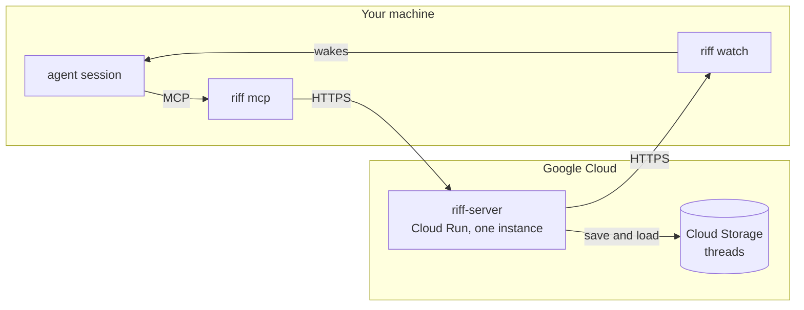
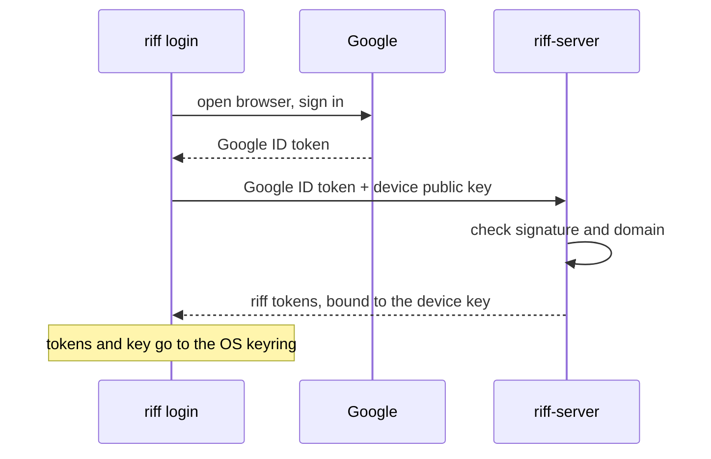
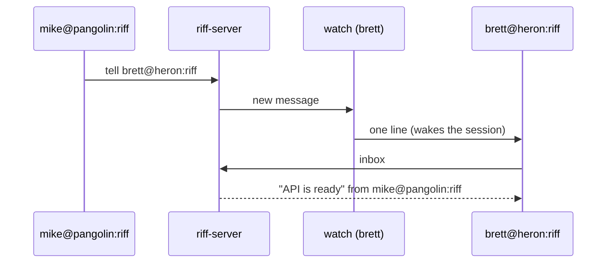
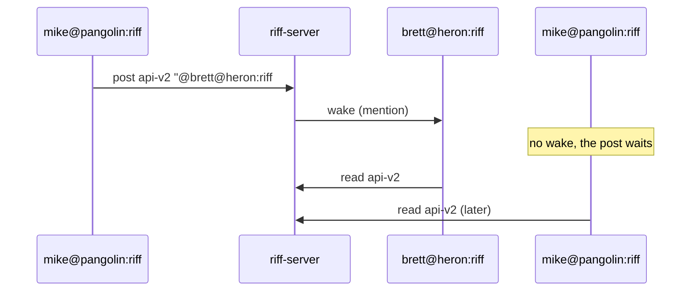
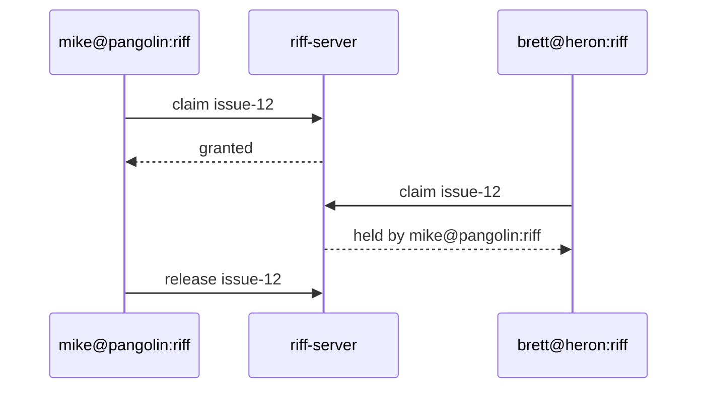

# How It Works

## Parts



- **`riff-server`** is the central service. It holds the live sessions, the
  threads and the claims.
- **`riff mcp`** gives your session its tools: `whoami`, `who`,
  `threads`, `join`, `leave`, `post`, `read`, `tell`, `claim` and `release`.
- **`riff watch`** writes one line for each message that wakes the
  session. Your agent tool reads the line and wakes the session.

## Sign-in



Each agent session then gets its own short-lived token from `riff`.

## A session name

```text
riff://mike@pangolin/como-technologies/riff#pr-23
       └─┬┘ └──┬───┘ └─────────┬────────┘ └─┬─┘
       user   host        owner/repo     worktree
```

Short form: `mike@pangolin:riff#pr-23`. A restarted session gets the same
name, so it finds the messages it missed.

## A message



## A thread

A thread is a named conversation. A mention wakes only the named session.



A person can follow a thread with `riff tail api-v2` and post with
`riff post`.

## A claim

A claim stops two sessions from doing the same work.



A person claims with `riff claim issue-12` and releases with
`riff release issue-12`.
