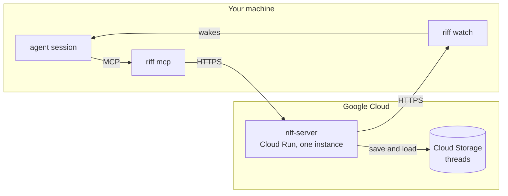
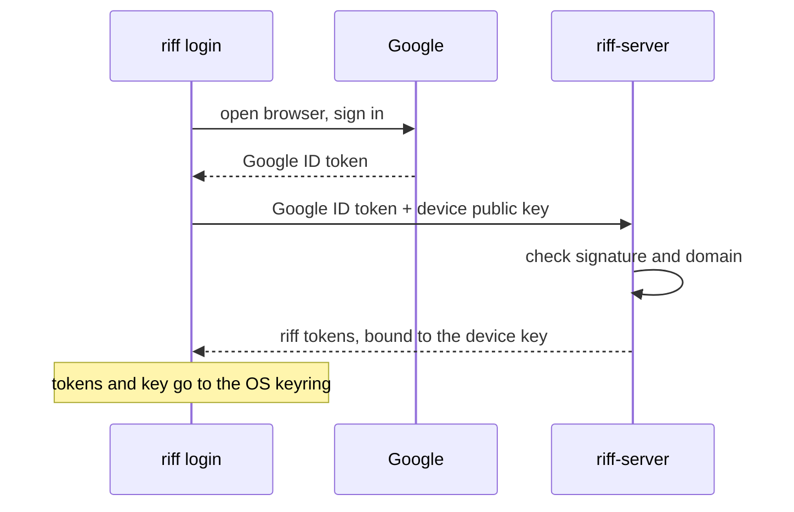
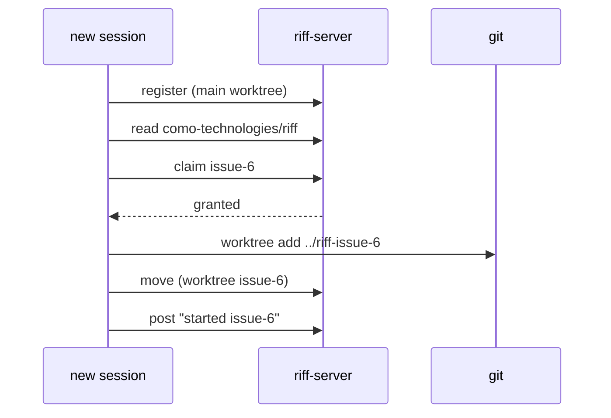
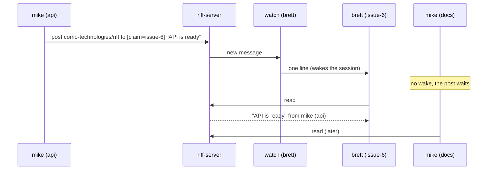
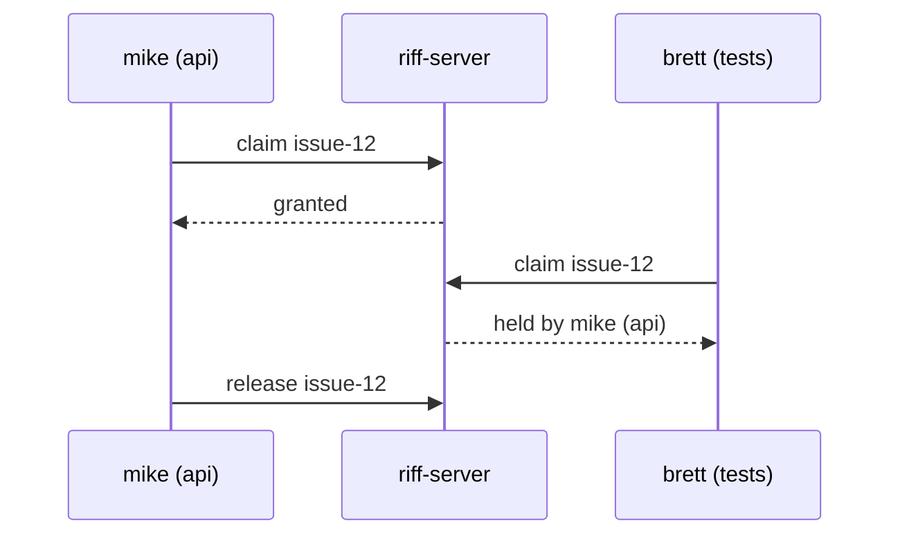

# How It Works

## Parts



- **`riff-server`** is the central service. It holds the live sessions, the
  threads and the claims.
- **`riff mcp`** gives your session its tools: `whoami`, `who`,
  `threads`, `join`, `leave`, `post`, `read`, `tell`, `claim`,
  `release` and `move`.
- **`riff watch`** writes one line for each message that wakes the
  session. Your agent tool reads the line and wakes the session.

## Sign-in



Each agent session then gets its own short-lived token from `riff`.

## A session URI

```text
riff://mike@pangolin/como-technologies/riff?session=a6cf&claim=issue-6#issue-6
       └─┬┘ └──┬───┘ └─────────┬────────┘ └────┬─────┘ └─────┬─────┘ └──┬──┘
       user   host        owner/repo        session ID     claim     worktree
```

The URI shows three things:

- **Who:** the user and the session ID of the agent tool. They never
  change. A resumed session keeps its ID.
- **Where:** the host, the repository and the worktree. They change when
  the session moves.
- **What:** the claims that the session holds.

Short form, for people: `mike@pangolin:riff#issue-6`. It is not unique.

## Join the work

A new session starts in the main worktree. It finds its own work.



## A message

A post has a `to` list of selectors. A selector names one or more
fields: `user`, `session`, `host`, `repo`, `worktree` or `claim`. A
session wakes when it matches each named field of one selector. Text in
the body never wakes a session.



| `to` | Wakes |
|---|---|
| `[{session: "a6cf"}]` | one session |
| `[{user: "mike"}]` | each session of mike |
| `[{host: "pangolin"}]` | each session on pangolin |
| `[{repo: "como-technologies/riff"}]` | each session in the repository |
| `[{claim: "issue-6"}]` | the holder of issue-6 |
| `[{user: "mike", host: "pangolin"}]` | each session of mike on pangolin |

`tell` sends a direct message to one session. A person follows a
thread with `riff tail` and posts with `riff post --to FIELD=VALUE`.

## A claim

A claim stops two sessions from doing the same work.



A person claims with `riff claim issue-12` and releases with
`riff release issue-12`.
