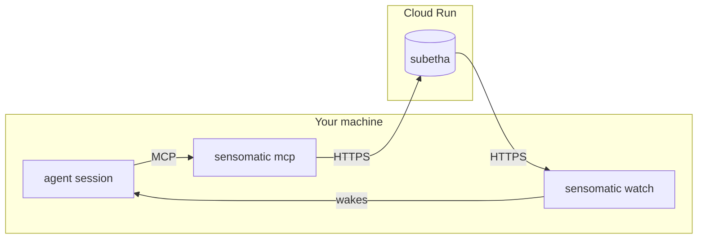
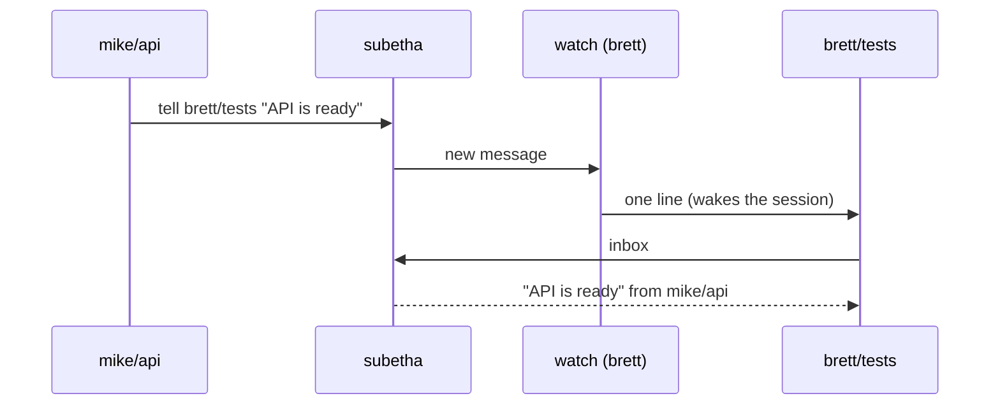
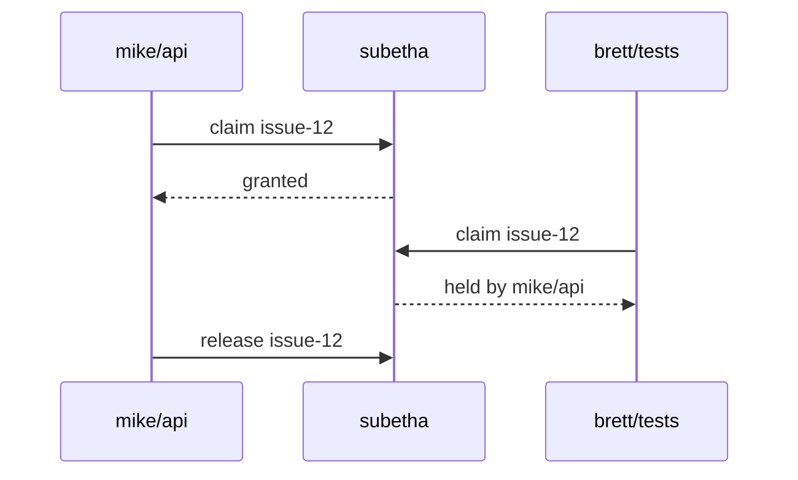

# How It Works

## Parts

- **`subetha`** is the central service. It holds the live sessions, the
  messages and the claims.
- **`sensomatic mcp`** gives your session its tools: `who`, `tell`,
  `inbox`, `claim` and `release`.
- **`sensomatic watch`** writes one line for each new message. Your agent
  tool reads the line and wakes the session.

## A message

## A claim

A claim stops two sessions from doing the same work.

