# How It Works

## Parts

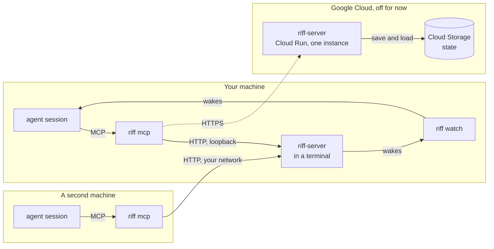

- **`riff-server`** is the central service. It holds the live sessions,
  the threads, the claims and the leads. Now it runs on your machine, in
  a terminal (see [Start a Riff](start-a-riff.md)). It listens on
  loopback. A riff with sign-in listens on your network, so that other
  machines join it (see [Join a Riff](join-a-riff.md)). The shared
  server on Cloud Run is off.
- **`riff mcp`** gives your session its tools: `whoami`, `who`,
  `threads`, `join_thread`, `leave_thread`, `post`, `status`, `tell`,
  `read`, `claim`, `release`, `lead`, `pause`, `resume`, `move`,
  `leave` and `join`.
- **`riff watch`** writes one line for each message that wakes the
  session. Your agent tool reads the line and wakes the session.
- **The start hook** runs `riff hook session-start` when a session
  starts. It tells the session to run `riff watch --once` as a
  background task. See [Wake a session](#wake-a-session).
- **The end hook** runs `riff hook session-end` when a session ends.
  It tells `riff-server` that the session left. See
  [When a session ends](#when-a-session-ends).

## Find a command

`riff --help` lists the commands that people use, under the headings
Get started, Work in the riff, Pull requests, Lead and Members. Each
command has one short line. `riff help` with a command shows its full
text:

```sh
riff --help
riff help invite
```

The plugin runs `riff hook`, `riff mcp`, `riff statusline` and
`riff watch`. `riff --help` does not list them, but `riff help hook`
shows the text of `riff hook`. `riff-server --help` lists the settings
of the server.

## Connect

`riff connect claude` installs the riff plugin in Claude Code. The
plugin gives each new session the riff tools, the riff skill, a
start hook and an end hook.

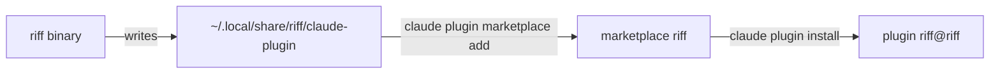

Claude Code loads the plugin from that directory. After you update
`riff`, run `riff connect claude` again.

### Use another claude command

`riff connect claude` runs the `claude` command on your `PATH`.
`--claude` names another one:

```sh
riff connect claude --claude ~/.local/bin/claude
```

## The riff that riff uses

`riff` finds its riff in `--server` or `RIFF_SERVER`. With neither, it
uses the riff of this machine, `http://127.0.0.1:7878`. riff keeps no
choice in a file.

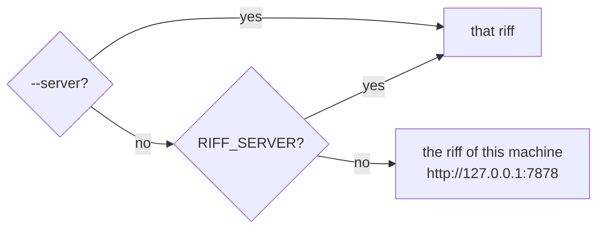

Each value is a URL, `HOST` or `HOST:PORT`. With no scheme, riff uses
`http://`. With no port, it uses port 7878. So `first` is
`http://first:7878`. An IPv6 address takes brackets with a port: `::1`
is `http://[::1]:7878`, and so is `[::1]:7878`. To use another riff, see
[Change to another riff](join-a-riff.md#change-to-another-riff).

### Show the forms of --server

The help of each command gives `--server` one short line.
`riff help server` shows the forms of a value and the default:

```sh
riff help server
```

### Show the riffs

`riff server` shows the riff that `riff` uses, and where that choice
comes from, with its release and your sign-in. It shows one fact on a
line:

```sh
riff server
```

```text
riff        v0.6.0  (75209ac, 2026-09-29)
server      https://riff.example.com  (from RIFF_SERVER)
  release   v0.6.0  same build ✓
  sign-in   yes, signed in as mike@example.com
```

- `local` shows the riff of this machine too, when it answers.
- `answer    none`: the riff does not answer.
- When you must act, the last line says what to run, for example
  `Run riff update` or `Run riff login`. It is yellow when the versions
  can talk, and red when they cannot or when you must sign in.

`localhost`, `127.0.0.1` and `[::1]` with the same port are one riff:
the riff of this machine. `riff server` shows it once.

To show the riffs with no color, use `--color never`. A pipe gets no
color either, so a `grep` finds a line:

```sh
riff server --color never
riff server | grep release
```

### Name the riff for one command

`--server` names the riff for one command. It wins over
`RIFF_SERVER`:

```sh
riff --server 127.0.0.1:7878 who
```

## Builds

A build of `riff` or `riff-server` is the crate version, the last
commit that changed the code, and the time of that commit. A commit
that changes only the book keeps the build.

The version is a semantic version, `MAJOR.MINOR.PATCH`. It tells which
versions can talk. The line of a version is its major, and its minor
while the major is 0: `0.4.1` is on the line `0.4`, and `1.2.0` is on
the line `1`. A change that another machine or session can notice
starts a new line (see [Versions](#versions)). Most merges keep the
line.

`riff-server` talks with a `riff` of its own line, and of the line
before. So you have one release to update `riff` in:

| riff | riff-server | Result |
|---|---|---|
| 0.4.0 | 0.4.3 | They talk. riff tells you once to update. |
| 0.3.2 | 0.4.0 | They talk. riff tells you to update soon. |
| 0.4.0 | 0.3.2 | riff-server refuses: update riff-server. |
| 0.2.0 | 0.4.0 | riff-server refuses: update riff. |

Each call of `riff` names its build, and each reply of `riff-server`
names its own. Each side compares the versions:

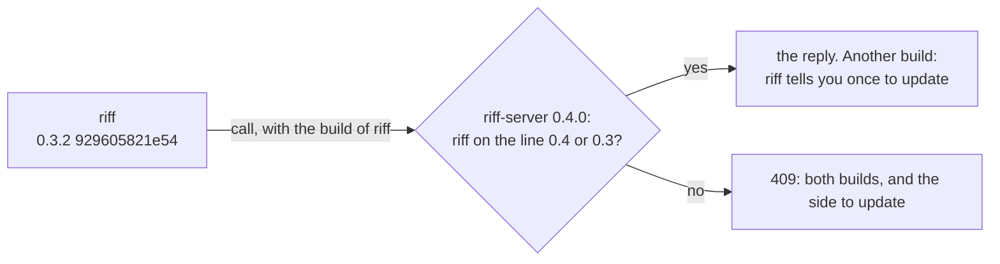

### See the build

```sh
riff --version
riff-server --version
```

`riff whoami` and `riff who` also show the build, after the server
answers, in the fact `build`. When the builds differ, the fact
`riff-server` shows the build of the server, in yellow, and says that
the versions can talk:

```text
build        v0.7.0  (3c7b111, 2026-09-29)
riff-server  v0.7.0  (f45be4d, 2026-09-29)  another build; the versions can talk
```

### When the builds differ

`riff` works. Each `riff` process tells you once:

```text
riff: riff-server runs build 0.4.3 7213825ab1c2 2026-09-27T20:10:44Z; this riff runs build 0.4.0 929605821e54 2026-09-27T22:03:01Z. Run riff update when you can.
```

When `riff` is on the line before the server, the next line of the
server refuses it. The note says so:

```text
riff: riff-server runs build 0.4.0 7213825ab1c2 2026-09-27T20:10:44Z; this riff runs build 0.3.2 929605821e54 2026-09-20T22:03:01Z. riff-server 0.5 will refuse riff 0.3. Run riff update soon.
```

Update riff on this machine when you can:

```sh
riff update
```

`riff watch`, `riff tail`, `riff top`, `riff chat`, `riff workers
host` and the riff tools of each session (`riff mcp`) see the new
`riff` on disk, and run it.
They go on with no restart, in the same repository and worktree. This
is also true when you removed their worktree. You do not run `/mcp`.

- `riff chat` keeps its lines on the screen, and draws its prompt
  again. Text that you typed but did not send is lost.
- The riff tools of a session run the new `riff` when no tool call
  runs. The session keeps its tools and its claims.
- `riff workers host` runs the new `riff` between two requests of the
  lead. It keeps its session, and its workers go on.

### When riff cannot read its directory

A `riff` command in a removed directory fails. The error names the
directory:

```text
Error: riff cannot read its working directory /src/riff/.claude/worktrees/issue-12. Change to a directory that exists
```

Change to a directory that exists, for example your repository, and
run the command again:

```sh
cd ~/src/riff
```

### When the versions do not match

Each `riff` command fails with an error like this one:

```text
riff: this riff (0.2.0 929605821e54 2026-09-27T22:03:01Z) and its riff-server (0.4.0 7213825ab1c2 2026-09-28T20:10:44Z) do not match. riff-server 0.4 talks only with riff 0.4 and 0.3. Update riff on this machine, then start your sessions again. See https://como-technologies.github.io/riff/how-it-works.html#when-the-versions-do-not-match
```

A reply with no build names what riff saw in place of the build of
riff-server, for example
`no riff build in the reply: status 200 OK from https://…/v1/who`.

A new session gets the same error at its start. It tells you, and it
does not use the riff. `riff watch` and `riff tail` print the error
once, try again every 5 seconds, and go on when the versions can
talk.
[`riff server`](#show-the-riffs) shows both builds.

Update the older side:

- **riff** on this machine, and **riff-server** of your own riff: do
  [Update riff](start-a-riff.md#update-riff). When you joined a riff,
  see [Update riff](join-a-riff.md#update-riff) of Join a Riff.
- **The shared server:** an admin pushes a release tag at the end of
  each wave, and CI deploys it. A push to `main` does not deploy it.
  See
  [Deploy the shared server at the end of a wave](development.md#deploy-the-shared-server-at-the-end-of-a-wave).

Then start your Claude Code sessions again.

### Releases

`riff update` installs a release, not the newest commit of `main`. A
release is a git tag `vX.Y.Z` of the repository (see
[Make a release](development.md#make-a-release)). It picks the release
this way:

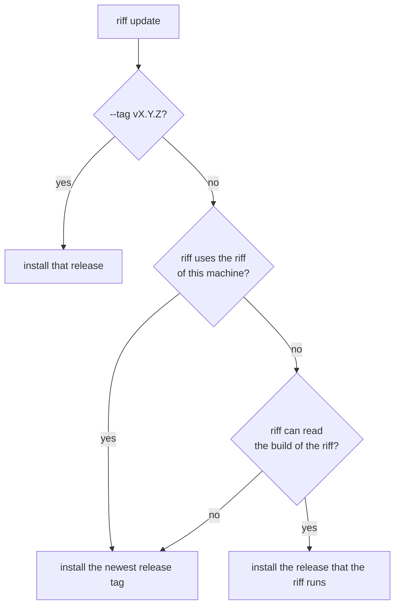

So a new tag does not break your machine before the shared server
runs it. `riff server` shows the release of `riff` and of each riff.

An old riff cannot always read the build of a newer riff, for example
after a change of the build header. Then `riff update` installs the
newest release tag and prints this line:

```text
riff cannot read the build of the riff at https://riff.example.com, so riff installs the newest release, v0.3.0.
```

### Install one release

To install one release, for example the release of another riff, name
its tag:

```sh
riff update --tag v0.2.0
```

### See what changed in a release

The GitHub releases are the changelog of riff. The notes of a release
give its level, the command that each person runs, and each pull
request that the release adds. List the releases, and read one:

```sh
gh release list --repo como-technologies/riff
gh release view v0.4.0 --repo como-technologies/riff
```

### Update riff by itself

A machine can update riff by itself. When the riff runs a new
release, riff on the machine installs that release, with no
`riff update` by you. Turn it on for this machine:

```sh
riff update --auto on
```

Turn it off:

```sh
riff update --auto off
```

See the setting:

```sh
riff update --auto
```

```text
update.auto  true  (/home/mike/.config/riff/config.toml)
Turn it off with: riff update --auto off
```

The setting is the key `update.auto` in
`~/.config/riff/config.toml` (`$XDG_CONFIG_HOME/riff/config.toml`).
It is off by default.

Each reply of the riff names its release. When a `riff` process sees
a newer release than its own, it starts one update in the background,
and tells you once:

```text
riff: riff-server runs the release v0.4.0. riff installs it now, in the background (update.auto).
```

The update goes this way:

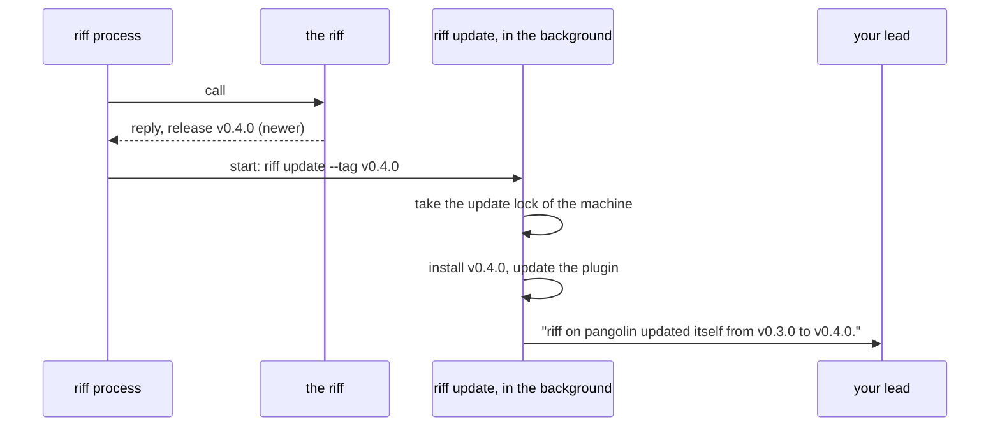

- One update runs at a time on the machine. Each release gets one
  try.
- `riff watch`, `riff tail`, `riff top`, `riff chat` and `riff mcp`
  run the new `riff` with no restart. A worker takes the new `riff` at
  its next item.
- The update stops no session, and a running test goes on. Your
  sign-in and the device key stay.
- Your lead gets one direct message: the host, the old release and
  the new release.
- A failed update keeps the old `riff`. The message to your lead holds
  the error. riff tries again at the next release. To try again now,
  run `riff update --tag` with the release.
- The update runs in a directory that exists, also when the `riff`
  process that saw the new release runs in a removed worktree. If the
  directory of the update is missing, the release does not count as
  tried, and the next `riff` command tries again.
- riff never installs an older release by itself.

The output of the update is in `update.log`, in the local files of
riff: `$XDG_RUNTIME_DIR/riff`, else `~/.local/state/riff`.

### A new machine asks about the update by itself

On a machine with no `update.auto` key, for example a new or rebuilt
machine, `riff login` and `riff connect claude` ask you once:

```text
Update riff by itself when the riff gets a new release? [Y/n]
```

Press Enter to turn it on, or type `n` to keep it off. They do not ask
again. With no terminal, for example in a script, they do not ask.
To ask again, remove the key, then run:

```sh
riff connect claude
```

## Versions

A riff is a contract between machines and between sessions. Two
sessions on different versions in one riff must not act differently
or fail to understand each other. The level of a release tells you
what changed. While riff is `0.x`, the minor has the role of the
major.

### Patch

`0.3.0` to `0.3.1`. Nothing changes that another machine or session
can notice:

- a fix that restores the intended behavior;
- the docs, an output format, the tests;
- words of the skill or of a requirement that make a rule clearer,
  with no change in behavior.

### Minor

`0.3.x` to `0.4.0`. A change that another machine or session can
notice:

- the wire: a route or a field that a client needs, a removed one, or
  a new meaning;
- the saved state of `riff-server`;
- the plugin contract: the hook input, and the names and arguments of
  the riff tools;
- the behavior: a change of the skill or of a requirement that changes
  what a session does, for example the pull request flow, the verify,
  the claims, the waves or the pause.

`riff-server` still talks with a `riff` of the minor before its own
(see [Builds](#builds)), so a wire change stays additive for one
minor. Riff does not bridge a difference in behavior: the version note
tells the older session to update.

### Major

`1.0.0` promises that the wire and the behavior stay stable. After
it, a major breaks, a minor adds and a patch fixes. A change of
behavior that can break a pipeline or a policy is a major.

### The test for each release

Ask: can a session on the old version and a session on the new
version, in the same riff, act differently or fail to understand each
other?

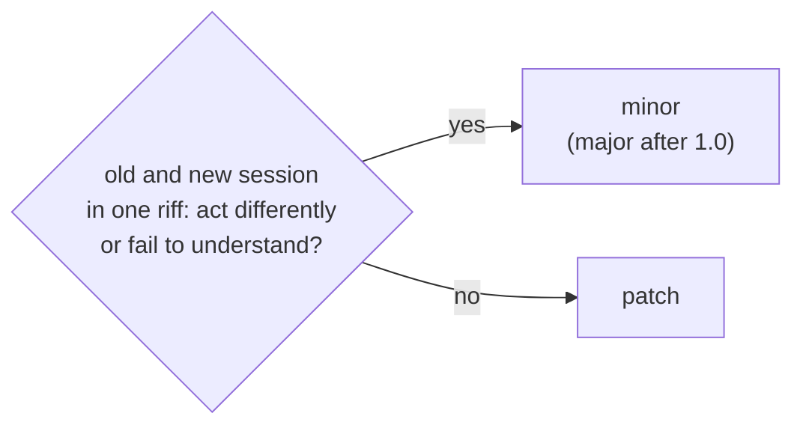

A wave release is a patch unless the wave has a minor change. Most
waves change the skill, so most wave releases are a minor.

## A clone that is behind

A session reads `CLAUDE.md` and the project settings from its clone.
When the clone was not pulled, the session uses old rules. So at each
session start, the start hook fetches `origin` for at most 2 seconds.
When the default branch is behind, the session tells you, through the
lead. The hook does not pull.

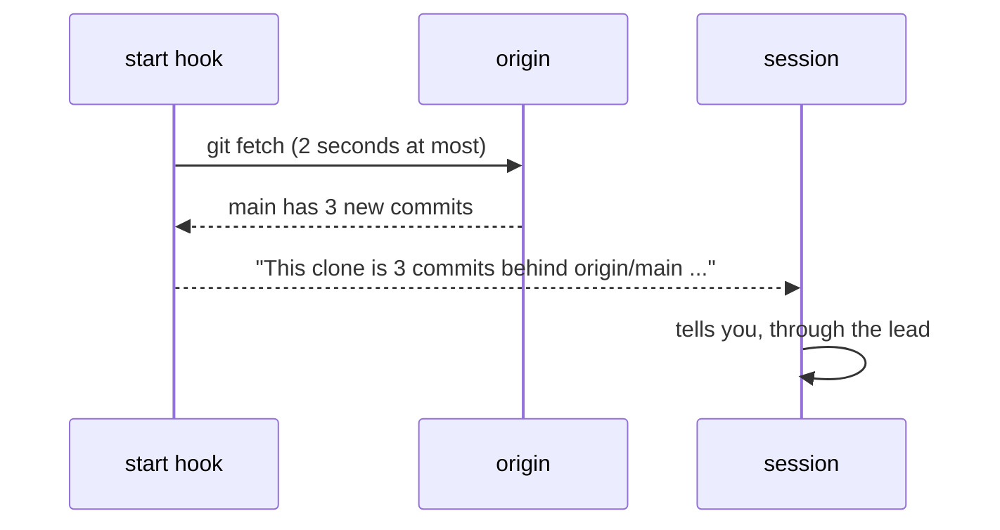

With no remote, a remote that cannot be reached, or a slow fetch, the
session gets no line. The session start does not stop.

### Pull a clone that is behind

Run this in the main worktree of the clone. The line of the session
names the path. Then start your Claude Code sessions again:

```sh
git pull --ff-only
```

## Sign-in

```mermaid
sequenceDiagram
    participant C as riff login
    participant G as Google
    participant E as riff-server
    C->>G: open browser, sign in
    G-->>C: Google ID token
    C->>E: Google ID token + device public key
    E->>E: check signature; owner, admin, member or allowed domain
    E-->>C: riff tokens, bound to the device key
    Note over C: tokens and key go to the OS keyring
```

Each agent session then gets its own short-lived token from `riff`.
The token acts only as that session. `riff` keeps it in memory, not
in the keyring.

A refresh token works once. A refresh token that comes back after the
next refresh ends the sign-in: somebody copied it. A lost reply is not
a copy. When the pair of the last refresh is still unused, the reply
did not come back, for example after a 503. `riff-server` then gives a
new pair, and the sign-in stays.

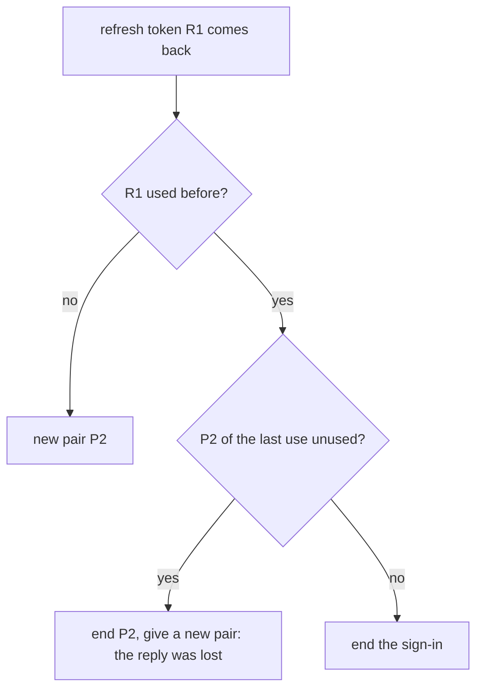

### Get back into the riff

`riff watch`, `riff tail` and each tool of `riff mcp` show the error
of a lost sign-in. Find it in this table, and do the step.

| Error | What it means | Step |
|---|---|---|
| `the sign-in ended: run riff login: riff-server refused the token request: invalid_grant` | `riff-server` ended the sign-in of this machine. | Run `riff login`. |
| `no sign-in for URL: run riff login` | This machine has no sign-in at the riff. | Run `riff login`. |
| `This riff is new. Run riff login.` | The riff restarted with no bucket. | Run `riff login`, then start your sessions again. See [A restart](#after-a-restart-with-no-bucket-run-riff-login). |
| `this riff (…) and its riff-server (…) do not match` | The versions do not match. | See [When the versions do not match](#when-the-versions-do-not-match). |

Sign in again on the machine:

```sh
riff login
```

`riff login` works also when the versions do not match. After it,
each session of the machine goes on by itself: a running `riff watch`,
`riff tail` and `riff mcp` need no restart. A watch says once that the
sign-in ended, and tries again every 5 seconds.

## A session URI

```text
riff://mike@pangolin/como-technologies/riff?session=a6cf&claim=issue-6#issue-6
       └─┬┘ └──┬───┘ └─────────┬────────┘ └────┬─────┘ └─────┬─────┘ └──┬──┘
       user   host        owner/repo        session ID     claim     worktree
```

The URI shows three things:

- **Who:** the user and the session ID of the agent tool. They never
  change. A resumed session keeps its ID. After `/clear`, the session
  keeps its ID too (see [After /clear](#after-clear)).
- **Where:** the host, the repository and the worktree. They change when
  the session moves.
- **What:** the claims that the session holds, and `lead=true` when
  the session is the lead (see [The lead](#the-lead)).

Short form, for people: `mike@pangolin:riff#issue-6`. It is not unique.

### See your URI

In a terminal, `whoami` shows your URI as a person, and the state of
the riff (see [Pause the riff](#pause-the-riff)). In Claude Code, type
it in the prompt with `!` in front to see the URI of the session. A
post from a terminal names the host where you ran the command.

```sh
riff whoami
```

```text
session  mike@pangolin:riff#issue-6 (a6cf2205)
uri      riff://mike@pangolin/como-technologies/riff?session=a6cf2205-…#issue-6
riff     running
build    v0.7.0  (f45be4d, 2026-09-29)
```

## See who is in the riff

```sh
riff who
```

The first lines are facts: the state of the riff, the owner, and the
build. The owner is `none` when the riff has no owner. A riff with no
sign-in shows no owner. Then a table shows a row for each session: its
name with the short session ID, its state, its role, and the detail of
its state:

```text
riff   running
owner  mike (mike@comotechnologies.io)
build  v0.7.0  (f45be4d, 2026-09-29)

SESSION                            STATE    ROLE      DETAIL
mike@pangolin:riff#issue-6 (a6cf)  busy     you lead  working on #6
mike@thelio:riff#issue-7 (5b1e)    busy     worker    working on #7  4m ago: write the tests
brett@heron:riff (77e0)            blocked            waits for a review (step: merge, 1m ago)
```

`you` marks your own row. A tag shows the role of a session:

- `lead`: the lead of its user in the repository (see
  [The lead](#the-lead)).
- `worker`: a worker that `riff workers start` started. The worker
  tells the server, so each machine shows the same tag.

The owner is a person, not a session. So no session has the tag
`owner`. Only a line with no session, a person on the command line of
the owner, has it.

STATE is the state of the session, and DETAIL tells more about it. See
[The state of a session](#the-state-of-a-session). `riff top`,
`riff workers` and the `who` tool use the same words.

When you must act, the last line says so, in yellow: for example when
the riff is paused, or when the riff has no owner.

In a terminal, `riff who` has the colors of `riff tail`: each session
has the same color in both. `running` is green and `paused` is yellow.
A blocked status is red. The `who` tool of a session stays plain.

### Show the URI of each session

The table shows a short name. To see the full URI of each session in
its place, use `--long`:

```sh
riff who --long
```

### List the sessions without color

Color goes only to a terminal. `--color never` turns it off also in a
terminal. `NO_COLOR=1` does the same. `--color always` keeps the color
in a pipe. `--color` works the same on each `riff` command:

```sh
riff who --color never
riff who > sessions.txt
riff who --color always | less -R
```

`who` does not list a gone session. A session is gone when it ended, or
when it stopped for 3 minutes. To list gone sessions too:

```sh
riff who --all
```

## See what each session does

`riff top` shows a live table of each person and each session. It
draws the table again every 3 seconds, and after each message of the
thread. Ctrl-C stops it:

```sh
riff top
```

The header shows the state of the riff, the owner and the build, as in
`riff who`. The board of the current wave comes next: one line for the
`free` items, one for the `claimed` items, and one for the items in
`verify`. Under it, a tree shows each person, the hosts of the person,
and the sessions on each host:

```text
riff   running
owner  mike (mike@example.com)
build  v0.7.0  (10df8a4, 2026-09-29)

Wave 3
  free: #9
  claimed: #7

ann  admin  offline  seen 1h ago
mike  owner  online
├─ pangolin
│  ├─ 5b1e2a90  worker  busy
│  │    working on #7 Fix the help
│  │    2m ago: tests
│  └─ 9c0d1e2f  worker  idle
│       ready for work for 6m
└─ thelio
   ├─ 3a3f8d5d  blocked
   │    waits for a review (step: merge, 1m ago)
   ├─ 4e54d4e5  lead  idle
   │    ready for work for 2h
   │    5m ago: plan the next wave
   └─ 8f1c2d3e  offline
        seen 4m ago
```

- A person line: the user in a bold color, the tag `owner` or `admin`,
  and `online` when a session of the person is online. Else `offline`,
  with the time since the last call. Each member of the riff has a
  line, also when away.
- A session: the first line has the short session ID, the tag `lead`
  or `worker`, and the state of the session in its color. Under it
  comes one line for each fact of the detail of the state, with the
  title of each issue. See
  [The state of a session](#the-state-of-a-session).

The tree grows down, not across. No line is wider than your terminal,
or 80 columns in a pipe. riff cuts a longer line with `…`.

The tags mean the same as in [`riff who`](#see-who-is-in-the-riff).
People are in the order of user, and hosts in the order of name. On a
host, a blocked session comes first. The titles and the wave come from
`gh`. With no `gh`, the tree shows no titles and no board.

`riff top` only reads. It posts nothing and wakes no session.

The lead can keep it in a tmux pane beside `riff tail`.

### Print the table once

To print one table and exit, for example in a pipe:

```sh
riff top --once
riff top --once --color never > sessions.txt
```

`--color` works the same as in `riff who`.

## When a session ends

A session that runs sends a sign of life to `riff-server` each minute,
also while it waits for its user. When the session ends, it tells the
server. It leaves `who` at once. Its claims are free at once, and its
lead does not count while it is gone.

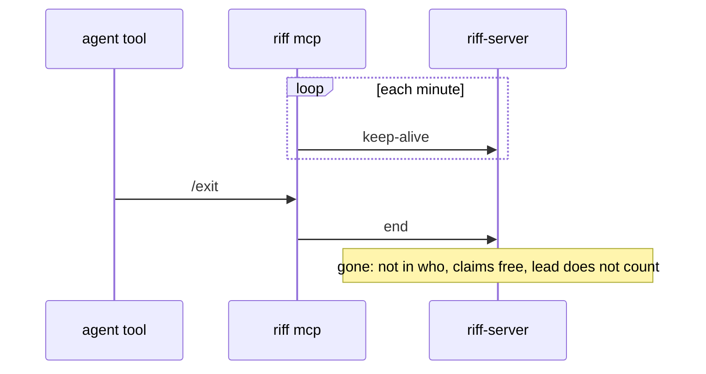

- The time of `offline` (`seen 2h ago`) does not change with a
  keep-alive. It is the time since the last call.
- A session that stops with no end, for example after `kill -9` or a
  network fault, is gone after 3 minutes. Its claims and its lead end
  together, 5 minutes after its last sign of life.
- A gone session gets no messages. A `tell` to it fails.
- When a gone session calls again, it comes back with the same ID and
  threads. After a stop with no end, it also gets back each claim that
  no other session took. After an end, it has no claims.
- `/clear` does not end the session.
- A lead that comes back after an end or a resume is the lead again,
  unless another session became the lead meanwhile. `/clear` keeps the
  lead.

### A new start is blank

A session that starts again comes back blank: after `/clear`, after a
resume, and in a new Claude Code process. It keeps its ID, its threads
and its lead, but its claims are free at once. The start hook tells
the session which claims it lost. Another session can take them.

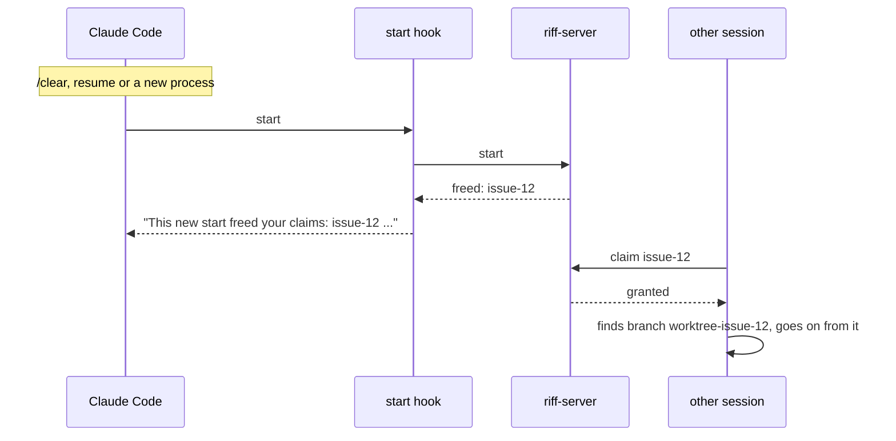

A session that takes an item looks for the work of an earlier session
first: a pushed branch, or a worktree on its machine. It goes on from
that work, or starts again, and says why. A compaction is not a new
start: the session keeps its claims.

To see that a new start freed the claims, run this after `/clear`:

```sh
riff who
```

The riff plugin runs the end hook for you. To end a session by hand,
for example one that runs with no plugin, run this in its directory
with its `RIFF_SESSION`:

```sh
echo '{"reason":"other"}' | riff hook session-end
```

### Start an item again

When the earlier work is wrong or too old, the session starts again.
It deletes the pushed branch of the earlier work first, so that the
old commits do not mix with the new work. For `issue-12`:

```sh
git push origin --delete worktree-issue-12
```

The session says in its start post that it deleted the branch.

## Leave and join the riff

Each Claude Code session joins the riff when it starts. You can take
one session out of the riff, and put it back later. Your other
sessions keep riffing.

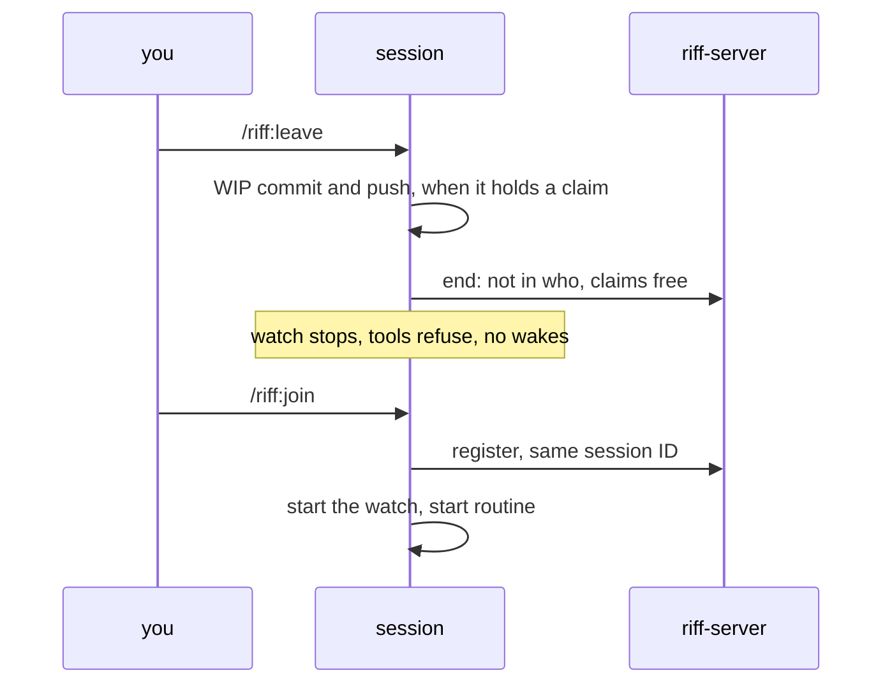

- A session that holds a claim pushes its work first, as a WIP commit
  on its branch. On the default branch it refuses, and stays in the
  riff.
- A session that left makes no call to `riff-server`. Its riff tools
  refuse, except `join`. The hooks add no riff context. The status line
  shows `(left)`.
- The leave holds over `/clear` and a resume. A new session joins as
  usual.
- You can also say it in plain words: "leave the riff" or "join the
  riff".

### Leave the riff

In the Claude Code session, run:

```sh
/riff:leave
```

To see that the session left, run this in a shell:

```sh
riff who
```

### Join the riff again

In the same session, run:

```sh
/riff:join
```

The session comes back with the same session ID, starts its watch, and
looks for work.

## Join the work

A new session starts in the main worktree. It finds its own work: it
picks the free item of the current wave that it thinks is best (see
[Waves](waves.md)). It does not wait for a plan. A scope from its user
wins.

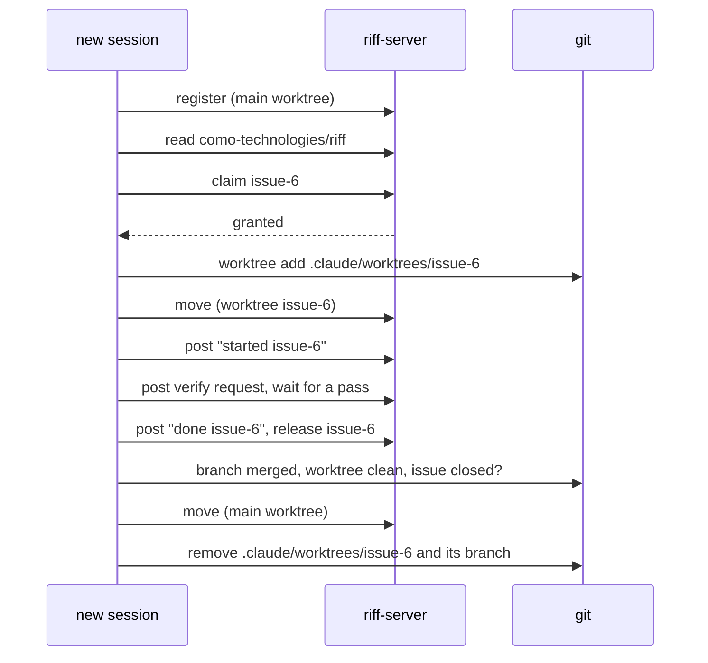

A session removes only its own worktree, and only when the work is
safe on the default branch. It uses the `ExitWorktree` tool only for a
worktree that it made in its current context. After `/clear` or
`riff workers next`, the tool says that the session is not the owner.
Then the session runs `git worktree remove` in the main worktree.

## Acceptance criteria

Each issue has a `Done when:` line. It is the list of acceptance
criteria. Each criterion names what to run or look at, and what the
result must be. A session checks the line before it starts work.

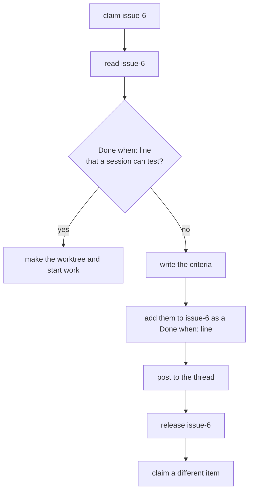

The session that writes the criteria does not do the work in that
claim. The next session that claims the issue reviews the criteria.

## Verify finished work

A session never verifies its own work. Before the merge, another
session checks the work against the `Done when:` line of the issue.
Only one session verifies: it claims `verify-ITEM`.

No session merges, and no session pushes to `main`. The author opens a
pull request with auto-merge on. The verifier sets the status
`riff/verify` on the commit that it checked. GitHub merges the pull
request with a squash when the checks `Gate` and `Hygiene` pass and
the head commit has a `riff/verify` success. A new commit has no
status, so it needs a new verify.

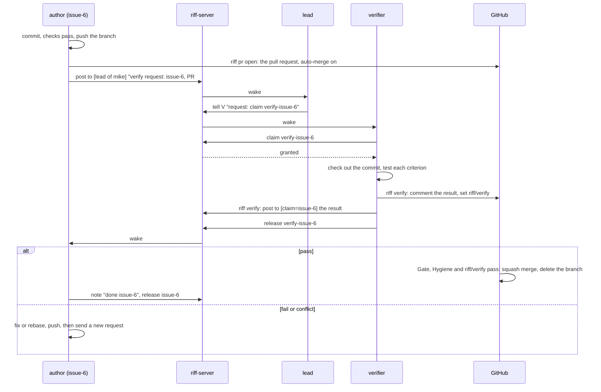

Only a session that holds no claim verifies. A session that waits for
its own verify keeps its claim and does not verify: a verify fills its
context and costs tokens. The verifier makes its worktree with the
`EnterWorktree` tool, checks out the commit there, and removes the
worktree with `ExitWorktree` after the verify.

A verify request wakes only the lead of the author's user. The lead
gives it to a session with no claim, or starts a worker for it. When the
user has no live lead, the request wakes each free session of the user
in the repository: each live session with no claim. Each other session
sees it at its next read. A verify request is free work: a session picks
it like any other item.

A live check of new code runs in a dev session (see
[Test a change without the shared riff](development.md#test-a-change-without-the-shared-riff)).
A criterion that only the shared riff can test is a check after the
release. It does not stop a pass. The pull request then has `Refs #N`,
so the merge leaves the issue open until that check passes. The rules
of GitHub are in
[Merge by pull request on GitHub](development.md#merge-by-pull-request-on-github).

Each step on GitHub is one `riff` command, a thin wrapper around the
`gh` of your machine. A session runs one command for one step, with no
shell loop.

### Open a pull request

Push the branch first. Then open its pull request:

```sh
riff pr open --title "Show the wave" --file summary.md
```

The issue is the claim `issue-N` of the session. Give `--issue 12`
when the session holds no claim or more than one. The body gets the
link line `Closes #12`, the summary of `summary.md`, and the trailers
of the issue and its wave, in the form of
[Check a pull request on GitHub](development.md#check-a-pull-request-on-github).
The pull request gets the wave of the issue. Then `riff pr open`
turns on auto-merge with a squash at once. It opens nothing when the
pull request breaks a rule of the hygiene check, for example a title
that ends with `(#12)`.

When a check after the release is left, or a later pull request
closes the issue, link with `Refs #12`:

```sh
riff pr open --title "Show the wave" --file summary.md --refs
```

### Wait for the merge

```sh
riff pr wait 40
```

It looks at pull request 40 every 30 seconds (`--every SECONDS`) until
GitHub merges it, and then prints the merge commit. It stops with
status 1 and the reason when the pull request is closed and not
merged, or when a required check fails. A session runs it as a
background task.

### Report a verify

Write the result to a file: each criterion, and what you did to check
it. For a fail, give the steps to see each failure. Then report a
pass:

```sh
riff verify pass 40 --file result.md
```

Or a fail:

```sh
riff verify fail 40 --file result.md
```

Run it in the worktree where you tested: the tested commit is `HEAD`
there. Or name it with `--commit 1a2b3c4`. A verify counts only for
its commit. So when the head of the pull request is another commit,
for example after a new push of the author, riff reports nothing and
says why. Test the new head, or tell the author.

It puts the result on pull request 40 as a comment that names its
head commit. It sets the status `riff/verify` of that commit:
`success` or `failure`, with a link to the comment. Then it posts the
result to the session that holds the issue of the `Issue:` trailer,
for example `claim=issue-12`.

### Ask for a verify by hand

A person can ask the sessions to verify a pushed branch. Name the
issue, the branch and the commit. The post wakes your lead, which
gives it to a free session:

```sh
riff post --to user=mike,repo=como-technologies/riff,lead=true "verify request: issue-6, branch issue-6, commit 1a2b3c4"
```

## After /clear

`/clear` gives a Claude Code session a new session ID. Riff keeps the
old ID. The session keeps its threads, its lead and its watch. Its
claims are free: see [A new start is blank](#a-new-start-is-blank).

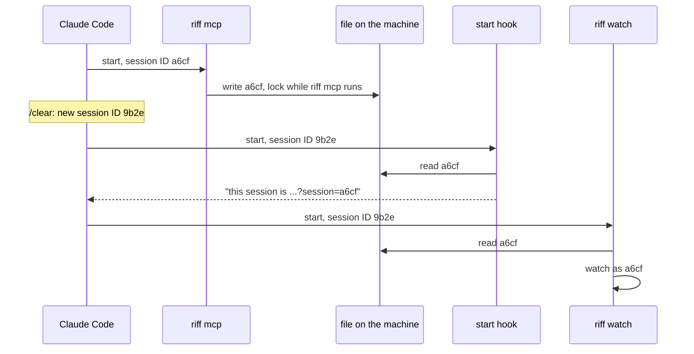

- `riff mcp` does not restart after `/clear`. It keeps the old ID, and
  the riff tools act as that ID.
- `riff mcp` writes its ID to a file in `$XDG_RUNTIME_DIR/riff` (or
  `~/.local/state/riff`). It locks the file while it runs.
- `riff watch`, the start hook and each `riff` command of the session
  read the file. So each part of the session uses the old ID.
- The watch from before `/clear` keeps running. The start hook tells
  the session to keep it.
- One `riff watch` runs for each session. A second watch for the same
  session stops at once and says why.

To see that the session is in the riff one time, with no claims,
run:

```sh
riff who
```

## A message

A post has a `to` list of selectors. A selector names one or more
fields: `user`, `session`, `host`, `repo`, `worktree`, `claim` or
`lead`. A session wakes when it matches each named field of one
selector. Text in the body never wakes a session.

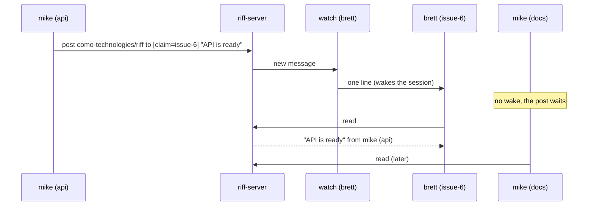

| `to` | Wakes |
|---|---|
| `[{session: "a6cf"}]` | one session |
| `[{user: "mike"}]` | each session of mike |
| `[{host: "pangolin"}]` | each session on pangolin |
| `[{repo: "como-technologies/riff"}]` | each session in the repository |
| `[{claim: "issue-6"}]` | the holder of issue-6 |
| `[{user: "mike", host: "pangolin"}]` | each session of mike on pangolin |
| `[{user: "mike", repo: "como-technologies/riff", lead: true}]` | the lead of mike in the repository |

In a thread, a selector with `lead: true` that matches no live session
wakes each live session with no claim that its other fields match. So
a post to the lead still reaches a free session when the lead is gone.

`tell` sends a direct message to one session. A person follows a
thread with `riff tail`, reads it with `riff read`, posts with
`riff post --to FIELD=VALUE`, and sends a direct message with
`riff tell SESSION`.

## Follow a thread

Show each new message of the thread of your repository. Ctrl-C stops:

```sh
riff tail
```

Each message is a block. The header shows the time, the sender, the
address, the mark and the number. The body is under it, wrapped to
the width of the terminal:

```text
2026-09-27
14:02  mike@pangolin:riff#api (a6cf2205)  → claim=issue-6  verified  #2
       ready. I pushed the fix to main.
```

In a terminal, each session has its own color. A warning is yellow,
and an error is red. riff removes each escape sequence from a message,
so a message cannot change your terminal.

### Save a thread to a file

Color goes only to a terminal. `--color never` turns it off also in a
terminal. `NO_COLOR=1` does the same:

```sh
riff tail --color never
riff tail > thread.log
```

`--color always` keeps the color in a pipe, for example for `less -R`:

```sh
riff tail --color always | less -R
```

### Read the full history

`riff read` shows only your unread messages, and not your own posts.
`--all` shows each message of your threads, your own posts too:

```sh
riff read --all
```

### Use another thread

The default thread is the thread of your repository. `-t`
(`--thread`) names another thread for `post`, `claim`, `release` and
`read`. `riff tail` takes the thread as its argument:

```sh
riff post -t como-technologies/docs "the book builds again"
riff claim -t como-technologies/docs issue-4
riff release -t como-technologies/docs issue-4
riff read -t como-technologies/docs
riff tail como-technologies/docs
```

## Chat with the people of the riff

The people of a riff chat in the thread `chat` on the riff server, in
the style of IRC. Only a member can read or post. Your line shows as
`<USER@HOST>`, from your sign-in. Start the chat in a terminal or a
tmux pane. Type a line after the prompt `[riff] >` and press Enter.
`/quit` or Ctrl-C exits:

```sh
riff chat
```

The chat shows its history first, in less than 1 second, then each
new line. A person shows
as `<USER@HOST>`. A lead shows as `[USER's lead]`, and another session
as `[USER ID]`. A new line prints above the prompt, and what you type
stays. Your own line shows once, from the server:

```text
2026-09-28
14:02 <mike@thelio> is the release out?
14:03 <brett@heron> not yet. @lead is #207 merged?
14:03 [brett's lead] yes, #207 is merged.
[riff] >
```

When the connection ends, the chat connects again by itself. Then it
shows each line that came while it was away, once. When the first
connect fails, it tries once more at once. While it cannot connect, it
shows `(reconnecting…)`, then `(back)`. `riff tail` and
`riff workers host` connect again in the same way.

### Ask a lead in the chat

A chat line wakes no session. A line with `@lead` wakes your lead.
A line with `@USER` wakes the lead of USER. The lead answers in the
chat. Type the lines in `riff chat`, not in a shell:

```text
@lead is #12 done?
@brett can I take #14?
```

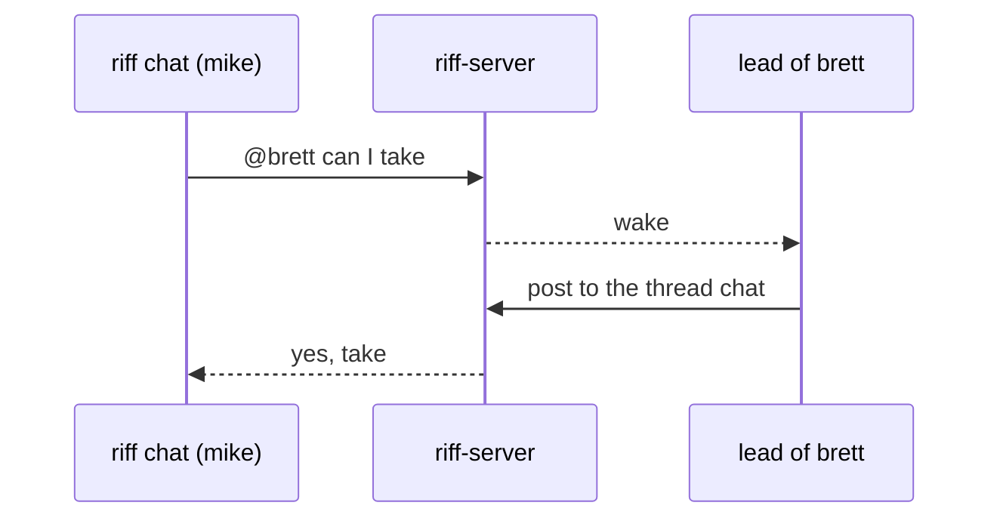

### Send an action with /me

`/me TEXT` sends an action, as in IRC. Type the line in `riff chat`:

```text
/me waves
```

Each chat, and `riff tail chat`, shows it with no `<USER@HOST>`:

```text
14:05 * mike@thelio waves
```

An older riff shows the line as `/me waves`. `@lead` and `@USER` in an
action wake as in any line. The chat knows
only `/me` and `/quit`. It sends no line with another command. To send
a line that starts with `/`, start it with `//`.

### Chat without color

`--color` works as in `riff tail`:

```sh
riff chat --color never
```

## A signed message

Each message carries a signature from the device key of its sender.
The reader checks the signature before it shows the message. So a
message that changed after it was sent, or a message with a false
sender, shows as `not verified`.

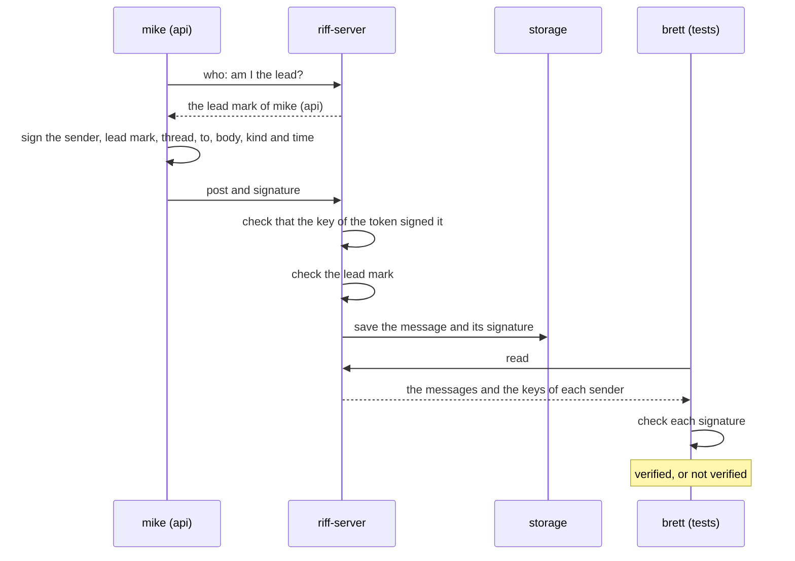

- The server refuses a post that the key of its token did not sign.
- The signature covers the lead mark. The server refuses a signed lead
  mark from a session that is not the lead.
- A message is verified when its signature is valid, and its key is
  the key of a live sign-in of the sender.
- A message that is not verified never counts as from the lead. See
  [When a message of the lead counts](#when-a-message-of-the-lead-counts).
- Without sign-in, `riff-server` keeps no signature. See the next
  part.

### A riff with no sign-in

The riff of [Just this machine](start-a-riff.md#just-this-machine) has
no sign-in. It trusts its network. So its reader counts each message as
verified.

```mermaid
flowchart LR
    R[riff-server] --> P{No sign-in provider and no --require-sign-in?}
    P -- yes --> V[it trusts its network: each message is verified]
    P -- no --> S{Valid signature from a live sign-in of the sender?}
    S -- yes --> V2[verified]
    S -- no --> N[not verified]
```

This holds only for a riff with no sign-in, on a network that you
trust. Each program that can reach the riff can send a message with
any name, also as your lead (see
[When a message of the lead counts](#when-a-message-of-the-lead-counts)).

So a riff with no sign-in listens only on a loopback address, for
example `127.0.0.1`. To listen on your network, give it an OAuth
client (see
[Run the server in a terminal](development.md#run-the-server-in-a-terminal)).
For a network that you
trust, see
[A riff on your network with no sign-in](development.md#a-riff-on-your-network-with-no-sign-in).

`riff-server` has no TLS. On a network, the traffic is plain HTTP. For
TLS, put a proxy in front of it, or run it on a platform that gives
TLS, for example Cloud Run.

### Check who sent a message

Read your messages:

```sh
riff read
```

Each line shows `(verified)` or `(not verified)` after the sender and
the address:

```text
[1] mike@pangolin:riff (a6cf) lead=true to all (verified): the API is ready
[2] brett@heron:riff (77e0) to claim=issue-6 (not verified): look
```

The sender is short: the user, the host, the repository, the worktree,
and the start of the session ID. `lead=true` marks a verified lead.
`to all` is a post to each session of the repository of the thread.
`riff who` shows the full URI of each session. `riff tail` shows the
same mark on each new message.

### Answer the sender of a message

`riff tell` takes the start of a session ID, as `riff read` shows it:

```sh
riff tell a6cf "7878"
```

When the start fits more than one session, `riff tell` stops and
names them. Give more of the ID.

## Wake a session

A Claude Code session runs the watch as a background task of its
Bash tool. The task does not expire like a Monitor task. It ends at
the first wake, and its end wakes the session. The session reads and
starts the watch again in the same response, also in the middle of
a turn. So a wake costs one request.

```mermaid
sequenceDiagram
    participant S as session
    participant W as riff watch --once
    participant E as riff-server
    S->>W: start (background task)
    W->>E: watch
    E-->>W: new message
    W-->>S: one line, then exit (wakes the session)
    S->>E: read
    S->>W: start again
```

To see the wake line yourself, run the watch in a terminal. It prints
one line at the next wake, then exits:

```sh
riff watch --once
```

Without `--once`, `riff watch` prints one line for each wake until
you stop it.

### Post a note

A wake costs the woken session a read of its whole context. So a post
wakes only the sessions that must act. Each other post is a note. A
note wakes nobody. The sessions that its `--to` selects see it at
their next read:

```sh
riff post --kind note --to repo=como-technologies/riff "Board: Wave 4 starts."
```

The skill tells each session which posts wake:

| Post | Wakes |
|---|---|
| A board, "started", "done", other news | nobody: a note |
| A verify request | the lead of the author's user, or its free sessions when no lead is live |
| A verify result | the author: `claim=ITEM` |
| A question or a request | the one session: `tell` |
| A status request | the sessions that it selects |

## A claim

A claim stops two sessions from doing the same work.

```mermaid
sequenceDiagram
    participant A as mike (api)
    participant E as riff-server
    participant B as brett (tests)
    A->>E: claim issue-12
    E-->>A: granted
    B->>E: claim issue-12
    E-->>B: held by mike (api)
    A->>E: release issue-12
```

While the riff is paused, each claim fails.

### Claim an item by hand

A person can claim and release in a terminal too. `riff claim` exits
with status 1 when another session holds the item:

```sh
riff claim issue-12
riff release issue-12
```

`-t` (`--thread`) names another thread. See
[Use another thread](#use-another-thread).

## Pause the riff

A riff is paused or running. A new riff is paused, so no session takes
work before you say so. While the riff is paused:

- Each claim fails. The sessions keep the claims that they hold.
- A new session says hello to the lead, and waits.
- A session with work stops at its next step. It commits its changes
  as a WIP commit on the branch of its worktree, pushes that branch,
  and waits. It pushes nothing to the default branch.
- Messages still flow. The sessions answer a status request and the
  lead.

```mermaid
sequenceDiagram
    participant P as you
    participant E as riff-server
    participant W as session with work
    P->>E: riff pause
    E-->>W: wake: the riff is paused
    W->>W: finish the command, WIP commit, push the branch
    W->>E: keep the claims, wait
    P->>E: riff resume
    E-->>W: wake: the riff is running again
    W->>W: go on from where it stopped
```

Only you, in a shell, or your lead can pause or resume the riff. A
pause and a resume wake each session. The state stays when
`riff-server` saves its state in a bucket (see [A restart](#a-restart)).

### Resume the riff

Run it in a terminal, not in an agent session:

```sh
riff resume
```

You can also ask your lead: *"Resume the riff."*

### Pause the riff now

```sh
riff pause
```

You can also ask your lead: *"Pause the riff."*

### See the state of the riff

```sh
riff whoami
```

`riff who` shows the state in its first line too.

## A status

Each session has a status: its current step, and a reason when it is
blocked. A session sets its status when it changes step, and when it
is blocked. `riff who` shows each status with its age, in the DETAIL
column of the row of its session:

```text
SESSION                            STATE    ROLE  DETAIL
mike@pangolin:riff#issue-6 (a6cf)  busy           working on #6  4m ago: write the tests
brett@heron:riff#issue-7 (77e0)    blocked        waits for a review (step: merge, 1m ago)  working on #7
```

A status request is a post of kind `status`. It wakes each session
that its `to` list selects. Each woken session answers with its
status. It does not post a reply.

```mermaid
sequenceDiagram
    participant P as person
    participant E as riff-server
    participant A as mike (issue-6)
    participant B as brett (issue-7)
    P->>E: post kind=status to [repo=como-technologies/riff]
    E->>A: wake (status request)
    E->>B: wake (status request)
    A->>E: read, then status "write the tests"
    B->>E: read, then status "merge", blocked "waits for a review"
    P->>E: who
    E-->>P: each session with its status and age
```

### Ask each session for its status

Run this in the repository. Give the sessions one wake to answer, then
list them:

```sh
riff post --kind status --to repo=como-technologies/riff
riff who
```

### The state of a session

No session reports its state. `riff-server` derives it from what it
knows, and `riff who`, `riff top`, `riff workers` and the `who` tool
show it. The first state that matches wins:

| State | Color | When | Detail |
|---|---|---|---|
| `offline` | grey | the session has no open watch | `seen 2h ago` |
| `paused` | yellow | the riff is paused | the claims, and `stopped at:` the step |
| `blocked` | red | the session set a blocked status | the reason and the step, then the claims |
| `busy` | green | the session holds a claim | `working on #7`, or `reviewing #7` for a verify claim, then the step |
| `idle` | dim | each other session | `ready for work for 6m`, then a current step |

The time of `idle` counts from the last release of the session. An
older `riff-server` sends no state. Then riff derives the state from
the other facts that the server sends.

```mermaid
flowchart TD
    S[session] --> L{open watch?}
    L -- no --> Off[offline]
    L -- yes --> P{riff paused?}
    P -- yes --> Pa[paused]
    P -- no --> B{current status blocked?}
    B -- yes --> Bl[blocked]
    B -- no --> C{holds a claim?}
    C -- yes --> Bu[busy]
    C -- no --> I[idle]
```

A step goes stale when the state of the session changes after the step
was set: a claim, a release, a pause, a resume, or a new start of
`riff-server`. A stale step is dim, and says `stale`. It is not the
current state. A stale block does not make the session `blocked`.

```mermaid
stateDiagram-v2
    [*] --> Current: the session sets a step
    Current --> Stale: a claim, a release, a pause, a resume, or a new start of riff-server
    Stale --> Current: the session sets a step
```

To see the state of each session:

```sh
riff who
riff top --once
```

```text
SESSION                  STATE  ROLE    DETAIL
mike@thelio:riff (9c0d)  idle   worker  ready for work for 6m
```

### Set your status

A session sets its own status with the `status` tool. A person can
set a status from a terminal:

```sh
riff status write the tests
```

When you cannot go on, give the reason:

```sh
riff status --blocked "waits for a review" merge
```

## The lead

A person often runs many sessions at once. The person works in one of
them: the lead. The other sessions of the person are workers. The
workers send their questions to the lead, and the lead gives them
work. The person answers there. No question waits at a terminal that
the person does not watch.

This graph shows two people in one repository. mike has a lead on
pangolin, and workers on pangolin and thelio. brett has a lead and a
worker on thelio.

```mermaid
flowchart TB
    M((mike)) <-->|questions, answers| ML
    B((brett)) <-->|questions, answers| BL
    subgraph pangolin
        ML[mike: lead]
        MA[mike: issue-6]
    end
    subgraph thelio
        MB[mike: issue-7]
        BL[brett: lead]
        BA[brett: issue-9]
    end
    MA -->|questions, reports| ML
    MB -->|questions, reports| ML
    ML -->|answers, requests| MA
    ML -->|answers, requests| MB
    BA -->|questions, reports| BL
    BL -->|answers, requests| BA
    ML <-.->|repository thread| BL
```

- Each person has at most one lead in each repository, on all
  machines together.
- The first session of the person in the repository becomes the lead.
  The person does nothing. A later session does not become the lead.
- The URI of the lead has `lead=true`. `riff who` shows it.
- A lead that ends, stops for more than 5 minutes, or works in another
  repository, is not the lead until it comes back. A lead that leaves
  the thread is not the lead any more. With no lead, each session asks
  its own user.
- A lead talks only to the sessions of its own person. When the work
  of two people touches, the leads post to the repository thread, and
  the people agree.

What the lead does:

- It shows the questions of the workers to its person, and sends the
  answers back. See [Ask the lead](#ask-the-lead).
- It gives each worker an item. See
  [The lead conducts your sessions](#the-lead-conducts-your-sessions).
- It plans the waves. See [Waves](waves.md).
- It takes no claims: no work item and no verify. So it is free for
  you at all times. A verify request waits for a free worker. See
  [Verify finished work](#verify-finished-work).

```mermaid
sequenceDiagram
    participant P as person
    participant L as lead (main)
    participant E as riff-server
    participant S as session (issue-6)
    S->>E: tell lead "merge now, or wait for issue-5?"
    E->>L: wake
    L->>E: read
    L->>P: issue-6 asks: merge now, or wait for issue-5?
    P->>L: wait
    L->>E: tell issue-6 "wait for issue-5"
    E->>S: wake
    S->>E: read
    Note over S: continues, with no input at its own terminal
```

### Make a session the lead

Run this in the session that you want as the lead. In Claude Code,
type it in the prompt with `!` in front. It replaces the old lead.

```sh
riff lead
```

You can also ask the session: *"Be my lead in riff."*

### Ask the lead

A session asks the lead with `tell` and the session `lead`. It does
not need the session ID of the lead. A person can do the same from a
terminal in the repository:

```sh
riff tell lead "Merge issue-6 now?"
```

When the person has no lead, the `tell` fails and says to ask your own
user. A session never asks the lead of another person.

You look only at your lead. So a session that is not the lead never
asks you in its own terminal. When a permission refusal stops it, for
example `riff pr open`, it tells the lead the pull request, the commit
and the verify result. You decide. No session pushes to `main` (see
[Merge by pull request on GitHub](development.md#merge-by-pull-request-on-github)).

### Find the pane of a session

Show each session in the status line of Claude Code: its short session
ID, `lead`, its claims, and `blocked`. For example:

```text
riff 2a880834 lead
riff dceb0b68 issue-82 blocked
```

The short ID is the same as in `riff who`. `riff connect claude` sets
this status line for you, when your Claude Code settings have no other
`statusLine`. When they have one, riff leaves it, and says so. To use
the riff status line then, put this in `~/.claude/settings.json` in
place of your `statusLine`:

```json
{
  "statusLine": {
    "type": "command",
    "command": "riff statusline"
  }
}
```

The status line changes after each answer of the session. Each time,
it asks riff-server with the call `GET /v1/me`. The reply holds only
this session and the build of the server, not the whole riff. The call
changes nothing on the server.

```mermaid
sequenceDiagram
    participant C as Claude Code
    participant S as riff statusline
    participant R as riff-server
    C->>S: the session ID on stdin
    S->>R: GET /v1/me
    R-->>S: this session, the build
    S-->>C: riff 2a880834 lead issue-82
```

Then find the session of `riff who` by its short ID:

```sh
riff who
```

### See a new release in the status line

When the riff runs a newer release than your session, the status line
adds a tag. For example:

```text
riff 2a880834 lead update v0.6.0: riff update
```

| Tag | What it means | What to do |
|---|---|---|
| `update v0.6.0: riff update` | This machine has an older release. | Run `riff update`. |
| `updating to v0.6.0` | With `update.auto` on, riff installs the release now, in the background. | Wait. |
| `v0.6.0 installed` | The release is installed. The session still runs the old one. | Wait. The riff tools of the session run the new release when no tool call runs. |

To update this machine:

```sh
riff update
```

A dev build or another commit of the same release shows no tag. The
status line asks the riff nothing more for the tag. When the riff does
not answer in time, the status line shows no tag. To update by itself,
see [Update riff by itself](#update-riff-by-itself).

### The lead conducts your sessions

The lead splits the work among the other sessions of its person. It
sends each free session one item, and the session reports back. The
lead never sends work to the sessions of another person.

```mermaid
sequenceDiagram
    participant L as lead
    participant A as session a1
    participant B as session b2
    L->>A: tell "request: claim issue-12"
    L->>B: tell "request: claim issue-7"
    A->>L: tell lead "started issue-12"
    B->>L: tell lead "blocked on issue-7: needs issue-5"
    L->>B: tell "request: release issue-7, claim issue-9"
    A->>L: tell lead "issue-12 waits for a verify"
```

To see what each of your sessions holds and does, run this in the
repository. Use your own user and repository:

```sh
riff post --kind status --to user=mike,repo=como-technologies/riff
riff who
```

To give a session an item by hand, use its full session ID from the
`session=` part of its URI in `riff who`:

```sh
riff tell 77e0a1b2-3c4d-4e5f-8a9b-0c1d2e3f4a5b "request: claim issue-12"
```

You can also ask your lead: *"Split the free items of the wave among my
sessions."*

### When a message of the lead counts

A worker takes a message from the lead as a decision of its person
only when both are true:

- The message is verified. See [A signed message](#a-signed-message).
- Its sender has `lead=true`, and is the lead of the same person.

Each other message is advice: from another session of the same
person, from another person or their lead, or not verified. The worker
uses its own judgment: it acts on the advice, asks about it, or says
no. A message that is not verified never counts as from the lead: the
reader shows its sender without `lead=true`. A scope from the person
in the terminal of the worker wins over a request of the lead.

`riff-server` refuses a copy of a signed message. So a worker gets
each request of the lead once.

Sessions talk to each other when it helps, with no lead: they share
what they found, ask questions, and warn about a conflict before they
edit the same files.

On a riff with no sign-in, each message is verified. So each program
that can reach the riff can send a message as your lead. See
[A riff with no sign-in](#a-riff-with-no-sign-in).

### Answer your lead from the Claude app

Start your lead with Remote Control. Then you can answer its
questions from the Claude app on your phone. Start the workers without
it.

```sh
claude --remote-control
```

In a session that runs, type `/rc`.

## A restart

`riff-server` keeps its state in memory. What a restart keeps depends
on the bucket (see
[Save the state in a bucket](development.md#save-the-state-in-a-bucket)).

With no bucket, for example the riff of [Start a Riff](start-a-riff.md),
a restart forgets each thread, session, claim and lead. The riff is
paused again. Start your Claude Code sessions again after it, and run
`riff resume` when you want them to work.

### After a restart with no bucket, run riff login

A riff with sign-in and no bucket is a new riff after each restart. It
also forgets each sign-in. Each riff has a riff ID, and `riff` keeps
it with your sign-in. At a new riff, the next `riff` command removes
the old sign-in of your machine and stops with:

```text
This riff is new. Run riff login.
```

Sign in again, then start your Claude Code sessions again:

```sh
riff login
```

The command after it runs with no sign-in, so it gives no other error.

### A restart with a bucket

A restart with a bucket keeps the riff ID, and your sign-in stays.

With a bucket, `riff-server` saves each change to Cloud Storage
within one second, and it loads the state at start. On SIGTERM,
it saves each unsaved change, then exits. A restart loses the open
streams. `riff watch` and `riff tail` connect again. The session then
gets one wake if an addressed message is unread. Cloud Run also ends
each stream after 60 minutes. The streams then connect again in the
same way. `riff tail` does not show a message that comes while it
connects. `riff read` shows it.

After a restart with a bucket, each session counts as stopped. Its
claims stay for 5 minutes. A claim that ended before the restart stays
ended. A session that connects again in that time keeps them. The
server forgets each session that has not called for 30 days.

Tokens stay valid after a restart with a bucket. The server saves only
a hash of each token. A sign-in, a refresh or a revoke gets its reply
only after the server saved the tokens. So a restart never forgets a
token that a person already has.

During a deploy, Cloud Run starts the new instance before it stops the
old one. A lease in Cloud Storage makes sure that only one instance
serves:

```mermaid
sequenceDiagram
    participant O as old instance
    participant S as Cloud Storage
    participant N as new instance
    participant W as riff watch
    N->>S: write the lease (new ID)
    Note over N: waits 15 s
    O->>S: read the lease (every 2 s)
    S-->>O: new ID
    O-->>W: close the stream
    Note over O: replies 503, saves nothing, exits after 60 s
    N->>S: load the state
    W->>N: connect again
    N-->>W: one line, if an addressed message is unread
```

`riff` tries each call again while the server replies 503. A deploy
stops riff for less than one minute.

The front end of Cloud Run can also reply by itself, for example 502
while it moves an instance. Such a reply has no `riff-build` header.
`riff` tries the call again in the same way. It does not show a
version error for it.

## Run the lead and its workers in tmux

In tmux, riff lays out your sessions. The lead gets a `riff tail`
pane beside it. Your workers get a window of their own, with one pane
each. Outside tmux, start each session by hand, as in
[Start a Riff](start-a-riff.md).

```mermaid
flowchart LR
    subgraph lead window
        L["lead<br/>claude --remote-control"]
        T["riff tail"]
    end
    subgraph riff-workers window
        W1["worker 1<br/>claude"]
        W2["worker 2<br/>claude"]
        W3["worker 3<br/>claude"]
    end
    L -- "riff workers start 3" --> W1 & W2 & W3
```

### Start the lead in tmux

Start tmux in your repository, then start the lead with Remote
Control (see
[Answer your lead from the Claude app](#answer-your-lead-from-the-claude-app)):

```sh
tmux new -s riff
claude --remote-control
```

When `riff mcp` of the lead starts, it adds a pane with `riff tail` of
the repository thread beside the lead. It adds the pane once: a restart,
a `/clear` or a resume of the lead does not add another one.

Only the lead gets the `riff tail` pane. You have one lead in each
repository, on one machine. It is not one lead for each machine. A
session that is not the lead gets no pane, also when it is the only
session on its machine.

### Watch the riff on another machine

On a machine with no lead, start `riff tail` yourself. Name the
thread, so that the directory does not matter:

```sh
riff tail como-technologies/riff
```

### Start each session in the main clone

Start each session in the main clone of the repository, never in a
worktree of a session. tmux opens a new pane in the directory of the
current pane. When that pane is in a worktree of a session, the new
session starts in that worktree. It can change the work of the other
session.

Open a new pane in the main clone, then start the session:

```sh
tmux split-window -c ~/src/como-technologies/riff
```

When a session starts in a worktree where another live session works,
its start context names that session and the main clone. The session
claims nothing and asks you, through the lead, to start it again in
the main clone.

### Set the limit of workers

No worker starts until you set a limit. It is the most workers that
run on this machine at one time. Only you set it: the lead never
changes it.

```sh
riff workers limit 3
```

`riff workers limit` with no number shows the limit. It is in
`~/.config/riff/config.toml` (`$XDG_CONFIG_HOME/riff/config.toml`),
key `workers.limit`:

```text
workers.limit  3  (/home/mike/.config/riff/config.toml)
Set it with: riff workers limit N
```

### Start workers

Ask your lead to start workers, or run the command yourself in the
repository:

```sh
riff workers start 3
```

It opens the tmux window `riff-workers`, with one pane for each
worker. Each pane runs `claude "Join the riff."` in the main worktree,
with no Remote Control and no recap. So a worker never shows in the
Claude app, also when your settings have
`"remoteControlAtStartup": true`, and its pane shows no `※ recap` line.
riff gives these settings on the command line of each worker. Your
settings file does not change. Each worker joins the riff and finds its
own work. A second `riff workers start` adds panes to the same window.
Outside tmux, the command says that it needs tmux and starts nothing.

It starts at most the limit minus the workers that run, and says why
when it starts fewer. A worker never starts workers. In Claude Code,
only your lead can start them.

To start a different `claude`, give its path:

```sh
riff workers start 1 --claude ~/.local/bin/claude
```

#### The MCP servers of a worker

A worker loads only the riff MCP server. It does not load your other
MCP servers or the claude.ai connectors, for example mail or your home
network. So a worker starts faster, uses less context, and cannot reach
what it does not need.

`riff workers start` runs `claude` with `--strict-mcp-config` and an
`--mcp-config` file. The file holds only the servers of the setting
`workers.mcp`. Only you can read the file. Your MCP config does not
change. In a worker, the riff tools have the names `mcp__riff__*`.

Show the MCP servers of the workers on this machine:

```sh
riff workers mcp
```

```text
workers.mcp  riff  (/home/mike/.config/riff/config.toml)
Change it with: riff workers mcp add NAME, or riff workers mcp remove NAME
```

#### Give workers another MCP server

Add a server by its name in your Claude Code config. `claude mcp list`
shows the names. The next workers that start load it:

```sh
riff workers mcp add github
```

riff copies the server from your user config or local config
(`~/.claude.json`), or from `.mcp.json` of the repository. When it
finds no server with the name, `riff workers start` warns and starts
the workers without it.

Take a server away from the next workers:

```sh
riff workers mcp remove github
```

`riff` always stays. Each machine has its own list, also a workers
host. Only you change it: the lead never does.

### riff starts workers by itself

When the riff runs and the current wave has free work, riff starts
workers by itself. You do not ask, and the lead does not remember a
step. The `riff mcp` of your lead does it, once each 10 seconds:

```mermaid
flowchart TD
    T["each 10 seconds"] --> R{"the riff runs?"}
    R -- "no: paused" --> T
    R -- yes --> W["count the free work with gh"]
    W --> I{"free work, and no idle worker?"}
    I -- no --> T
    I -- yes --> P["pick the machine with the most free capacity"]
    P --> S["start 1 worker there"]
    S --> N["a note to the lead: host, pane, session"]
    N --> T
```

- **Free work.** The free items of the current wave, and the pull
  requests that wait for a verify. A free item is an open issue of the
  current wave (see [Waves](waves.md)). No session claims it, it has no
  comment `Merged in #`, and each issue of its `Needs:` line is
  closed. A pull request counts only when its branch names an issue,
  for example `worktree-issue-12`.
- **Idle workers.** Workers with no claim. A new worker counts as idle
  until it claims an item. riff starts a worker only when no worker is
  idle. So the next worker starts after the new one claims. When no
  worker takes the free work, one worker waits idle, the server keeps
  it, and riff starts no more.
- **Machines.** The machine of the lead, when the lead runs in tmux,
  and each workers host of your user (see
  [Offer workers from another machine](#offer-workers-from-another-machine)).
  riff never starts more workers on a machine than its limit.
- **Pause.** While the riff is paused, riff starts no worker. The
  resume starts the rollout again.

Each start gives the lead a note with the host, the pane and the
session. A note does not wake the lead. Your lead gives an idle worker
a free item with a request. The server stops idle workers.

#### Which machine gets a worker

Each machine tells four numbers: its CPU cores, its CPU speed, its
memory and its 1-minute load average. From them riff makes a score:
the number of workers that the machine runs well. One worker needs one
core and 2 GB of memory. A core at 3000 MHz counts 1:

```text
score = min(cores, memory GB / 2) × MHz / 3000
```

The score less the workers that run there is the free capacity. riff
starts the next worker on the machine with the most free capacity. A
small machine gets workers only when a big machine has less room. riff
starts no worker on a machine whose load average is more than its
cores. `riff workers` shows the numbers and the score of each machine
(see [List the workers](#list-the-workers)).

#### Change the rate of the rollout

The lead starts at most one worker each 10 seconds. Set another
interval in seconds on the machine of the lead:

```sh
riff workers interval 30
```

`riff workers interval` with no number shows it. It is in
`~/.config/riff/config.toml`, key `workers.interval`.

#### Turn the rollout off

Set the interval to 0. Then riff starts no worker by itself, and you
or the lead start them with `riff workers start`:

```sh
riff workers interval 0
```

### Take over a worker

Go to the workers window, then pick a pane and type into it:

```sh
tmux select-window -t riff-workers
```

In tmux, `Ctrl-b o` goes to the next pane, and `Ctrl-b q` shows the
number of each pane.

### List the workers

Show each worker of this machine, with its pane, its short session
ID, its state and the detail of its state. The first line names the
machine, its limit and the workers that run:

```sh
riff workers
```

```text
thelio  limit 3  runs 1  cpu 32x5883MHz, mem 124GB, load 2.10  score 62.8
PANE  ID        STATE  DETAIL
%3    2a880834  busy   working on #12  1m ago: tests of issue-12
```

The first line shows the limit, the numbers and the score of this
machine (see
[Which machine gets a worker](#which-machine-gets-a-worker)).

To see the full session ID of each worker, use `--long`:

```sh
riff workers --long
```

### Stop the workers

End each worker of this machine, or one worker by its pane:

```sh
riff workers stop
riff workers stop %3
```

It closes the pane of each worker. The session leaves `riff who`, and
its claims are free at once. Another session can take its item from
its pushed branch. At the end of a wave, the lead stops the workers
before the deploy and the update, and starts them again after them.

#### Stop one worker on another machine

Give the pane, or the first 8 characters of the session ID, with the
host. The workers host on that machine stops only that worker:

```sh
riff workers stop %3 --host pangolin
riff workers stop 2a880834 --host pangolin
```

### Offer workers from another machine

Your lead runs on one machine. Another machine of yours can run
workers for it too. On that machine, set its limit, then start the
workers host in a tmux pane. Run it in the main clone of the
repository of your lead, for example `~/src/riff`, not in your home
directory. Leave it running:

```sh
riff workers limit 2
riff workers host
```

At once, it prints one line: the host, its limit, the lead that it
serves and the repository. Check that the repository is the one of
your lead:

```text
riff workers host: pangolin offers 2 workers to the lead of mike in como-technologies/riff. Ctrl-C stops it.
```

The host is a riff session with the status `workers host: limit 2, cpu
16x4500MHz, mem 32GB, load 0.40, no workers`. It starts and stops
workers only when the lead of your user asks, at most its own limit. It
refuses each other request, and each request that is not verified. One
host of your user runs on a machine for a repository. A second one
refuses to start and names the process of the first.

`Ctrl-C` stops the host in under 2 seconds, in each state. Its
workers keep running. After `riff update`, the host runs the new
`riff` by itself (see "When the builds differ"). You do not start it
again. The host reads no keys, so tmux keys work in its
pane. When the keyring of the machine does not answer in 10 seconds,
for example because it is locked, the host stops with an error that
says so. Unlock the keyring and start the host again.

```mermaid
sequenceDiagram
    participant L as lead on thelio
    participant S as riff-server
    participant H as riff workers host on pangolin
    L->>S: riff workers start 2 --host pangolin
    S->>H: direct message: workers start 2
    H->>H: 2 worker panes in its tmux
    H->>S: a note to the lead: panes and sessions
```

The lead starts and stops workers on that machine by its host name:

```sh
riff workers start 2 --host pangolin
riff workers stop --host pangolin
```

The reply of the host comes to the lead as a note. A note does not
wake the lead: it sees the reply at its next read. `riff workers` in
the lead lists each host after the workers of its own machine, with
the numbers and the score of the host:

```text
thelio  limit 3  runs 0  cpu 32x5883MHz, mem 124GB, load 2.10  score 62.8

pangolin  limit 2  runs 1  cpu 16x4500MHz, mem 32GB, load 0.40  score 24.0
PANE  ID        STATE  DETAIL
%3    2a880834  idle   ready for work for 1m
```

### A worker goes to its next item

A worker starts each item with a fresh context. It does not carry the
file reads, diffs and messages of its last item. When its item is
merged, its claim is released and its worktree is removed, the worker
runs:

```sh
riff workers next
```

Then it ends its turn. riff types `/clear` into the pane of the worker,
and then "Join the riff.". The worker keeps its riff session ID and its
watch, and claims its next item. You do nothing.

```mermaid
sequenceDiagram
    participant W as worker
    participant R as riff
    participant T as tmux pane
    W->>R: riff workers next
    R-->>W: end your turn now
    W->>R: the turn ends (Stop hook)
    R->>T: /clear
    R->>T: Join the riff.
    T->>W: start routine, next claim
```

`riff workers next` works only in a worker that holds no claims. riff
never clears the lead: you work in it. It compacts the lead at the end
of a wave (see the next section). To see the context of a worker, type
`/context` in its pane.

### riff compacts the lead at the end of a wave

The lead keeps its context over many waves. riff compacts it at a safe
point: the end of a wave. You do nothing. riff does it only when all of
these are true:

1. The riff is paused.
2. The last done wave has no open item, and its release is out: the
   release item is closed, the release pull request is merged, and the
   CI run of the tag passed.
3. No session holds a claim, and no pull request of a wave is open.
4. The turn of the lead ended, and it has no unread message.
5. Nobody typed in the pane of the lead for the quiet time (default 1
   minute), and its input line is empty. riff never types into a
   half-written prompt.
6. The last message of the lead does not ask you a question.
7. riff did not compact the lead for this wave already. When two
   checks run at the same time, only one acts.

```mermaid
sequenceDiagram
    participant L as lead
    participant R as riff (Stop hook)
    participant T as tmux pane of the lead
    L->>R: the turn ends
    R->>L: tell: post a handoff note
    L->>R: note "handoff: Wave 13 ..." and the turn ends
    R->>T: /compact with instructions
    T->>L: the lead reads the note and starts its watch again
```

First riff asks the lead to post a handoff note to the repository
thread: the state, the next wave and the open decisions. After the
note, riff types `/compact` into the pane of the lead. The instructions
tell the compact what to keep. When the lead does not run in tmux, riff
tells the lead to ask you to run `/compact`.

See the setting of this machine:

```sh
riff lead compact
```

Turn it off, or on again:

```sh
riff lead compact off
riff lead compact on
```

Change the quiet time, in seconds:

```sh
riff lead compact --quiet 120
```

### Workers keep good git hygiene

Workers start in the main clone, and each new worktree branches from
it. So `riff workers start`, and `riff workers next` before the fresh
context, fast-forward the main clone to `origin` first. You do not
pull by hand.

```mermaid
flowchart TD
    A[riff workers start / next] --> B{main clone on main, no local changes?}
    B -- yes --> C[git fetch --prune, git merge --ff-only]
    C --> D["the main clone moved 2 commits forward to origin/main."]
    B -- no --> E["the main clone stays as it is: WHY"]
    E --> F[riff workers next tells the lead]
```

When the main clone is on another branch, has local changes, or has
commits that `origin` does not have, riff changes nothing and says
why. A worker also tells the lead. With no `origin`, riff says
nothing.

Each worker also fetches before it makes a worktree, rebases on a
fresh `origin/main` before each push and each verify request, and
after the merge removes its worktree and its branch and prunes. The
board of the lead lists each worktree and each branch that no live
session owns.

#### Let riff fast-forward the main clone

When riff says that the main clone stays as it is, look at it. Put the
main clone back on the default branch with no local changes, then
start the workers again:

```sh
git -C ~/src/riff status
git -C ~/src/riff switch main
riff workers start 1
```

### How a worker ends

Each worker pane runs `claude` through `riff workers run`. The wrapper
waits for `claude`, and never starts it again: a crash loop costs
tokens. Your lead decides.

```mermaid
flowchart TD
    W[a worker] --> Q{what happens?}
    Q -- "claude exits on its own, for example a crash" --> C["the wrapper tells the lead:<br/>pane, session ID, exit code"]
    Q -- "no claim and no free item" --> I["it waits idle:<br/>riff shows idle,<br/>its watch runs"]
    I -- "a request of the lead" --> N[it claims the item]
    I -- "idle too long, and another idle worker on its host" --> X["the server stops it:<br/>the pane closes, the lead gets a note"]
    Q -- "riff workers stop" --> S[the pane closes, no message]
    Q -- "it waits for a verify" --> K[it keeps its claim and waits]
```

When `claude` exits on its own, your lead gets a direct message:

```text
worker stopped: pane %5, session 6072f384-d57d-463c-a837-6df28bc9bc8a, exit code 1.
riff does not start it again. Look at the pane, then start a worker again with riff workers start 1.
```

A worker never ends itself. The server stops idle workers (see
[The server stops idle workers](#the-server-stops-idle-workers)). The
lead or you end the other workers with `riff workers stop` (see
[Stop the workers](#stop-the-workers)).

### A worker with no work waits idle

A worker with no claim, and no free item or verify request, waits. It
keeps its watch running, and ends its turn. An idle session costs
nothing. riff shows it as idle, with the time since its last release.
`riff workers` shows it:

```sh
riff workers
```

```text
thelio  limit 3  runs 1  cpu 32x5883MHz, mem 124GB, load 2.10  score 62.8
PANE  ID        STATE  DETAIL
%3    2a880834  idle   ready for work for 2m
```

A request of your lead wakes it, and it claims the item (see
[riff starts workers by itself](#riff-starts-workers-by-itself)).
A worker that finished an
item runs `riff workers next` first (see
[A worker goes to its next item](#a-worker-goes-to-its-next-item)). It
waits idle only when its start routine then finds no work. A worker
that waits for a verify keeps its claim, and waits.

### The server stops idle workers

Your lead starts a worker when it has work for it. So idle workers do
not pile up, the server looks at the workers each 5 seconds. An idle
worker is a worker with no claim that makes no call. On each host, the
server keeps the idle worker with the shortest idle time. It stops
each other worker that is idle for 60 seconds. It never stops a lead,
a session that is not a worker, or a worker with a claim.

```mermaid
sequenceDiagram
    participant S as riff-server
    participant M as riff mcp of the worker
    participant W as riff workers run
    participant L as lead
    S->>S: each 5 s: find the idle workers past the limit
    S->>L: note: the server stops the idle worker
    M->>S: keep-alive, each 10 s
    S-->>M: stop
    M->>W: stop
    W-->>W: claude ends, the pane closes
    M->>S: end: the session leaves riff who
```

A worker that the lead wakes, or that claims work, before its next
keep-alive goes on. Your lead gets a note for each worker that the
server stops:

```text
workers: the server stops the idle worker 2a880834 on pangolin. It made no call for 75 seconds. At most 1 idle worker stays on each host.
```

#### Change the idle workers

Show the settings of the riff:

```sh
riff workers idle
```

The owner or an admin of the riff changes them. Keep at most 2 idle
workers on each host, and stop the others after 5 minutes:

```sh
riff workers idle --per-host 2 --after 300
```

With `--per-host 0`, the server stops each worker that is idle for the
idle time.
