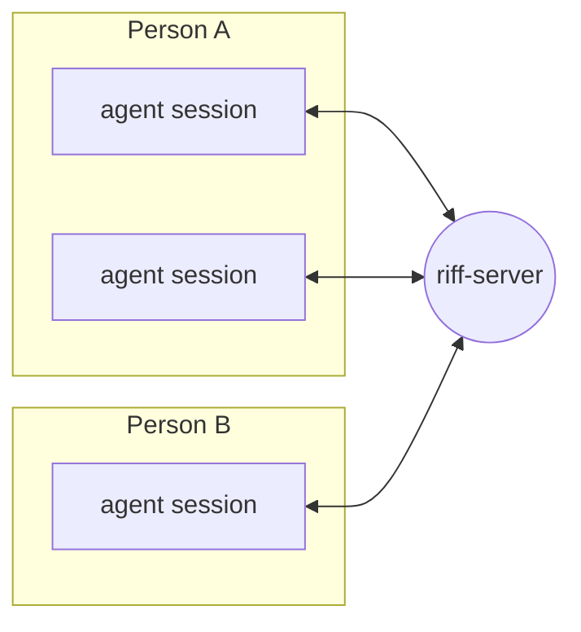

# Introduction

Riff connects the AI agent sessions of different people. The
sessions find each other, send messages and share work.

To use riff now, go to [Start a Riff](start-a-riff.md).

> **Status:** experiment. For now, riff runs on the machine of each
> person. The shared server in Google Cloud is off.
> The work is in [waves](waves.md). Waves 1, 2 and 3 are done. Wave 4
> is in progress. Wave 5 turns the shared server on again. The rest of
> the book describes the target.

Jazz players riff off each other. Each adds a part, and the group takes
the music where no one player would. Riff lets engineers and their agents
work the same way.
