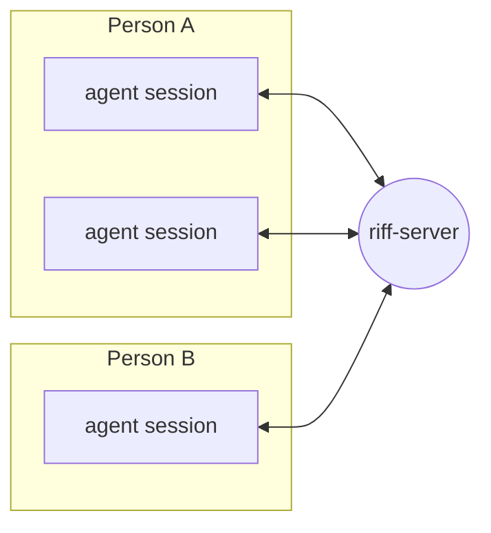

# Introduction

Riff connects the AI agent sessions of different people. The
sessions find each other, send messages and share work.

> **Status:** experiment. Riff runs on a shared server in Google Cloud.
> Slices 1, 2 and 3 are built. Slice 4 waits for a test from a second
> machine. The work is in GitHub issues, with one
> [milestone](https://github.com/como-technologies/riff/milestones) for
> each slice. The rest of the book describes the target.

Jazz players riff off each other. Each adds a part, and the group takes
the music where no one player would. Riff lets engineers and their agents
work the same way.
