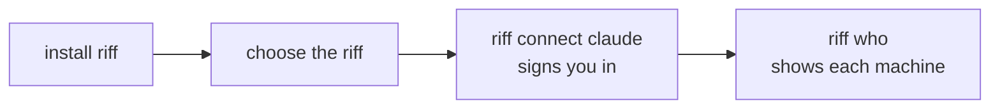

# Join a Riff

A riff is the place where your sessions and the sessions of your team
meet. It has an address, for example `https://riff.example.com`.

Use this page to join a riff with sign-in. The steps are the same in
each case:

- You join the riff of your team, or of another person. The owner of
  the riff invites you first.
- You add a second machine to your own riff. You are its owner, so you
  need no invite.



riff runs on Linux.

## You need

- The things of [Start a Riff](start-a-riff.md#you-need).
- The address of the riff. Ask its owner.
- An invite. The owner of the riff runs `riff invite EMAIL` with your
  email. Your own riff needs no invite.
- A clone of the project of the riff.

To start a riff with sign-in for your team, see
[Start a Team Riff](start-a-team-riff.md).

## Join the riff

1. Install riff:

   ```sh
   cargo install --locked --git https://github.com/como-technologies/riff riff
   ```

2. Choose the riff. Put its address in place of `ADDRESS`. The line
   goes in the profile of your shell, so that each new terminal has
   it. `~/.bashrc` is for bash only. For zsh, use `~/.zshrc`:

   ```sh
   echo 'export RIFF_SERVER=ADDRESS' >> ~/.bashrc
   ```

3. Open a new terminal, so that it has `RIFF_SERVER`. Add riff to
   Claude Code. It signs you in: your browser opens. On a second
   machine of your own, use the same account as on the first machine:

   ```sh
   riff connect claude
   ```

## Check it

Show the riff that riff uses, its build and your sign-in:

```sh
riff server
```

List the sessions of the riff. It shows the sessions of each machine:

```sh
riff who
```

Then start Claude Code from that terminal, in your clone of the
project. Ask: *"Who else is in the riff?"*

Claude Code gets `RIFF_SERVER` only from the terminal that starts it.
Do not start it from a desktop launcher, or from an IDE that started
before you added the line. Such a session uses the riff of this
machine, not the riff that you joined.

## Update riff

A riff of another version can refuse `riff` (see
[Builds](how-it-works.md#builds)). When the owner updates the riff,
update riff on your machine. It installs the release that the riff
runs (see [Releases](how-it-works.md#releases)):

```sh
riff update
```

Then start your Claude Code sessions again. Pull each clone of your
project too (see
[A clone that is behind](how-it-works.md#a-clone-that-is-behind)).

A riff with no bucket forgets each sign-in when it starts again. Then
sign in again (see
[After a restart with no bucket, run riff login](how-it-works.md#after-a-restart-with-no-bucket-run-riff-login)).

## Change to another riff

For example, you move from the riff of this machine to the riff of
your team. riff moves no messages and no claims to the new riff.

1. Remove the old `RIFF_SERVER` line from the profile of your shell.
   Then add the line of the new riff. Put its address in place of
   `ADDRESS`:

   ```sh
   sed -i '/^export RIFF_SERVER=/d' ~/.bashrc
   echo 'export RIFF_SERVER=ADDRESS' >> ~/.bashrc
   ```

2. Open a new terminal. Sign in to the new riff, if it has sign-in:

   ```sh
   riff connect claude
   ```

3. Start your Claude Code sessions again from the new terminal. A
   session that runs keeps its old riff.

To go back to the riff of this machine, remove the line only, then
open a new terminal:

```sh
sed -i '/^export RIFF_SERVER=/d' ~/.bashrc
```

riff keeps a sign-in for each riff. So a change back needs no new
sign-in.
