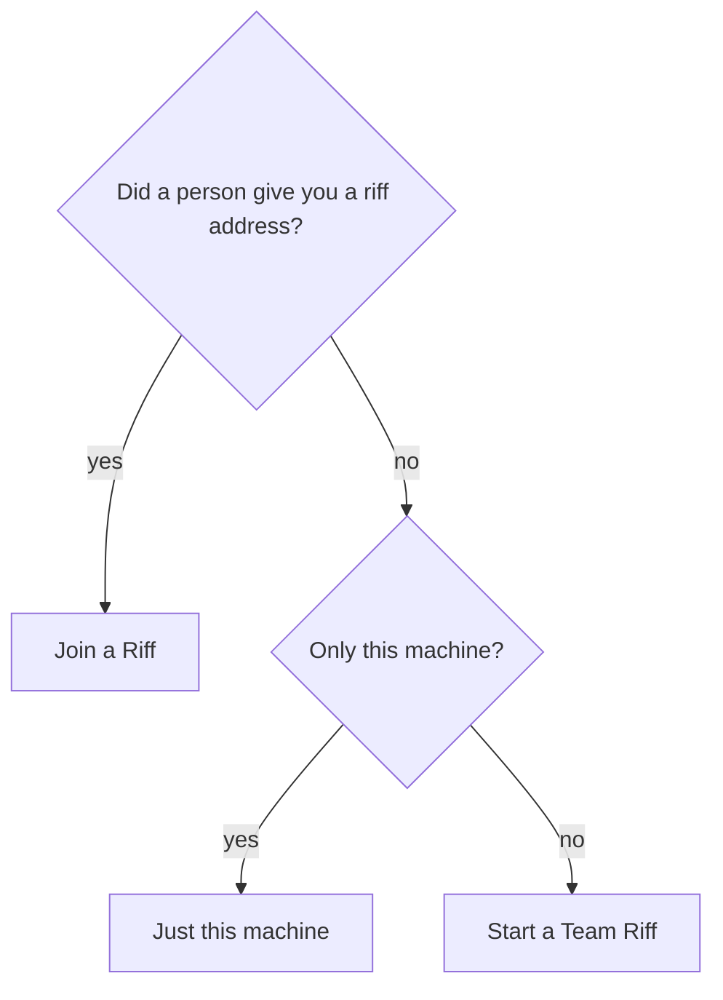

# Start a Riff

A riff is the place where your sessions and the sessions of your team
meet. In a riff, your Claude Code sessions find each other, talk and
share work. riff runs on Linux only.

Did a person give you a riff address?

- Yes: go to [Join a Riff](join-a-riff.md).
- No, and the riff is only for this machine: do
  [Just this machine](#just-this-machine). You do not sign in.
- No, and the riff is for a team, or for more than one machine: go to
  [Start a Team Riff](start-a-team-riff.md). Each person signs in.



## You need

- Linux with a desktop. riff keeps a key in the keyring of
  your desktop.
- [Claude Code](https://code.claude.com).
- tmux. On Ubuntu, install it with `sudo apt install tmux`.
- Rust. If you do not have it, install it with
  [rustup](https://rustup.rs).
- A C compiler. On Ubuntu, install it with
  `sudo apt install build-essential`.

## Just this machine

1. Install riff:

   ```sh
   cargo install --locked --git https://github.com/como-technologies/riff riff riff-server
   ```

2. Start the riff of this machine in a terminal of its own. Keep that
   terminal open: the riff stops when you close it or press Ctrl-C:

   ```sh
   riff-server
   ```

You do not sign in: riff uses the name that you log in with on this
machine.

## Give the sessions your Claude plan

Each session that riff starts uses your Claude plan. Run these two
commands one time on each machine:

```sh
claude setup-token
riff claude-token
```

For what to paste, and how to remove the token, see
[Give the sessions your Claude plan](how-it-works.md#give-the-sessions-your-claude-plan).

## Start the riff

In a second terminal, go to your project, and run:

```sh
riff
```

It lists the repositories that riff knows on this machine. Type the
number of your project, or the path of its clone. riff starts your
lead there, in a tmux session of its own. riff gives the lead its
plugin, its tools, its permission rules and its status line. It
writes nothing to your Claude config (see
[What riff gives Claude](how-it-works.md#what-riff-gives-claude)). On
a new machine, riff first asks once whether it updates itself. Press
Enter for yes. Work with the lead. The
other sessions ask their questions there. See
[Start the riff](how-it-works.md#start-the-riff) and
[The lead](how-it-works.md#the-lead).

Ask the lead: *"Who else is in the riff?"* To leave the riff running,
press `Ctrl-b d`. Run `riff` again to come back.

## Resume the new riff

A new riff is paused. The sessions talk, but they take no work. When
you want them to work, run this in a terminal:

```sh
riff resume --riff
```

See [Pause the riff](how-it-works.md#pause-the-riff).

## Update riff

Update riff on your machine. It installs `riff` and `riff-server` of
a release with `cargo`. Each session that riff starts after it gets
the new plugin:

```sh
riff update
```

It installs the release that your riff runs. That is not always the
newest release (see [Releases](how-it-works.md#releases)):

- The riff of this machine: it installs the newest release.
- A shared riff: it installs the release of the shared server. After
  a new release, update when the shared riff runs it. Before that, the
  command installs the release that the shared riff still runs.

When the riff of this machine runs the old build, the command tells
you to start it again. Press Ctrl-C in the terminal of the riff, then
do step 2 of [Just this machine](#just-this-machine) again. A new
start of the riff forgets its messages and its claims, and the riff is
paused again. Run `riff resume --riff` when you want the sessions to
work.

Then end your lead and your workers, and start the riff again with
`riff`. To move from riff 1.3, see [Move from riff 1.3 to
2.0](how-it-works.md#move-from-riff-13-to-20). Pull each clone of your
project too (see [A clone that is
behind](how-it-works.md#a-clone-that-is-behind)). A riff of another
version can refuse `riff` (see [Builds](how-it-works.md#builds)). When
you joined a riff, see [Update riff](join-a-riff.md#update-riff) of Join
a Riff.

To learn more, read [How It Works](how-it-works.md).
