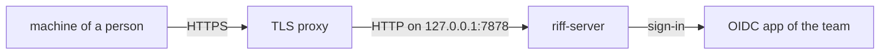

# Start a Team Riff

A team riff is the place where the sessions of your team meet. It runs
on a Linux host that each person of your team reaches. Each person
signs in with their own account. You are the owner: you invite each
person.

For a riff on your machine only, with no sign-in, see
[Start a Riff](start-a-riff.md).



## You need

- A Linux host with an address that your team reaches, for example
  `riff.example.com`.
- A TLS proxy on that host, for example [Caddy](https://caddyserver.com).
  `riff-server` has no TLS.
- Rust and a C compiler on the host. See
  [Start a Riff](start-a-riff.md#you-need).

## Make an OIDC app

riff has no built-in sign-in app. Make your own Google OAuth client
once. See
[Make your own OAuth client](development.md#make-your-own-oauth-client).
Keep its client ID and its client secret in a safe place. Do not put
them in source, in a commit or on a page.

## Start the riff

Do these steps on the host.

1. Install riff:

   ```sh
   cargo install --locked --git https://github.com/como-technologies/riff riff riff-server
   ```

2. Put the OIDC app in the environment of `riff-server`. Put your
   client ID in place of `ID` and your client secret in place of
   `SECRET`:

   ```sh
   export RIFF_OIDC_CLIENT_ID=ID RIFF_OIDC_CLIENT_SECRET=SECRET
   ```

3. Start the riff in the same terminal. Keep that terminal open. Put
   the address of the riff in place of `URL`, for example
   `https://riff.example.com`, and the email of your account in place
   of `EMAIL`:

   ```sh
   riff-server --public-url URL --owner EMAIL
   ```

   `riff-server` listens on `127.0.0.1:7878`. `--public-url` is the
   address that people use. `--owner` names you as the owner.

4. In a second terminal, start the TLS proxy. It takes HTTPS at the
   address of the riff and sends it to `riff-server`. For Caddy:

   ```sh
   caddy reverse-proxy --from riff.example.com --to 127.0.0.1:7878
   ```

## Sign in first

Sign in before you invite a person. On your machine, use the riff. Put
the address of the riff in place of `URL`. For zsh, use `~/.zshrc`:

```sh
echo 'export RIFF_SERVER=URL' >> ~/.bashrc
```

Open a new terminal. Sign in with the account of `EMAIL`. Your browser
opens:

```sh
riff login
```

## Invite a person

Invite each person with the email of their account:

```sh
riff invite EMAIL
```

The command prints the address of the riff and the lines that the
person runs to join. Send the lines to the person. The lines hold no
secret. The person follows [Join a Riff](join-a-riff.md). To see the
members of the riff, run `riff members`.

## See each change of the members

The riff posts each change of the members to the thread of each
repository of the riff, as a note: `riff invite`, `riff remove`,
`riff admin add`, `riff admin remove` and `riff owner`. The note names
the user that made the change, the email and the change. It wakes no
session. The command prints the threads that got the note.

To see the notes as they come, run this in the directory of a
repository:

```sh
riff tail
```

A note looks like this:

```text
members: ada invited bob@gmail.com. bob@gmail.com is a member now.
```

## A restart

`riff-server` keeps its state in memory. When it stops, it forgets the
members, the sign-ins, the messages and the claims. Do steps 2 and 3 of
[Start the riff](#start-the-riff) again. Then sign in again with
`riff login`, and invite each person again. Each person signs in again
with `riff login`.
