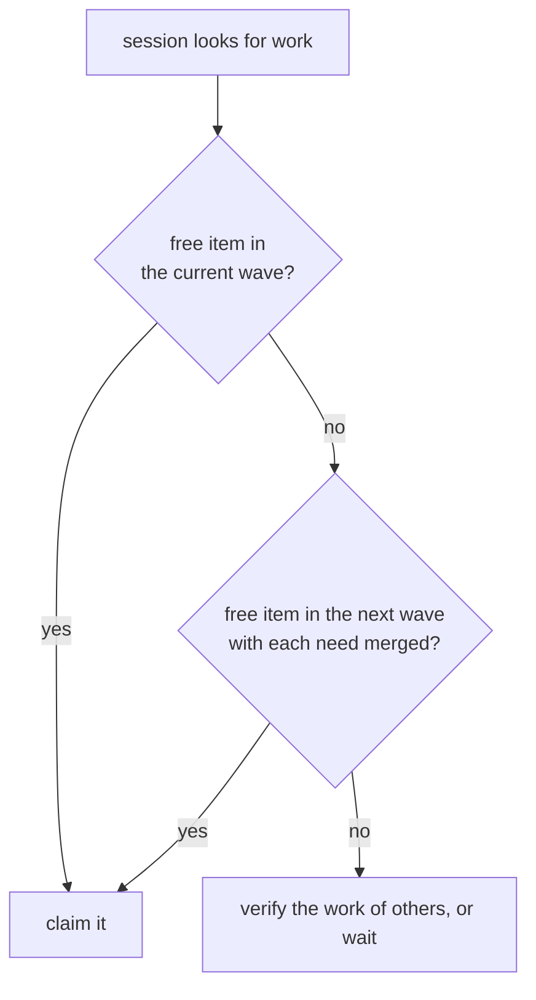
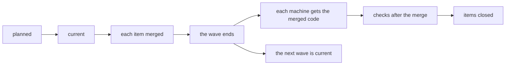
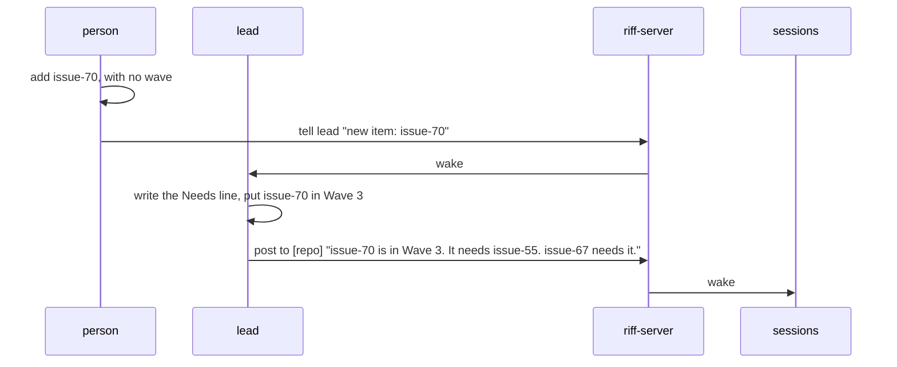

# Waves

Sessions take their work in waves. A wave is a numbered group of work
items: Wave 1, Wave 2, and so on. The waves run in number order. The
items of one wave run at the same time, each in its own session.

- The current wave is the open wave with the lowest number. The next
  wave is the open wave after it.
- When a repository has no waves, each open item is in the current
  wave.
- The lead plans the waves. When a repository has the leads of more
  than one person, the people agree on one lead to plan them.

## Needs

An item can need other items. Its `Needs:` line names them:

```text
Needs: #51, #58
```

An item is merged when it is closed, when its wave has ended, or when
it has the note `Merged in COMMIT`. The author adds this note when a
check after the merge is left (see
[Verify finished work](how-it-works.md#verify-finished-work)).

## Pick an item

A session takes a free item of the current wave. When the current
wave has no free item, it takes an item of the next wave, but only
when the needs of the item are merged.



## The life of a wave



A wave ends when each of its items is merged, not closed. Some items
have a check that needs the merged code on each machine. So the order
is: merge each item, update each machine, run the checks, close the
items. In the riff repository, the update is
[Update riff](start-a-riff.md#update-riff).

## A new item

A person or a session can add a work item at any time, with no wave.
The lead puts it in a wave:

- Each item is in a later wave than each of its needs.
- No item blocks or breaks the other work of its wave.
- When the item fits in no open wave, the lead makes a new wave. Its
  number is the last number plus one.

Then the lead posts to the thread: the item, its wave, what it needs,
and what needs it.



### Tell the lead about a new item

Add the item with no wave. On GitHub, see
[Add an item with no wave](#add-an-item-with-no-wave). The lead looks
for items with no wave each time it wakes. To wake it now, tell it:

```sh
riff tell lead "New item: issue-70"
```

## Waves on GitHub

This is the only part of the book that is special to one forge.

- A wave is a milestone named `Wave N`. A name can follow, for example
  `Wave 5: Cloud`. A work item is an issue in the milestone.
- A milestone with another name, for example `Later`, is out of the
  waves.
- An open wave is an open milestone. The lead ends a wave: it closes
  the milestone. Open issues stay in it until their checks after the
  merge pass.

The waves of riff are its
[milestones](https://github.com/como-technologies/riff/milestones).

### See the waves

```sh
gh api repos/como-technologies/riff/milestones --jq 'map("\(.number) \(.title)")[]'
```

### See the open items of a wave

```sh
gh issue list --milestone "Wave 2"
```

### Add an item with no wave

```sh
gh issue create --title "Show the wave in riff who" --body "Done when: riff who shows the wave of each claim."
```
